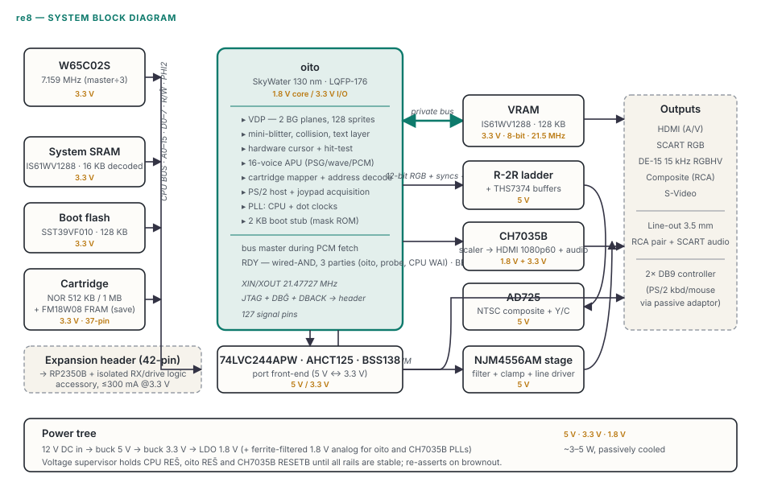
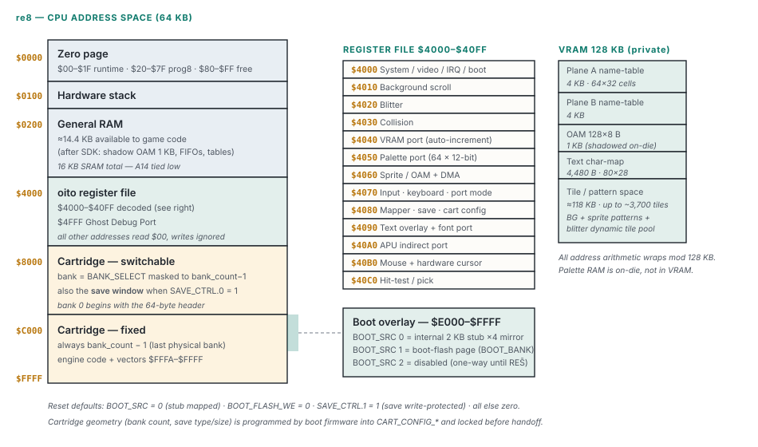
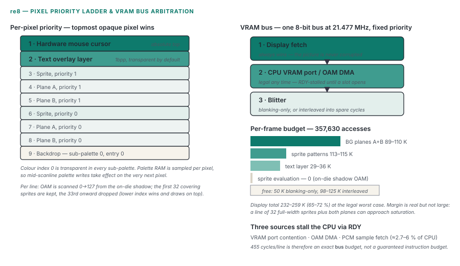
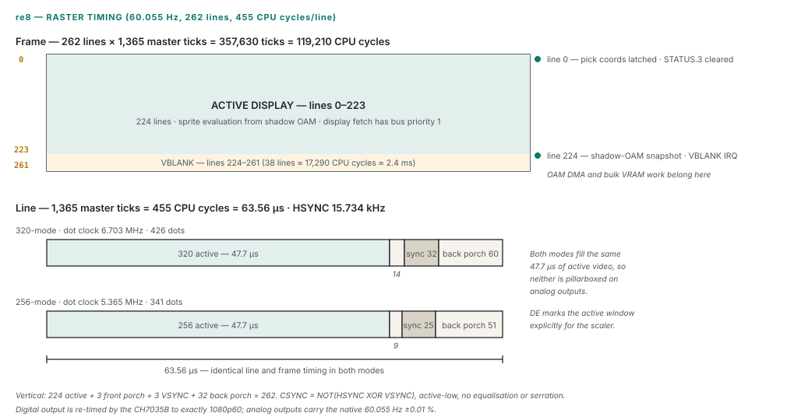
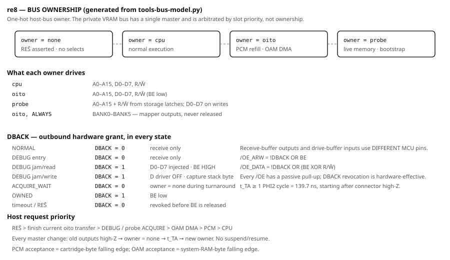
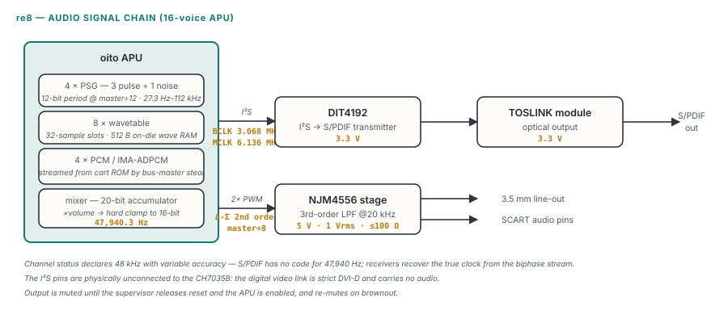
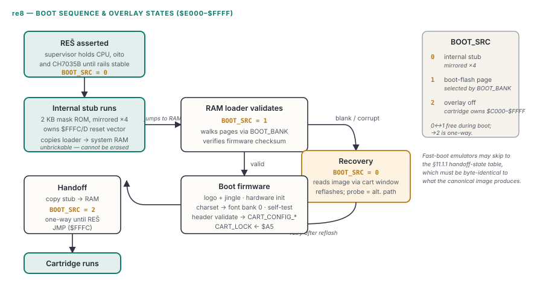

# re8 console — high-level technical specification

**Document purpose.** This is the normative specification of the re8 console: a boutique 2D games machine built from currently-manufactured parts, comprising a W65C02S CPU and a single custom ASIC (**oito**) that integrates the video display processor, a 16-voice audio unit, the cartridge mapper and all system glue.

It defines everything an implementer needs to build the hardware or a **Tier 1 (compatibility) reference emulator** (§14.5): machine-visible behaviour, electrical interfaces and bill of materials, timing, file and tool ABI, and the conformance contract.

**Version 0.23.1** · 2026-07-30 · *architecture draft*. Revision history and the versioning rules are in §18.

**Document map.** This specification is normative; rationale and history live in **`re8-design-history.md`**.

| Concern | Sections |
|---|---|
| **1. Machine-visible behaviour** | §4 CPU · §5 memory map & registers · §6 oito (VDP, arbitration, formats, raster, text) · §8 APU · §9 input · §10 interrupts |
| **2. Electrical interfaces & BOM** | §2 BOM & power tree · §6.2–6.3 video bus & pins · §7 video outputs · §11 cartridge · §12 expansion header · §13 debug probe |
| **3. Timing** | §3 clocks · §6.5 VRAM arbitration · §6.7 raster · §11.1.1 handoff state |
| **4. File & tool ABI** | §11.0 ROM image · §11.2 header · §11.4 saves · §14 SDK & toolchain |
| **5. Conformance & limits** | §15 restrictions · §16 conformance & validation |
| **Revision** | §17 design history (separate document) · §18 version history |

Diagrams accompanying this document are in `diagrams/` and are referenced from the sections they illustrate.

**Requirement keywords.** **MUST**, **MUST NOT**, **SHOULD** and **MAY** are used in the RFC 2119 sense and **only** for requirements; all other prose is descriptive and carries no obligation. Performance figures carry either a stated workload or the label *estimate*; no cross-machine comparisons are made.

**Scope.**

- *In scope:* all active components (BOM), console capabilities and restrictions, how active elements operate and interconnect (including pin/signal mapping and voltage domains), memory map, interrupts, debug-probe operation, SDK and tooling ABI, and the conformance contract. **Analog video and audio buffering is in scope** — buffers and line drivers are active components.
- *Out of scope:* PCB layout, ASIC internals (gate/RTL level), mechanical/enclosure design, production economics, and passive component values **except where a value is required to define or substantiate an electrical-interface, safety or timing claim**. Final passive selections live in the schematic/BOM evidence.

**Status (2026-07-30): architecture draft.** The memory map, register file, subsystem behaviour and BOM are specified to a level intended to support emulator implementation and schematic capture. The design has been through **twenty-two adversarial reviews; every finding is dispositioned and the resulting changes are in this document, but validation remains open** — a disposition is not closure. The items in §16.2 are the gap between the two. The decision log and review registers live in **`re8-design-history.md`**.

**Explicitly outstanding across compatibility, SDK, schematic, RTL/tapeout, prototype and production-release gates** (full criteria and stages in §16.2):

**This list is complete and generated from §16.2** — `tools-verify.py` requires the same 18 entries in the same order and rejects missing, extra or duplicated rows. The **ASRC filter design** appears once here; §16.2.1 records that gate's deferral rather than creating a second gate.

| Item |
|---|
| prog8 ROM and multi-bank toolchain fixture |
| Typed-symbol source |
| Debug-info pipeline |
| BOM orderability and suffix evidence |
| Active-part lifecycle sweep |
| Input protection selections |
| oito package pinout |
| HDMI connector and reference circuit |
| `TPS2553-1` current-limit design |
| CH7035B qualification |
| AD725 and analog-output qualification |
| **ASRC filter design** |
| CPU bus pre-tapeout timing sign-off |
| Bus transaction semantic proof |
| CPU bus and external-memory post-silicon characterization |
| W65C02S instruction jamming and breakpoint timing |
| **Probe bus ownership and transfers** |
| HDMI licensing and compliance |


---

## 1. System overview



re8 is a boutique 2D game console built exclusively from currently-manufactured ("factory-fresh") components — no New Old Stock. Its architecture deliberately sits between the 8-bit era (NES, Master System, PC Engine) and early-90s arcade hardware (Capcom CPS-1):

- **CPU:** WDC W65C02S, 8-bit, fully static CMOS, single 3.3V rail.
- **oito:** one custom ASIC (SkyWater 130nm, **LQFP-176, custom pad ring**) combining a Video Display Processor (hybrid tile renderer + mini-blitter, hardware sprites, hardware collision) and a **16-voice APU** (PSG + wavetable + PCM).
- **Memory:** 16KB system SRAM (CPU bus) + 128KB VRAM (private bus to oito).
- **Media:** parallel NOR flash cartridges, **37-pin** edge connector, **console-side fixed-plus-switchable 16KB mapper**; optional battery-free on-cart FRAM saves (§11.4).
- **Video out:** one digital pipeline (12-bit RGB + syncs from oito) fanned out to five simultaneous outputs: composite, S-Video, RGB SCART, **15 kHz analog RGBHV on DE-15** (not VGA timing), and **1080p60 HDMI with embedded 48 kHz stereo audio**.
- **Input:** two DB9 ports, Sega Genesis/Mega Drive controller compatible; optional **PS/2 keyboard and mouse** through a port via a passive adaptor (§9.1/§9.2), the mouse with a fully hardware-rendered cursor.
- **Developer hardware:** 42-pin expansion header (CPU bus + oito JTAG) driving a USB debug probe.
- **SDK:** prog8 language → 64tass → flat ROM binary; `re8.*` event-driven library; VS Code extension with source-level debugging, VRAM inspector, and a WASM reference emulator.

**Core philosophy.**

1. *Zero-emulation:* real silicon executes game code; no soft-cores or interpretation layers.
2. *No NOS:* every part must be orderable new (this single rule drove the CPU, sound, video-encoder and flash choices).
3. *First-time-right silicon:* oito is 100% digital; every analog function (video encoding, DACs, audio filtering) lives on the motherboard in proven off-the-shelf parts, because analog blocks on a low-volume ASIC are hard to verify and risky.
4. *ROM is cheap, RAM is precious:* the SDK trades ROM space freely to preserve the 16KB RAM budget.

---

## 2. Bill of materials — active components

| # | Component | Part | Function | Voltage | Bus/interfaces |
|---|-----------|------|----------|---------|----------------|
| 1 | CPU | WDC **W65C02S6TPG-14** | 8-bit host processor | 3.3V (datasheet AC table: 14MHz @5V, **8MHz @3.3V**) | 16-bit address, 8-bit data, PHI2, R/W̄, SYNC, RDY, BE, RES̄, IRQ̄ |
| 2 | Custom ASIC | **oito** (re8-vdp-8001, SkyWater 130nm, **custom pad ring, LQFP-176**, **127 signal + ~24 supply ≈ 151 pins used** — the §6.3 budget, not a sign-off pinout) | VDP (tiles, sprites, blitter, collision, scroll) + 16-voice APU + cartridge mapper + address decode + joypad read | 1.8V core / 3.3V I/O | CPU bus slave; private VRAM bus master; 12-bit digital RGB + syncs out; PWM audio out; I²S out; 2× controller ports; JTAG |
| 3 | System RAM | **`IS61WV1288EEBLL-10TLI`** (128K×8, 10 ns, **2.4–3.6V**, TSOP-II-32) with **A14–A16 tied low — only 16KB is decoded**. Deliberately the same part number as the VRAM (item 4): one line item, one footprint, one qualification. **A 55 ns part is an acceptable substitute** (see timing note) | CPU work RAM | 3.3V | CPU bus |
| 4 | VRAM | **`IS61WV1288EEBLL-10TLI`** (128K×8, 10 ns, **2.4–3.6V**, TSOP-II-32) — exact fit, 17 address lines matching VA0–VA16 | Video memory | 3.3V | Private bus to oito only |
| 5a | Cartridge `OE#` inverter *(on cartridge)* | **`74LVC1G04GV`** (Nexperia single inverter, **SOT753**), one per cartridge whatever the board type, with a 100 nF decoupling capacitor | derives `OE#` = NOT(R/W̄) with the correct polarity (§11) — without it the memory drives the bus during writes. `CE#` supplies the selection term, so no gating is required | 3.3V | cartridge edge |
| 5 | Cartridge flash | **`MX29LV800CTTI-70G`** (Macronix, 8 Mbit as **1M×8 in byte mode**, TSOP-48, 2.7–3.6V, 70 ns, boot-block sectors, AMD-style JEDEC unlock at `$AAA`/`$555`) — **one part for every cartridge size**, whatever the game actually uses. A single family means one command set, one driver, one footprint and one net list; the alternative saved perhaps $0.50 on small titles and cost two of everything, including a header field to choose between them | Game ROM (in cartridge) | 3.3V | Cartridge slot (D0–D7, A0–A13, BANK0–BANK5) |
| 6 | Boot ROM | internal oito stub (~2KB on-die mask ROM, unbrickable) **+** external boot flash **SST39VF010** (128KB parallel NOR, 3.3V, PLCC-32/TSOP-32) | Two-stage boot firmware — stub → updateable firmware → cartridge (§11.1) | on-die / 3.3V | internal / CPU bus |
| 7 | Video encoder | Analog Devices **AD725** *(provisionally selected — 240p operation requires bench validation)* | Analog RGB → **NTSC** composite + S-Video (Y/C) (the part's PAL mode is unused) | 5V (§2.1) | Analog RGB in (from R-2R DACs), CSYNC, subcarrier clock (14.318MHz NTSC / 17.734MHz PAL) |
| 8 | HDMI transmitter / scaler | Chrontel **`CH7035B-BFI`** (88-QFN, 10×10 mm, industrial −40…85 °C, MOQ 168/tray) | 240p digital RGB + I²S audio → scaled **1080p60 HDMI with embedded 48 kHz stereo LPCM** (§7.1) | **1.8V `DVDD`/`AVDD_PLL` + 3.3V `VDDH`/`AVDD`/`VDDMQ`/`VDDMS`/`VDDIO`** | **24-bit RGB-888 parallel in, fed by oito's 12 lines with bit replication** + HSYNC/VSYNC + pixel clock; **I²S audio in (`I2S_CK`/`I2S_WS`/`I2S_D`, 3-wire — the part has no MCLK pin)**; I²C slave (SPC/SPD); I²C master (SPCM/SPDM); TMDS out |
| 9 | Config ROM | Chrontel **CH9904 — an 8KB (8192×8) I²C boot ROM** (*not* a sub-1KB device). Substitute: a generic 8-pin I²C EEPROM (24C64-class, 8KB) **only if** it matches address **`0x57`**, the CH7035B master's byte/page-read protocol, and is readable before `RESETB` releases | holds the CH7035B power-on register image; the configuration binary is a **versioned release artefact** | 3.3V | I²C at address `0x57` (to CH7035B master port) |
| 9a | CH7035B reference crystal | **27.000 MHz** crystal (+ load caps) | scaler timebase on XI/XO | — | CH7035B XI/XO |
| 9b | Audio-output oscillator | **12.288 MHz** CMOS oscillator (±50 ppm, 3.3V), e.g. `ASEM1-12.288MHZ-LC-T` | clocks the **output-path resampler** (§8.4) that converts the APU's native 47,940.3 Hz to a **nominal 48 kHz** for the HDMI audio stream. `BCLK` = ÷4 = 3.072 MHz and `LRCLK` = ÷256 = 48 kHz are exact divisions of it | 3.3V | **oito `AUDXI` only** |
| 10 | Controller port front-end | per port: 1× **`74LVC244APW,118`** octal buffer (receive) **+** a bidirectional path on 2 lines (~4.7kΩ pull-ups to 5V + open-drain pull-down); **shared: 1× `SN74AHCT125` (5V-powered) driving both ports' SELECT**. PS/2 lines: 4.7kΩ pull-up to 5V + 1kΩ series into the LVC receiver + **BSS138 gate-driven pull-down** (drain on the 5V line, source GND, gate from oito) + ≤10pF TVS — | 244 buffers the **4 joystick-only data lines** inbound (5V→3.3V, LVC inputs 5V-tolerant at 3.3V). **SELECT is driven outbound by an `SN74AHCT125` powered at 5V**: a 3.3V LVC output cannot guarantee the ~3.5V CMOS high a 5V-powered 74HC157 requires, whereas AHCT has TTL-level inputs (V_IH 2.0V) and a ~4.9V CMOS output. The **2 PS/2-capable lines** need *bidirectional* drive for the mouse-enable command and keyboard LEDs (§9.1/§9.2), which a unidirectional 244 cannot provide | 3.3V rail, 5V-tolerant inputs | DB9 data (6/port) + SELECT → oito; 2 lines also driven low by oito |
| 11 | Debug probe MCU *(accessory, not in console)* | Raspberry Pi **RP2350B** (QFN-80, **48 GPIO**, 3× PIO @150MHz) — *RP2040 has only 30 GPIO and cannot reach the header's 37 signals* | Bus sniffing, breakpoints, instruction jamming, JTAG, USB bridge | 3.3V (powered from header) | 42-pin header; USB-C to host PC |
| 11f | Debug-probe bus interface *(accessory, not in console)* | **receive:** 4× `74LVC245APW,118`; **drive:** 1× `74LVC244APW,118` + 3× `74LVC595APW,118`; **grant logic:** 1× `74LVC1G04GV`, 1× `74LVC1G86GV,125`, 1× `74LVC2G32DP,125`; passive pull-ups on every active-low drive enable | electrically separate passive observation and outbound drive; stores A0–A15 + `R/W̄`, drives D0–D7 separately, and makes `DBACK` revocation effective even if probe firmware is frozen (§6.9.2, §13) | 3.3V from header; every selected LVC device specifies partial-power-down `Ioff` | 25 received bus signals; 25 driven bus signals; 3 serial-latch controls |
| 11a | Analog video buffers | **2× `THS7374`** (4-channel video amplifier, integrated reconstruction filters, **2× gain**, single-supply) — one for SCART, one for VGA (RGB + CSYNC each) | buffers the shared R-2R ladder so no destination double-loads it; 2× gain into a 75Ω series resistor gives standard **0.7 Vₚₚ into 75Ω** | 5V | analog RGB + CSYNC in/out |
| 11b | AD725 input buffer | **TI `OPA3691ID`** (triple wideband current-feedback amplifier, unity-gain stable, single +5V operation), each channel at G = +1 with the AD725's required AC coupling and bias network | the AD725 needs **~0.714 V full-scale, AC-coupled** with its own bias — a different requirement from driving a 75Ω line, so it cannot share the THS7374 outputs | 5V | ladder → AD725 |
| 11d | Analog audio line driver | **Nisshinbo `NJM4556AM`** (DMP8; `NJM4556AV` in SSOP8 is the alternate footprint) — dual audio op-amp, **±70 mA** output. *The `AD` suffix is not on Nisshinbo's current product page and the ±100 mA figure was wrong; the filter and output stage are designed against the ±70 mA figure and this part's 5 V single-supply input common-mode and output-swing limits.* Substitute `OPA1662AID` **only with the filter recalculated** — it is not pin-and-behaviour interchangeable in every active topology + 3rd-order active reconstruction filter (−3 dB @20 kHz), output coupling and mute control | turns the APU's 2× delta-sigma PWM into a real line output: 1 Vᵣₘₛ, ≤100 Ω, separately series-fed to the **3.5 mm jack, the RCA pair and the SCART audio pins**, muted until rails are valid and the APU is enabled | 5V | PWM in; **3.5 mm line-out + RCA pair + SCART audio**, each on its own series resistor |
| 11c | SCART control drivers | divider for pin 16 (fast-switch, 1–3V) + emitter-follower stage for pin 8 (status, **9.5–12V, taken from the 12V input rail**, signalling 4:3) | forces RGB mode and reports aspect | 5V / 12V | SCART pins 8, 16 |
| 11d-2 | Analog mute switch | **TI `TS5A23159DGSR`** (dual SPDT analog switch, 5 V, low `R_ON`), one device, switching L and R between the driver output and the bias node **before the branch split** | stereo mute, driven by oito's `AUDIO_EN` (§8.4); a bare MOSFET cannot mute a signal that swings both sides of ground | 5V | driver → branches |
| 11e | Connector protection & current limit | **Per pin, not per connector** (table below): `TPD4E1B06DCKR` on low-voltage signal lines; `TPD4E02B04DQAR` (0.3 pF) on TMDS; an **`SMAJ12A` TVS on SCART pin 8**; `TPS2553DBVR-1` current-limit switches on the cartridge 3.3V feed, each controller port's 5V feed and the digital connector's +5V | connector ESD, cartridge-insertion inrush, per-port current limit (§2.1) | 3.3V / 5V / 12V | — |
| 12 | Power management | 2× **TI `TPS562201DDCR`** buck (12V→5V and 5V→3.3V; same part, different feedback divider) + **TI `TLV75718PDBVR`** LDO (1.8V, 1A) + PLL filters + **3× TI `TPS3808G01DBVR`** voltage supervisors (one per rail, open-drain outputs wire-OR'd into system reset) | Rail generation, power-on reset, brownout (§2.1) | 12V in | — |

Notes:

- **SRAM timing margin:** at 7.159 MHz the CPU cycle is 139.7 ns with roughly half available for the access, so a **10 ns** SRAM has enormous margin and even a **55 ns** part meets timing — stated because it widens the sourcing pool considerably. The VRAM bus runs at 21.477 MHz (46.6 ns/cycle), where a 10 ns part leaves ≈36 ns of margin.
- **The 16KB system-RAM limit is a *design* limit, not a component limit**, and the decode is written as an equation because prose got it wrong: "`RAM_CĒ` ignores A14" would have meant A14 does not participate in chip select, mirroring RAM across `$4000–$7FFF` and colliding with oito's own register file. The actual decode is

 ```
 RAM_CĒ = !( !A15 && !A14 && bus_cycle_valid )      ; asserts only for $0000–$3FFF
 ```

 **`bus_cycle_valid` is the owner-aware term of §11**, and it replaces the `cpu_memory_cycle` an earlier revision used here. That term was never defined and was CPU-specific, so read literally it deasserted `RAM_CĒ` whenever `BE` was low — which is exactly when **OAM DMA reads its source block from system RAM** and when **the probe's live-memory access reads or writes it**. Neither feature could have reached its own documented storage. The complete decode for both motherboard memories is in **§11**, not here.

 The SRAM's **A14, A15 and A16 are hard-strapped to GND at the footprint**, so only its lowest 16 KB is ever addressed. **There is no future-expansion path without a board change**: enabling more RAM would need both a different decode in oito and those three pins routed instead of strapped.
- **Rail budget:** each SRAM draws roughly **~30 mA active / <5 mA standby**, included in the 3.3V budget alongside the probe allowance.
- The motherboard also carries R-2R resistor-ladder DACs (passive, out of scope) that convert oito's digital RGB to analog RGB, buffered per destination for SCART / DE-15 / AD725 (§7).
- Controllers themselves contain a 74HC157 multiplexer (3-button pads) powered at 5V from DB9 pin 5.
- **Two flash families, in two places that never mix.** The **boot** flash is `SST39VF010` and uses the SST unlock sequence at `$5555`/`$2AAA`; **cartridges** are always Macronix and use the AMD-style sequence at `$AAA`/`$555`. The two drivers are selected by *which device is being programmed*, which the updater always knows, so no header field is needed and none exists.
- **PS/2 keyboard/mouse adaptor *(passive accessory, not in console)*** — a wiring-only DB9↔mini-DIN-6 adaptor (no MCU), serving keyboard and mouse alike (§9.1/§9.2); on the two PS/2-capable data lines per port the console adds ~4.7kΩ pull-ups + an open-drain driver (bidirectional PS/2, for mouse-enable and keyboard LEDs).

### 2.1 Power tree, reset & protection

**A single 3.3V rail was never feasible** — the design has always needed 5V (AD725, controllers) and 1.8V (oito core); the CH7035B needs 1.8V and 3.3V domains. So the board is **multi-rail**. What survives is the digital core: **CPU + oito + all SRAM/flash + glue share one 3.3V rail** (no level shifters in the CPU/memory domain — the original benefit). The extra rails serve only the analog/video/core-voltage parts, which is normal.

**Input:** **12V DC barrel jack, ≥1.5A** recommended (typical board draw ~3–5W, to be confirmed by measurement/synthesis). Protection: series reverse-polarity FET (or Schottky), **an input fuse that is not yet selected** (§16.2), and a TVS on the jack. *The "no polyfuses" rule of §2.1 applies to the protected **output** rails, where electronic switches replaced them; one input-side device upstream of everything remains, because there is no rail to switch there.*

 **No part is named, deliberately.** A previous revision named `0ZCJ0150FF2E`, which **does not exist** — the nearest real member of that series is `0ZCJ0150FF2C`, and its `V_max` is **8 V**, unusable in series with a 12 V adapter. It was placed in the parts ledger with a family landing page as its source and a date that recorded no actual reading. Rather than guess a third time, the selection criteria are stated and the part is left open:

 | Criterion | Requirement |
 |---|---|
 | Voltage rating | above maximum adapter voltage including tolerance and transients — **≥16 V**, not 8 V |
 | Hold current | above worst-case input current at maximum ambient, **with derating stated**, not the 23 °C figure |
 | Trip and inrush | checked against the buck converters' startup and the bulk capacitance |
 | Fault current | adequate interrupt capability at 12 V |
 | Identity | an **exact orderable OPN**, verified against a part-specific datasheet page, in both the BOM and the ledger |

 The reverse-polarity topology (series FET versus Schottky) and the jack TVS OPN and polarity are unselected on the same terms.

12V rather than 9V because **SCART pin 8 requires 9.5–12V to signal 4:3** (§7). A 9V input cannot produce a voltage above itself, so aspect signalling would have been unimplementable or would have needed a boost converter. 12V/1.5A supplies are at least as common as 9V ones and give the 5V buck more headroom.

**Rails:**

| Rail | Source | Regulator | Feeds |
|---|---|---|---|
| 12V (unregulated) | jack | — | SCART pin 8 status driver only (§7), through an emitter follower and a current-limiting resistor |
| 5V | 12V | buck | AD725, analog video/audio op-amps, and controller ports (DB9 pin 5). **Accessory allowance: 250mA per port, 350mA total across both** (not 2× the per-port figure — simultaneous maximum draw is not a design case). Protection: per-port **`TPS2553-1`** limiting at ≈500 mA, distinct from the 250 mA budget |
| 3.3V (main) | 5V | buck | oito I/O, W65C02S, system + VRAM SRAM, cartridge + boot flash, `74LVC244APW,118`, **CH7035B `VDDH`/`AVDD`/`VDDMQ`/`VDDMS`/`VDDIO`** (VDDIO = 3.3V because oito drives 3.3V RGB), **the 12.288 MHz audio oscillator (BOM 9b)**, glue, **plus ≤300 mA for an attached debug probe** |
| 1.8V | 3.3V | LDO | oito core; **CH7035B `DVDD`**. Sharing this rail with oito is permitted **only after noise/current/sequencing analysis** — the scaler's SDRAM interface is a switching load |
| 1.8V analog (CH7035B `AVDD_PLL`) | 1.8V via ferrite + caps | filter | CH7035B PLL — a clean supply, mirroring oito's PLL treatment |
| 1.8V analog (oito VDDA_PLL) | 1.8V via ferrite + caps | filter | oito PLL (clean supply for the pixel/core-clock PLL) |

(A single multi-output PMIC could consolidate the bucks/LDOs to save board area — an implementation option.)

**Sequencing & reset.** A dedicated **voltage-supervisor / reset controller** holds CPU RES̄, oito RES̄ **and CH7035B `RESETB`** asserted until every rail is up and stable (plus a settle delay), and re-asserts on **brownout**.

- **CH7035B requirements:** stable power for **≥20 ms before `RESETB` release**, plus a **≥100 µs** asserted pulse.
- **Ordering constraint:** the scaler self-boots from its configuration EEPROM at reset release (§7.1), so the **EEPROM MUST be powered and stable before `RESETB` is released** — otherwise it boots a blank configuration.
- **Rail order:** core 1.8V comes up before or with I/O 3.3V, per oito's requirement. oito may additionally hold its own core in reset via an internal power-on reset, but the *system* reset is driven by the supervisor.
- RES̄ is also exposed on the expansion header (§12).

**Per-output current limiting — one implementation each.** Every 5 V and 3.3 V output that leaves the board is protected by an electronic switch with a stated setting:

| Output | Device | Setting | Behaviour on fault |
|---|---|---|---|
| Controller port 1, 5 V | **`TPS2553-1`**, `R_ILIM` = **53.2 kΩ** (≈500 mA nominal) | 250 mA budget, 500 mA limit | current-limits, then latches off; reset by `EN` toggle **or** power cycle |
| Controller port 2, 5 V | as port 1 | as port 1 | as port 1 |
| Cartridge, 3.3 V | **`TPS2553-1`**, `R_ILIM` = **133 kΩ** (≈200 mA nominal) | covers insertion inrush | as above |
| HDMI +5 V (pin 18) | **`TPS2553-1`**, `R_ILIM` = **133 kΩ** (≈200 mA nominal) | ≥55 mA required by HDMI | as above |

**There are no polyfuses on the output rails.** An electronic switch was chosen over a polyfuse on every rail because it limits rather than merely trips, recovers on a power cycle instead of after a cool-down, and has a defined inrush behaviour — three properties a polyfuse does not offer. **The exact orderable part is `TPS2553DBVR-1`**: TI orders the suffix *device, package/carrier, then fault behaviour*, so the trailing `-1` is the **latch-off** variant, and `TPS2553DBVR` without the trailing `-1` is the constant-current part that keeps regulating into a fault and may thermal-cycle. A latched part stays off until `EN` is toggled **or** input power is cycled; it does not periodically retry. `TPS2553-1` is used as family shorthand in prose, `TPS2553DBVR-1` wherever an orderable number is meant. **All four `R_ILIM` values must be re-derived from the datasheet's minimum and maximum equations including resistor tolerance before schematic freeze (§16.2)**; the numbers above are nominal-table values, and that arithmetic was already got wrong once.

**Controller-port draw.** Typical: 3-button pad <5 mA, 6-button pad <10 mA, PS/2 mouse 20–50 mA, PS/2 keyboard 100–150 mA.

- **Budget:** **250 mA per port, 350 mA total** across both — simultaneous maximum draw on both ports is not a design case.
- **Protection:** the per-port `TPS2553-1` above, limiting at ≈500 mA against a 250 mA budget — the two numbers are deliberately different.
- **Connector:** the DB9 contact rating (~3 A) is never the limit; the current-limit switch and the PCB trace are.
- **Short-circuit:** the switch current-limits and then latches off, that port collapses, the console keeps running, and recovery is by power-cycle. This is explicitly **not** a hot-swap-safe design.
- **Inrush:** keyboards with bulk capacitance draw a brief surge, so the 5V buck needs headroom or soft-start (bring-up item).
- **Out of scope:** backlit or hub keyboards, unpowered USB hubs, and USB-style high-power devices via passive adaptors are **not supported**.

**Connector protection, per pin.** Assigning a protection part "by connector" is unsafe when one connector carries several voltage classes — SCART pin 8 is deliberately driven at 9.5–12 V, far outside a low-voltage array's working range, and clamping it would have shorted the aspect signal to ground.

| Pins | Normal level | Device |
|---|---|---|
| DB9 data + SELECT, both ports | 0–5 V | `TPD4E1B06` |
| SCART RGB (7/11/15), CSYNC (20), audio (2/6) | 0–1 V | `TPD4E1B06` |
| SCART pin 16 (fast switch) | 1–3 V | `TPD4E1B06` |
| **SCART pin 8 (status)** | **9.5–12 V** | **`SMAJ12A` TVS, 12 V standoff** — *not* the low-voltage array |
| DE-15 RGB | 0–1 V | `TPD4E1B06` |
| DE-15 HSYNC/VSYNC (13/14) | 0–3.3 V | `TPD4E1B06` |
| Digital connector TMDS pairs | differential, **topology per Chrontel AN-B008 — no added series AC-coupling capacitors** | `TPD4E02B04` (0.3 pF) |
| Digital connector DDC/HPD | 0–5 V | `TPD4E1B06` |
| **3.5 mm TRS jack, tip/ring** | 0–1.4 V pk | `TPD4E1B06`, plus the branch series resistor |
| **RCA pair, centre pins** | 0–1.4 V pk | `TPD4E1B06`, plus the branch series resistor |
| Cartridge edge, all signals | 0–3.3 V | series resistance + `TPS2553-1` on the rail |

**Thermal:** ~3–5W is passively cooled (no fan); the buck regulators and CH7035B want small copper pours and thermal vias.

**Emulator note:** power/reset is board-level and does not affect emulation; captured here for BOM correctness and to retire the "all-3.3V" misconception.

---

## 3. Clocks and frame timing

| Clock | Value | Notes |
|---|---|---|
| **Master clock (oito)** | **21.47727 MHz** (= 6 × NTSC colorburst 3.579545 MHz) | PINNED. NTSC-locked so the frame rate lands cleanly near 60Hz |
| **CPU PHI2** | **master ÷ 3 = 7.15909 MHz** | PINNED. Synchronous to oito, fixed 3:1 ratio; fastest integer divisor under the W65C02S 8MHz@3.3V rating (~12% margin) |
| Dot clock, lo-res | ~5.365MHz (341 dots/line, PLL) | 256×224 active — §6.7 |
| Dot clock, hi-res | ~6.702MHz (426 dots/line, PLL) | 320×224 active — §6.7 |
| Frame rate | **60.055Hz (fixed)** | progressive 240p, never 480i; 60Hz-only worldwide — no 50Hz PAL; HDMI re-timed to 1080p60 by CH7035B — §6.7 |
| HSYNC rate | 15.734kHz (both H-modes share it) | standard NTSC 240p line rate |
| Lines per frame | 262 total, 224 active, 38 VBLANK (lines 224–261) | |
| Line duration | **1,365 master ticks = 455 CPU cycles = 63.56µs** | 1365 ÷ 3 = 455 exactly |
| Frame duration | **357,630 master ticks = 119,210 CPU cycles** | 262 × 1,365; VBLANK ≈ 51,870 ticks = 17,290 CPU cycles |
| **CH7035B reference** | **27.000 MHz** (dedicated crystal on XI/XO) | the conventional reference for this class of converter; is the conventional reference from which the scaler *synthesises* its output clock — 148.5 MHz is 5.5 × 27 MHz, a PLL ratio rather than a division, and the synthesis is part of the qualification gate (§16.2). **Deliberately independent of the 21.477MHz master** — the scaler frame-buffers and re-times anyway (§6.7), so coupling them would buy nothing and risk noise |
| **Audio output clock — `AUDXI`** | **12.288 MHz** (dedicated oscillator) | drives the output-path resampler; `BCLK` = ÷4 and `LRCLK` = ÷256 are its only derived outputs. **There is no `MCLK` net** — the CH7035B has no such pin (§7.1). **Deliberately separate from the master**: the APU still mixes at master ÷ 448, and only the *stream leaving the console* is converted to a standard rate (§8.4) |
| AD725 subcarrier | **14.318MHz (NTSC)** | dedicated crystal to AD725 (regenerates color independent of master). *The part also supports a 17.734MHz PAL subcarrier — an unused capability of the chip, not an re8 feature (60Hz-only).* |

Emulator-relevant derived facts: **CPU runs at exactly master/3**, so 455 CPU cycles per scanline and 119,210 per frame. VBLANK ≈ 17,290 CPU cycles (~2.4ms).

**Determinism caveat.** Those figures are an exact **bus** budget, not a guaranteed instruction budget: three mechanisms **stall the CPU with RDY** and reduce the cycles actually available to code — the CPU VRAM port under contention (§6.5), OAM DMA (§5.1), and **PCM sample fetch** (§8.3, ~3–6% when four voices stream). The line/frame *timing* remains exact and deterministic; the CPU's *work per line* varies with those stalls. Cycle-exact raster code should account for them or suspend PCM (§14.2). The exact line-total/porch/sync timing and the 60.00-vs-59.94 selection are a separate video-timing item needed only for a cycle-accurate emulator; the baseline above is sufficient to run software.

---

## 4. CPU subsystem (W65C02S)

**Choice rationale.** By 2026 the W65C02S and W65C816S are the only classic-bus CPUs still in production: Z80 survives only as the bus-incompatible eZ80; 68000 only as ColdFire. The 65C816 was evaluated and rejected on pin count and toolchain complexity. *With LQFP-176 an 816's extra host lines would fit, so the W65C02S choice rests on the remaining reasons: a simpler 8-bit bus matching the SDK's memory model, and the fully static core that is the foundation of the debug strategy (clock to 0 Hz with full state retention). Revisiting the CPU is not proposed here.* (Calling the W65C02S "the last standalone classic-bus CPU" is inaccurate — the W65C816S is also in production.)

**Electrical/operating decisions:**

- Runs at 3.3V specifically so no level shifters are needed between CPU, oito, SRAM and flash (all 3.3V). 3.3V operation derates the max clock from 14MHz (5V) to **8MHz** (WDC AC characteristics).
- **Clocked at master ÷ 3 = 7.159 MHz** (§3, PINNED): synchronous to oito for determinism, ~12% below the 8MHz rating for timing margin.
- Performance at 7.16MHz: **~1.8–2.7 MIPS** — *arithmetic from cycle counts (2–4 cycles/instruction), not a benchmark*. Cross-machine comparisons are deliberately not made here.

**Signals used by the system (pin mapping):**

| Signal | Direction | Used for |
|---|---|---|
| A0–A15 | out | 64KB address space; sniffed by probe (header pins 1–16) |
| D0–D7 | bidir | data bus; **the only lines the probe drives during instruction jamming** (BE stays high); header pins 17–24 |
| PHI2 | in | system clock; probe can take over and single-cycle it |
| R/W̄ | out (tri-stated by BE) | write detect (probe uses it for ghost-port sniffing). **oito drives it read-high while bus-mastering** |
| SYNC | out | high during opcode fetch; probe breakpoint qualifier |
| RDY | **bidirectional, open-drain** | pulled low by the probe (breakpoints) and by oito (VRAM stalls, OAM DMA, PCM steals); **the CPU itself drives it low during `WAI`** — hence wired-AND with an external pull-up |
| BE | in (open-drain drivers) | pulled low by the probe or oito to tri-state the CPU off the bus; pull-up keeps buses enabled by default |
| RES̄ | in | system reset (also on debug header) |
| IRQ̄ | in | single interrupt line, driven by oito |
| NMĪ | — | **not used** (never mentioned in any conversation) |

Standard 6502 conventions apply: zero page $0000–$00FF, hardware stack $0100–$01FF, vectors at $FFFA–$FFFF (reset $FFFC/D, IRQ/BRK $FFFE/F).

**Control-line termination.** The modern W65C02S has **no internal pull-up on RDY, and RDY is bidirectional** because `WAI` drives it low. re8 has three parties on that line (CPU via WAI, oito for VRAM/OAM-DMA/PCM stalls, probe for breakpoints), so termination must be specified rather than assumed. "Unused" is a design statement, not an electrical connection — every unused input **MUST** be terminated.

| Signal | Termination |
|---|---|
| **RDY** | **open-drain, wired-AND, external ~10 kΩ pull-up to 3.3 V.** oito and the probe may only **pull low**, never drive high — this is what lets the CPU's own `WAI` pull-low coexist with them (§10 recommends `WAI`, so this is not hypothetical) |
| **BE** | external ~10 kΩ **pull-up** (buses enabled by default); oito and probe pull low. Fail-safe: an absent or unpowered probe cannot tri-state the CPU |
| **IRQ̄** | driven by oito; **pull-up** so a floating input cannot storm interrupts while oito is held in reset |
| **NMĪ** | **tied high through a pull-up** — a floating NMI is a classic intermittent-crash source |
| **SOB** | tied high (unused, must not float) |
| **RES̄** | driven by the supervisor (§2.1) with a **pull-up**, so the line is defined before the supervisor is alive |

**Implementation constraint:** oito's **RDY and BE pads are open-drain outputs**, not push-pull (recorded for the pad-ring table, §6.3).

Note: an early section of the debug-probe design referenced a "HALT̄" pin; the later, corrected design uses RDY/BE/SYNC (the W65C02S has no HALT pin). The RDY/BE/SYNC version is normative.

---

## 5. Memory map



Canonical CPU address space (final iteration):

| Range | Size | Region | Notes |
|---|---|---|---|
| $0000–$00FF | 256B | Zero page | $0000–$001F re8 runtime reservation (§5.0); $0020–$007F prog8 compiler variables; $0080–$00FF free |
| $0100–$01FF | 256B | Hardware stack | |
| $0200–$3FFF | ~15.5KB | General RAM | flattened globals, game state. *(Address-range size; **≈14.4 KB (14,704 B) is actually available to game code** after SDK allocations — budget in.)* |
| $4000–$7FFF | 16KB window | oito register I/O space | canonical register file at $4000–$40FF (§5.1); **all unmapped space reads $00, writes ignored**; $4FFF Ghost Debug Port |
| $8000–$BFFF | 16KB | Cartridge window 1 — **bank-switchable** | driven by BANK0–BANK5 via oito mapper. Also the **save window**: while SAVE_CTRL.0 ($4081) is set this range addresses the cart's FRAM instead of ROM |
| $C000–$FFFF | 16KB | Cartridge window 2 — **fixed** | cartridge code + vectors at $FFFA–$FFFF (after boot handoff). At power-on $E000–$FFFF is overlaid per `BOOT_SRC` (internal stub → external firmware → disabled) — §11.1 |

### 5.0 Zero-page allocation

**Nothing in oito or the CPU decodes zero page** — `$0000–$00FF` is ordinary system SRAM. The source `re8-base.properties` comment calling `$0000–$001F` "reserved for internal chip logic" was a misnomer; it is a **software convention**: the re8 runtime and prog8 boot stub reserve these 32 bytes for fast (single-byte-address) variables, and prog8's allocator is told to start user/compiler variables at `$0020` (`zeropage_start=0020`). For an emulator this needs no special handling — it is plain RAM.

Runtime reservation `$0000–$001F` (illustrative; finalized when the library is written):

| Addr | Use |
|---|---|
| $00–$01 | IRQ dispatcher scratch |
| $02 | event/VBLANK flags (bit0 = VBLANK since last poll) |
| $03–$04 | frame counter (16-bit) |
| $05–$06 | joypad-1 / joypad-2 previous-state shadow (software edge detection) |
| $07–$09 | VRAM auto-increment pointer shadow (mirrors $4040–$4042) |
| $0A | cartridge bank shadow (mirrors $4080, write-mostly register) |
| $0B–$0F | runtime indirect-addressing pointers (ptr0, ptr1 — 2 bytes each) + RNG seed |
| $10–$13 | debug/REPL mailbox [command_id, arg0, arg1, arg2] |
| $14–$15 | **IRQ handler RAM vector** — the syslib IRQ trampoline calls through this cell (pushed return + `JMP ($14)`); `sys.set_irq()` updates it |
| $16–$1F | reserved for future runtime use |

`$0020–$007F` = prog8 compiler zero-page variables (96 bytes). `$0080–$00FF` = free zero page (128 bytes) for hand-assigned fast variables. A pure bare-metal program that does not link the re8 runtime may reclaim `$0000–$001F`.

**System RAM budget.** The compile-time overflow check (§14.1) is only meaningful if every consumer of the 16 KB is declared. Several were added after that promise was written — notably the **1 KB shadow-OAM buffer** that the shadow-OAM design makes mandatory — so the real figure is published here:

| Consumer | Size | Owner |
|---|---:|---|
| Zero page — runtime reservation ($00–$1F) | 32 B | SDK |
| Zero page — prog8 compiler variables ($20–$7F) | 96 B | compiler |
| Zero page — free for hand-assignment ($80–$FF) | 128 B | user |
| Hardware stack ($0100–$01FF) | 256 B | CPU |
| **Shadow-OAM staging buffer** | **1,024 B** | SDK *(only when `re8.sprites` is linked)* |
| Keyboard FIFO + layout state | ~64 B | SDK |
| Callback tables (input / collision / mouse) | ~64 B | SDK |
| Bank stack (8-deep) + IRQ state | ~16 B | SDK |
| ROM→RAM initialised data | variable | compiler |
| **Available to game globals/BSS** | **14,704 B ≈ 14.4 KB** | user |

- **SDK regions are declared to the build**, so the **linker/map fails on overlap** rather than silently colliding, and the memory-allocation meter (§14.3) reports against the **real remainder**, not the gross 16 KB.
- **The shadow-OAM kilobyte is reclaimed automatically** by dead-code elimination when a game never links `re8.sprites`.

### 5.1 oito register map

The window `$4000–$40FF` is the register file (low 8 bits decode the register); `$4FFF` is the deliberately-isolated Ghost Debug Port. Everything unmapped follows the single rule below. All multi-byte fields are little-endian. **R = read-only, W = write-only, R/W = both.** Unlisted addresses read **$00** and ignore writes — see the unmapped-access table below.

**Base-register width.** Every "2KB units" base register (`BG0/BG1_MAP_BASE`, `BG0/BG1_PAT_BASE`, `OAM_BASE`, `SPR_PAT_BASE`, `TEXT_MAP_BASE`) is 8-bit but VRAM is 128KB = **64 × 2KB**, so **only bits 0–5 are significant; bits 6–7 are not wired — ignored on write, read back as 0.** Bases therefore always land inside VRAM (no undefined aliasing), and hardware and emulator agree by construction. `CURSOR_TILE_LO/HI` is a **12-bit tile index** (matching the name-table/OAM index width, §6.6); its VRAM byte address is `index × 32`.

**Design conventions.** The CPU never touches VRAM or palette RAM directly — both are reached through auto-incrementing address/data *ports*. OAM (sprite attributes) and name-tables live *in* VRAM; a small dedicated **palette RAM (64×12-bit) lives inside oito** and has its own port. IRQ status bits are **write-1-to-clear**.

**Block layout ($40xx):**

| Range | Block |
|---|---|
| $4000–$400F | System / video control & status / IRQ |
| $4010–$401F | Background scroll |
| $4020–$402F | Blitter |
| $4030–$403F | Collision |
| $4040–$404F | VRAM access port |
| $4050–$405F | Palette access port |
| $4060–$406F | Sprite / OAM control |
| $4070–$407F | Input (joypads) |
| $4080–$408F | Cartridge mapper |
| $4090–$409F | Text overlay layer (§6.8) |
| $40A0–$40AF | APU audio port (16-voice APU — §8) |
| $40B0–$40BF | Mouse & hardware cursor (§9.2) |
| $40C0–$40CF | Hit-test / pick (§9.2) |
| $4FFF | Ghost Debug Port |

**System / video / IRQ ($4000–$400F):**

| Addr | Name | R/W | Bits |
|---|---|---|---|
| $4000 | VIDEO_CTRL | W | 0=screen enable · 1=resolution (0=256×224, 1=320×224) · 2=Plane A (BG0) enable · 3=sprite enable · **4 = reserved** · 5=Plane B (BG1) enable · 6–7 reserved |
| $4001 | IRQ_ENABLE | W | 0=VBLANK · 1=collision · 2=joypad-change · 3=raster-compare · 4=blitter-done · 5–7 reserved |
| $4002 | IRQ_STATUS | R / W1C | read: pending bits (same bit order as IRQ_ENABLE). Write-1-to-clear each bit (acknowledge). **`IRQ̄ = NOT(any(IRQ_STATUS & IRQ_ENABLE))`, combinational; masked events still set status; same-cycle set beats W1C-clear** (full state machine in §10) |
| $4003 | STATUS | R / **bit3 W1C** | 0=in VBLANK · 1=in HBLANK · 2=blitter busy · **3=sprite overflow — set on any line where a sprite was dropped by *either* limit: the 32-sprite count or the per-line pattern-byte budget (§6.5). Reports the completed frame; cleared at the start of the next active frame or by writing 1** · 4–7 reserved |
| $4004 | RASTER_CMP | W | scanline number (0–261) that raises the raster-compare IRQ (low 8 bits; bit 8 in $4005) |
| $4005 | RASTER_CMP_HI / CUR_LINE_HI | R/W | write: raster-compare bit 8. read: current scanline bit 8 |
| $4006 | CUR_LINE | R | current scanline, low 8 bits |
| $4007 | BOOT_CTRL | R/W | bits0–1 = **`BOOT_SRC`** — what occupies the $E000–$FFFF overlay: **0 = internal 2KB stub, mirrored 4×** (reset default; $FFFC/D is the stub's reset vector) · **1 = external boot-flash page** selected by BOOT_BANK · **2 = overlay disabled**, cartridge fixed bank visible · 3 = ignored. 0↔1 may be switched freely during boot (firmware validation and recovery require it); **writing 2 is one-way until RES̄**. bit2 = **`BOOT_FLASH_WE`** — boot-flash write enable; **cleared at reset**, and while 0 oito never asserts `BOOT_W̄Ē`, so no stray write can program the firmware. The updater sets it immediately before erase/program and clears it after (same idiom as `SAVE_CTRL`'s write-protect). **bit3 = `RECOVERY_BANK`** — while set, `BANK_SELECT` drives BANK0–BANK5 **unmasked** for all 64 banks, bypassing `CART_CONFIG_BANKS` (§11.1 recovery). **Writable only while `BOOT_SRC` = 0**, and cleared by `CART_LOCK`; a game can never set it. bits4–7 reserved |
| $4008 | BOOT_BANK | R/W | bits0–3 = which **8KB page** of the external boot flash appears at $E000–$FFFF while the overlay is enabled (16 pages → 128KB; reset = 0 = resident page). Applies only while `BOOT_SRC = 1`; inert otherwise |
| $4009–$400F | reserved | | |

**Background scroll ($4010–$401F):**

| Addr | Name | R/W | Notes |
|---|---|---|---|
| $4010 | BG0_SCROLL_X_LO | W | Plane A X scroll bits 0–7 |
| $4011 | BG0_SCROLL_X_HI | W | Plane A X scroll bit 8 (9-bit, wraps over the 512px-wide map) |
| $4012 | BG0_SCROLL_Y | W | Plane A Y scroll, **8-bit** (0–255, wraps over the 256px-tall map) |
| $4013 | *reserved* | — | **Y scroll is 8-bit — there is no bit 8** (the map is 256px tall). Writes ignored, reads 0 |
| $4014 | BG0_MAP_BASE | W | Plane A name-table base, 2KB units (§6.6) |
| $4015 | BG0_PAT_BASE | W | Plane A tile pattern base, 2KB units |
| $4016–$4019 | BG1_SCROLL_* | W | Plane B X (9-bit) / Y (8-bit) scroll — same layout as $4010–$4013, with **$4019 reserved** |
| $401A | BG1_MAP_BASE | W | Plane B name-table base, 2KB units |
| $401B | BG1_PAT_BASE | W | Plane B tile pattern base, 2KB units |
| $401C–$401F | reserved | | |

**Blitter ($4020–$402F)** — operates VRAM→VRAM on the private bus (never touches the CPU bus):

| Addr | Name | R/W | Notes |
|---|---|---|---|
| $4020 | BLIT_SRC0/1/2 | W | source VRAM address, 17-bit ($4020 lo, $4021 mid, $4022 bit0=A16) |
| $4023 | BLIT_DST0/1/2 | W | destination VRAM address, 17-bit ($4023/$4024/$4025) |
| $4026 | BLIT_W | W | width in **units set by `BLIT_MODE` bit 2**: tiles (32 B) or **byte-pairs of pixels** (1 B = 2 px). Not "pixels" — there is no sub-byte addressing (§6.5) |
| $4027 | BLIT_H | W | height |
| $4028 | BLIT_MODE | W | **bits0–1 = operation enum** (0 = copy · 1 = transparent copy, per-nibble skip of index 0 · 2 = fill · 3 = masked) · bit2 = unit (0 = tiles, 1 = pixels) · bit3 = interleave during active display (else blanking-only, §6.5) · bits4–7 reserved. |
| $4029 | BLIT_FILL | W | fill colour index in the **low nibble**; high nibble **ignored**; the byte written is the nibble duplicated |
| $402A | BLIT_CTRL | R/W | write 1 → start (**ignored while busy**); read bit0 = busy (mirrors STATUS.2) |
| $402B | BLIT_SRC_PITCH | W | bytes added to the source address per row (0 = contiguous) |
| $402C | BLIT_DST_PITCH | W | bytes added to the destination address per row (0 = contiguous) |
| $402D–$402F | BLIT_MASK_SRC | W | 17-bit VRAM address of the **1bpp mask** used by masked mode (1 bit/pixel, MSB = leftmost) |

**Collision ($4030–$403F):**

| Addr | Name | R/W | Notes |
|---|---|---|---|
| $4030 | COLLIDE_STATUS | R | 0=collision latched · 1=overflow (≥2 pairs since last clear) |
| $4031 | COLLIDE_A | R | first colliding sprite ID (0–127) |
| $4032 | COLLIDE_B | R | second colliding sprite ID |
| $4033 | COLLIDE_CLEAR | W | write 1 → clear latch and re-arm |

**VRAM access port ($4040–$404F) interface:**

| Addr | Name | R/W | Notes |
|---|---|---|---|
| $4040/$4041/$4042 | VRAM_ADDR0/1/2 | W | 17-bit pointer ($4042 bit0 = A16) |
| $4043 | VRAM_CTRL | W | 0=auto-increment enable · 1=direction (0=+, 1=−) · **2–4=stride select, all eight values defined: 0→1, 1→2, 2→4, 3→8, 4→32, 5→64, 6→128, 7→256** · 5–7 reserved |
| $4044 | VRAM_DATA | R/W | read or write the byte at the pointer; pointer post-increments per VRAM_CTRL. Full semantics in the note below. |

**VRAM port semantics.** This is the CPU's only path to VRAM, so its behaviour is pinned rather than sketched:

- **Stride values** as tabulated above — chosen to match the data structures: 2 = a name-table cell, 4 = one 4bpp tile row, 8 = an OAM entry, 32 = a whole tile, 128 = a name-table row (64 cells × 2 B).
- **When `VRAM_CTRL`.0 is 1, every successful access — read *or* write — post-increments the pointer exactly once**, after the transfer, by the selected stride and direction; reads and writes behave identically. **When it is 0 the pointer never changes.** That is the reset state, so software must set the bit before relying on auto-increment — the bit is functional, not decorative.
- **Reads are true reads: there is no prefetch/read-buffer.** `VRAM_DATA` returns the content at the *current* pointer, not a previously latched byte. Stated explicitly because NES-style VRAM ports **do** use a read buffer, and an implementer steeped in that would otherwise guess wrong.
- **The pointer wraps modulo 128 KB (17 bits)**, consistent with the blitter and base-register arithmetic.
- **`VRAM_ADDR2` bits 1–7 are ignored** (only bit 0 is A16) and read back 0.
- **Pointer registers are latched when an access begins**, so writing them while an access is RDY-stalled **cannot redirect the in-flight transfer**; the stalled access completes at its original address.
- **Back-to-back accesses arbitrate independently** (§6.5), so a burst may stall per byte during active display.

**Palette access port ($4050–$405F)** — dedicated internal 64×12-bit palette RAM:

| Addr | Name | R/W | Notes |
|---|---|---|---|
| $4050 | PAL_INDEX | W | entry 0–63 (4 sub-palettes × 16). **Masked to 6 bits**; bits 6–7 ignored, read back 0 |
| $4051 | PAL_DATA_LO | R/W | color bits: 7–4 = G[3:0], 3–0 = B[3:0]. **Writing LO does not increment** |
| $4052 | PAL_DATA_HI | R/W | 3–0 = R[3:0]; **writing** HI post-increments PAL_INDEX (**wrapping 63 → 0**); **reading HI does not increment**. Color = R<<8 \| G<<4 \| B (12-bit 4:4:4) |

**Palette port semantics.**

- **Increment happens only on a `PAL_DATA_HI` *write*, and wraps 63 → 0**, so the LO/HI pair is the natural unit and a stray LO write cannot desynchronise the index. **Reads never increment**, so a game may read an entry back without disturbing the pointer.
- **LO and HI are independently visible:** writing LO changes G/B immediately rather than being held until HI arrives. This keeps the port stateless; the cost is one transient intermediate colour if a game separates the writes, which the SDK avoids by writing them adjacently.
- **Changes take effect at the very next pixel composited** — palette RAM is read per pixel by the compositor, not latched per line or per frame. **Mid-scanline palette swaps therefore work** (the classic trick for exceeding 64 on-screen colours); the practical limit is how many writes the CPU can issue per 455-cycle line.
- **Emulator consequence (important):** a scanline renderer **must sample palette state per pixel**, not cache it once per line — caching silently breaks raster palette effects.

**Sprite / OAM control ($4060–$406F)** — OAM lives in VRAM; fast-path DMA from CPU RAM:

| Addr | Name | R/W | Notes |
|---|---|---|---|
| $4060 | OAM_BASE | W | OAM base in VRAM, 2KB units (§6.6) |
| $4061 | OAM_DMA_SRC | W | **1KB block number** in bits 0–3 (0–15): source address = **`block << 10`**. Bits 4–7 ignored, read 0. All 16 values are valid, since 16KB of RAM is exactly sixteen 1KB blocks. Writing this register **triggers** the OAM DMA burst CPU-RAM → VRAM OAM |
| $4062 | OAM_DMA_CTRL | **R** | bit0 = DMA busy; bits 1–7 read 0. **Read-only** — the transfer is triggered by a write to `OAM_DMA_SRC` ($4061), not here, and writes to this address are ignored. A write to `OAM_DMA_SRC` while busy is **ignored**, matching the blitter |
| $4063 | SPR_PAT_BASE | W | sprite tile pattern base, 2KB units |
| $4064 | OAM_DMA_LEN | W | transfer length in **8-byte OAM entries**: 0 = all 128; 1–128 = that many; **129–255 clamp to 128** |
| $4065 | OAM_DMA_OFS | W | **starting OAM entry index (0–127)** for the transfer; source and destination advance together, so the burst copies `LEN` entries from `src_block + OFS×8` into `OAM + OFS×8`. `OFS+LEN` past entry 127 **wraps within OAM**, and **the source address wraps identically, modulo 16 KB** — a full 128-entry transfer from block 15 with a non-zero offset would otherwise run past `$3FFF` into nothing. Source and destination therefore both wrap, and the transfer always reads real system RAM |
| $4066–$406F | reserved | | |

**Input ($4070–$407F)** — pad state latched inside oito (§9); active-high (1 = pressed):

| Addr | Name | R/W | Notes |
|---|---|---|---|
| $4070 | JOYPAD_1 | R | 0=Up 1=Down 2=Left 3=Right 4=A 5=B 6=C 7=Start |
| $4071 | JOYPAD_1_EXT | R | 0=X 1=Y 2=Z 3=Mode (6-button pads) · 4–7 reserved |
| $4072 | JOYPAD_2 | R | as JOYPAD_1, port 2 |
| $4073 | JOYPAD_2_EXT | R | as JOYPAD_1_EXT, port 2 |
| $4074 | INPUT_STATUS | R/W1C | 0=port1 changed · 1=port2 changed · 2=keyboard scan-code available (§9.1) · 3=**mouse event** (move, button change or wheel — read MOUSE_STATUS $40B0 to distinguish; §9.2) · 4–7 reserved. Write-1-to-clear. All four are **always latched here** (so any source can be polled); which of them actually raise the input-change IRQ (IRQ_STATUS bit 2) is selected by `INPUT_IRQ_MASK` |
| $407C&nbsp; | PORT_MODE | R/W | bits0–1 = port 1 mode, bits2–3 = port 2 mode: **0 = joystick (reset default), 1 = PS/2**, 2–3 reserved. **oito's PS/2 gate-control outputs are held low — FETs off — except in PS/2 mode** — the non-circular form of the joystick-safety invariant. Set by boot firmware (persisted in boot flash) or by the SDK |
| $407B | INPUT_IRQ_MASK | W | per-source IRQ enable, same bit order as INPUT_STATUS (0=port1 · 1=port2 · 2=keyboard · 3=mouse). Reset 0 = poll-only. Lets a game take joypad IRQs but poll the mouse each frame instead of being interrupted at its 40–200Hz report rate — **without** hiding the cursor, since display enable (`CURSOR_CTRL`.0) and interrupt enable are deliberately separate concerns |
| $4075 | KBD_STATUS | R / **bit2 W1C** | 0=keyboard present · 1=scan-code available (FIFO non-empty) · **2=FIFO overflow (sticky, write 1 to clear)** · 3=keyboard on port 2 (else port 1) · **4=`PORT_HINT` port 1, 5=`PORT_HINT` port 2** — a valid unsolicited PS/2 frame (e.g. BAT `$AA`) was received while the port is still in joystick mode, i.e. a PS/2 device may be attached; receive-only, nothing is ever driven · 6–7 reserved. **Writes affect bit 2 only**: writing 1 to bit 2 clears the overflow latch; every other write bit is ignored |
| $4076 | KBD_SCAN | R | pop next raw Set-2 make/break byte from the **16-byte FIFO** (0 if empty); reading advances it. On overflow **new bytes are dropped** (never overwriting a partially-consumed sequence) and `KBD_STATUS`.2 sets |
| $4077 | KBD_MODS | R | live modifiers/locks: 0=Shift · 1=Ctrl · 2=Alt · 3=CapsLock · 4=NumLock |
| $4078 | KBD_CTRL | W | 0=keyboard enable · 1=key→joypad passthrough enable · 2=passthrough target (0=player 1, 1=player 2) · **3=map namespace for `KBD_MAP_IDX` (0 = plain, 1 = `E0`-prefixed)** · **4=lock-key ownership (0 = oito maintains CapsLock/NumLock/ScrollLock state and LEDs itself, 1 = software owns them and writes `KBD_LEDS`)** · 5–7 reserved |
| $4079 | KBD_MAP_IDX | W | key→joypad map slot. Set-2 scan bytes are a **full 8 bits** in *two* namespaces (plain and `E0`-prefixed), so the LUT is **512 slots**: **bits0–7 = the scan byte** here, and **the namespace comes from `KBD_CTRL` bit 3** (0 = plain, 1 = `E0`). Seven bits plus a flag would have aliased every code above `$7F` onto a lower one. `F0` (break) is a *state*, not an index — it is consumed by the receiver and never selects a slot — and the `E1`-prefixed Pause/Break sequence is **not mappable** and is delivered to the FIFO only. Firmware loads defaults at boot |
| $407A | KBD_MAP_VAL | R/W | joypad assignment for the selected slot: **bits0–3 = bit index (0–7), bit4 = target `_EXT` register** (so X/Y/Z/Mode are reachable), **bit5 = valid**; bits 6–7 reserved. **A slot is mapped only when bit 5 is 1**; the reset and "unmapped" value is **$00**, which now reads as *invalid* rather than as "main register, bit 0". Without the valid bit, Up — main register bit 0 — was the one button no key could be mapped to |
| $407D | KBD_LEDS | R/W | 0=ScrollLock · 1=NumLock · 2=CapsLock · 3–7 reserved. Writing queues a PS/2 `$ED` Set-LEDs command (§9.1). While `KBD_CTRL`.4 = 0 oito owns this register and updates it from its own lock state, and writes are ignored; while `KBD_CTRL`.4 = 1 software owns it and oito stops toggling locks on make events |

**Cartridge mapper ($4080–$408F):**

| Addr | Name | R/W | Notes |
|---|---|---|---|
| $4080 | BANK_SELECT | R/W | 6-bit bank (0–63) for the $8000–$BFFF window. |
| $4082 | CART_CONFIG_BANKS | R/W | bits0–2 = **bank-count log2** (0–6 → 1…64 × 16KB); bits3–6 reserved; bit7 = lock status (read-only mirror of `CART_LOCK`). Programmed by boot firmware from header $16. Reset 0 = a 1-bank/16KB cartridge |
| $4083 | CART_CONFIG_SAVE | R/W | bit0 = has-save · bits1–2 = save type · bits3–5 = save-size code — the header $17 values, loaded by boot firmware. `SAVE_CTRL` is honoured only when bit0 is set |
| $4084 | CART_LOCK | W | write **$A5** once → `CART_CONFIG_BANKS`/`CART_CONFIG_SAVE` become **read-only until RES̄**. Boot firmware locks them before the cartridge handoff, so a game cannot restate its own geometry |
| $4081 | SAVE_CTRL | R/W | 0 = save-window enable · 1 = save write-protect (reset = 1) · **2–3 = reserved** (read the save size from `CART_CONFIG_SAVE` bits 3–5) · **4 = `CART_WE_ENABLE`**, arms ROM-space command writes (§11), cleared at reset · 5–7 reserved. **Bits 0–1 are honoured only when `CART_CONFIG_SAVE`.0 (has-save) is set; bit 4 is honoured unconditionally**, because a dev, SD or flash cartridge has no FRAM and must still be writable. Exact strobe equations are in §11 |

**Text overlay ($4090–$409F)** — the top-priority character layer (§6.8); the char map lives in VRAM, glyphs in on-die font RAM reached through an indirect font port:

| Addr | Name | R/W | Notes |
|---|---|---|---|
| $4090 | TEXT_CTRL | W | 0=layer enable · 1=narrow (0=8×8/40-col, 1=4×8/80-col) · 2=font_sel (0=default bank, 1=cart bank) · 3=blink enable · 4=caret enable · **5–6=sub-palette select (0–3)** · 7 reserved |
| $4091 | TEXT_MAP_BASE | W | char-map base in VRAM, 2KB units; the map is a fixed **80×28 grid, 160-byte row stride, 4,480 B total** in every mode |
| $4092 | TEXT_SCROLL_X | W | whole-plane fine X offset (pixels) |
| $4093 | TEXT_SCROLL_Y | W | whole-plane fine Y offset (pixels) |
| $4094 | TEXT_CARET_X | W | hardware **caret** cell column (text layer; distinct from the mouse CURSOR_* block) |
| $4095 | TEXT_CARET_Y | W | hardware caret cell row |
| $4096 | FONT_ADDR_LO | W | font-RAM address bits 0–7 |
| $4097 | FONT_ADDR_HI | W | bits0–3 = font-RAM address bits 8–11 (**3KB bank**: $000–$7FF = 8×8 set, $800–$BFF = 4×8 set) · bits4–6 reserved · **bit7 = write-bank select: 0 = default bank 0, 1 = cart bank 1** — independent of `TEXT_CTRL.font_sel`, which selects the *display* bank. **Bank-0 writes are honoured only while the boot overlay is active (`BOOT_SRC ≠ 2`)**; after handoff they are silently ignored |
| $4098 | FONT_DATA | W | write glyph byte at [FONT_ADDR]; auto-increments, **wrapping $FFF → $000**. **Write-only: font RAM cannot be read back.** Addresses **$C00–$FFF are not implemented** — writes there are discarded and the address still increments, because each bank physically holds 3 KB, not the 4 KB the 12-bit address could reach |

**Mouse & hardware cursor ($40B0–$40BF)** — §9.2; oito accumulates position from PS/2 deltas and renders the cursor; the game reads state + sets the cursor graphic:

| Addr | Name | R/W | Notes |
|---|---|---|---|
| $40B0 | MOUSE_STATUS | R | 0=mouse present · 1=moved · 2=button changed · 3=wheel moved — **bits 1–3 clear on a read of *this* register**, not on X/Y/button reads · **4–5 = protocol enum: 0 = ID $00 (3 buttons, no wheel, 3-byte packets) · 1 = ID $03 (wheel, 4-byte) · 2 = ID $04 (wheel + 5 buttons, 4-byte) · 3 = reserved** · 6–7 reserved |
| $40B1 | MOUSE_X_LO | R | cursor X (at hotspot), bits 0–7. **Reading this latches X_HI and Y into a shadow**, so LO→HI→Y always returns one coherent position |
| $40B2 | MOUSE_X_HI | R | cursor X bit 8 (0–319) |
| $40B3 | MOUSE_Y | R | cursor Y (0–223) |
| $40B4 | MOUSE_BUTTONS | R | 0=Left · 1=Right · 2=Middle · 3=btn4 · 4=btn5 · 5–7 reserved. **Bits 3–4 read 0 except under protocol ID $04**; `MOUSE_STATUS` bits 4–5 report which protocol is live |
| $40B5 | MOUSE_WHEEL | R | signed wheel delta accumulator, **saturating at ±127**; **clears on read** |
| $40B6 | CURSOR_CTRL | W | 0=cursor enable · 1=size (0=8×8, 1=16×16) · 2–3=sub-palette · 4–5=pointer source (0=auto: mouse-if-present else D-pad fallback · 1=mouse only · 2=D-pad fallback only · 3=off) · 6=bounds enable · 7=fallback player (0=P1, 1=P2) |
| $40B7 | CURSOR_TILE_LO | W | cursor pattern **tile index** bits 0–7 (VRAM byte address = index × 32) |
| $40B8 | CURSOR_TILE_HI | W | tile index bits 8–11 (**12-bit index**, as name-table/OAM); bits 4–7 ignored. **In 16×16 mode the index addresses the first of four consecutive tiles and its low 2 bits are ignored** (quad must be 4-aligned) |
| $40B9 | CURSOR_HOTSPOT_X | W | hotspot pixel within tile (0–15) |
| $40BA | CURSOR_HOTSPOT_Y | W | hotspot pixel within tile (0–15) |
| $40BB | CURSOR_SCALE | W | velocity/sensitivity, **3.5 fixed-point in bits 0–6** — step 0.03125, range **0.03125 … 3.96875**, unity = $20 — and **bit 7 = acceleration enable** (|delta| > 4 doubles the scaled result). **Value 0 is treated as unity**, so a zeroed register does not freeze the pointer. The previous "4.4 with bit 7 as a flag" was self-contradictory: only seven magnitude bits remained, so it reached 7.9375 rather than the advertised 15.9375, and its three lowest codes fell below the advertised 0.25 minimum. Fractional remainders persist between packets |
| $40BC | CURSOR_BOUND_SEL | W | bits0–2 select the bounds field: **0=X0_LO · 1=X0_HI (bit 8) · 2=Y0 · 3=X1_LO · 4=X1_HI (bit 8) · 5=Y1**; 6–7 unused. Six fields give real 9-bit X without new addresses |
| $40BD | CURSOR_BOUND_VAL | W | value written to the field selected by CURSOR_BOUND_SEL. **Bounds are inclusive**; an invalid rectangle (X1 < X0 or Y1 < Y0) **disables clamping** rather than trapping the cursor |

**Hit-test / pick ($40C0–$40CF)** — §9.2; oito samples the compositor at the cursor hotspot (or PICK_X/Y) once per frame and latches what's under the pointer (cursor/text layers excluded):

| Addr | Name | R/W | Notes |
|---|---|---|---|
| $40C0 | HIT_STATUS | R | 0=sprite under point · 1=plane A opaque · 2=plane B opaque · **3–4 = visible winner (0=backdrop, 1=plane B, 2=plane A, 3=sprite)** · **5=sample valid — set when the raster passes the pick point, cleared at the start of each frame** · 6–7 reserved |
| $40C1 | HIT_SPRITE | R | topmost opaque sprite index under point (0–127; 0xFF = none) |
| $40C2 | HIT_A_COL | R | plane A name-table column under point (0–63; scroll/wrap applied) |
| $40C3 | HIT_A_ROW | R | plane A name-table row (0–31) |
| $40C4 | HIT_A_TILE | R | plane A tile ID **bits 0–7** (high nibble in HIT_TILE_HI) |
| $40C5 | HIT_B_COL | R | plane B column under point |
| $40C6 | HIT_B_ROW | R | plane B row |
| $40C7 | HIT_B_TILE | R | plane B tile ID **bits 0–7** (high nibble in HIT_TILE_HI) |
| $40C8 | PICK_CTRL | W | 0=pick source (0=follow cursor hotspot, 1=use PICK_X/Y) · 1–7 reserved |
| $40C9 | PICK_X_LO | W | probe X bits 0–7 (when PICK_CTRL.0=1) |
| $40CA | PICK_X_HI | W | probe X bit 8 |
| $40CB | PICK_Y | W | probe Y (0–223) |
| $40CC | HIT_TILE_HI | R | high nibbles of both hit tile IDs — bits0–3 = plane A tile[11:8], bits4–7 = plane B tile[11:8]. With HIT_A_TILE/HIT_B_TILE this reports the full **12-bit** index |

**APU — audio port ($40A0–$40AF)** — the 16-voice APU (§8) is reached through an indirect port into an internal 16-bit-addressed register file + wave RAM; the CPU-visible footprint is tiny:

| Addr | Name | R/W | Notes |
|---|---|---|---|
| $40A0 | AUDIO_ADDR_LO | W | internal APU address bits 0–7 |
| $40A1 | AUDIO_ADDR_HI | W | internal APU address bits 8–15 |
| $40A2 | AUDIO_DATA | R/W | read/write internal register or wave RAM at [AUDIO_ADDR]; **post-increments the address by 1 after every access, read or write alike**, when `AUDIO_CTRL`.0 is set. Full semantics in §8.2 |
| $40A3 | AUDIO_CTRL | **R/W** | 0 = auto-increment enable (**reset default 1**) · 1 = APU output enable (reset 0) · 2–7 reserved, read 0. **APU global `$A2` bit 0 aliases *bit 1 of this register*** — output enable, not auto-increment. One flip-flop at two addresses; a write to either updates it and a read of either returns it, which is why this register is R/W where most control registers are write-only |
| $40A4 | AUDIO_STATUS | R | 0 = any PCM DMA busy · 1–7 reserved |

**Ghost Debug Port:**

| Addr | Name | R/W | Notes |
|---|---|---|---|
| $4FFF | GHOST_LOG | W | write-only; no storage; 4 CPU cycles per write; snooped by probe/emulator; inert otherwise (reads $00; a write with no probe/emulator attached has no effect) |

**Unmapped reads & writes.** One rule, no open bus, no mirroring:

| Range / case | Read returns | Write |
|---|---|---|
| Unlisted register inside `$4000–$40FF` | **$00** | ignored |
| Read of a **write-only** register | **$00** | — |
| `$4100–$4FFE` | **$00** | ignored |
| `$4FFF` (Ghost Debug Port) | **$00** | consumed by probe/emulator (§13) |
| `$5000–$7FFF` | **$00** | ignored |

**Rationale.** Open bus is timing-dependent and is the largest single source of emulator divergence on comparable systems; oito is synchronous and drives **$00**, which is deterministic and trivially conformance-testable. The register file is **not** mirrored across `$5000–$7FFF`, so games cannot depend on aliases and register space stays open for expansion.

**Consequence.** A write-only register **cannot be read back**, so software must shadow any value it needs to read-modify-write. The runtime already keeps ZP shadows for `BANK_SELECT` and the VRAM pointer (§5.0), and the SDK does the same for `VIDEO_CTRL`.

**Reset state.** All registers clear to 0 at RES̄ **except the three below**, which is the complete and exhaustive list:

| Register | Reset value | Why non-zero |
|---|---|---|
| `SAVE_CTRL`.1 ($4081) | **1** | save write-protect engaged (§11.4) |
| `AUDIO_CTRL`.0 ($40A3) | **1** | port auto-increment on, so a block load works without setup |
| APU `$A0` / `$A1` (internal, reached through the port) | **128** each | master volume unity (§8.5); internal APU registers, not part of the `$40xx` file |

*(This list and the §11.1.1 handoff table **will be generated** from one source, `re8-registers-<ver>.csv` (§16.3), which **does not exist yet** — both are currently maintained by hand, which is precisely why "all zero except" prose has twice drifted out of agreement with the sections that set the exceptions. Until the file exists and CI fails on drift, treat cross-section agreement as unverified.)* Two zero values are load-bearing rather than incidental and are called out for clarity: `BOOT_CTRL.BOOT_SRC` = 0 selects the internal boot stub and `BOOT_CTRL.BOOT_FLASH_WE` = 0 disables boot-flash writes. Everything else is zero: screen off, all IRQs disabled and clear, blitter idle, scroll 0, bank 0, BOOT_BANK 0, cartridge geometry unprogrammed (`CART_CONFIG_*` = 0, unlocked), save window closed, boot-flash writes disabled (`BOOT_FLASH_WE`=0), PSG muted, text and cursor layers off. The boot code must enable video, program the palette, load VRAM, and enable IRQs before anything is displayed.

---

## 6. oito (custom ASIC)

### 6.1 Functions

oito integrates, on one 130nm die:

1. **Video Display Processor** — hybrid architecture:
 - *Tile-based line renderer* (NES/Genesis lineage): 8×8 tiles, tile grids 32×28 (lo-res) / 40×28 (hi-res); **two independent background planes** (Plane A / Plane B), each a 64×32-cell name-table (512×256px) with pixel-perfect scrolling (9-bit X, 8-bit Y). Full data formats, plane priority and VRAM layout are in §6.6.
 - *Mini-blitter*: writes raw pixels into a "Dynamic Tile Pool" region of VRAM, **sharing the single private VRAM bus at priority 2** (behind display fetch — §6.5; it is not a separate bus); throughput **≥1,000 tiles/frame interleaved (≥350 blanking-only)** under the §6.5 benchmark workload; a full 320×224 background is 1,120 tiles, so a whole-screen redraw per frame is possible **only under the §6.5 benchmark workload**, and sits just above the ≥1,000 floor.
2. **Sprites** — 128 hardware-tracked sprites, **up to 32 per scanline**, evaluated from an on-die shadow OAM with a line-buffer cache. Within that per-line budget rendering is flicker-free; the **33rd and beyond are dropped for that line** — "zero flicker" is a property of staying inside the budget, not an unconditional guarantee.
3. **Hardware collision** — compares opaque sprite pixels during line rendering (index 0 ignored); on overlap latches both sprite IDs into COLLIDE_A/B and asserts IRQ. Latch/overflow/priority semantics are defined in §6.6.
4. **Color** — 4-bit indexed pixels; 12-bit master palette (4:4:4 = 4,096 colors); 4 sub-palettes × 16 colors = 64 simultaneous; palettes 0–1 backgrounds, 2–3 sprites/blitter; color 0 transparent.
5. **APU** — a 16-voice audio unit (4 enhanced PSG + 8 wavetable + 4 PCM), full detail in §8. Audio leaves the console three ways: **embedded in the HDMI stream** at 48 kHz (§7.1), on a **stereo 3.5 mm line-out and an RCA pair** at 1 Vᵣₘₛ, and on the **SCART audio pins**. One HDMI cable therefore carries picture and sound to a compatible 1080p60 sink.
6. **Cartridge mapper** — a **console-side fixed-plus-switchable 16KB mapper**: the bank register drives BANK0–BANK5 (64 × 16KB = 1MB addressable), swapping the $8000–$BFFF window in under a clock cycle while $C000–$FFFF stays fixed. *Banking model resembles **UxROM** (fixed + switchable PRG window); it implements **none** of MMC3's PRG modes, CHR banking, scanline IRQ or serial write protocol — raster interrupts come from the VDP's `RASTER_CMP` instead (§5.1). The distinctive choice is that banking lives in the **console**, not the cartridge, which is why carts carry no mapper hardware — only the flash and a single inverter that sets `OE#` polarity (§11).*
7. **Address decoding / glue** — decodes the $4000+ I/O window; drives the DB9 SELECT lines and reads the (always-enabled `74LVC244APW,118`-translated) controller data directly (§9).
8. **JTAG** — IEEE 1149.1 boundary scan plus a **custom debug TAP** (§13, capability 9) reaching VDP internals: palette state, line-buffer flags, blitter status, wave RAM and a VRAM read window, independent of the CPU-side debug path. Boundary scan alone would expose only I/O-cell state, so the extra instructions and data registers are part of the design rather than an assumption.

### 6.2 Video output bus (all-digital rule)

oito never produces analog video. It outputs:

- 12-bit parallel digital RGB: R[3:0], G[3:0], B[3:0]
- HSYNC, VSYNC (both **active-low**), and chip-generated **CSYNC = HSYNC XNOR VSYNC** = `NOT(HSYNC XOR VSYNC)`, **active-low**. With active-low inputs this is the standard formulation — horizontal pulses invert during vertical sync, which is what CRTs expect (full waveform in §7). Because SCART pin 20 and the VGA path need CSYNC too, generating it once in oito serves **three** outputs, and every consumer sees an identical waveform.
- **DE (data enable)** — marks the active rectangle for the CH7035B
- pixel clock (to CH7035B path)

Rationale: NTSC/PAL subcarrier generation on unproven low-volume silicon was judged too risky (an off-by-fraction error yields rolling B&W pictures); analog encoding is delegated to the AD725 (a proven, in-production encoder).

### 6.3 Pin budget — LQFP-176

oito targets **LQFP-176** (0.5 mm pitch, 24×24 mm, standard OSAT part) on a **custom pad ring** (no Efabless Caravel harness — see §6.4). The complete signal budget, counting every interface the design actually requires:

| Interface | Signals | Pins |
|---|---|---:|
| 6502 host bus | A0–A15 (16, **bidirectional** — oito drives them when bus-mastering, §8.3), D0–D7 (8, bidir), PHI2, **R/W̄ (bidirectional** — BE tri-states the CPU's RWB too, so oito must drive read-high during steals**)**, IRQ̄ (**open-drain**, §13), **RDY**, **BE** | 29 |
| Private VRAM bus (128KB, **8-bit data**) | VA0–VA16 (17), VD0–VD7 (8), /CE, /OE, /WE | 28 |
| **CPU-bus memory control** (oito is the address decoder, §6.1) | RAM_CĒ, RAM_ŌĒ, RAM_W̄Ē (16KB system SRAM), BOOT_CĒ, BOOT_ŌĒ, **BOOT_W̄Ē**, **BOOT_A13–BOOT_A16** (boot-flash page address — the 8KB CPU overlay supplies only A0–A12, so the four high address lines of the 128KB boot flash come from `BOOT_BANK`, §5.1) | 10 |
| Video output | RGB 4:4:4 (12), HSYNC, VSYNC, CSYNC, **DE**, PCLK | 17 |
| Audio output | PWM L/R (2), I²S **`BCLK`/`LRCLK`/`SDATA`** out (3 — the CH7035B has **no MCLK input**, so oito emits none), **`AUDXI`** in (1), **`AUDIO_EN`** out (1 — §8.4) | 7 |
| Cartridge mapper | BANK0–BANK5 (6), ROM_CĒ, **SAVE_CĒ**, **CART_W̄Ē** (gated write strobe, §11) | 9 |
| Controllers | 2 ports × (6 data in + 1 SELECT out) = 14, **plus 2 PS/2 gate-control outputs per port** = 4. The gate control cannot share the receive line: the receiver is a `74LVC244APW,118` input and the pull-down is a BSS138 whose *gate* must be driven independently (§9.1) | 18 |
| Clock + reset | XIN, XOUT, RES̄ | 3 |
| JTAG + debug | TCK, TMS, TDI, TDO, DBḠ (probe debug-request; §13), **`DBACK`** (oito→probe **outbound-drive grant**, §6.9) | 6 |
| **Signal subtotal** | | **127** |
| Power / ground (derivation below) | I/O VDD/VSS pairs (~9), core VDD/VSS (2 pairs), PLL VDDA/VSSA (1 isolated pair) | **~24** |
| **Total** | | **~151** (of 176) |

**~25 pins spare** — real ECO headroom rather than the margin-free fit LQFP-144 would have given once the boot-page, PS/2 gate-control and cartridge-write signals were counted honestly.

**This is a signal budget, not a sign-off pinout.** It answers one question — *does the design fit LQFP-176?* — and the answer is yes, comfortably. It is **not** a pad-ring specification. Power/ground is *derived*, not measured: **≥1 VDD/VSS pair per ~8 simultaneously-switching outputs** (~70 outputs → ~9 I/O pairs), plus separate **core** pairs, plus an **isolated PLL VDDA/VSSA** pair behind its own ferrite. The true count depends on the foundry I/O cell library, ESD clamp strategy, SSO current, bond-wire inductance and lead assignment — none of which are available until the fab route of §6.4 is engaged.

**Every headline count in this document is derived from §6.3 and §11, and from nothing else.** Pin and contact totals have drifted between sections three revisions running, so they are now stated once — **127 oito signal pins, ~151 total, 37 cartridge contacts, 42 header positions** — and every other mention cites those sections rather than restating a number. Before tapeout they **will** come from `re8-pins-<ver>.csv` (§16.3); that file does not exist yet, so today these totals are hand-maintained and have drifted before.

**Owed before tapeout (deliverable, not an estimate):** a complete **176-pin table** giving, per pin — number, name, **direction in every bus-ownership state** (normal / oito bus-master / probe bus-master / debug), **pad type** (open-drain for RDY, BE and IRQ̄), drive class, I/O bank supply, corner cells, no-connects, and the exposed-pad decision.

**Signal reset states.** Until that table exists, the signals whose *unpowered and reset* behaviour is safety-relevant are recorded here, because "it is in the pin table" is not a record while the pin table is a deliverable. **A pin is not a register**, so none of these belongs in §5.1.

| Signal | oito I/O rail invalid | `RES̄` low (reset) | After reset release | Board guarantee |
|---|---|---|---|---|
| **`AUDIO_EN`** (§8.4) | **high-Z** | driven **low** | low until `AUDIO_CTRL`.1 = 1 *and* 50 ms elapsed, then high | **100 kΩ pull-down to GND** holds the switch in *bias* — muted — in every rail combination |
| `IRQ̄` | high-Z | not driven (open-drain) | driven low only when `IRQ_STATUS & IRQ_ENABLE` | external pull-up |
| `RDY` | high-Z | not driven (open-drain) | driven low only to stall | external pull-up |
| `BE` | high-Z | **released (high-Z), reads high through the pull-up** — the CPU keeps its bus | released except during oito or probe bus-mastering, when it is pulled **low** | pull-up, so a dead oito cannot strand the bus. *An earlier revision said `BE` is "driven high" here, which an open-drain pad cannot do — and the wired-AND with the probe (§13) depends on it never driving high* |
| `ROM_CĒ`, `SAVE_CĒ`, `CART_W̄Ē` | high-Z | driven **high** (deselected/inactive) | normal decode | pull-ups; no cartridge device is ever selected by default |
| **`BOOT_CĒ`, `BOOT_ŌĒ`** | high-Z | driven **high** (deselected) | normal decode | pull-ups |
| **`BOOT_W̄Ē`** | high-Z | driven **high** (inactive) | high unless `BOOT_CTRL.BOOT_FLASH_WE` = 1 | **pull-up, and it is the only firmware protection that works while rails cross.** `BOOT_CTRL` guards the flash *after* oito is powered, reset and decoding; before that, this pull-up is what stops a floating `W̄Ē` meeting a live `CĒ` |
| **`RAM_CĒ`, `RAM_ŌĒ`, `RAM_W̄Ē`** | high-Z | driven **high** (deselected/inactive) | normal decode | pull-ups. RAM contents need not survive reset, but an undefined enable can put the SRAM's outputs against the CPU's and draw contention current while rails cross |
| **Private VRAM `/CE`, `/OE`, `/WE`** | high-Z | driven **high** (deselected/inactive) | oito-controlled per the slot table (§6.5) | pull-ups; same contention argument as system RAM |
| **oito's host-bus-master outputs** — `R/W̄`, A0–A15 | high-Z | **not driven** — `owner = none`; `BE` is released | driven **only while `owner = oito`** (§6.9's one-hot state, *not* merely while `BE` is low — `BE` is a wired-AND request the probe also pulls, so keying on it would let two masters drive at once), released otherwise, and **`R/W̄` is driven high before it is driven at all** so a takeover never presents a write | the CPU drives them while it owns the bus; oito must be high-Z whenever `owner ≠ oito`, which the pinout gate (§16.2) must show per ownership state |
| **oito's cartridge mapper outputs** — `BANK0–BANK5` | high-Z | driven **low** | **driven for every cartridge access, whoever owns the host bus** — source per §11: masked `BANK_SELECT` in `$8000–$BFFF`, the fixed bank in `$C000–$FFFF`, oito's own address during a PCM steal, and **the same mapping during a probe access**. These are **not** bus-master lines: they are not on the expansion header and the CPU has no `BANK` pins | oito is the only driver in every state |
| **`DBACK`** (§6.9) | **high-Z** | driven **low** | low except during a granted jam or while `owner = probe` | **100 kΩ pull-down to GND on the probe board.** `DBACK` low makes every **outbound** active-low enable high through the §6.9.2 gates; the always-on receive path is unaffected. A dead or unpowered oito therefore cannot be misread as a drive grant, and a frozen probe MCU cannot keep driving. `RES̄` pulls `DBACK` low **asynchronously** before the ordered reset-abort sequence |
| `SELECT` (controller ports) | high-Z | driven **low** | normal polling | — |
| PS/2 gate-control outputs | high-Z | driven **low** (gates off) | normal | pull-downs on the BSS138 gates |

The rule these share: **the passive state is the inactive, non-driving, safe one**, so a pad that is high-Z because a rail has not come up produces the same behaviour as a pad deliberately deasserted. **Every external active-low enable and write strobe is in this table** — an earlier revision listed only the cartridge signals, which left boot-flash `W̄Ē` and `CĒ`, both memory buses and every bus-master output with no stated behaviour during power sequencing or brownout, though they carry the same risk and `BOOT_W̄Ē` carries more. These states are **cross-referenced from the 176-pin table and the bus waveforms** (§16.2), which must also show that no partially powered target back-drives oito or the CPU.

**Key resolutions captured here:**

- **VRAM is 8-bit data + 17 address = a real 128KB** (2¹⁷ × 8 bits).
- **Controllers are read into oito** (6 data + 1 SELECT per port), so the joypad register is an oito register rather than external glue.
- **PLL** derives PCLK (5.37/6.71 MHz) and the render-core clock from one crystal (XIN/XOUT), hence the analog PLL supply pair. **It no longer produces an audio clock**: the audio output domain runs from the separate `AUDXI` oscillator (§8.4).

### 6.4 Production strategy (context)

RTL synthesized with open-source OpenLane against the open SkyWater 130nm PDK. **The Efabless Caravel harness / chipIgnite base flow is abandoned** (decision 2026-07): its ~38 user I/O cannot carry oito's **127 signal pins** (§6.3), its base shuttle delivers ~100 QFN prototypes rather than a low-thousands LQFP-176 supply, and its RISC-V management core is dead weight in this console. oito therefore needs a **custom pad ring and its own LQFP-176 package**, taped out on SKY130 as a full-custom (bring-your-own-pad-ring) project — through a commercial MPW/fab engagement rather than the stock Caravel wrapper.

*Open:* which specific full-custom SKY130 route/foundry/shuttle, and its real NRE, per-unit cost and deliverable quantity. Economics is out of scope for this specification.

### 6.5 VRAM bus arbitration & bandwidth



The single 8-bit VRAM bus (VA0–16, VD0–7, 10 ns SRAM) has three masters. This section defines who wins, when the CPU can touch VRAM, and the resulting bandwidth — the last emulator-blocking unknown in the graphics path.

**Bus clock & budget.** The VRAM bus runs at the oito master clock (**21.47727 MHz, 1 byte-access per cycle**). Per frame that is **357,630 accesses** (262 lines × 1,365 cycles); per scanline **1,365**. At lo-res there are ~4 master cycles per output pixel (~3.2 at hi-res), and display fetch needs well under one access per pixel on average — so **active display leaves spare VRAM cycles**, and most blanking bandwidth is free — subject to the line-224 shadow-OAM snapshot and the line-261 prefetch of line 0, both detailed below. (Note the CPU runs at master ÷ 3, so 1 CPU cycle = 3 VRAM-bus cycles.)

**Two time bases, and they must not be confused.** A frame is **357,630** master ticks, and **357,630 mod 448 = 126** — so a counter that restarts every frame would place a mix tick 126 ticks after the previous one instead of 448, changing the sample rate and inserting a discontinuity at every frame boundary. There are therefore **two independent counters**:

| Counter | Width | Resets on | Drives |
|---|---|---|---|
| **`raster`** | 0 … 357,629 | the first tick of line 0 of each frame | `line = raster div 1365`, `tick_in_line = raster mod 1365`, `CUR_LINE`, HBLANK/VBLANK, raster compare, the slot table below |
| **`audio`** | free-running | **`RES̄` only** | a **tone tick** every 12 ticks and a **mix tick** every 448 ticks, forever, with no frame-boundary discontinuity |

Both count the master clock, so they never drift relative to one another; they simply have different reset points. At `RES̄` both are zeroed, which fixes their relative phase for the life of the session and makes the golden audio vector reproducible. Everything below is expressed in master ticks. Two derived phases are also fixed rather than left to implementation:

- **CPU cycle *k* occupies master ticks 3k, 3k+1, 3k+2.** **PHI2 falls at tick 3k, rises at 3k+1.5, and falls again at tick 3k+3** — that second fall retires cycle *k* **if `RDY` is high at it** (`cpu_transfer_accept`), and otherwise holds it. **Falling edges land on integer ticks**, and this is the document's single PHI2 origin; the earlier half-tick sampling model is withdrawn.
- **The dot-clock PLL is line-locked**: pixel 0 begins at `tick_in_line = 341`, and **pixel *n* begins at tick `341 + floor(n × 1024 / W)`** where W is 256 or 320. Both resolutions therefore occupy the **same 1,024-tick active window**, which is why they fill the same width on a CRT. In lo-res that is exactly 4 ticks per pixel; in hi-res, 16 ticks per 5 pixels.
- **A mix tick occurs when `audio mod 448 == 0`** (§8.5), and a tone tick when `audio mod 12 == 0`. Note the counter: these are *not* derived from `raster`.

**Total event order within one master tick.** When several events fall on the same tick they are processed in this order, which is normative because software can observe the difference:

1. raster position update (`CUR_LINE`, HBLANK/VBLANK flags, raster-compare latch)
2. **CPU VRAM request detection** — a `$4044` access decoded during this tick becomes pending *now*, so it is visible to the arbitration that follows in the same tick
3. VRAM bus grant, per the slot table below
4. *(reserved — CPU sampling and retirement are step 0 of the same tick, ordered before step 1; see below. Earlier revisions placed CPU completion off the whole-tick grid entirely, which the integer-edge origin withdrew.)*
5. blitter byte retire and, if final, `STATUS`.2 clear plus the done IRQ
6. OAM DMA byte, if a transfer is in progress
7. **APU mix tick** — voices sampled, FIFOs drained, output frame emitted
8. **PCM FIFO fill levels updated, refill requests raised, one voice granted** (§8.5)
9. **compositor pixel emission**, including its font-RAM read (§6.8)
10. `IRQ̄` recomputation from `IRQ_STATUS & IRQ_ENABLE`

Two orderings here are deliberate rather than incidental. **Step 2 precedes step 3**, so a request raised on a tick can be granted on that same tick — without it, two implementations could differ by a whole supercycle on every immediate grant. And **step 7 precedes step 8**, because a refill request is a consequence of the drain the mix tick performs and cannot be evaluated before its own cause.

**The falling edge is step 0 of every third tick.** Because falling edges land on integer ticks, at every tick that is a multiple of 3 the CPU's sample-and-retire is ordered **before** that tick's other steps:

```
tick 3k:          [0] PHI2 falls — the CPU samples read data, and oito samples address,
                      R/W̄ and write data. The cycle RETIRES ONLY IF RDY WAS HIGH at
                      this edge; if RDY was low the cycle is HELD and repeats.
                  [1..10] the ordinary steps listed above
tick 3k+1, 3k+2:  [1..10] only
```

**Sampling and retirement are two events, not one.** WDC's `RDY` halts the processor *in its current state*: a low `RDY` at the falling edge leaves the address, `R/W̄` and data direction unchanged and re-presents the same cycle. So a stalled access sees the edge arrive repeatedly without the cycle ever advancing, and the specification must — and now does — distinguish **sample**, **retire** and **hold**. Writing "the cycle retires" unconditionally, as an earlier revision did, made a stalled read indistinguishable from a completed one and left four incompatible implementations open. See §6.5's read state machine.

**Three kinds of falling edge, named separately.** Every falling edge is a **sample edge**. What it does next depends on `RDY`, and using one word for all three is how an earlier revision came to tell a bus master to "wait for the acceptance edge" of a cycle it had just made unacceptable by definition:

<!-- GENERATED bus.effect_matrix -->
| Owner | Edge | Condition | What fires |
|---|---|---|---|
| any | **sample edge** | every PHI2 falling edge | the current owner samples read data; oito samples address, `R/W̄` and write data |
| **cpu** | **hold edge** | `RDY` **low** | **the CPU does not retire** and no CPU-owned effect commits. The cycle is re-presented with address and direction unchanged |
| **cpu** | **acceptance edge** | `RDY` **high** | `owner_transfer_accept(cpu)`: accum_consume, fifo_pop, ptr_increment, reg_commit, sticky_clear, and CPU retirement |
| **probe** | **acceptance edge** | the **falling edge of the PHI2 cycle oito generates** for a request, while `owner = probe` **and `probe_transfer_pending`**. `RDY` is low throughout, and that is **not** a hold for the probe. *The acquisition `DBACK` rise is excluded — no transfer is pending then* | `owner_transfer_accept(probe)`: accum_consume, fifo_pop, ptr_increment, reg_commit, sticky_clear. **No CPU retirement** — the CPU stays halted with its pins released |
| **oito** | **acceptance edge** | PCM: the PHI2 falling edge that latches one cartridge byte. OAM: the PHI2 falling edge that latches one system-RAM source byte | `owner_transfer_accept(oito)`: one host byte accepted. The later OAM VRAM write is a private-bus grant, not a host acceptance; no CPU-visible commit |
| any | *(PHI2 high, any presentation)* | the cycle emits an external strobe | `RAM_W̄Ē` / `BOOT_W̄Ē` / `CART_W̄Ē` — **asynchronous, not gated**, which is why no halt requester may hold such a cycle |
<!-- END GENERATED -->

**`owner_transfer_accept` — one condition per owner, and everything with a side effect hangs off it.** A held cycle re-presents itself, so an implementation that acts on *every* falling edge acts more than once per access: a held read of `KBD_SCAN` would pop two FIFO bytes, a held read of `MOUSE_STATUS` or an APU `$A5` would clear a flag the CPU never saw, and a held `AUDIO_DATA` access would post-increment twice.

**It is parameterised by owner, because the CPU is not the only master that touches the register file.** §13 gives the probe direct access to the VRAM and palette ports and requires it to arm `CART_WE_ENABLE` during dev bootstrap — and the probe holds `RDY` **low** for the whole interval it owns the bus. A CPU-only acceptance condition commits none of those accesses: a probe write to `VRAM_DATA` or `SAVE_CTRL` would never take effect, no port pointer would advance, and the documented bootstrap path could not run. *Releasing `RDY` to obtain acceptance is not a repair — with `owner = probe` that would clock the tri-stated CPU forward while another master owns its bus.*

```
owner_transfer_accept(cpu)    = PHI2 falling edge AND RDY pin high at that edge
owner_transfer_accept(oito)   = PHI2 falling edge that latches one
                                cartridge byte (PCM) or one system-RAM
                                source byte (OAM); the later OAM VRAM write
                                is a private-bus grant, not host acceptance
owner_transfer_accept(probe)  = the falling edge of the PHI2 cycle oito GENERATES
                                for a probe request, at step 0 of that tick,
                                AND owner == probe AND probe_transfer_pending
                                -- oito withholds that edge until data is valid,
                                   so PHI2 itself is the ready signal (11.3)

cpu_transfer_accept           = owner_transfer_accept(cpu)         -- retained name
```

**The probe case in full, because "the probe drives the ports directly" is not a protocol:**

| Question | Answer |
|---|---|
| When it fires | **once per probe-requested, oito-generated PHI2 cycle** while `owner = probe` — the probe never drives PHI2 (§13); it requests a cycle and oito generates it. It does **not** advance CPU state — the CPU stays halted at a hold edge with its pins released |
| `RDY` | remains **low** throughout. Probe acceptance is independent of it, which is the whole point |
| Read data | oito drives D0–D7 from the addressed register at the same offsets a CPU read would use; the probe samples at the falling edge |
| VRAM/palette port reads | **stall the probe, not the CPU** — oito **withholds the completing PHI2 edge** until the arbitrated slot returns data, exactly as a CPU read waits two cycles |
| Snapshots and commit tokens | **identical to the CPU's** three commit types below. A probe read of `KBD_SCAN` pops exactly the snapshotted element; a sticky read clears exactly the mask it returned |
| Port pointer increments | **yes**, once per acceptance, on the same rule as the CPU's |
| Write protection | **unchanged.** `SAVE_CTRL`, `CART_LOCK` and `boot_program_owner` are evaluated identically; `boot_program_owner` requires `owner == cpu`, so a probe cannot write boot flash whatever it drives |
| Unmapped reads | return `$00`, as for the CPU (§5.1) |
| Reset | `owner = none` aborts any probe transaction, discarding its read-data latch and token |

**Every internal side effect is defined against `owner_transfer_accept`** — register writes, font-RAM writes, FIFO pops, clear-on-read, accumulator consume, W1C and port pointer increments — **not against the CPU's instance of it.** That instance is:

```
cpu_transfer_accept  =  PHI2 falling edge  AND  RDY pin high at that edge
```

- It is the **`RDY` pin**, not oito's intent to drive it. `RDY` is open-drain and wired-AND: the debug probe also pulls it low for breakpoints (§13), so an oito that qualified on its own request signal would accept a transaction the probe was holding.
- **Exactly one acceptance per CPU bus transaction**, however many held edges intervene.
- **Everything below fires at `owner_transfer_accept` and nowhere else:** oito register writes, font-RAM writes, **read** side effects (FIFO pops, clear-on-read, accumulator consume), the **W1C write** commit, port pointer auto-increment, and — for the CPU's instance — the retirement of the CPU cycle itself. *W1C is listed apart from the read side effects deliberately: its mask comes from the CPU's write data, not from a returned value, and an earlier revision filed it under reads in this very sentence while correctly calling it a write two paragraphs below.* **External write strobes are the exception, and they are handled by never creating the situation** — see immediately below.
- **`RES̄` and the debug protocol do not use this rule to *undo* anything.** Acceptance is a gate on committing, not a rollback.

**An asynchronous write pulse cannot be retracted by a later edge, so oito does not stall an external write at all.** `RAM_W̄Ē`, `BOOT_W̄Ē` and `CART_W̄Ē` are asynchronous strobes qualified by **PHI2 high** (§11), so they are already active from tick 3k+1.5. `RDY` need only be valid **`t_PCS` = 15 ns before the falling edge**, i.e. by 3k+2.68 — by which point **54.8 ns of a 69.8 ns write pulse has already reached the memory**. A falling-edge decision arrives far too late to prevent it, and repeating the held cycle repeats the pulse. Gating the strobe off when `RDY` drops does not undo the elapsed write time; it just produces a runt.

This is concrete, not theoretical. The `FM18W08` begins a write asynchronously on `W̄Ē` assertion and terminates it on the rising edge, so a duplicate consumes a further nonvolatile cycle; a duplicated NOR unlock or program write, or a smart-cartridge command write, can change the device's **command state**. Starting the strobe later instead — at oito's arbitration tick 3k+2 — leaves only **46.6 ns**, below what a 70 ns FRAM needs, so the runt-pulse repair does not close either.

**There are exactly two commit mechanisms, and each effect belongs to one of them:**

| Effect | Mechanism |
|---|---|
| oito register writes, font-RAM writes, FIFO pops, clear-on-read, accumulator consume, W1C, port pointer increment, retirement | **gated** at `owner_transfer_accept` — the CPU's instance is `cpu_transfer_accept`; the probe has its own (§6.5) |
| **`RAM_W̄Ē`, `BOOT_W̄Ē`, `CART_W̄Ē`** | **scheduled** — PHI2-high asynchronous pulses, never gated, never presented on a cycle oito holds |

**The external rule is a scheduling rule, not a gating one:**

> **No `RDY` puller may hold a cycle that will emit an external write strobe** — `RAM_W̄Ē`, `BOOT_W̄Ē` or `CART_W̄Ē`. Any halt request **waits for the first cycle that emits none of the three** and creates its hold edge there.

**The rule binds every *external halt requester*, because `RDY` is open-drain and wired-AND.** `cpu_transfer_accept` already observes the *pin* precisely because more than one party pulls it; a rule scoped to one of them protects nothing. **Three parties share the line and two are bound** — the distinction is not who can pull it, but who can halt a cycle they did not choose:

<!-- GENERATED bus.rdy_pullers -->
| Electrical party on `RDY` | Pulls low for | External-write rule |
|---|---|---|
| **oito** | VRAM stalls, OAM DMA, PCM steals | **bound.** It has `R/W̄` and its decode by ≈3k+1.3, well before the 3k+2.68 deadline, so it sees that cycle *k* is an external write and evaluates cycle *k*+1 instead |
| **probe** | breakpoints, host halt, crash freeze, live access, bootstrap | **bound.** It must sample `R/W̄` and the address window and **defer the halt to the first non-external-write cycle**, then assert `RDY` in time for that cycle's falling edge (§13) |
| **cpu_wai** | the CPU drives RDY low during WAI | **exempt, for a stated reason.** `WAI` is the CPU's *own* instruction, so the cycle it stops is a `WAI` cycle and can never be an external write in progress. The CPU does not asynchronously halt a cycle it did not choose, which is what the rule guards against |

**3 parties share the pin; 2 of them are *external halt requesters* and are bound by the scheduling rule.** Those are different sets, and calling the smaller one "every puller" is what an earlier revision did while §2 documented a third party on the same line.
<!-- END GENERATED -->

*An earlier revision scoped this rule to oito alone.* The probe halts the CPU on host `halt/run`, on `freeze (RDY)` before register capture, for live-memory access and dev bootstrap, and on autonomous crash detection — and **the stack-overflow heuristic triggers off a push write**, so it could land squarely in the three-cycle interrupt push sequence and repeat a stack write, an FRAM write cycle or a NOR command. The preserve/abort table does not help: preserving the transaction is correct, and it is *why* the held external write would be re-presented. **The SYNC-qualified hardware breakpoint is a separately safe case** and keeps its existing timing — it matches an opcode fetch and holds the following cycle, which is an operand or dummy read, never an external write.

- **Writes to oito's own registers are still freely held.** They emit no asynchronous external pulse; their commit is internal and gated by `owner_transfer_accept(current_owner)` as above. The rule covers only system RAM, boot flash and the cartridge.
- **The deferral is bounded at three CPU cycles.** The longest run of back-to-back external write cycles a 65C02 produces is the **interrupt/`BRK` push sequence** — `PCH`, `PCL`, `P`, all to the stack in system RAM. `JSR` pushes two; `PHA`/`PHP`/`PHX`/`PHY` are one each and never adjacent. So a halt is delayed by **at most 3 CPU cycles = 9 master ticks**.
- **It is deterministic, not merely bounded.** An emulator knows `R/W̄` and the decode, so it computes the same deferral the hardware does; nothing here depends on which lot closes timing.
- **Consequences are recomputed rather than assumed:** §8.5's steal onset and §6.6's OAM DMA cost both inherit this, and both say so.
- **Reads are unaffected in their data path.** oito drives the read value throughout the cycle and re-drives the same value across held edges; only the *commit* — the pop, the clear, the increment — waits for acceptance. The CPU has not taken the data until the accepted edge, so re-presenting it is correct.

**Which byte, not just when — the read snapshot and its commit token.** `owner_transfer_accept` says *when* a side effect commits; it does not say *what* the commit applies to, and for a producer whose state changes during a hold those are different questions. A `KBD_SCAN` read can find the FIFO empty and then have a scan byte arrive before acceptance; `MOUSE_STATUS` bits 1–3 or an APU `$A5` flag can set after the first hold edge. Without a rule, an implementation can return `$00` and pop the newly-arrived key, or return old status while clearing a flag that arrived later — and "the same value across held edges" would simply be false.

So each transaction carries a **read-data latch** — the byte the CPU will receive, re-driven unchanged at every subsequent hold edge — plus a **commit token**, both captured at the event that sets `serviced` (the grant for a VRAM read, decode completion at tick 3k+2 for an oito register read).

**A snapshot alone is not enough, because a token that only records the old value cannot express an event that happened after it.** Each side-effecting read therefore also runs a **post-snapshot accumulator**.

**The accumulation interval is snapshot-to-acceptance, and it exists even when nothing is held.** The snapshot is captured when `serviced` sets — decode completion at tick 3k+2 for an ordinary register read — while acceptance is a later falling edge, so **there is always a gap**, at minimum one tick, whether or not `RDY` ever goes low. Precisely: the accumulator collects every event processed **after** the snapshot's event step and **at or before** the acceptance edge's step 0, ordered by the §6.5 event list. *"For the duration of the hold" was too narrow — it left an unstalled read's snapshot-to-acceptance window undefined, and an input or APU event landing there would have been consumed as part of a snapshot taken before it happened.*

There are **three commit types**, and every side-effecting register belongs to exactly one:

| # | Class | Example | Token captured with `serviced` | Accumulated **after snapshot, before acceptance** | Applied at acceptance |
|---|---|---|---|---|---|
| **1** | **FIFO read** | `KBD_SCAN` | the **head element's identity**, or the token **`empty`** | — | pop **exactly that element**; if `empty`, pop **nothing** |
| **2** | **Sticky clear-on-read bits** | `MOUSE_STATUS` bits 1–3, APU `$A5` | **`S = read_data & clear_on_read_mask`** — *not* the whole returned byte | **`A` — every bit *set by an event* after the snapshot, recorded even when the live bit was already 1** | `live ← (live & ~S) \| A` |
| **3** | **Numeric consume-on-read accumulator** | `MOUSE_WHEEL` (signed, saturating at ±127) | the **snapshotted value `V`** | **`D` — the sum of deltas arriving after the snapshot**, saturated at ±127 as it accumulates | `live ← D` |

**Type 2 needs `A`, not just `S`, and this is the part a mask alone gets wrong.** Suppose APU `$A5`.0 is already 1 when the read is snapshotted, and voice 0 underruns *again* during the hold. The CPU accepts the old value with bit 0 set — correctly — but clearing `S` would then clear bit 0 and **lose the second underrun**. A one-bit sticky latch carries no generation identity, so nothing in the live state distinguishes "the old 1 is still there" from "another event set this 1". Recording the post-snapshot *sets* separately is what preserves it. *An earlier revision said "a flag that set after the snapshot survives", which is true only when that bit was 0 at snapshot time — the case that does not need fixing.*

**`clear_on_read_mask` is per register, and most of the returned byte is not clearable.** `S` must be masked or a read would clear bits that only report state:

| Register | `clear_on_read_mask` | What the rest of the byte is |
|---|---|---|
| `MOUSE_STATUS` | **bits 1–3** | bit 0 `present` and bits 4–5 protocol are **status, never cleared by a read** |
| APU `$A5` (per voice) | **all defined flag bits** | — |

*The worked example implied the right subfield, but the literal formula `live ← (live & ~S) | A` with `S` as "the returned bit mask" would have cleared `present` on every read of `MOUSE_STATUS`.*

**Type 3 cannot be done by subtraction.** `live − V` is not generally correct: the accumulator **saturates**, and opposite-signed deltas make the operation non-invertible, so a wheel at +127 that receives further motion cannot be unwound. Accumulating post-snapshot deltas separately and *replacing* the live value is the only form that survives saturation. **Saturation order is stated:** each arriving delta is added to `D` and the result saturated immediately, so `D` never exceeds ±127 at any intermediate step.

**W1C is a write, not a read, and is filed separately.** Its clear mask comes from the **current owner's write data** — the CPU's for a CPU cycle, the probe's for a probe-owned one — not from a returned value. A held or stalled W1C write samples that byte into a **current-owner write-data latch** for the transaction and applies it **once** at `owner_transfer_accept(current_owner)`. *Saying "the CPU's write data" left the probe's W1C payload undefined while the probe table permits register writes.* *It was previously listed beside clear-on-read, which left its payload ambiguous.*

**One W1C precedence order, for every W1C register.** Within a single event step, a bit may face a hardware set, an automatic clear and the CPU's acknowledgement at once. The order is:

```
1. automatic clear   (e.g. STATUS.3 at the active-frame boundary)
2. owner W1C mask    (applied at owner_transfer_accept(current_owner))
3. hardware set      (the event for this step)
```

**Set is applied last, so a coincident set always wins and no event is lost** — losing one to an acknowledgement that arrived in the same step would be a silent, unreproducible bug, and the worst case of set-wins is one redundant service. This resolves `STATUS`.3's three-way question — frame clear, event set, CPU W1C — with the same order as everything else, rather than a special case.

The rule covers **all four W1C families**, and applies identically to each: **`IRQ_STATUS`**, **`STATUS`.3** (sprite overflow, plus its frame-boundary auto-clear), **`INPUT_STATUS`**, and **`KBD_STATUS`.2** (FIFO overflow). *Only `IRQ_STATUS` previously stated a coincidence rule, so two conforming implementations could disagree on a same-step keyboard, input or sprite-overflow event.* §16.2's traces cover all four.

- **Abort** (`RES̄` only, per the table below) discards the read-data latch, the token **and the accumulator**. A **preserved** transaction keeps all three, so a takeover changes neither the byte the CPU receives nor the events that survive it.
- **On reset** all accumulators are zero and no transaction is outstanding.

*This is what makes "the same value across held edges" true rather than aspirational. §16.2 gates it with traces that begin with the tested bit **already set**, since a trace that sets a different bit passes without exercising the defect at all.*
- **Nothing needs to be predicted for the *internal* effects.** §6.5 times oito's register writes and font-RAM writes from **step 0** of the tick; acceptance is that same step-0 event with the `RDY` qualification retirement now carries. **This does not extend to the three external strobes** — `RAM_W̄Ē`, `BOOT_W̄Ē` and `CART_W̄Ē` are asynchronous PHI2-high signals (§11) and cannot be gated by a later edge at all; they are handled by the scheduling rule below and by nothing else.
- **Bus takeover follows the same rule.** `BE` is asserted one tick after the **hold edge**, so a takeover never straddles an accepted transfer. On resumption the CPU continues the **same preserved transaction** — see the preserve/abort table below.

Every **oito register** write and every **font-RAM** write is timed from **step 0** of that tick **and gated by `owner_transfer_accept(current_owner)`** — for the CPU that means step 0 only if `RDY` was high at that edge; for the probe it means the **falling edge of the oito-generated PHI2 cycle** for that transfer, qualified by `owner = probe` and `probe_transfer_pending` (§11). `DBACK` rises once at acquisition and stays high; there is no per-transfer rise. **The external strobes `RAM_W̄Ē`, `BOOT_W̄Ē` and `CART_W̄Ē` are explicitly excluded**: they are PHI2-high asynchronous pulses and are governed by the scheduling rule rather than by acceptance. **Font RAM is read at step 9 and written at step 0**, so a pixel composited at tick 3k+1 or 3k+2 sees the byte written at step 0 of tick 3k, and one composited at tick 3k−1 does not.

**The slot table.** A per-line *total* does not say **where in the line** an access happens, and interleaved blitting is visible under the raster, so totals cannot be the contract. The line is instead divided into **105 supercycles of 13 master ticks** — 105 × 13 = 1,365 exactly — and each supercycle is split by a fixed rule:

| Mode | Ticks 0–10 of each supercycle | Ticks 11–12 | Display capacity/line | Guaranteed non-display/line |
|---|---|---|---|---:|
| **hi-res (320)** | display fetch | CPU, then blitter | 1,155 | **210** |
| **lo-res (256)** | display fetch (ticks 0–9) | CPU, then blitter (ticks 10–12) | 1,050 | **315** |

**Display rarely needs its full capacity — and in the hi-res worst case it needs all of it.** What it needs is bounded and content-derived, so an emulator computes the same free slots the hardware does:

| Consumer | hi-res | lo-res |
|---|---:|---:|
| BG planes A + B — 6 accesses per tile column each (2 name + 4 pattern row), **`C` columns when `SCROLL_X mod 8 == 0`, `C + 1` when it is not** | 480 or **492** | 384 or **396** |
| Text overlay, when enabled — 2 bytes per cell (glyphs come from on-die font RAM) | 160 | 128 |
| **Sprite patterns** | **whatever remains, capped at 512** | same |
| **Display capacity** | **1,155** | **1,050** |

**Fine horizontal scroll costs a whole extra column.** With `BGn_SCROLL_X mod 8 ≠ 0` a wrapping plane shows part of a tile at the left edge *and* part of another at the right, so it needs **`C + 1`** columns — 41 in hi-res, 33 in lo-res. Fetching only `C` would leave the right edge wrong at every non-zero fine offset. Each plane is counted independently, so a line may need 40 + 41 columns.

**The sprite budget is therefore what the queue has left, not a fixed 512.** Sprites are last in the fetch order, so they are what runs out: the admission limit is **`min(512, capacity − BG − text)`** and the 32-sprite cap applies as well. Both quantities are derived from `VIDEO_CTRL`, `TEXT_CTRL`, the two scroll registers and OAM, so both implementations compute the same number.

| Worst case | BG | text | sprites admitted |
|---|---:|---:|---:|
| hi-res, both planes fine-scrolled, text on | 492 | 160 | **503** |
| hi-res, tile-aligned, text on | 480 | 160 | **512** (capped) |
| lo-res, both planes fine-scrolled, text on | 396 | 128 | **512** (capped) |

*A fixed 512-byte budget with fine scroll on both hi-res planes would have demanded 1,164 accesses against 1,155 slots — nine fetches with no defined outcome.*

**The fetch queue — which access lands in which slot.** Capacity alone does not determine behaviour: two implementations consuming the same totals in a different order expose different free ticks to the CPU and blitter, and can sample a pixel's source before or after a blitter write to the same address. That is Tier-1-observable, so the *order* is normative too.

The display engine runs **one line ahead of the beam**, into a double-buffered line buffer: **during line *N* it fetches everything line *N*+1 will need**, and the compositor emits line *N* from the buffer filled during line *N*−1.

**The frame wraps on line 261.** Line 0's data must be fetched somewhere, and the only line before it is the last line of the previous frame, so **line 261 carries a display fetch** and lines **223 to 260 carry none** — line 223 is already fetching blank line 224. Three consequences follow and are normative:

- **Frame-latched registers move to the start of line 261**, not line 0: `VIDEO_CTRL` bit 1 (resolution), `OAM_BASE`, `PICK_CTRL` and `PICK_X/Y` are sampled there, because line 0's fetch has already happened by the time line 0 begins. §6.7's latch table says line 261 for exactly this reason.
- **Blanking bandwidth is reduced accordingly.** Line 261 gives up its ticks to line 0's fetch — up to **1,155 in hi-res, leaving 210**, and up to **1,036 in lo-res, leaving 329** (table below).
- **Priming, as three cases** — a single rule could not cover reset, since at reset there is no preceding line 261:

 | Case | Behaviour |
 |---|---|
 | **Reset release** | the raster starts at line 0 with **both buffers invalid**. Line 0 shows the **backdrop colour**; line 1 onward is normal, because line 0's fetch period filled line 1's buffer. Only the very first line of the very first frame is affected. |
 | **Screen enabled during VBLANK** | line 261 performs its ordinary line-0 fetch, so the **first active frame is complete**. This is what boot firmware does. |
 | **Screen enabled during an active frame** | `VIDEO_CTRL`.0 is per-line, so display resumes two lines later by the ordinary rule (§6.7), and **no line is lost** — the fetcher never stopped. |

 **The fetcher runs whenever the raster runs, regardless of screen enable.** That is what makes the third case clean and confines the first to one line. For the line being fetched, the queue is built in exactly this order and consumed **one access per display slot, in order**:

1. **Plane A**, viewport columns `0 … C−1`, **plus column `C` when `BG0_SCROLL_X mod 8 ≠ 0`** — six accesses each: name-table low byte, name-table high byte, then pattern-row bytes 0–3.
2. **Plane B**, same, with its own `BG1_SCROLL_X` test — the two planes are independent, so a line may fetch 40 columns of one and 41 of the other.
3. **Text overlay**, if enabled: cell 0 … 79, two accesses each — character code then attribute.
4. **Sprites**, in ascending OAM index among those admitted for the line (§6.6), each contributing its pattern-row bytes in ascending VRAM address order.

*C* is 40 in hi-res and 32 in lo-res, and **viewport column *v* maps to map column `((SCROLL_X div 8) + v) mod 64`** — the queue is in viewport order, and wrap is applied per column. The map row is `((SCROLL_Y + display_line) mod 256) div 8`, with the pattern row being that sum mod 8. **Column `C` is the partial tile at the right edge**; without it the rightmost pixels would be undefined at every non-zero fine offset, which is why its cost is in the budget above. A disabled plane or a disabled text layer contributes nothing and its slots fall through; sprites contribute only what the admitted set needs, up to the 512-byte ceiling. **Slots the queue does not reach fall through to the CPU and then the blitter in the same tick** — deterministic, not opportunistic, because the queue length follows from `VIDEO_CTRL`, `TEXT_CTRL` and OAM, all of which both implementations already model. **`VIDEO_CTRL`.0 (screen enable) does *not* participate**: the fetcher runs whenever the raster runs. Only the layer-enable bits 2/3/5, `TEXT_CTRL`.0 and the two `SCROLL_X` values change what the queue contains.

**Consequence, stated plainly because it is a real behavioural cost.** A per-line register (§6.7) is latched at the start of the line on which its data is *fetched*, which is one line before display. **A write during line *N* therefore first affects the picture on line *N*+2.** Raster splits must be programmed two lines early. This is the price of a fully determined fetch order, and it is a fixed, documented quantity rather than an implementation variable.

**Sprite pattern budget — the reason "32 per line" needed qualifying.** A 4bpp sprite row costs `width/2` bytes: 4, 8, 16 or 32 for the four sizes. Thirty-two 64-px sprites would need 1,024 bytes on one line, which alone exceeds every free slot the line has. The contract is therefore **two limits, whichever binds first**:

- at most **32 sprites** per line, and
- at most **`min(512, capacity − BG − text)` sprite pattern bytes** per line — 512 when the planes are tile-aligned, **503** in the hi-res worst case where both planes are fine-scrolled with text on (table above).

Sprites are evaluated in ascending OAM index and admitted until either limit would be exceeded; the rest are **dropped for that line** and `STATUS`.3 sets, exactly as sprite-count overflow already did. So on a **tile-aligned** line with the full 512 bytes a line carries **32 sprites of 8 px** (128 bytes, count-limited), 32 of 16 px (256 bytes), 32 of 32 px (512 bytes, exactly at the limit) or 16 of 64 px. In the **fine-scrolled hi-res worst case the budget is 503 bytes**, so only **31** sprites of 32 px fit and the 32nd is dropped — the examples are conditional on the background and text state, not absolute. This is the same class of limit the Genesis and SNES impose, and without it the "32 per line, full stop" promise was unachievable at the two larger sizes.

**CPU VRAM-port grant, with the handshake spelled out.**

**The bus cycle runs from one PHI2 falling edge to the next.** Cycle *k* occupies ticks 3k…3k+2, PHI2 falls at **tick 3k**, rises at 3k+1.5 and falls again at **tick 3k+3**, which retires the cycle **if `RDY` is high at that edge** (`cpu_transfer_accept`, §6.5) and otherwise holds it. Both phases are 69.8 ns, over the 62/63 ns minima.

**Address timing is referenced to the falling edge that *starts* the cycle**, per WDC: `t_ADS` is **40 ns at 3.3 V** — not the 30 ns of the 5 V column — so the address is valid at **tick 3k+0.86**.

<!-- GENERATED bus.read_timeline -->
| Event | Tick | Note |
|---|---|---|
| PHI2 falls, cycle *k* begins | 3k+0.00 | **sample edge** |
| CPU address and `R/W̄` valid | 3k+0.86 | `t_ADS` = 40 ns from that edge |
| oito's decoded selects valid | ≈3k+1.3 | input pad, `$4044` decode, synchroniser |
| `pending` sets (step 2) | 3k+2 | 53.1 ns after address validity |
| **grant** (step 3, same tick) | 3k+2 | `pending` clears, `serviced` sets, read data and commit token latched |
| `RDY` driven low | 3k+2.68 | `t_PCS` = 15 ns before the edge at 3k+3 |
| VRAM data at oito | 3k+3.00 | one master tick, 10 ns SRAM |
| …at the CPU data pins | 3k+3.21 | +10 ns pad, mux and board |
| edge at 3k+3 | 3k+3.00 | **hold edge** — `RDY` low, cycle held and re-presented, **nothing commits** |
| data must be valid | 3k+5.68 | `t_DSR` = 15 ns before the retiring edge |
| `RDY` released | 3k+5.68 | high `t_PCS` before the edge at 3k+6 |
| edge at 3k+6 | 3k+6.00 | **acceptance edge** — CPU samples, pointer increments once, cycle retires, `serviced` clears |

Return margin **+114.7 ns**; the read takes **2 CPU cycles** and the binding constraint is the *request* path, not the return path.
<!-- END GENERATED -->

- **A `VRAM_DATA` read takes two CPU cycles, and the binding constraint is the *request* path, not the return path.** A one-cycle read would need the slot at tick 3k+1, leaving only **6.6 ns** between address validity and that slot for pad, decode, synchroniser and arbitration — not realisable. Capturing at tick 3k+2 instead gives **53.1 ns** for that path and **114.7 ns** of return margin. *An earlier revision claimed a one-cycle read on a +21.6 ns figure that measured only the data return and omitted the request path entirely; that claim is withdrawn.*
- **RDY is asserted by 3k+2.68**, `t_PCS` = 15 ns before the edge that would otherwise retire cycle *k*, giving **84.7 ns** from address validity — a comfortable path, and the one genuine improvement the corrected edge convention delivers.
- **Waveforms are a deliverable** (§16.2), drawn falling-edge to falling-edge against the 3.3 V AC column, **showing the CPU's address separately from oito's decoded selects** so the two delays are not conflated.

- **A CPU write is accepted at the sampling edge at 3k+3.0** — subject to `owner_transfer_accept(cpu)`, so a held write is accepted once and emits one strobe — and committed to VRAM on a later granted slot — a **posted write**, whose contract is:

 | Question | Answer |
 |---|---|
 | Buffer depth | **one entry**. A second port access while it is occupied stalls the CPU with RDY until the first commits |
 | When the CPU-visible pointer increments | **at capture**, not at commit. `VRAM_ADDR*` remain **write-only** (§5.1) and still read `$00`; what increments at capture is the *internal* pointer that the next access uses, which is why "exactly once per successful access" (§5.1) counts captures |
 | Writes to `VRAM_ADDR*` / `VRAM_CTRL` while a write is pending | affect only *subsequent* accesses; the pending write carries its own captured address, stride and direction |
 | A read issued behind a pending write | **waits for it to commit**, so the port is strictly ordered and a read never overtakes a write |
 | Same-address forwarding | not required, because of the rule above |
 | Ordering against blitter, display, OAM DMA and the snapshot | the pending write is a normal CPU-port request and takes its priority (display > CPU/DMA > blitter). It commits on its granted tick, not before |
 | Line 224 | the snapshot can leave a write pending for up to 1,024 ticks; the ordering rules above are what make that safe |

- **The read state machine, as one transition list.** This replaces the earlier "becomes pending at the sampling edge that retires its CPU cycle — for a read, the edge of the *preceding* cycle" rule, which was the withdrawn one-cycle mechanism and contradicted capture at 3k+2 above. There is **one** capture rule for reads and **one** for writes:

 **Two pieces of state, not one.** A single request latch cannot express this transaction, and trying to make it do so is how an earlier revision let one CPU access be serviced twice. There is a **`pending`** latch, which arbitration consumes, and a **`serviced`** flag, which records that this transaction already has its data:

 | # | Event | When | Rule |
 |---|---|---|---|
 | 1 | cycle *k* begins | falling edge, tick 3k | address valid at 3k+0.86, decoded selects ≈3k+1.3 |
 | 2 | **`pending` sets, `serviced` clears** | step 2 of tick **3k+2** | only if `serviced` is clear. Detection is **suppressed while either `pending` or `serviced` is set**, which is what makes the transaction once-only |
 | 3 | **`RDY` driven low** | by tick **3k+2.68** | `t_PCS` = 15 ns before the edge at 3k+3 |
 | 4 | **grant** | step 3 of tick **3k+2** if the slot is free | **`pending` clears, `serviced` sets.** Detection stays suppressed, because `serviced` is now the suppressing term |
 | 5 | edge at 3k+3 | `RDY` low | **not `cpu_transfer_accept`.** Cycle *k* **does not retire**; `$4044`, `R/W̄` and direction are held and the CPU repeats the cycle. No side effect fires. No new request: `serviced` is set |
 | 6 | data at the CPU pins | grant + 1.21 ticks — **3k+3.21** for an immediate grant | 10 ns SRAM + 10 ns pad/mux/board |
 | 7 | **`RDY` released** | high **`t_PCS` before** the next falling edge at or after data validity — 3k+5.68 here | |
 | 8 | **acceptance** | edge at 3k+6: **`RDY` high** | `cpu_transfer_accept`. The CPU samples the data, the pointer increments **once**, cycle *k* retires, and **`serviced` clears** |

 **`serviced` is what closes the duplicate.** Clearing the request at grant while the CPU still presents `$4044` would let step 2 of the *next* tick see an un-suppressed read of the same held cycle and enqueue it again — two VRAM accesses and two pointer increments for one instruction. The suppressing term therefore has to survive until acceptance, not until grant.

 **Across a bus takeover the CPU transaction is *preserved*, not abandoned.** A takeover holds the CPU; it does not delete the access the CPU is in the middle of. WDC resumes the same internal bus state, so oito must resume the same service state:

 | Event | `pending` / `serviced` | read-data latch and commit payload | CPU transaction |
 |---|---|---|---|
 | **PCM refill or OAM DMA takeover** | **preserved** | **preserved** | resumes and accepts after `BE` then `RDY` are released |
 | **Probe bus-ownership** (§13) | **preserved** | **preserved** | the probe returns the bus; same as DMA |
 | **Debug entry / breakpoint halt** (§13) | **preserved** | **preserved** | accepts when execution resumes |
 | **`RES̄`** | **cleared** | **cleared** | aborted — the CPU is being reset, so there is nothing to retire |

 *An earlier revision said probe ownership and debug entry "abort the transaction". They do not: only reset does. Clearing oito's service state after a temporary takeover would force the same CPU access to be serviced twice — the very duplicate `serviced` exists to prevent.* **So resumption is not "a fresh transaction"** — that phrasing is withdrawn; it is the *same* transaction reaching its acceptance edge at last.

 **Grant is at 3k+2, the same tick as detection.** The event order exists to make this deterministic — step 2 is detection and step 3 is arbitration precisely so that *"a request raised on a tick can be granted on that same tick"* — and an earlier revision's "first arbitrated slot 3k+3" contradicted its own event order. *This does not restore a one-cycle read:* retiring at 3k+3 would need data by 3k+2.68 and it arrives at 3k+3.21, so the read is still **two CPU cycles** and the binding constraint is still the request path. What it changes is the return margin, now **114.7 ns** rather than the 68.1 ns computed from the later slot.

 So an uncontended read is **two CPU cycles**: cycle *k* plus one held repeat. Contention adds whole held cycles, never partial ones. **A write is different and stays different:** it is accepted at the retiring edge at 3k+3, costs one cycle, and asserts `RDY` only if the posted-write buffer is already occupied.

 Request-to-grant is at most **11 master ticks in hi-res and 10 in lo-res**, a bound that depends on same-tick eligibility at the end of a supercycle.
- **Waveforms remain a deliverable** (§16.2): read, write, immediate grant, worst-case wait, line-224 wait, the PCM steals at all three phases, and the OAM-DMA takeover at its single phase, each drawn falling-edge to falling-edge against the 3.3 V AC column.

- On blanking lines every tick is available and a grant is immediate, **except during ticks 0–1023 of line 224** (the shadow-OAM snapshot, the machine's longest stall) **and on line 261, which carries line 0's fetch** and so behaves like an active line.

**Blitter allowance**, derived from the table above rather than asserted:

| Line | Blanking-only (default) | Interleaved |
|---|---:|---:|
| Active lines 0–222 (fetching lines 1–223) | 0 — the blitter does not run | `1,365 − display load`, **less whatever the CPU port and OAM DMA take** |
| Active line 223 (fetches nothing — line 224 is blank) | 0 | **1,365**, less CPU/DMA |
| **Line 224** (shadow-OAM snapshot, below) | 341, less CPU/DMA | 341, less CPU/DMA |
| Lines 225–260 | 1,365, less CPU/DMA | 1,365, less CPU/DMA |
| **Line 261** (fetches line 0) | `1,365 − display load`, less CPU/DMA | same |

The display load is **mode- and content-dependent**, so the totals below are stated per mode at the *legal worst case*.

**These are bus availability, not a blitter guarantee.** The CPU port and OAM DMA outrank the blitter, so a program hammering `VRAM_DATA`, or a DMA in flight, consumes the same ticks. The throughput figures below therefore carry the condition **"the CPU performs no VRAM-port accesses and no OAM DMA is in progress"** — without it they are not floors at all.

| Worst-case load per fetched line | hi-res | lo-res |
|---|---:|---:|
| BG (both planes fine-scrolled) + text + sprites | 492 + 160 + 503 = **1,155** | 396 + 128 + 512 = **1,036** |
| Free on line 261 | **210** | **329** |
| **Blanking-only per frame** (`341 + 36 × 1,365 + line 261`) | **49,691** | **49,810** |
| **Interleaved per frame** (`357,630 − 224 × load − 1,024`) | **97,886** | **124,542** |
| **Tiles/frame**, at 64 accesses each | **776 / 1,529** | **778 / 1,945** |

These are floors under an idle CPU port and no OAM DMA: a line with no text and few sprites frees display slots and the real figure rises. **Note that lo-res has *more* blanking-only bandwidth than hi-res**, because its lighter line-261 load leaves more of that line free.

The blitter consumes its allowance in the byte order of the reference algorithm below, so **a blit completes on a determined tick** and the done IRQ latches there. `STATUS`.2 clears in step 4 of that tick's event order.

RDY is shared with the debug probe and with the CPU's own `WAI`; all three are wired-AND open-drain with an external pull-up.

**Blitter operational definition.** The reference implementation, which is normative:

**Units are always whole bytes.** `BLIT_W` counts **tiles** (32 bytes) or **byte-pairs of pixels** (1 byte = 2 pixels), selected by `BLIT_MODE` bit 2. There is no sub-byte addressing anywhere: `BLIT_SRC`, `BLIT_DST` and `BLIT_MASK_SRC` are byte addresses with no nibble selector and there is no X coordinate, so **odd start-X and odd width do not exist** and no boundary read-modify-write is defined. Software that needs an odd-aligned blit shifts its source data instead.

```
blit:                                    # all VRAM addresses are 17-bit, wrapping mod 128KB
  # A start write ALWAYS sets STATUS.2 for at least one tick and ALWAYS ends
  # with a done IRQ, so software sees one completion per start, no exceptions.
  if BLIT_W == 0 or BLIT_H == 0:          # zero means NO-OP (not 256)
      STATUS.2 = 0 ; raise blitter-done IRQ ; return
  unit_bytes = 32 if unit == tiles else 1
  row_bytes  = BLIT_W * unit_bytes
  mask_pitch = (row_bytes * 2 + 7) // 8  # 1 bit per pixel, 2 pixels per byte, rows byte-aligned
  src = BLIT_SRC ; dst = BLIT_DST ; msk = BLIT_MASK_SRC
  for row in 0 .. BLIT_H-1:              # rows ascend; bytes within a row ascend
    s = src ; d = dst ; mbit = row * mask_pitch * 8
    for i in 0 .. row_bytes-1:
      match op:
        copy:        write(d, read(s))
        transparent: b  = read(s)                        # per-NIBBLE test
                     hi = (b >> 4) ; lo = b & 15
                     o  = read(d)
                     if hi != 0: o = (o & 0x0F) | (hi << 4)
                     if lo != 0: o = (o & 0xF0) | lo
                     write(d, o)
        fill:        write(d, (BLIT_FILL & 15) * 0x11)   # nibble duplicated
        masked:      if (mbit & 7) == 0:                # one mask byte per 8 pixels
                         mcache = read(msk + (mbit >> 3))  # costs a bus slot
                     b  = read(s)
                     o  = read(d)
                     mh = bit(mcache, 7 - (mbit & 7))     # left  pixel = high nibble
                     ml = bit(mcache, 6 - (mbit & 7))     # right pixel = low  nibble
                     if mh: o = (o & 0x0F) | (b & 0xF0)
                     if ml: o = (o & 0xF0) | (b & 0x0F)
                     write(d, o)
      s += 1 ; d += 1 ; mbit += 2
    src += row_bytes + BLIT_SRC_PITCH
    dst += row_bytes + BLIT_DST_PITCH
  STATUS.2 = 0 ; raise blitter-done IRQ
```

- **Masked mode, completely:** the mask byte covering pixel *n* is at `BLIT_MASK_SRC + (n div 8)` and its bit `7 - (n mod 8)` is that pixel — **MSB is the leftmost**. **The byte is fetched once per eight pixels and held in a one-byte cache** for the four loop iterations that consume it, which is why the cost is one mask read per 8 pixels rather than two per byte; the cache is reloaded at each `mbit` multiple of 8 and **discarded at the end of every row**, since rows are byte-padded. A mask bit of **1 copies the source pixel; a mask bit of 0 leaves the destination pixel untouched**. Mask rows are **padded to a whole byte** and the row stride is `mask_pitch` above; the mask always starts at **bit 7 of its first byte** — there is no sub-byte start offset. Masked mode therefore costs **three accesses per byte** (source read, destination read, destination write) plus one mask read per 8 pixels. The mask address wraps modulo 128 KB like every other VRAM address.
- **Nibble order:** high nibble = left pixel (as §6.6).
- **Overlap:** the copy is strictly **ascending**, so overlapping regions with `dst > src` corrupt — the caller's responsibility, exactly as period blitters behaved.
- **Busy semantics:** a start while busy is **ignored**; register writes while busy are **ignored**. `BLIT_CTRL`.0 and `STATUS`.2 both read busy.
- **Timing is normative, not free.** The blitter consumes its per-line allowance from the arbitration schedule above, in the byte order shown. **Completing a blit instantly is not a conforming implementation**: software observes `STATUS`.2, the ordering of the blitter-done IRQ against raster and input IRQs, and — in interleaved mode — partially written VRAM as the raster passes over it. `STATUS`.2 clears and the done IRQ latches at the end of the line on which the final byte is written.

**Shadow OAM.** oito keeps a **1 KB on-die copy of OAM**. Per-line sprite evaluation (§6.6) scans that internal copy, so **sprite evaluation costs zero VRAM accesses**; only the *pattern rows* of the ≤32 winning sprites are fetched from VRAM. This is standard VDP practice (the NES copies OAM internally; the Genesis caches the sprite list) and removes the largest, most variable term in the budget — a naive per-line scan of 128 VRAM entries would cost 57 K–229 K accesses/frame by itself.

- **Snapshot event: line 224, master ticks 0–1023.** The first VBLANK line is reserved: oito reads the 1 KB VRAM OAM into the on-die shadow at **one byte per tick for exactly 1,024 ticks**, then releases the remaining **341 ticks** of that line to the CPU and blitter. The snapshot is *not* instantaneous and it does not compete with anything — the line is allocated to it. Nothing else may use ticks 0–1023 of line 224: a CPU `VRAM_DATA` request arriving there is RDY-stalled until tick 1024, which is the longest stall the machine can produce (1,024 ticks ≈ 341 CPU cycles) and is why the SDK does its VBLANK VRAM work after line 224.
- **Sprite evaluation for every visible line of frame N uses the shadow captured at line 224 of frame N−1.** A VRAM-port OAM write therefore lands on the **next** frame — which is precisely what "next frame" meant.
- **OAM DMA writes both** — CPU RAM into the VRAM OAM *and* into the shadow in the same pass — so its effect is visible on **all lines rendered after the burst completes**, not on lines already drawn. The dual write is why the cost in §6.6 counts one read and one write per byte.
- **Consequence, documented rather than discovered:** a **mid-frame DMA tears** — sprites above the raster line show old positions, below show new. This is why the SDK issues OAM DMA in VBLANK.
- **Emulator rule:** schedule the snapshot at line 224 and apply DMA effects at the cycle the burst completes; both are ordinary events in the scanline loop.
- **Semantic consequence:** OAM edits made through the VRAM port take effect **on the next frame**, not mid-frame — the classic shadow-OAM behaviour, and precisely why OAM DMA exists. Emulators **MUST** model this one-frame latency.

**Bandwidth, per frame.** The slot table already bounds this per line; the frame view is its consequence, at 320×224 with two planes and text on, against **357,630** accesses:

| Consumer | Accesses/frame |
|---|---:|
| BG planes A + B, both fine-scrolled | 224 × 492 = **110,208** |
| Text overlay | 224 × 160 = **35,840** |
| Sprite patterns (at the remaining-slot ceiling) | 224 × 503 = **112,672** |
| Sprite evaluation / OAM scan | **0** (on-die shadow) |
| Shadow-OAM snapshot, line 224 | **1,024** |
| **Display worst case** | **259,744 (73 %)** |
| **Everything else, available to blitter + CPU** | **97,886** |

There is no unallocated remainder: every tick the display does not use **falls through** under the queue rule, including the whole of line 223, which fetches nothing.

Every row is a worst case, not a typical figure, which is what makes the remainder a guarantee.

**Blitter throughput — a benchmark, not a slogan.** Throughput is quoted only against a defined workload, with guaranteed minimums:

- **Benchmark transaction:** **opaque copy, tile units, 8×8 tiles (32 B), source and destination pitch 0**, measured with **both BG planes enabled**, and — because the CPU and OAM DMA outrank the blitter — with **the CPU performing no VRAM-port accesses and no OAM DMA in progress**. The display remainder is taken at its *worst case* per mode — text on, both planes fine-scrolled, and the sprite budget the queue leaves (503 hi-res, 512 lo-res), so the result is a floor under a busy picture rather than a best case under an empty one.
- **Throughput under that workload is *derived*, not estimated.** Each tile costs 64 bus accesses, and the slot table gives **49,691 (hi-res) / 49,810 (lo-res)** accesses per frame blanking-only and **97,886 / 124,542** interleaved in the worst case — **776 / 778** and **1,529 / 1,945** tiles. Floors, since unused display slots fall through.
- **Other workloads are estimates, and the spec says so:** transparent mode costs three accesses per byte instead of two, and masked mode three plus the mask fetch, so both run at roughly two-thirds the tile rate; enabling the text layer subtracts ~36 K accesses/frame from the *display* budget, which is what the interleaved figure's 256 spare cycles per line already allows for.

The correct characterisation of the margin remains **adequate, not large**. A worst-case line (both planes plus 32 full-width 32 px sprites) can approach saturation; the renderer's contract in that case is unchanged — display always wins, and the blitter/CPU simply get fewer spare cycles that line.

**Emulator guidance (Tier 1 — §14.5).** Model per master tick against the event order and the slot table: run the CPU cycle by cycle applying RDY stalls where the grant rule says they occur; consume the blitter's allowance in the byte order of the reference algorithm; and **fill the line buffer from the ordered fetch queue on the preceding line**, rendering each display line from *that buffer* — **not** from VRAM as it stands at each pixel, which would miss every write that landed between the fetch and the display.

**There is no Tier-2 residual in the fetch path.** The ordered queue, the one-line-ahead line buffer and the slot assignment are **Tier 1 in full**, because together they decide CPU grants, blitter progress, and whether a fetch reads VRAM before or after a blitter write to the same address. A renderer that samples "VRAM state at each pixel" does *not* reproduce a buffer filled on the previous line and is not conforming. Tier 2 is reserved for genuinely unobservable electrical detail.

### 6.6 Graphics data formats & rendering

Everything the display-fetch model (§6.5) reads from VRAM, plus the sprite overflow/priority/collision contract — the complete renderer specification.

**VRAM address arithmetic — one rule.** **Every VRAM address computation wraps modulo 128 KB (17 bits).** This is not an edge case: a **12-bit tile index alone spans the whole 128 KB** (4096 × 32 B = 131,072 B), so *any* non-zero pattern base can carry a high index past 17 bits — a game using tile 4000 with a 2 KB base is already out of range.

- The rule applies uniformly to `pattern_base + index × 32`, name-table fetches, sprite pattern fetches, the cursor tile (§9.2), the text char-map (§6.8), blitter addressing and the CPU VRAM port.
- **No clamping, no "invalid tile" case, no error flag.** Wrapping is simply what the hardware does — the address bus is 17 bits wide and the high bits do not exist — so it is free, deterministic, and matches era-appropriate VDPs. Clamping would need comparison logic that buys nothing.
- **Consequence, documented rather than hidden:** base and index spaces **overlap**, so a large base plus a large index aliases back into low VRAM. That is the programmer's responsibility; the SDK's asset packer warns when a bank's tile range would wrap.

**Pixel & tile format.** 4bpp indexed. One 8×8 tile = **32 bytes** = 8 rows × 4 bytes; each byte holds two pixels, **high nibble = left pixel, low nibble = right pixel**; row 0 = top. Color index 0 = transparent. Tiles are addressed by a **12-bit index** relative to a pattern base: VRAM address = **(pattern_base + index × 32) mod 128 KB** (base registers are in 2KB units → 64 tiles/step; wrap rule).

**Palette (recap §5.1).** Internal 64×12-bit RAM = 4 sub-palettes × 16 colors. Background planes use sub-palette 0 or 1; sprites use sub-palette 2 or 3. Index 0 of any sub-palette is transparent. The **backdrop** (shown where every layer is transparent) is sub-palette 0, entry 0.

**Background: two planes.** **Plane A (BG0)** and **Plane B (BG1)**, independent, each:

- name-table **64 × 32 cells** (512 × 256 px), 2 bytes/cell = 4KB, at BGn_MAP_BASE; wraps.
- pixel-perfect scrolling: **X is 9-bit** (0–511, wrapping the 512px map width), **Y is 8-bit** (0–255, wrapping the 256px height) — Y needs no ninth bit because the map has no 257th row.
- enabled by VIDEO_CTRL bit 2 (A) / bit 5 (B); tiles from BGn_PAT_BASE.

**Name-table cell (16-bit, little-endian):**

| Bits | Field |
|---|---|
| 0–11 | tile index (relative to that plane's pattern base) |
| 12 | horizontal flip |
| 13 | vertical flip |
| 14 | sub-palette select (0 or 1) |
| 15 | priority (0 = low, 1 = high) |

**OAM DMA.** OAM is **128 × 8 = 1024 bytes**, so the DMA source is a **1KB-aligned block of CPU RAM** (`OAM_DMA_SRC` $4061 holds the block number 0–15; address = `block << 10`) — not a 256-byte page. The SDK reserves one 1KB shadow-OAM buffer and always passes it, so games never compute the address. Entry size stays 8 bytes: it is fully spent on 9-bit X/Y, a 12-bit tile index, independent W/H, flip, palette and priority, and 1KB of the 16KB RAM budget is proportionally *less* than the NES spends (256B of 2KB).

- **Cost — a state machine, with best and worst cases, not one fixed number.** v0.4's unconditional `8N + 6` is withdrawn: §6.5 simultaneously subjected the VRAM write to slot arbitration and paused the transfer for the line-224 snapshot, and those cannot all hold. The transfer is defined as a two-phase loop per byte:

 | Phase | Bus | Cost |
 |---|---|---|
 | **read** | host SRAM, at the CPU rate | exactly **1 CPU cycle**, always — the CPU bus has no other master while `BE` is low |
 | **write** | VRAM, through the **same grant rule as the CPU port** (§6.5) | **0 additional cycles** when a slot is free in that cycle, otherwise the wait bound of §6.5 |

 A **two-entry write FIFO** lets the read of byte *k*+1 proceed while byte *k* is still waiting for its slot; with only one entry the buffer is occupied by the waiting byte and the source read must pause, which is why the depth is two. **When both entries are full the source read stalls** until a write is granted, so under sustained contention the write rate, not the read rate, sets the pace.

 | Condition | Cost of *N* entries |
 |---|---|
 | **Blanking lines** | **`8N + 6` … `8N + 9` CPU cycles** — **1,030–1,033** for a full 128-entry transfer, ≈2.3 scanlines. The floor applies when the cycle after `STA $4061` is not an external write; the ceiling is the 3-cycle interrupt-push bound (§6.5) |
 | **Active display**, worst case | **`8N × 4 + 6` … `8N × 4 + 9`** — writes wait the full 4-cycle bound, **4,102–4,105** cycles for a full transfer. *The startup deferral of §6.5 applies here too: it happens **before** the transfer and therefore adds once rather than scaling with `N`. An earlier revision published "up to `8N × 4 + 6`", three cycles below the real ceiling* |
 | **Crossing the line-224 snapshot** | add up to **342 CPU cycles** — the snapshot is 1,024 master ticks = 341⅓ CPU cycles, and resumption is restricted to a whole PHI2 boundary, so the penalty rounds up and depends on entry phase |

 **OAM DMA has exactly one startup phase, not three.** It is triggered by a CPU write to `$4061`, and **every CPU write retires at the same PHI2 falling edge**, so unlike a PCM refill — which arises on a free-running mix tick and genuinely cycles through `m mod 3` — the trigger has one fixed phase. The `8N + 7` row therefore does not describe OAM DMA at all and is deleted. The three-phase table applies to PCM refills only.

 **`8N + 6` is a floor, not a constant, because of the external-write deferral.** oito cannot stall a cycle that emits an external write strobe (§6.5), and the cycle it must hold is whatever follows the trigger write to `$4061` — which the program chooses. If that is a store to system RAM or the cartridge, the halt defers, by **at most 3 CPU cycles** (the interrupt-push bound). So a blanking-line transfer costs **`8N + 6` to `8N + 9`**, set by the instructions immediately after the trigger and therefore **computable by an emulator and controllable by the SDK** — following `STA $4061` with a non-write cycle makes it exactly `8N + 6`. *Earlier revisions said "always `8N + 6`", which held only while a write could be halted mid-pulse, and it cannot be.*

 The `8N + 6` … `8N + 9` range is therefore the **VBLANK** cost, which is where the SDK issues it and where the number is meaningful. During active display it is bounded, not fixed. **Each shadow-OAM byte becomes visible at the tick its VRAM write is granted**, not when the transfer completes. It comfortably fits the 38-line VBLANK (17,290 CPU cycles) but is expensive mid-frame — **it SHOULD be issued in VBLANK**. Once started it is **not abortable**; `OAM_DMA_CTRL`.0 reads busy.
- **Bus contract:** OAM DMA requests `owner = oito` through §6.9.1; it does not publish a second RDY/BE sequence here. The CPU transaction is held and preserved, and each source byte accepts on the PHI2 falling edge that latches it. The later VRAM write is a private-bus grant. The **host SRAM bus runs at the CPU rate, not the master rate** — one source byte per CPU cycle — which sets the `8N + 6` floor above; the fixed overhead includes the §6.9.1 acquisition and release-wait states.
- **Ordering against the other bus events, normatively:**
  - The **line-224 shadow snapshot always wins.** A DMA in flight when line 224 begins is *paused* for the duration of the snapshot and resumes afterwards; the snapshot therefore captures VRAM OAM as it stands mid-transfer, and the DMA's remaining entries land in the shadow directly.
  - A **PCM steal request during DMA is deferred** until the DMA completes. PCM FIFOs are 16 bytes deep and a full DMA is at least 1,030 CPU cycles — longer under active display — so a four-voice underrun is likely rather than merely possible; that is a documented consequence, it sets the `$A5` flags, and it is why the SDK issues DMA in VBLANK.
  - A **probe debug-mode request during DMA takes effect at the end of the DMA**, never inside it. The probe cannot observe a half-transferred OAM.
- **Partial updates:** `OAM_DMA_LEN` ($4064) sets the entry count and **`OAM_DMA_OFS` ($4065) sets the starting entry**, so a run anywhere in OAM can be refreshed — with a length register alone only a **prefix** could be updated, making the saving illusory for sprites at high indices. Six moved entries = 48 bytes = **54–57 CPU cycles in VBLANK** (`8N + 6` … `8N + 9`) instead of 1,030–1,033 — **54 exactly** if the SDK follows the trigger with a non-write cycle, at any index; under active display the same transfer is bounded by the four-times **range** above — **198–201** cycles for six entries. `OFS+LEN` past entry 127 wraps within OAM; lengths 129–255 clamp to 128. Single entries can still be written through the ordinary VRAM port.

**Sprites — OAM (in VRAM at OAM_BASE, 128 entries × 8 bytes = 1KB):**

| Byte | Contents |
|---|---|
| 0 | Y[7:0] |
| 1 | X[7:0] |
| 2 | tile index [7:0] |
| 3 | [0–3] tile index [11:8] · [4] H-flip · [5] V-flip · [6] sub-palette (2 or 3) · [7] priority |
| 4 | [0] Y[8] · [1] X[8] · [2–3] width (0=8, 1=16, 2=32, **3=64 px**) · [4–5] height (same encoding) · [6] enable · [7] reserved |
| 5–7 | reserved (future: link/scale) |

- **Position:** X,Y are 9-bit; the display origin sits at sprite-coordinate **(64,64)** — an on-screen pixel = (X−64, Y−64) — so a **maximum-size 64 px sprite can be positioned fully off the top or left edge**.
- **Size:** width and height independently ∈ **{8, 16, 32, 64}** px (1/2/4/8 tiles) — all four encodings of the 2-bit fields are assigned, so no value is undefined. A W×H-tile sprite occupies W·H consecutive tiles from its index in **row-major** order (left→right, then top→bottom). A 64×64 sprite costs 64 tiles and, at 8 tile-rows wide, one such sprite alone consumes a quarter of a line's sprite-pattern budget; the 32-sprites-per-line limit still applies by *sprite*, not by width.
- Sprites use sub-palette 2 or 3; index 0 transparent.

**Recommended VRAM layout** (all bases are register-relocatable):

| Region | Size | Notes |
|---|---|---|
| Plane A name-table | 4KB | |
| Plane B name-table | 4KB | |
| OAM | 1KB | |
| Tile/pattern space | ~119KB | BG + sprite patterns + the blitter's dynamic tile pool (all just tiles); up to ~3,700 distinct tiles |

Palette RAM is internal to oito, not in VRAM.

**Per-pixel priority ladder (front → back).** The topmost opaque pixel wins, tested in this fixed order:

| Level | Layer |
|---:|---|
| 1 | **hardware mouse cursor** (§9.2) — absolute top when enabled |
| 2 | **text overlay layer** (§6.8) — above all graphics and sprites |
| 3 | sprite, priority 1 |
| 4 | Plane A, priority 1 |
| 5 | Plane B, priority 1 |
| 6 | sprite, priority 0 |
| 7 | Plane A, priority 0 |
| 8 | Plane B, priority 0 |
| 9 | backdrop colour (sub-palette 0, entry 0) |

**Sprite per-line evaluation & overflow.**

- Each scanline, oito scans **its on-die shadow OAM** (§6.5 — not VRAM) index 0→127 and collects sprites whose vertical span covers that line, **up to 32 sprites and up to the per-line pattern-byte budget, whichever binds first** (§6.5). Only the winners' pattern rows are fetched from VRAM. *(Evaluation reads the shadow snapshotted at line 224 of the previous frame, so VRAM-port OAM writes land next frame; OAM DMA updates the shadow immediately.)* **Sprites beyond either limit are dropped for that line** — lower OAM index always wins, and a sprite is admitted only if its whole pattern row fits in the remaining byte budget, so admission never depends on partial fetches. `STATUS.3` sets if any line in the frame overflows and **remains readable throughout VBLANK**, clearing at the start of the next active frame (line 0) or on a write-1. **Two accumulators are needed, not one**, because line 0 of frame *N*+1 is evaluated during line 261 of frame *N*: an overflow there belongs to frame *N*+1 and must neither appear in frame *N*'s latch nor be erased by the line-0 clear. oito keeps a **current-frame latch, which `STATUS`.3 reads, and a next-frame accumulator** written by line 261's evaluation; at the start of line 0 the accumulator is copied into the latch and then cleared. A W1C clears only the current-frame latch.
- The per-line limit is **two limits, whichever binds first** (§6.5): at most **32 sprites**, and at most the **pattern-byte budget** the backgrounds and text leave — 512 when both planes are tile-aligned, 503 in the fine-scrolled hi-res worst case. A wide sprite costs one slot like any other, but it costs pattern bytes in proportion to its width, which is what the second limit exists to bound.
- Where sprites overlap on a line, **lower OAM index draws on top** (sprite 0 frontmost).

**Collision.**

- A collision registers wherever **two rendered sprites both have an opaque (non-0) pixel at the same screen location** — independent of which is visually on top and independent of the background. Sprites dropped by per-line overflow do not participate on that line.
- COLLIDE_A / COLLIDE_B ($4031/2) latch the **first** colliding pair in raster order (top→bottom, left→right) since the last COLLIDE_CLEAR; COLLIDE_A = lower index, COLLIDE_B = higher. COLLIDE_STATUS.1 (overflow) sets if further *distinct* pairs collide before the clear. The collision IRQ fires on the first latch.

**Emulator note.** Per visible line: take the ≤32 admitted sprites and both planes' tile data **from the line buffer that the §6.5 fetch queue filled on the preceding line** — not from VRAM as it stands now — then compose each pixel through the priority ladder (backdrop → BG/sprite levels → text → cursor), sampling palette and font RAM per pixel. **The fetch order is part of the Tier-1 contract** (§6.5): it decides CPU grants, blitter progress and whether a fetch saw a value before or after a blitter write. Tier 2 adds nothing here.

### 6.7 Raster timing



Both H-modes share **identical line and frame timing** — only the dot clock (hence horizontal resolution) changes — so switching resolution never re-syncs the display or the CH7035B. The CPU clock and the dot clocks are independent PLL outputs from the 21.47727 MHz master, so the dot count per line is exact even though the dot clock isn't a whole divisor of the master.

**Common line & frame (both modes):**

- Line = **1,365 master ticks = 455 CPU cycles = 63.56 µs**; HSYNC rate **15.734 kHz** (standard NTSC 240p).
- Frame = **262 lines = 357,630 master ticks = 119,210 CPU cycles**; refresh **60.055 Hz**.
- Vertical: **224 active + 38 blank** (3 front porch, 3 VSYNC, 32 back porch). VBLANK = lines 224–261.

**Horizontal — lo-res (256):** dot clock ≈ **5.365 MHz**, **341 dots/line** = 256 active + 9 front porch + 25 HSYNC + 51 back porch.

**Horizontal — hi-res (320):** dot clock ≈ **6.702 MHz**, **426 dots/line** = 320 active + 14 front porch + 32 HSYNC + 60 back porch.

**These porch/sync splits are pinned, not indicative.** They fix HBLANK status timing, the CSYNC waveform the AD725 sees, the CH7035B qualification target and every mid-scanline effect, so they cannot be "fine-tuned" without a specification change and a re-issue of the conformance vectors. Changing them is a version bump (§18.1), not an implementation liberty.

**Refresh, tolerance & compatibility.** 60.055 Hz is the native rate — an NTSC-locked 240p line count does not land on an exact 60.00/59.94 with the ÷3 CPU line. The previous claim that "every 60 Hz display tolerates it" was an untestable universal and is replaced by a specification:

- **Digital output is exact, not tolerant.** The **CH7035B frame-buffers and re-times to standard 1080p60 (60.000 Hz)**, so the sink always receives a compliant timing regardless of the input rate. This is *why* the digital path is compatible — a specification rather than a hope.
- **Cadence:** input and output differ by **0.09 %**, so the scaler repeats or drops approximately **one frame per ~1,100** (≈1 every 18 s). Stated as a number rather than "negligible".
- **Analog outputs carry the native rate, quoted as a tolerance:** **60.055 Hz ±0.01 % (+0.19 % relative to 59.94 Hz)**, line rate **15.734 kHz within ±0.1 % of NTSC**. A display either accepts that or does not; the spec no longer asserts that all do.
- **Compatibility is a test matrix, not an adjective.** Validation set: consumer NTSC CRTs, PVMs, SCART CRTs, RetroTINK/OSSC-class upscalers, and capture devices — the same equipment as the AD725 240p validation, with results recorded.

**When a register write takes effect — the complete latch table.** A scanline renderer cannot infer this, and immediate, line-latched and frame-latched behaviour produce visibly different images, so every display-affecting register is classified here. There are exactly three classes:

| Class | Value sampled at | First displayed on | Registers |
|---|---|---|---|
| **Per-pixel** | the pixel itself | same pixel | palette RAM (§5.1); `TEXT_CARET_X/Y`; **font RAM** — all read by the compositor, not the fetcher, so the one-line lead does not apply |
| **Per-line** | start of the **fetch** line | **two lines** after the write | `BG0/BG1_SCROLL_*`, `BG0/BG1_MAP_BASE`, `BG0/BG1_PAT_BASE`, `SPR_PAT_BASE`, `TEXT_MAP_BASE`, `TEXT_SCROLL_X/Y`, `TEXT_CTRL`, `VIDEO_CTRL` bits 0/2/3/5, and the cursor's *appearance* registers — `CURSOR_CTRL`, `CURSOR_TILE_LO/HI`, `CURSOR_HOTSPOT_X/Y`, `CURSOR_SCALE`, `CURSOR_BOUND_*` |
| **Per-frame** | start of **line 261** | line 0 of the next frame | `VIDEO_CTRL` bit 1 (resolution), `OAM_BASE`, `PICK_X/Y`, `PICK_CTRL` — line 261 because that is when line 0 is fetched (§6.5) |
| **Cursor position** | start of line 261 | the whole next frame | the internally accumulated pointer position (§9.2), **listed apart from the other `CURSOR_*` registers**: position is frame-latched so a moving cursor cannot tear, while its graphic and bounds are per-line |

Two columns are needed because the fetcher runs a line ahead of the beam: *when a value is sampled* and *which picture line first shows it* are different lines. **There are three timing classes**; the fourth row is not a class but an explanatory sub-row of *per-frame*, separated because cursor position and the cursor's appearance registers latch differently.

**Font RAM is per-pixel, and saying so removes an ambiguity.** A `FONT_DATA` write lands in font RAM and increments `FONT_ADDR` **on the CPU cycle that performs it**, with no queue and no shadow bank. Glyph rows are read by the **compositor**, per pixel — *not* by the fetcher — so a glyph byte written at master tick *m* is visible on **every text pixel composited after *m***, including later pixels of the line already on screen. The previous "visible from the next line" promise became ambiguous the moment the fetcher moved a line ahead, since it did not say whether the sampling happened on the fetch line or the display line. Font RAM is dual-ported on the die — a single-entry write port against the compositor's read port — which is what makes a mid-line write safe without a commit mechanism. **Cursor *position*** — which the mouse updates continuously — is latched **per frame at line 261**, the same instant the hit-test coordinates latch (§9.2); applying PS/2 deltas per pixel would draw the top and bottom of a cursor at different X, and frame latching costs at most one frame of pointer lag while guaranteeing a cursor is never torn.

Resolution is per-frame because changing the dot clock mid-frame would change the line length, which §6.7 fixes at 1,365 master cycles. `OAM_BASE` is per-frame because sprite evaluation works from the line-224 shadow, so a mid-frame change would have no coherent meaning.

**Emulator note.** Model 262 lines × 455 CPU cycles/line; VBLANK on lines 224–261 (drives the VBLANK IRQ). The porch values above are needed for mid-scanline raster effects, HBLANK status and CH7035B input modelling; the active/blank split alone is what the renderer needs to draw a picture.

### 6.8 Text overlay layer

An optional **monochrome character layer composited above both BG planes and all sprites** — **level 2** of the §6.6 priority ladder, beneath only the hardware mouse cursor (§9.2). It reuses the proven tile-plane and BG-scroll machinery; it has its own font, does not consume a BG plane, and its characters **do not count against the 128-sprite / 32-per-line budgets**. Characters cannot move independently or collide (§9 collision ignores this layer).

**Transparent by default.** The layer is a true overlay: each cell is transparent unless a glyph pixel is lit or the cell opts into an opaque background (textbox, below). When disabled (`TEXT_CTRL.enable=0`) the layer costs nothing.

**Glyphs & font RAM.** Characters are 8 pixels tall, **1bpp** (glyph pixel = on/off). oito carries **two 3 KB font-RAM banks** (6 KB total; bank 0 = system default, bank 1 = cart font). Each bank holds **both densities**:

- **8×8 set — 2 KB** (256 chars × 8 rows × 1 byte), used in 40-column mode;
- **4×8 set — 1 KB** (256 chars × 8 rows × 4 bits, **two glyph-rows packed per byte: the even row in the high nibble, the odd row in the low nibble**, and within a nibble bit 3 is the leftmost pixel). The byte holding rows *r* and *r*+1 of character *c* is at `$800 + c × 4 + (r >> 1)`, used in 80-column mode. A 4-pixel-wide glyph is a genuinely different bitmap, not a squeezed 8×8, so it is stored rather than derived — column-dropping an 8×8 face would mangle the letterforms.
- `FONT_ADDR` therefore spans **12 bits** (0–3071) within the selected bank; the 4×8 set begins at offset $800.
- At boot, firmware copies the **region default charset** (ISO-8859-1 base; regional builds may ship Cyrillic/Kana) from the boot flash into bank 0 — **3 KB per region** (both densities). Default font always survives, so system text (no-cart / error screens) works even mid-game. A cart font need only upload the densities it actually uses.
- A game uploads its own 256-glyph font from cartridge ROM into **bank 1** through the font port (§5.1) — selecting the write bank with `FONT_ADDR_HI` bit 7, which is **separate from the display bank** so a game may rewrite the cart font while the default is on screen — then sets `TEXT_CTRL.font_sel=1` to switch. The swap is instant and non-destructive.
- **Only firmware may write bank 0.** Bank-0 writes are accepted solely while the boot overlay is active (`BOOT_SRC ≠ 2`) and are **silently ignored after handoff**, which is what actually enforces the guarantee above that the default font always survives for system text. Without the gate, a game could overwrite bank 0 and break the no-cart/error screens.

**Glyph width — two column densities (no new video timing):**

- **40-column, 8×8** (default): 320/8 = 40 cols × 28 rows on hi-res; 32 cols on lo-res. Most legible.
- **80-column, 4×8** (`TEXT_CTRL.narrow=1`): a 4-pixel-wide glyph gives 320/4 = **80 cols × 28 rows** at the *same* dot clock — this is how the 80×25 "2000-cell screen" is reached without a 640px mode. (A true 640px 8×8 text mode would need a second ~10.7 MHz dot clock and a 640-wide path through the CH7035B/DACs — deliberately **not** implemented; it would break the §6.7 shared-raster design.)

**Placement — grid + fine scroll (not a second sprite engine):**

- **Cell grid (coarse) — fixed 80-cell stride:** a character map in VRAM, one entry per cell = char code (1 byte) + attribute (1 byte). The map is a **fixed 80 × 28 = 2,240-cell (4,480-byte)** region with a **row stride of 80 cells (160 bytes) in every mode**; narrower configurations (`cols` = 32, 40 or 64) simply use the **leftmost `cols` cells of each row** and ignore the remainder.
 - **Why fixed rather than per-mode:** a live resolution or narrow-mode switch then changes only **how many cells are displayed, never where a cell lives** — text at (col 5, row 3) occupies the same address in all four configurations, so switching mid-game never scrambles the screen or forces a re-layout. The cost is at most 4,480 B of 128 KB, partly unused in narrow modes: a trivial price for that property.
 - **No wrapping:** cells beyond `cols` are not fetched, and rows beyond 27 do not exist.
 - **Scroll sign & range:** `TEXT_SCROLL_X/Y` are **unsigned 0–255**, applied as a positive offset that shifts content **up and left** (so incrementing Y scrolls text upward — the natural direction for credits). Larger offsets simply push content off-screen.
 - **Off-screen cells are not fetched** and cost no bandwidth: fine scroll moves the sampling window, it does not wrap content.
 - Cells snap to the 8px lattice (4px in narrow mode).
- **Whole-plane fine scroll:** `TEXT_SCROLL_X/Y` apply a per-pixel offset to the **entire** text plane during compositing (same path as BG scroll, §6.2), positioning a text *block* at any exact pixel coordinate and enabling smooth credits/subtitles/tickers. It shifts all cells together; it does not move characters relative to each other.
- **Free-floating single glyphs** (a damage number, a bouncing letter) are drawn as ordinary 8×8 **sprites** from the font — a handful at most — rather than a 2000-entry per-line evaluator. re8 therefore does **not** build a character-OAM; arbitrary independent per-glyph positioning is out of scope by design.

**Attribute byte (per cell).** All colours are drawn from the layer sub-palette selected by `TEXT_CTRL` bits 5–6:

| Bits | Field |
|---|---|
| 0–3 | **foreground** colour index (any of the 16 sub-palette entries) |
| 4–5 | **background** colour index — restricted to **entries 0–3** of that sub-palette |
| 6 | **opaque background** (0 = cell transparent, 1 = fill with the background entry first) |
| 7 | **blink** this cell (gated by the `TEXT_CTRL`.3 global enable) |

*Per-cell **inverse** is deliberately dropped: it is exactly "swap the two colours", which an author encodes directly by choosing fg and bg in the same byte — spending a bit on a redundant operation would have cost background range.* Four background entries is sufficient in practice (a panel colour plus a highlight for the selected row), and those entries can be *chosen* per sub-palette; foreground keeps all 16. The 2-byte cell stride is preserved — a 3-byte cell would have grown an 80×28 map from 4,480 to 6,720 bytes and broken easy addressing.

**Blink & caret timing.**

- **One global 1 Hz counter with 50 % duty** drives all blinking; its phase **resets when `TEXT_CTRL`.3 transitions 0→1**, so blink is deterministic and emulator-reproducible rather than free-running.
- A blinking cell alternates between its normal rendering and its background (transparent if attribute bit 6 = 0).
- The **hardware caret** (`TEXT_CARET_X/Y`) shares that counter and renders as a filled cell in **the foreground colour of the attribute byte of the cell it occupies** — not a fixed entry and not a separately latched value, so a caret moving across differently-coloured text takes each cell's own colour. If the cell is transparent the caret still paints; the attribute's foreground nibble is read regardless of attribute bit 6.
- **Out-of-range caret coordinates simply do not render.** `TEXT_CARET_X` ≥ the active column count (32/40/64/80) or `TEXT_CARET_Y` ≥ 28 hides the caret; no wrapping and no clamping. A caret pushed outside the visible sampling window by `TEXT_SCROLL_X/Y` is likewise clipped by the ordinary compositor clip, exactly as the glyph in that cell would be.
- **Textbox:** a rectangular run of opaque-background cells paints a solid dialogue or menu panel *and* its text within the text plane alone — no BG tiles, no sprites — and can slide in via fine scroll.

**Cost & impact.** Grid mode's per-line fetch ≈ one BG plane's worth (≤80 char codes + attributes; font rows come from on-die font RAM, not VRAM) — counted in the §6.5 budget, where text joins *display* priority. Silicon: +1 compositor level, **+6 KB font RAM** (2 banks × 3 KB), +char-map fetch, ~9 registers. VRAM: char map is a fixed **4,480 B** (80×28) of 128 KB. **No pins, no external parts, no video-timing change.** Boot flash: **+3 KB per regional charset** (8×8 + 4×8).

**Emulator note.** A deterministic top-layer composite: char codes and attributes arrive through the §6.5 fetch queue on the preceding line; the glyph row is read from font RAM per pixel by the compositor and overlaid — honouring transparent/opaque, blink phase and the `SCROLL_X/Y` offset — after the sprite/BG composite.

---

### 6.9 Bus arbitration and ownership

**This section is the single normative home for who owns which bus, when, and how ownership changes.** Sections 6.5, 6.6, 8.3, 11 and 13 define the work performed after a grant; they do not define a second ownership protocol.



There are two independent buses:

| | **Host bus** | **Private VRAM bus** |
|---|---|---|
| Width / rate | A0–A15, D0–D7 at 7.159 MHz | 8-bit at 21.477 MHz |
| Masters | **CPU, oito, probe** — one-hot `owner` | oito only |
| Arbitration | one-hot ownership, changed only by the transitions below | fixed priority per slot (§6.5) |
| Hold / release | `RDY` holds the CPU; `BE` releases its pins | requesters wait for their slot |

The private VRAM bus has no ownership state: oito is its only electrical master. Its fixed request priority is **display fetch > CPU port / OAM DMA > blitter** (§6.5).

The host-bus state is:

```
owner ∈ { none, cpu, oito, probe }      -- exactly one value
```

`owner = none` is a real electrical turnaround state, not a fourth master. While it is active, every ordinary select is inactive and neither oito nor the probe may drive the host bus.

#### 6.9.1 Requests, priority and host-owner transitions

At every arbitration point oito applies this total order:

| Priority | Request |
|---:|---|
| 1 | `RES̄` / invalid rail: abort to `owner = none` |
| 2 | the **current** oito-owned OAM transfer or PCM burst completes; neither is pre-empted mid-transfer |
| 3 | a committed DEBUG entry or probe ACQUIRE; committing either blocks new internal takeovers |
| 4 | pending OAM DMA |
| 5 | pending PCM refill; simultaneous voice requests use §8.3 round-robin order |
| 6 | CPU execution |

“Completes” is deliberate: oito never suspends an OAM transfer or PCM burst and later resumes it. A probe request arriving during one waits for that bounded operation; no next internal takeover starts ahead of it. An OAM transfer remains non-abortable as §6.6 requires, and a PCM burst remains capped at eight bytes (§8.3).

Every change of electrical master includes a connector-level no-drive interval:

```
t_TA >= 1 PHI2 cycle = 139.7 ns
```

The interval starts only after the old master's last output is observed or guaranteed high-Z **at the expansion-header connector**; logic, buffer and board propagation occur before it. `owner = none` and every select remain inactive throughout it.

| Transition | Ordered actions |
|---|---|
| **CPU → oito** | accept the internal request; wait rather than halt an external write; pull `RDY` low so the CPU reaches a hold edge; pull `BE` low; enter `owner = none`; wait for CPU high-Z plus `t_TA`; set `owner = oito`; drive `R/W̄` high before address; begin the transfer |
| **oito → CPU** | finish the accepted byte/transfer; make every oito master output high-Z and every select inactive; set `owner = none`; wait `t_TA`; set `owner = cpu`; release `BE`, then `RDY` |
| **CPU → probe** | follow the ACQUIRE transition in §6.9.3; it uses the same hold, `BE`, `owner = none` and `t_TA` stages before the grant |
| **probe → CPU** | follow RELINQUISH/recovery in §6.9.4; `DBACK` revocation and connector high-Z precede `t_TA`, `owner = cpu`, `BE`, and `RDY` |

`owner_transfer_accept(oito)` is tied to a physical host-byte event, not to a generic “slot”:

| oito operation | `owner_transfer_accept(oito)` |
|---|---|
| PCM refill | the PHI2 falling edge on which oito samples one cartridge byte |
| OAM DMA host read | the PHI2 falling edge on which oito latches one system-RAM source byte |
| OAM DMA VRAM write | **not a host acceptance**; it is a later private-VRAM-bus grant under §6.5 |

#### 6.9.2 Probe electrical topology and active-low enables

The receive path and drive path are electrically separate. **No net joins two push-pull outputs**, and no MCU pin is both a receive-buffer output and a drive-buffer input.

| Function | Exact devices | MCU connection | Enable |
|---|---|---|---|
| receive A0–A15 | 2× `74LVC245APW,118` | 16 dedicated input GPIO | `DIR` strapped console→probe; `/OE` tied low |
| receive D0–D7 | 1× `74LVC245APW,118` | 8 dedicated input GPIO | same |
| receive `R/W̄` | one channel of 1× `74LVC245APW,118`; unused inputs tied to a defined level | 1 dedicated input GPIO | same |
| drive D0–D7 | 1× `74LVC244APW,118` | **8 different output GPIO** | both `/OE` pins use `/OE_DATA` |
| drive A0–A15 + `R/W̄` | 3× cascaded `74LVC595APW,118`; unused outputs unconnected | serial data, shift clock, storage-latch clock | all `/OE` pins use `/OE_ARW`; shifting never changes the stored outputs |

The other 12 header signals use 12 direct GPIO. The map is therefore **37 input/direct GPIO + 8 data-drive GPIO + 3 latch-control GPIO = 48**, exactly the RP2350B total. The full package/PIO assignment remains a §16.2 gate; this count does not pretend to be that pinout.

The MCU controls values and the storage-latch edge, but **does not control either outbound enable**. These active-low equations are implemented by the exact LVC gates in BOM item 11f:

```
nDBACK  = NOT(DBACK)                              -- 74LVC1G04GV
/OE_ARW = nDBACK OR BE                            -- 74LVC2G32DP,125 gate 1
/OE_DATA = nDBACK OR (BE XOR R/W̄)                -- 74LVC1G86GV,125 + gate 2

probe_drive_addr = DBACK && !BE
probe_drive_rw   = DBACK && !BE
probe_drive_data = DBACK && (BE XOR R/W̄)
```

The equations produce these physical states:

| State | `DBACK` | `BE` | physical `R/W̄` | A/`R/W̄` drive | D drive |
|---|:--:|:--:|:--:|---|---|
| normal / no grant | 0 | X | X | off | off |
| **DEBUG jam active**, CPU read/instruction fetch | 1 | 1 | 1 | off | **on — injected byte** |
| **DEBUG jam active**, CPU stack write | 1 | 1 | 0 | off | **off — receiver captures CPU data** |
| OWNED read | 1 | 0 | 1 | on | off; selected target may respond |
| OWNED write | 1 | 0 | 0 | on | on |

Every `/OE_ARW` and `/OE_DATA` net has a passive pull-up, so a missing rail, invalid gate output or disconnected cable selects **off**. All named LVC parts specify `Ioff` partial-power-down behaviour. Gate and buffer propagation are included before the connector-level start of `t_TA`. `DBACK` is low whenever `BE` changes, and no storage-latch edge occurs during an `access_phase`; those sequencing rules prevent combinational enable glitches from becoming a drive pulse.

Within one OWNED interval `DBACK` stays high. Direction turnaround is local and does not re-grant ownership:

- **read → write:** finish the read and `t_PHD`; deassert its select; wait until the target is high-Z at the connector, then wait `t_TA`; place write data on the eight drive GPIO and latch the new address with `R/W̄ = 0`; only then request the write cycle;
- **write → read:** finish the write; latch `R/W̄ = 1`, which disables `/OE_DATA`; wait until D0–D7 are high-Z at the connector, then wait `t_TA`; only then request the read cycle;
- **same direction:** no drive-direction turnaround is required, but distinct external accesses still obey the 160.5 ns `CĒ`-high precharge in §11.

The first-transfer timer starts only on the explicit `ACQUIRE_WAIT → OWNED_GRANT` transition. It cannot restart on a direction change, and a jam grant cannot start it. The inter-transfer timer is restarted only by a validated OWNED request.

#### 6.9.3 `DBACK`, DEBUG jam and probe ACQUIRE

`DBACK` means exactly one thing: **oito authorises the probe's outbound hardware path**. It is neither a ready signal (PHI2 is) nor the ownership state (`owner` is).

| oito state | `owner` | `BE` | `DBACK` | Permitted outbound drive |
|---|---|:--:|:--:|---|
| NORMAL | cpu | high | 0 | none |
| DEBUG entry, before jam | cpu | high | 0 | none |
| **DEBUG jam active** | cpu | high | **1** | D0–D7 on CPU read phases only |
| ACQUIRE_WAIT | cpu → none | high → low | 0 | none |
| OWNED | probe | low | **1** | A0–A15 and `R/W̄`; D0–D7 on writes |
| RELINQUISH / timeout | probe → none → cpu | low → high | 0 | none |
| `RES̄` asserted | none | low until safe, then released | **0 asynchronously** | none |

The jam sub-state machine is:

1. A committed ENTER DEBUG request blocks new internal steals; an active OAM transfer or PCM burst completes.
2. oito freezes the CPU using the external-write-safe `RDY` rule.
3. At a PHI2 falling edge oito asserts `debug_select_suppress`; every external select and internal register decode is inactive.
4. oito raises `DBACK`. On a CPU read/fetch, `/OE_DATA` becomes active and the probe supplies the byte. The byte is stable at least `t_DSR = 15 ns` before the falling edge and for `t_PHD ≥ 20 ns` after it.
5. On a CPU write—such as the stack writes in `PHA`, `PHX`, `PHY` and `PHP`—physical `R/W̄ = 0` forces `/OE_DATA` inactive. The receive buffer remains enabled and the probe samples the pushed value at the falling edge. Restore instructions use the same rule: injected opcode/operand reads are driven; CPU writes are observed.
6. A committed STEP generates exactly one complete PHI2 bus cycle, then returns to the halted low phase.

There are exactly two ways out of jam:

- **ACQUIRE:** lower `DBACK`; wait until the D driver is high-Z at the connector plus `t_TA`; deassert `debug_select_suppress` at a falling edge; perform CPU→probe acquisition from §6.9.1; raise `DBACK` only after `owner = probe`.
- **EXIT DEBUG:** lower `DBACK`; wait for connector high-Z plus `t_TA`; deassert `debug_select_suppress` at a falling edge; then release the debug hold.

Thus the suppression window strictly contains the jam-drive window. No stable “DEBUG, no jam” state grants drive, and no implicit edge starts or ends jamming.

#### 6.9.4 Relinquish, timeout and reset abort

All probe-owned returns to the CPU—normal RELINQUISH and every timeout—use one release-wait state:

1. lower `DBACK`, making every outbound enable inactive in hardware;
2. set `owner = none` and make every select inactive;
3. wait until every probe output is high-Z **at the connector**, then wait `t_TA`;
4. discard only probe-owned state (`probe_transfer_pending`, `probe_access_phase`) and re-present the preserved CPU transaction (§6.5);
5. set `owner = cpu`;
6. release `BE`, then `RDY`.

`cpu_access_phase` and `probe_access_phase` are distinct. Probe ownership preserves the CPU transaction; re-presentation produces exactly one falling `CĒ` edge for that transaction, not a duplicate.

Reset is necessarily different:

1. `RES̄` forces `DBACK` low asynchronously, `owner = none`, and every select inactive;
2. if a probe or oito master held the bus, keep `BE` low until its connector outputs are high-Z plus `t_TA`; only then may `BE` be released while `RES̄` remains asserted;
3. clear CPU, oito and probe transaction state, including `pending`, `serviced`, access phases, read-data latches and commit tokens;
4. keep `owner = none` for the entire reset assertion; set `owner = cpu` only on the separately defined reset-release event (§11.1).

## 7. Video output subsystem

**Region: 60Hz-only, single global timing.** No 50Hz PAL mode — games run full-speed worldwide and the HDMI output is region-agnostic 1080p60. Composite/S-Video use **NTSC** color (AD725 + 14.318MHz crystal); **RGB SCART, DE-15 RGBHV and HDMI are region-agnostic** (raw RGB / digital, no subcarrier) and work on any 60Hz-capable display. The only unsupported case is pure composite/S-Video into a 50Hz-only vintage PAL CRT.

One digital pipeline feeds all outputs **simultaneously** (no switching). **Analog output stage.** A single R-2R ladder cannot drive five outputs, so the buffering is specified rather than deferred (it consists of *active* parts and is therefore in scope, §1):

- **One R-2R ladder set (R, G, B)** is the sole source and is **never loaded directly**; each destination has its own buffer, so nothing double-loads.
- **Ladder transfer function.** Each ladder is **4-bit, R = 1 kΩ / 2R = 2 kΩ, 1 % thin film**, driven from oito's 3.3 V CMOS outputs, giving an unloaded full scale of **3.3 V × 15/16 = 3.094 V** at a source impedance of **1 kΩ**.
- **Loading, done properly.** A 1 kΩ source into a 10 kΩ load loses **1/(1+10) = 9.1 %**, not "<1 %" — the earlier figure was simply not the arithmetic. For loading below 1 % the total load must exceed **99 kΩ**, so each buffer input network is specified at **≥100 kΩ** and the `OPA3691`/`THS7374` input impedances (both ≫ 1 MΩ) do not dominate it. The divider that sets each destination's level is part of that network and is counted in it, not added after it.
- **Amplitude, with the back-termination included.** A 75 Ω source resistor into a 75 Ω terminated input is a **2:1 divider**, so the amplifier must produce **twice** the wanted level. For the standard **0.7 Vₚₚ at the display**:

| Stage | Required |
|---|---|
| Voltage at the display, 75 Ω terminated | **0.700 V** |
| At the THS7374 output, before the 75 Ω series resistor | **1.400 V** |
| At the THS7374 input, at its fixed 2× gain | **0.700 V** |
| Divider from the 3.094 V ladder | **0.700 / 3.094 = 0.2263**, inside a ≥100 kΩ network |

 The AD725 branch is computed independently: it wants **≈0.714 V full scale at its own input**, driven by the `OPA3691` at unity gain into a high-impedance input with no back-termination, so its divider is **0.714 / 3.094 = 0.2308**.
- **Black level needs a clamp, not a bias resistor.** AC coupling plus a fixed mid-rail bias removes the source's DC component but **does not restore black level**: the average picture level then moves the black reference and eats headroom, which is visible as brightness pumping on high-APL scenes. Each analog path therefore carries a **back-porch clamp**, gated by a clamp pulse derived from oito's HSYNC and asserted during the back porch (§6.7). Per-output levels, all into 75 Ω:

| Level | Value |
|---|---|
| Sync tip | −0.300 V (SCART pin 20 and DE-15 CSYNC only; RGB carries no sync) |
| Blanking / black | 0.000 V |
| Peak white | +0.700 V |
| Setup / pedestal | **none** — 0 IRE black, as 240p console practice and Japanese NTSC, not 7.5 IRE |

- **Exact resistor values, tolerance stack-up, the INL/DNL that follows from 1 % parts, and the clamp circuit are a schematic-freeze deliverable (§16.2).** What is fixed here is the source impedance, the ≥100 kΩ load rule, the three voltages above and the clamp requirement.
- **SCART and VGA:** one **THS7374** each — 4 channels (RGB + CSYNC), integrated reconstruction filters, **2× gain**, 5V single supply; 2× gain into a 75Ω series resistor produces the standard **0.7 Vₚₚ into 75Ω**.
- **AD725:** a separate **unity-gain buffer**, because it requires **~0.714 V full-scale AC-coupled** inputs with its own bias — which is why it cannot share the THS7374 outputs.
- **SCART control:** pin **16** held at **1–3V** by a divider (forces RGB mode); pin **8** driven to **9.5–12V** by an emitter follower from the **12V input rail** (signals 4:3). This is why the input is 12V and not 9V (§2.1): a 9V rail cannot produce a voltage above itself, so aspect signalling would have needed a boost stage or would have had to be dropped, and dropping it also loses the TV's automatic input switching.
- **Filtering:** the THS7374's integrated filters suit 240p; a passive reconstruction filter follows the AD725 output.
- The analog stage runs from **5V** and is included in that rail's budget (§2.1).

| Output | Connector | Path | Notes |
|---|---|---|---|
| Composite (CVBS) | RCA | R-2R DACs → analog RGB + **oito CSYNC on the AD725's composite-sync input** (its other sync input tied to the static level per datasheet; the encoder's *internal* H/V combination is deliberately unused) → **AD725** → CVBS | vintage TVs — **AD725 is provisionally selected pending 240p validation** |
| S-Video (Y/C) | 4-pin mini-DIN | same AD725 produces Y/C simultaneously | |
| RGB SCART | Euro-SCART | R-2R DACs + CSYNC on pin 20; pin 16 held at 1–3V to force RGB mode | PVMs/EU CRTs |
| **15 kHz analog RGBHV (DE-15)** | DE-15 | buffered ladder (THS7374, §7 analog stage) → **RGB 0.7 Vₚₚ into 75Ω**, source-terminated 75Ω; separate **H and V sync on pins 13/14**, active-low, **3.3 V CMOS through a 75 Ω series resistor**, ≥8 mA drive, with a **`TPD4E1B06` ESD array** on both pins, specified into a 2 kΩ / 30 pF load (the TTL-level sync input of a PVM or upscaler). **A build-time 0 Ω link substitutes CSYNC for HSYNC on pin 13 and leaves pin 14 unconnected** — that is the option, stated as which pin and how it is selected, since many PVMs and upscalers prefer composite sync and oito generates it anyway | **Not VGA timing** (VGA is 31.5 kHz): this is 15.734 kHz for CRTs, PVMs and upscalers, and standard PC monitors will not sync |
| **Digital A/V** | 19-pin HDMI Type-A receptacle | 12-bit RGB (replicated to RGB-888) + syncs + pixel clock, **plus I²S audio**, → **CH7035B** → TMDS | **HDMI 1.4b, 1080p60 with embedded 16-bit stereo LPCM at 48 kHz nominal** (§7.1). One cable carries picture and sound to **a compatible 1080p60 sink**; the mode is fixed and unconditional, so a sink that cannot accept it shows nothing and the analog outputs are the remedy |
| **Analog audio, stereo** | **3.5 mm TRS jack** | APU → 2× delta-sigma PWM → 3rd-order active filter → `NJM4556AM` → jack | **1 Vᵣₘₛ, ≤100 Ω** line level (§8.4) |
| Analog audio, stereo | **RCA pair (L/R)** | same driver, **separate series resistors** per destination | for AV amplifiers and older sets, which want RCA rather than a 3.5 mm jack |
| Analog audio, stereo | SCART pins 2/6 | same driver, separate series resistors | for a SCART CRT, picture and sound arrive on one cable |

**AD725 240p qualification.** The AD725's application material specifies **interlaced RGB at TV-standard rates** and discusses equalisation/serration in composite sync, whereas re8 feeds it **262-line progressive 240p with a plain 3-line VSYNC and no equalisation pulses** — the classic "240p is not a broadcast standard" situation. CRTs are tolerant; the *encoder* still has to lock subcarrier and vertical timing to a waveform its datasheet never promised. Two specific risks: **colour-burst insertion and subcarrier phase** across a 262-line frame (NTSC's 4-field colour sequence assumes 525-line interlace), and **vertical lock** without equalisation.

- **Status: provisionally selected, pending bench validation** — the same treatment as the CH7035B. **Go/no-go:** colour lock on 240p; correct burst insertion; stable vertical lock; acceptable output on representative CRTs **and** capture devices/upscalers (which are markedly less tolerant than CRTs, and are how most users will actually view this output).
- **Sync waveform is normative, and stated line by line**. oito emits **negative-polarity HSYNC and VSYNC** per §6.7 and derives **CSYNC = XNOR(HSYNC, VSYNC)** with both inputs active-low. Over a frame that produces:
  - **lines 0–223 and 227–261:** one ordinary negative HSYNC pulse per line;
  - **lines 224–226 (VSYNC asserted):** the output sits low for the whole line *except* where HSYNC is asserted, where it goes high — i.e. a **broad, inverted vertical pulse interrupted at the horizontal rate**. Those interruptions are what the XNOR produces and what a CRT or encoder uses to keep horizontal lock through vertical sync.
  - **No equalisation pulses and no half-line serrations** are inserted; the horizontal-rate interruptions during VSYNC are the full-width HSYNC pulses themselves, not the half-line serrations of a broadcast interlaced signal.
  This is the "non-interlaced NTSC" convention consoles of the era used. Broadcast *serrations* are omitted; the XNOR's horizontal-rate interruptions are not — the two are different things.
- **There is no fallback mode. The bench test is a go/no-go on the part.** oito has **one** RGB bus, one sync set and one pixel clock, fanned to all five outputs, so any timing change reaches every output at once. A 480i contingency would therefore have been a *second complete machine timing* — different line and field totals, half-line sync, field parity, CPU cycles per line, `CUR_LINE` semantics, raster-IRQ positions, DMA windows and emulator behaviour — none of which was ever specified, and all of which software can observe.
- **If the AD725 fails 240p qualification, it is replaced** by an encoder that passes. That is the only outcome. §16.2 lists it as a schematic-freeze gate for exactly this reason, and §15 restriction 6 says 240p without qualification.

### 7.1 HDMI path (provisionally selected digital A/V design)

- **Why a companion chip:** 1080p60 needs a 148.5MHz pixel clock and 1.485GHz TMDS bit clock — impossible/uneconomical on the 130nm ASIC. DVI minimum pixel clock is 25MHz, so even raw 240p pass-through needs help. Candidate approaches rejected: RP2350/small-FPGA scaler (720p ceiling, RAM limits, 6-layer PCB for 1080p), plain serializers TFP410/ADV7513 (no scaling → TV compatibility risk at 240p), DisplayPort (no TV inputs), analog-only (pushes cost to user).
- **What CH7035B provides:** fixed-function display converter with integrated SDRAM frame buffer + frame-rate conversion, hardware scaler, HDMI/DVI transmitter (to 1080p), DDC master for EDID, hot-plug detect, and **I²S audio inputs, which re8 uses** (§8.4). Few dollars, no FPGA.
- **Input-format mapping.** The CH7035B's parallel input supports **RGB-565 / RGB-666 / RGB-888** — **not** RGB-444 — so oito's 12-bit 4:4:4 bus cannot connect one-to-one. The scaler is therefore configured for **24-bit RGB-888 input**, and oito's 12 lines fan out on the PCB with **bit replication**: `R[7:4]←R[3:0]` *and* `R[3:0]←R[3:0]` (same for G and B). Replication — not zero-fill — is required so full-scale white maps $F→$FF (100%) rather than $F0 (94%, a visibly dull white); it makes the 12-bit palette land exactly on the 8-bit range with correct endpoints. Cost: **no extra parts and no oito pins** — each of the 12 oito outputs drives two scaler inputs (fan-out of 2). The **CH9904 EEPROM config must select 24-bit RGB-888 input** (Strategy A, below).
- **Configuration:** self-boot — CH7035B acts as I²C master (SPCM/SPDM pins) and loads a fixed config from the **CH9904 8KB I²C boot ROM at address `0x57`** at power-on (that config selects **24-bit RGB-888 input**, the fixed 1080p60 output, **HDMI output mode rather than DVI**, and the **audio path: I²S slave input, 2-channel 16-bit LPCM, the Audio InfoFrame contents and `N` = 6144**; the image is a versioned release artefact/E6). Zero CPU involvement; video alive even if the CPU crashed; no memory-map presence. The single shipping output mode is **1080p60** one fixed mode, no runtime switching.
- **Sink handshake — fixed output, no EDID dependency.** The CH7035B is **not** assumed to read EDID autonomously: the public brief describes HPD as raising an **interrupt to a processor** and EDID as read **through programmed registers** — both presuppose a host, and Strategy A deliberately gives the scaler none. re8 therefore **does not depend on EDID at all**:
 - the scaler is configured once from EEPROM and drives **1080p60 unconditionally whenever powered** — legitimate for a fixed-function console, since 1080p60 is the most universally supported digital TV mode and there is nothing to negotiate;
 - **failure mode, stated plainly:** a sink that cannot accept 1080p60 shows nothing on the digital output; the remedy is the analog outputs, which is part of why re8 ships five;
 - **HPD is not acted upon** — the output never varies, so nothing needs to change on hot-plug. **Whether the part can be configured to enable TMDS independently of HPD is itself an open qualification item (§16.2)**, not an established property: the public material does not state it. If it cannot free-run, the digital output requires a connected, asserting sink, which for a fixed-function console is an acceptable but different behaviour that must be documented rather than discovered;
 - **connector-side circuit, not a checklist:**
   - **+5 V (pin 18):** fed from the 5 V rail through a **`TPS2553-1` current-limit switch set to a nominal 200 mA**, using **`R_ILIM` = 133 kΩ** taken from **TI's own selection table**, not from arithmetic — the part's limit is inversely proportional to `R_ILIM` (≈26,600 / kΩ mA), so the 75 kΩ v0.4 named would have given ≈355 mA, not 250. The HDMI specification requires a source to supply at least **55 mA**; 200 mA nominal clears that with room for cable inrush and the part's process/temperature spread. **The final value must be re-derived from the datasheet's minimum and maximum equations including resistor tolerance** before schematic freeze (§16.2).
   - **DDC (pins 15/16):** routed to the CH7035B's DDC master through **1.8 kΩ pull-ups**, the value its datasheet specifies for `DDC_SC`/`DDC_SD`, to a rail chosen per **Chrontel AN-B008** — whose reference design isolates that rail specifically to stop a sink back-driving the console when it is off. Exact rail and isolation are a schematic-freeze deliverable (§16.2). **DDC is routed, not omitted** — that choice is made here rather than deferred, because a routed and an unconnected DDC are different schematics with potentially different compliance behaviour, and routing it costs two traces and keeps a future EDID read possible. The pull-up rail and its isolation device are the schematic-freeze deliverable; the *topology* is settled.
   - **HPD (pin 19):** divided to 3.3 V and clamped, tolerant of the 5 V a sink may assert; it drives the scaler's `HPD` input, which the datasheet requires to carry a **47 kΩ pull-down**.
   - **Receptacle: an exact model from HDMI LA's Approved Connector list.** The licence requires every connector on a CTS 1.4b device to appear on that list **by a single complete model number**, not by a family or a generic "19-pin Type-A". Selecting it and recording its list status is a compliance gate (§16.2), and the BOM carries the chosen model once made.
   - **CH7035B reserved pins, per its datasheet:** pin 43 to `DVDD`, pin 44 to `DGND`, pin 50 open or 10 kΩ to ground, and every unused `D[23:0]` input pulled low with 10 kΩ.
   - **TMDS pairs:** 100 Ω differential, length-matched **within 5 mil (0.127 mm) intra-pair, and 100 mil between pairs**, per Chrontel AN-B008 §2.8.3 — *not* 5 mm, which is ~197 mil and misses the vendor's recommendation by about 39×, with a **`TPD4E02B04` 0.3 pF ESD array** per pair so the capacitance does not degrade the 1.485 GHz edges. **The output topology is Chrontel's, taken from AN-B008 component for component** — that note routes the TMDS pairs to the connector through its protection network and **does not show series AC-coupling capacitors**. Series AC-coupling capacitors would change the common-mode operating point and are not a layout preference. Every series and termination component is named in the schematic-freeze package (§16.2), and any departure from AN-B008 needs written Chrontel guidance.
 **CEC is not implemented** — a fixed-function console needs no consumer-electronics control, and implementing it would add silicon, firmware and compliance surface for no capability. *(The former rationale, that the strict-DVI link could not carry it, no longer applies now that the link is HDMI.)*

- **Mode-switch tracking.** Shared line/frame *timing* alone is **not** sufficient: constant HSYNC/VSYNC frequency does not tell a scaler where the active pixels are, and the two modes differ in dot clock (5.365 vs 6.703 MHz), total dots (341 vs 426) and active width. Resolution — **two dot clocks are retained (§6.7 stands) and `DE` carries the active window**:
 1. **oito outputs `DE` (data enable)**, marking the active rectangle explicitly in **both** modes, so the scaler locates active video by signal rather than by inference. Cost: **+1 pin**.
 2. **Both H-modes keep their native dot clock**, so **256-mode still fills the screen on analog outputs** (256 px at 5.365 MHz = 47.7 µs, identical to 320 px at 6.703 MHz). A single fixed 426-dot container with 256-mode pillarboxed is **rejected**: oito drives the analog R-2R ladder from the same RGB bus, so the pillarbox would appear on CRT as well as HDMI.
 3. **The burden therefore moves to the scaler**: the CH7035B must track two input geometries from DE without reprogramming. This is **added to the go/no-go qualification list (§16.2)** rather than assumed, since the part is already provisional. **If it cannot, the scaler is replaced.** An oito-wide line-doubled 480p would have put 31 kHz on the SCART, DE-15 and composite outputs, which cannot accept it.

- **Scaling — the required outcome, stated once.** The digital output MUST be **nearest-neighbour with no interpolation**; bilinear is banned, because it destroys the pixel art the whole machine exists to draw. **Integer scale factors are preferred but not required**: 4× gives 1280×896 inside the 1080p raster and 5× with an overscan crop gives 1600×1120, both letterboxed, and a non-integer *nearest-neighbour* scale that fills more of the frame is acceptable. What is not acceptable is any filtering.

Whether the CH7035B accepts the two native input timings and performs genuine nearest-neighbour scaling is a **qualification gate** (§16.2), not an assumption — and it is a gate on the *part*, with replacement as the outcome if it fails. Once the part passes, the exact CH9904 register image, input and output timings, crop, scale ratio, measured latency and captured output are published as versioned artefacts (§16.3).
- **Audio is embedded in the HDMI stream.** oito's I²S port (`BCLK`, `LRCLK`, `SDATA` — three wires; the part has no MCLK pin) connects to the CH7035B's audio inputs, and the scaler packs it into **TERC4 data islands** with an Audio InfoFrame and an Audio Clock Regeneration packet. The stream is **2-channel 16-bit LPCM at 48 kHz nominal (±50 ppm, set by the `AUDXI` oscillator)**, which is the most universally supported HDMI audio format there is.
 - **Why a nominal 48 kHz and not the APU's native rate.** HDMI's standard sample rates are the IEC 60958 set, and **HDMI compliance testing exercises them specifically**. A non-standard 47,940.3 Hz stream would in principle survive — the sink recovers the true rate from the measured CTS — but it would be a "most sinks cope" bet on the one path now subject to certification. Instead an **output-path resampler** (§8.4) converts the APU stream to a nominal 48 kHz, and `N` takes its standard value of **6144**.
 - **This does not touch the APU or the conformance contract.** The APU still mixes at master ÷ 448 = 47,940.3 Hz in a single clock domain, and §8.5's bit-exact golden audio vector is defined at *its* output. The resampler sits downstream, exactly as the delta-sigma PWM modulator does, and **emulators do not model it**.
 - **Clock domains and CTS.** Audio arrives locked to the 12.288 MHz oscillator while the TMDS clock derives from the scaler's 27 MHz reference, so the two are asynchronous — which is precisely what the Audio Clock Regeneration mechanism exists to handle. **Whether the CH7035B measures CTS correctly across its own frame-rate conversion is a qualification item (§16.2), not an assumption.**
 - **No EDID needed, and this time that is a specification rather than a hope.** **2-channel 16-bit LPCM at 48 kHz is the one audio format every HDMI sink is required to support**, so re8 can transmit it unconditionally without reading EDID — which is exactly what the Strategy-A self-boot configuration does, since it gives the scaler no host to read EDID with. Choosing the mandatory format is what makes the no-EDID position safe for audio as well as video.
- **No HDCP, no CEC, no ARC.** None is required by HDMI and none is needed here: re8 transmits no protected content, a fixed-function console needs no device control, and there is no return path to use. Each would add a licence or a compliance surface for no capability.
- **Cable & connector:** a **standard HDMI Type-A receptacle and an ordinary HDMI cable**, carrying picture and sound together. The port is labelled **HDMI**.
- **Licensing position — re8 is *designed as* an HDMI 1.4b source, and will be marketed with HDMI trademarks only after licensing and compliance close.** The previous strict-DVI position existed to avoid the HDMI licence, and it worked, but it cost the one thing a console plugged into a modern television needs: **sound on the same cable**. That trade is no longer worth taking, so the design targets **HDMI Adopter status** and emits real HDMI. **It is not a licensed product yet**: HDMI LA treats a finished product as licensed only once its manufacturer is a registered Adopter *and* the product has passed self-test and Authorized Test Centre testing for the first article of its type. Both are open items (§16.2), so **the HDMI name and logo may not be used on the product or its marketing until they close** — and this document uses future tense until then.
 *Commercial terms — publicly confirmable parts only.* HDMI LA's registration page offers an Adopter option of **$5,000 per year plus a $1.00 per-licensed-product administration fee, plus a royalty**, and requires Authorized Test Centre testing of the first product of each type. **The royalty rate, the volume band it applies to, and ATC cost are set out in current adopter materials rather than on the public page**, so this document does *not* state them as technical facts. The per-console figure quoted in earlier revisions ("$3–4") assumed a royalty rate and a production volume neither of which is established here; **it is withdrawn**. Volume, royalty and test-cost arithmetic belong in a dated business model validated against the executed agreement, not in a hardware specification.
 *What re8 implements:* HDMI 1.4b, 1080p60, 2-channel 16-bit LPCM at 48 kHz. **No HDCP, no CEC, no ARC.**
 *What remains for counsel:* the Adopter Agreement itself, the trademark usage guidelines, and the certification path. This is now ordinary commercial licensing rather than the open legal question the DVI position left hanging — which is a real, if unglamorous, benefit of paying the fee.

---

## 8. Audio subsystem — the oito APU

A **16-voice hybrid APU** integrated in oito — enhanced PSG + wavetable + PCM — sized to the graphics system. It needs **no extra pins** (output is still 2× PWM + I²S) and **no external RAM** (small on-die wave RAM; PCM streams from cartridge ROM).

### 8.1 Voice complement (16 total)

| Block | Voices | Synthesis |
|---|---|---|
| **PSG** | 4 (3 pulse + 1 noise) | variable-duty pulse; 15-bit LFSR noise; per-voice ADSR envelope, frequency sweep, stereo volume |
| **Wavetable** | 8 | 32-sample × 8-bit user waveforms from on-die wave RAM; per-voice ADSR, stereo volume, pitch |
| **PCM** | 4 | 8-bit signed PCM or 4-bit IMA-ADPCM, streamed from cartridge ROM; per-voice pitch, loop, stereo volume |

All 16 voices feed an internal digital mixer → stereo → a **2nd-order delta-sigma PWM** stereo pair at master ÷ 8, which drives the active analog stage, and in parallel to the **I²S port that carries HDMI audio to the CH7035B** (§8.4). Output/mix rate is **master ÷ 448 = 47,940.3 Hz**.

### 8.2 Internal register file (via the $40A0 port, 16-bit internal address)

| Range | Contents |
|---|---|
| $0000–$001F | PSG voices 0–3 (8 bytes each) |
| $0020–$005F | Wavetable voices 0–7 (8 bytes each) |
| $0060–$009F | PCM voices 0–3 (16 bytes each) |
| $00A0–$00AF | globals — enumerated in §8.5 (16 voice-active flags need **two** bytes, not one) |
| $00B0–$00BF | PCM position readback, **read-only**: voice *n* at `$00B0 + 4n`, bytes +0…+2 = 20-bit current position, +3 reserved (reads $00) |
| $0100–$02FF | Wave RAM: 16 slots × 32 bytes (512 B) |

**Port semantics ($40A0–$40A4).** `AUDIO_ADDR_L`/`AUDIO_ADDR_H` form a 16-bit internal address; `AUDIO_DATA` reads or writes the addressed byte.

- **When `AUDIO_CTRL`.0 is 1** (its reset value), the address **post-increments by 1 after every `AUDIO_DATA` access, read or write alike**, so block loads and block reads both work without re-addressing. **When software clears that bit the address does not change**, which is how a single register is polled repeatedly.
- The increment **wraps modulo $10000**. It is not clamped to any range.
- Writes to reserved or read-only addresses are **discarded**; reads of reserved addresses return **$00**. Both still increment the address.
- The CPU port and the mix tick **never contend**: the port writes into a shadow that the mixer samples at the start of each mix tick, so a mid-tick write takes effect on the *next* tick, deterministically. Wave-RAM writes are the one exception — they land in wave RAM immediately, which is what makes live waveform morphing audible within a tick.

**PSG voice (8 bytes):** +0 period[7:0] · +1 **pulse:** [0–3] period[11:8] (**12-bit period**), [6–7] duty (12.5/25/50/75%) / **noise:** [0–2] noise rate, [3] LFSR mode (0=15-bit long, taps 0⊕1; 1=short/periodic, taps 0⊕6) · +2 L volume (**8-bit, 0–255**) · +3 R volume (**8-bit**) · +4 ADSR attack[7:4]/decay[3:0] · +5 sustain-level[7:4]/release[3:0] · +6 sweep shift[2:0]/dir[3]/rate[6:4]/enable[7] · +7 key-gate[0]/enable[1]/retrigger[2].

**Wavetable voice (8 bytes):** +0 period[7:0] · +1 [0–3] period[11:8] (**12-bit**, same ÷12 tone clock) · +2 L volume (**8-bit**) · +3 R volume (**8-bit**) · +4 wave slot[3:0] (0–15 into wave RAM) · +5 ADSR attack/decay · +6 sustain/release · +7 key-gate[0]/enable[1]/loop[2].

All side volumes in all three voice classes are **8-bit, 0–255**, so one mixing rule covers every voice.

**PCM voice (16 bytes):** +0…2 start address (**20-bit linear cartridge-ROM** byte address = the full 1MB cart space; stored in 3 bytes, **top 4 bits reserved/must-be-0**) · +3…5 loop address · +6…8 end address · +9…10 pitch (8.8 fixed point, `$0100` = source rate) · +11 L volume · +12 R volume · +13 format[0] (0 = 8-bit PCM, 1 = 4-bit IMA-ADPCM) / loop-enable[1] / key-gate[2] / enable[3] / bits 4–7 reserved · +14…15 reserved, read $00.

Current position is **not** in the voice record — 16 bytes cannot hold three 20-bit addresses, a pitch, two volumes, a control byte *and* a 20-bit position. It is read from the separate `$00B0` block above.

### 8.3 Behavior details (emulator-grade)

- **Tone clock.** Pulse and wavetable voices are clocked from a **÷12 prescaler off the master clock: 21.47727 MHz ÷ 12 = 1.7897725 MHz** — *exactly* the NES APU clock, because both derive from the same 3.579545 MHz colorburst. Using the master clock directly (as originally written) put the lowest tone at 655 Hz ≈ E5 and made bass impossible.
- **Pulse:** **12-bit** period → **freq = 1.789773 MHz / (16 × (period+1))**, giving **27.3 Hz (period 4095, below A0) to ~112 kHz (period 0)** — a full musical range with an octave of headroom below the NES. Existing NES period tables port unchanged for 11-bit values. Duty as above. **Noise:** 15-bit LFSR clocked from its own noise-rate divider (unaffected); long mode taps 0⊕1, short mode 0⊕6.
- **ADSR envelope** (all voices): 4-bit attack/decay/release **rate indices** into a 16-entry ticks-per-step table, 4-bit sustain level; advanced per output sample; key-gate starts attack / release. Exact table and semantics in **§8.5**.
- **Sweep** (PSG): NES-style, clocked at a fixed **239.70 Hz (mix rate ÷ 200)** and then divided again by the 3-bit rate field — each adjustment is period ± (period ≫ shift); rate 0 disables; out-of-range mutes (§8.5).
- **Wavetable:** the phase accumulator advances one of the slot's 32 samples every `period + 1` tone ticks, giving **13.66 Hz – 55.9 kHz**; samples are 8-bit signed. Wave RAM is CPU-writable through the audio port (live waveform morphing allowed).
- **PCM — sample fetch by CPU-bus cycle-stealing.** Sample data lives in cartridge ROM at **20-bit linear addresses** spanning the whole 1MB cart. Because the cartridge is addressed by **the CPU's own A0–A13**, oito cannot fetch samples "independently"; instead **oito briefly becomes a bus master**, exactly as the NES 2A03's DMC channel does for DPCM:
 1. a voice's read-ahead FIFO runs low and requests a refill;
 2. the request enters the §6.9.1 priority and CPU→oito transition; an external write is never halted and an already-active OAM transfer completes first;
 3. with `owner = oito`, oito drives **A0–A15**, `R/W̄ = 1` and **BANK0–BANK5** to the sample's linear address, and reads a burst of **at most 8 bytes** into the FIFO;
 4. the §6.9.1 oito→CPU release-wait transition restores the preserved CPU transaction.

 **Bus-master timing (normative).** WDC specifies that `BE` low tri-states Address, Data **and R/W̄**, so oito's `R/W̄` pad is bidirectional and is driven **high before address and throughout the steal**. Ownership, `BE`, `RDY` and connector turnaround follow §6.9.1. Within the grant:

 1. assert `ROM_CĒ` only after address, bank and `R/W̄ = 1` are valid;
 2. sample D0–D7 on the PHI2 falling edge after the flash access time; this edge is `owner_transfer_accept(oito)` for that byte;
 3. deassert `ROM_CĒ`; repeat for the remaining bytes;
 4. stop every oito host-bus output before entering the common connector-level `t_TA` release wait.
 A steal always asserts **ROM_CĒ** explicitly, so sample fetch is unaffected by `SAVE_CTRL` (§11.4) — that register redirects **CPU** accesses to $8000–$BFFF only, never oito's own bus-master cycles. PCM therefore keeps streaming correctly while a game has the save window open.
 A NOR read (~70 ns) does not fit one 46.6 ns master cycle, so each stolen access occupies a full CPU cycle (139.7 ns); bursting amortises the arbitration. 8-bit = signed raw; 4-bit = IMA-ADPCM (standard predictor + step-index table). Pitch resamples via the phase accumulator; loop between loop-address and end-address when loop-enabled. **Because oito drives the bank lines during a steal, a sample may exceed 16KB and cross bank boundaries freely** — unlike anything reachable through the CPU's window.

- **Cost of streaming (a real, documented CPU tax).** **Workload:** 4 PCM voices, 8-bit samples, unity pitch, 8-byte bursts. That is ≈**192 K byte-fetches/s** against 7.159 M CPU cycles/s → ≈**2.7 % of cycles**, rising to ≈**6 %** with per-burst arbitration overhead and shorter bursts. Fewer or 4-bit ADPCM voices cost proportionally less. Consequence: with PCM active the CPU's *instruction* throughput is below the nominal 455 cycles/line — see the determinism note in §3. Games needing a cycle-exact raster window can suspend PCM (`audio.pcm_suspend`, §14.2).
- **Mixer:** each voice → L/R accumulators (voice sample × envelope × side volume); sum 16 into a **signed 24-bit** accumulator → master L/R volume → **hard-clamp (saturate)** to 16-bit. That stream delta-sigma modulates the 2 PWM pins for the analog stage, and in parallel feeds the output-path resampler → I²S → HDMI (§8.4). Exact arithmetic in §8.5.

### 8.4 Output paths



Audio rides the HDMI cable *and* leaves on its own analog connectors, so every display arrangement gets sound.

**Audio leaves the console three ways**, all fed from the same mixer output (§8.5):

| Path | Format | Where |
|---|---|---|
| **HDMI, embedded** | 2-channel **16-bit LPCM at 48 kHz nominal** | one cable to a compatible 1080p60 sink (§7.1) |
| **Analog line-out** | stereo, **1 Vᵣₘₛ, ≤100 Ω** | 3.5 mm TRS jack **and** an RCA pair, on separate series resistors |
| **SCART audio** | same driver, separate series feed | pins 2/6, so a CRT gets picture and sound on one cable |

There is **no optical S/PDIF**: its transmitter is a last-time-buy part, and HDMI now serves the soundbar and AV-receiver case that optical used to.

**The output-path resampler.** The APU mixes at **master ÷ 448 = 47,940.3 Hz**, which is not one of HDMI's standard rates. Rather than bet certification on sinks honouring measured CTS over a declared rate, oito converts the stream on the way out:

- A **12.288 MHz oscillator** (BOM 9b) drives **oito's `AUDXI` input**, and nothing else. oito derives `BCLK` and `LRCLK` from it and emits those two plus `SDATA`; **no `MCLK` leaves the chip**, because the scaler has no pin to receive it.
**It is a polyphase FIR, not a linear interpolator.** Linear interpolation is *not* transparent merely because the ratio is near unity: its response is `sinc²` in the fractional phase, which droops **−1.26 dB at 10 kHz, −2.89 dB at 15 kHz and −5.29 dB at 20 kHz**, and because the fractional phase sweeps slowly across the whole interval, that droop *modulates*. Shipping it would make the HDMI output — the path most owners will use — audibly duller than the analog ones. The specification is therefore:

| Parameter | Value |
|---|---|
| Structure | **polyphase FIR**. **Phase count `P`, tap count `T` and coefficient width are design outputs, not requirements** — the 64 × 64 / 18-bit set below is a **rejected baseline** retained to show the method, and the ROM is `P × T` entries |
| Coefficient format | signed fixed point, width a design output |
| Coefficient generation | **requirements on the generator that does not exist yet — no formula is named as the current oracle.** It MUST: evaluate in a **stated arbitrary-precision context** (Python `mpmath`, 50 decimal digits) and quantise **once**; state its window, cut-off and normalisation explicitly; normalise each phase to unity DC gain with a **deterministic tie-break** for the residue; range-check every coefficient against `W`; and be committed with its ROM and that ROM's **SHA-256**, which is what implementations match. IEEE-754 fixes arithmetic formats but not `sin`, `sqrt` or a Bessel `I0` summed "to convergence", so a double-precision formula is not a bitstream oracle across hosts — which is *why* the artefact rather than a formula is normative. **Neither the generator nor the ROM exists** (§16.3). *An earlier revision made "the literal formula below" normative while §8.4.1 headed that same formula NON-NORMATIVE and must-not-be-implemented; an implementer was told both at once. The formula is now historical evidence only* |
| Group delay | **`(T−1)/2 − p/P` input samples**, *decreasing* with phase. With `hist[0]` oldest, tap `i` sits at time `t_newest − (T−1) + i`, and the coefficient peak at `i = (T−1)/2 + p/P`, so the delay from the newest sample is `(T−1)/2 − p/P`. **The sign was previously wrong** — it was written `+ p/P`, which contradicts the same section's statement that increasing phase interpolates *forward*, since forward interpolation reduces delay. The user-visible latency is quoted rounded, and it is **inside** the startup window rather than added to it |
| Phase count | **`P` must be a power of two.** This is a *constraint on the design output*, not a derived fact: phase selection is a bit-field truncation of the accumulator, and a non-power-of-two `P` would need a divider in the per-frame output path. State `log₂P` in the design record |
| Phase selection | the **top `log₂P` bits** of the phase accumulator select the phase; the remainder is truncated, not interpolated |
| History | a **`T`-sample** shift register per channel, `hist[0]` oldest and `hist[T−1]` newest; **it advances by `phase_carry` samples after each output** |
| Phase accumulator | **32-bit unsigned**; **increment is also 32-bit unsigned**, so `phase_carry` is always **0 or 1** and the history advances by at most one sample per output frame. `phase + increment` must be computed in a **33-bit temporary** and the carry taken from bit 32 — adding two 32-bit values and testing for wrap is the same computation only if the temporary is wide enough to hold the sum |
| Arithmetic | **derived from `W` (coefficient width) and `T`, not fixed.** Products are `16 × W → 16+W` bits signed. The accumulator must be **at least `⌈log₂(T × 2^(W+14) + 1)⌉ + 1` bits signed** — equivalently **`W + 16 + ⌊log₂T⌋`** for integer `T` — then rounded to nearest with ties away from zero and **saturated** to signed 16-bit. **The `+1` is not slack.** The largest *positive* product is `(−2¹⁵) × (−2^(W−1)) = 2^(W+14)`, so `T` of them sum to exactly `2^(W+14+log₂T)`, while a signed `N`-bit accumulator reaches only `2^(N−1) − 1`: the bound is hit **exactly** at the corner, and a formula of `15 + W + ⌈log₂T⌉` — which this table published — is **one bit short for every power-of-two `T`**, precisely the case `P`-and-`T` designs land on. *Worked through for the rejected baseline of §8.4.1 (non-normative), those widths give 34-bit products and a **40-bit** accumulator minimum — so the 40 bits it named were the exact minimum, not "one to spare" as an earlier revision claimed. Those figures belong to that rejected baseline and are withdrawn as requirements* |
| Passband | **≤0.1 dB ripple to 20 kHz** |
| Stopband | **≥80 dB from 27,940 Hz** = `f_in − 20 kHz`, the first image of the protected band. *The earlier "≥80 dB from 23.97 kHz" named the input Nyquist, which is a single point rather than a band and is the worst possible place to specify an interpolator* |
| **Status** | **no filter is specified.** The only published coefficient set failed this requirement and has been moved to §8.4.1 as a **rejected, non-normative baseline**. Filter-dependent RTL is **not implementable** until the committed design closes (§16.2.1) |
| THD+N | **≤ −90 dB** full scale, 20 Hz–20 kHz |
| Channels | left and right share the coefficient ROM and are computed in successive cycles; the FIFO holds interleaved stereo frames |

**No filter is specified, and nothing below quietly reintroduces one.** The only set this project ever published failed its own stopband; it now lives in **§8.4.1** under a heading that says so, and **nothing in §8.4.1 is normative**. What is normative in §8.4 is the *requirement*, the *parameter constraints* above, the *rate arithmetic*, and the *acceptance procedure* below. **Tap count `T`, phase count `P`, window, cut-off and coefficient width `W` are outputs of the design work**, and the figures in the table above are targets, not achieved results.

**The coefficient design is therefore a blocking deliverable** (§16.2, §16.2.1), and the honest consequence is stated rather than softened: **an implementer cannot build the resampler from this document today.** Every other part of oito can be built; this block cannot, because its ROM depth, multiplier width, accumulator width, history length and latency all follow from parameters that do not yet have values.

**The stopband edge is `f_in − 20 kHz` = 27,940 Hz, stated once.** It is the lower edge of the **first reconstruction image of the protected 0–20 kHz band**, and at a 48 kHz output it aliases to about 20.06 kHz — so the end-to-end test must name *which image* it is measuring rather than treating 27.94 kHz as a directly representable output tone. Earlier revisions also said "the input Nyquist, 23.97 kHz", which is a single point rather than a band; that statement is withdrawn.

**Acceptance is this executable procedure and nothing else** — and its absence is why three attempts at measuring the rejected design produced three different numbers without any coefficient changing. **The superseded criterion — "every one of the `P` quantised phases, evaluated on the assembled polyphase prototype" — is withdrawn as a category error, not merely reworded.** A per-phase branch runs at `f_in`, so 27,940 Hz is above *its* Nyquist and is not a frequency that branch has; the interleaved prototype has **one** response, not `P` of them. Asking each phase for a stopband figure on the assembled prototype asks a question neither object answers. The committed acceptance script (§16.3) must define, and a candidate set must pass, all five:

| # | Object under test | What is measured |
|---|---|---|
| 1 | **prototype ↔ phase mapping** | the exact prototype-to-phase coefficient mapping, including **phase index order and reversal**, and the gain normalisation. Stated first because every later number depends on it |
| 2 | **the assembled prototype**, at `P × f_in` | **one** reconstruction response: passband ripple to 20 kHz and stopband rejection from 27,940 Hz, on a stated frequency axis and reference level. *One response, not `P` of them* |
| 3 | **each phase branch**, at `f_in` | passband magnitude and **delay error**, over **only those frequencies representable at `f_in`**. No stopband figure is meaningful here |
| 4 | **the rational resampler**, end to end | at the nominal ratio and **both trim corners**: image, alias, spur and THD+N, each defined — plus input tone phase, warm-up, observation length, window and output-bin treatment |
| 5 | **the grid itself** | the frequency grid and a method for **bounding peaks between grid points**, since a pass on a grid is not a pass |

Until that script exists and a coefficient set passes all five, **no filter is specified**.

- **Nominal increment.** `f_in` = master ÷ 448 = **21,477,270 ÷ 448 Hz exactly**, `f_out` = `AUDXI` ÷ 256 = **12,288,000 ÷ 256 Hz exactly**. The increment is computed from those integers — `round(2³² × 21,477,270 × 256 / (448 × 12,288,000))` = **`$FFAE8982`** — and **not** from the rounded decimal 47,940.3348, which would give `$FFAE8980`. One exact rational, one value.
- **The increment is servo-trimmed, not fixed.** The two oscillators are independent, each ±50 ppm, so their true ratio is not the nominal one and drifts with temperature. A fixed increment lets the FIFO walk off one end: at ±100 ppm worst case that is **4.8 samples per second**, a drop or repeat every fifth of a second, audible as a periodic tick. The servo:

 | Element | Definition |
 |---|---|
 | FIFO | **32 stereo frames**, dual-clock, **Gray-coded pointers with two-flop synchronisers** in each direction |
 | Error | `e = fill_level − 16`, sampled once every **K = 4,096 output frames** (≈85 ms) |
 | Control law | **proportional-plus-integral**: `acc += Ki × e` then `increment = nominal + Kp × e + acc`, evaluated in that order, with **Kp = 2¹⁸** and **Ki = 2¹⁴** |
 | Trim range | `increment` saturated to **±1,000 ppm** of nominal; `acc` saturated to the same. **Not ±2,000**: the nominal increment `$FFAE8982` = 4,289,628,546 sits only **+1,244.6 ppm** below `2³²−1`, so +2,000 ppm would overflow a 32-bit increment and wrap to a near-zero value — a catastrophic rate change from a rounding-scale trim. ±1,000 ppm fits with margin and is **ten times** the ±100 ppm the two oscillators can actually differ by |
 | Startup / underflow / overflow | **defined once, below** — not here, because two descriptions of the same reset state is how the previous revision contradicted itself |

 **Stability is shown, not claimed.** The plant is an integrator: over one update period a deviation δ in the increment moves the fill by `−Kδ/2³²`, so the loop gain is `g = K/2³² = 2⁻²⁰`. With the PI law above the closed-loop characteristic polynomial is `z² + (g·Kp + g·Ki − 2)z + (1 − g·Kp)`, giving poles at **0.912 and 0.822** — both inside the unit circle, overdamped, no overshoot. The slower pole gives a time constant of about **0.94 s** and settling in roughly **3.8 s**.

 *The previous design was integral-only — `increment += e × 2¹²` — whose poles sit at **1.000 and 0.996**. That is marginally unstable: it does not converge, and with saturation and quantisation it becomes a limit cycle rather than a one-second settle. The proportional term is what moves the poles inside the circle.*

 **Verification is required, not inferred:** the RTL testbench must demonstrate settling time, peak FIFO excursion, absence of limit cycles, and correct behaviour at **±100 ppm corners in both directions** over a run of at least 10⁸ output frames.
**One output frame, in full** — the numeric tables above constrain the arithmetic but do not pick a unique sample sequence, so the order is pinned:

```
stereo_frame():                         # ONE call per output frame, both channels
    # prospective test first: never emit and then discover the FIFO was empty
    if (phase + increment) >= 2**32 and fifo.empty:
        underflow = 1                   # sticky
        return prev_L, prev_R           # phase, history and servo all unchanged
    ph    = phase >> (32 - log2P)       # top log2(P) bits select the phase
    coef  = ROM[ph * T .. ph * T + T - 1]
    # coef[0] multiplies the OLDEST sample in the window, coef[T-1] the NEWEST.
    # Phase 0 is aligned with the newest sample; increasing phase interpolates
    # forward, reducing group delay.
    outL  = convolve(histL, coef)       # both channels, ONE phase
    outR  = convolve(histR, coef)
    tmp    = phase + increment          # 33-BIT temporary, advanced ONCE per frame
    carry  = tmp >> 32 ; phase = tmp & 0xFFFFFFFF
    if carry: L, R = fifo.pop(); histL.shift_in(L); histR.shift_in(R)
    prev_L, prev_R = outL, outR
    return outL, outR

convolve(hist, coef):
    acc = 0
    for i in 0 .. T-1:  acc += hist[i] * coef[i]
    return saturate16( div_round_half_away( acc, DC_GAIN ) )   # NOT a shift
```

**One call emits both channels and advances phase once.** The previous scalar routine returned a single sample and advanced the phase, so calling it per channel advanced twice and calling it once produced only one channel. **Carry is at most 1**, because the increment is 32-bit (above), so at most one stereo frame is popped per output.

#### 8.4.1 Rejected coefficient baseline — NON-NORMATIVE

> **Nothing in §8.4.1 is a requirement.** This is the coefficient set the project published and then rejected, kept because the *method* is what the replacement must follow and because deleting a failure erases the reason for the constraint. **It must not be implemented.** Every literal in this subsection — 64 phases, 64 taps, 18-bit coefficients, `2**17`, the 31.5 centre, the 32-sample delay — belongs to this rejected set alone and has no force in §8.4.
>
> **Why it was rejected — stated no more strongly than the evidence allows.** This set is rejected because **it has never been validated under §8.4's normative five-part procedure**, which did not exist when it was written. That is the whole claim.
>
> It is *not* claimed that the assembled prototype fails the ≥80 dB stopband. The number that prompted the rejection — a **worst-phase −72.8 dB**, against **−96.3 dB** for phase 0 alone — was produced by **measuring each of the 64 phases as though it were the assembled high-rate prototype**, and §8.4 now identifies that as a **category error**: a phase branch runs at `f_in` and cannot represent 27,940 Hz at all, while the assembled prototype has *one* response rather than `P` of them. **A number obtained from a withdrawn measurement cannot be evidence for a conclusion under the procedure that replaced it.** It is recorded here as a historical result under a superseded formulation, and as the thing that triggered the methodology review — not as a proven failure.
>
> This matters more than it might look. Three attempts at measuring this set produced **−72.8, −25.7 and −45.3 dB** depending on formulation, with no coefficient changing. That spread is why the deferral exists, and it is exactly why the honest verdict is *"not validated"* rather than *"failed"* — the same discipline the rest of this document applies to numbers it cannot stand behind.
>
> Two things did go wrong in the design method, and they survive the correction: the target came from a **Kaiser order estimate**, which predicts a *single-rate* filter's stopband and is not a substitute for measuring the actual polyphase set; and **checking phase 0 alone would have shown a comfortable pass**, because it is symmetric with a zero at Nyquist. That asymmetry is the reason §8.4's procedure tests the prototype and the branches as separate objects.

**The rejected formula, in full** — "Kaiser-windowed sinc" names a family, and every one of these choices changes the output:

```
for p in 0..63:                       # phase
  for i in 0..63:                     # tap
      # tap i is offset (i - 31.5) samples from the window centre;
      # phase p adds a fractional delay of p/64 sample.
      x      = (i - 31.5) - p/64.0
      s      = 1.0 if x == 0 else sin(pi*fc*x) / (pi*fc*x)     # fc = 2*21900/47940.3348
      beta   = 8.0
      r      = (i - 31.5) / 32.0                               # |r| <= 1 across the window
      w      = I0(beta * sqrt(max(0.0, 1.0 - r*r))) / I0(beta) # Kaiser, endpoints included
      h[p][i]= fc * s * w
  # quantise to signed 18-bit with unity DC gain per phase
  k        = 2**17 / sum(h[p])
  q[p][i]  = round_half_away(h[p][i] * k)
  # force the sum to exactly 2^17; residue goes to the tap of largest magnitude,
  # and on a tie to the LOWEST index i, so the choice is deterministic
  q[p][argmax_lowest_index] += 2**17 - sum(q[p])
```

Bullets specific to the rejected set, retained with it:

- **The cut-off was normalised to the *input* rate**, 47,940.3348 Hz, since that is the band being reconstructed. A replacement should keep that normalisation; the value of `fc` is a design output.
- **The window was centred at 31.5**, between taps 31 and 32, which is what made that kernel even-length linear-phase and gave its **32-sample group delay**. The general statement is the `(T−1)/2 − p/P` expression in §8.4's table.
- **`I0` is the zeroth-order modified Bessel function**, evaluated in the 50-digit context named in §8.4; the ROM hash, not the summation rule, is what implementations must match.

#### 8.4.2 Rules that hold for whatever filter replaces it — NORMATIVE

These are independent of `P`, `T` and `W`, and survive the rejection above.

- **Emit first, then advance.** The output for a frame uses the phase in force when the frame began; the increment is applied afterwards. The opposite order shifts every sample by one output period.
- **History orientation:** `hist[0]` is the **oldest** sample in the window and `hist[T−1]` the newest; tap `i` multiplies `hist[i]`. The output corresponds to an input instant `(T−1)/2 − p/P` samples in the past, so **the filter is causal**; the "sample that has not arrived yet" phrasing of an earlier revision described a window the algorithm never had.
- **`div_round_half_away(a, d)` is defined arithmetically, not as a shift**: `q = trunc(a/d)`, `r = a − q·d`; if `2·|r| ≥ d` then `q += sign(a)`. `d` is the per-phase DC gain, which is `2^(W−1)`. Writing `round(acc >> 17)` was meaningless — the shift has already discarded the fractional bits, so nothing remains to round, and on a negative accumulator a shift is a floor while `trunc` is not. Conformance vectors cover `±(2¹⁶−1)`, `±2¹⁶` and their neighbours.
- **ROM layout:** phase-major, tap-minor, `P × T` entries, signed values sign-extended into 32-bit little-endian words.
- **Startup, as one state machine that fits the storage it has.** The FIFO is **32 stereo frames**, so it cannot itself hold `T + 16` frames for any `T > 16`, and the rejected baseline's `T = 64` would have needed 80 retained at once. The earlier three-step sequence was therefore not implementable as written. **The consumer prefills the history as frames arrive, rather than after they have all arrived:**

 | Step | Consumer (output domain) | Producer (mixer domain) |
 |---|---|---|
 | 1 | on reset: history all zero, `phase = 0`, `acc = 0`, **output muted**, servo off, prefill counter `n = 0` | FIFO empty; pushes normally as mix frames are produced |
 | 2 | **while `n < T`:** whenever the FIFO is non-empty, pop one frame, `histL/histR.shift_in()`, `n += 1`. **Do not emit and do not advance `phase`** | continues pushing; **overflow cannot occur** here, because the consumer is draining faster than `f_in` |
 | 3 | **when `n == T`: stop popping** and wait until FIFO occupancy reaches **16** | continues pushing until occupancy is 16 |
 | 4 | enable output and the servo on the same frame; normal `stereo_frame()` operation begins | normal |

 Peak simultaneous storage is `T` history registers + 16 FIFO frames, and **the history registers already exist** — they are not extra. So the sequence is realisable for any `T`, which the previous one was not.

 - **Pointer movement is ordinary FIFO popping**, one frame at a time through the Gray-coded consumer pointer; no cross-domain reach is introduced.
 - **History order during prefill is the same as during operation**: the first frame popped is the oldest, ending at `hist[0]`.
 - **If the input pauses during prefill**, the consumer simply waits — it stays muted, `n` holds, and nothing times out. A stalled prefill is silent, not faulted, because the alternative is emitting a partial window.
 - Startup latency is **`T + 16` input frames** (≈1.67 ms had `T` been 64); the group delay is *inside* that window, not additional to it.
- **Underflow is the first branch of `stereo_frame()` above**: prospective, before anything is emitted or advanced. Playback resumes on the first frame after the FIFO refills, with phase continuing from where it stopped, so an underflow costs exactly its own duration and leaves no permanent phase error.
- **Overflow, in the producer's domain.** Discarding "the oldest input frame" is a *consumer*-pointer operation and a Gray-pointer FIFO does not give the producer that reach. The rule is therefore inverted: **on a full FIFO the producer drops the incoming frame** rather than the oldest stored one, sets the same sticky bit, and does not move its own pointer. No cross-domain handshake is needed, which is the point.
- **Left and right** share the ROM and are computed in successive cycles from a common phase, so the two channels never drift.

- **Conformance:** the **coefficient ROM, its generator script, a bit-exact input/output vector and the ±100 ppm corner run** are named artefacts (§16.3). **None of them exists yet, and an implementer cannot build the resampler from this text** — not merely "cannot check it". The framing, rate arithmetic, servo, startup and I²S interface are complete; the filter is not, and §8.4's parameter constraints are what a design must satisfy, not a design.
- **It is deliberately outside the conformance contract.** §8.5's golden audio hash is taken at the *mixer* output, at 47,940.3 Hz, in the master clock domain — so the single-domain determinism that makes a bit-exact hash possible is untouched. **Emulators do not model the resampler**, exactly as they do not model the delta-sigma modulator; both are output-path analogue-facing stages.
- **All three analog branches** — jack, RCA and SCART — are fed from the **mixer output directly**, not through the resampler, so nothing about the analog sound depends on it.

**Three wires go to the CH7035B, not four.** The scaler's audio interface is **`I2S_CK` (pin 58), `I2S_WS` (pin 57) and `I2S_D/SPDIF` (pin 56)** — **there is no MCLK input on the part**, and oito therefore does not emit one. `LRCLK` = 48 kHz nominal, `BCLK` = 64 × fs = 3.072 MHz, both exact divisions of `AUDXI` (÷256 and ÷4). Standard I²S framing: one-BCLK delay after the `LRCLK` transition, MSB first, `LRCLK` low = left, 16-bit samples left-aligned in 32-bit slots. The scaler recovers its audio timing from `BCLK`/`LRCLK` alone, which is what a three-wire interface implies.

**48 kHz is a documented input rate for the part**: the datasheet lists 32, 44.1, 48, 88.2, 96, 176.4 and 192 kHz for its 2-channel I²S input, so the rate choice is supported by the device even though the surrounding HDMI behaviour is not yet qualified.

**The protocol on those three wires is fixed; the *electrical domain* is not.** oito's I/O runs at 3.3 V and the three signals go straight to pins 58/57/56, but the brief datasheet gives pin 56 (`I2S_D/SPDIF`) a **0–2.5 V signal level** and publishes **no `V_IH`/`V_IL` or absolute-maximum ratings for pins 56–58 in I²S mode**. `VDDIO = 3.3 V` establishes the *parallel-video* bank, not necessarily these pins. The brief is ambiguous about whether 0–2.5 V describes only the default S/PDIF mode — **and ambiguity is not evidence that a direct 3.3 V drive is safe**. This is a **schematic-freeze gate** (§16.2), not a settled connection: closing it may require a three-channel level translator or moving those oito pads into a compatible voltage domain, either of which changes the BOM and the pin/power budget. *Consequently §16.2.1's "board schematic capture is unblocked" is scoped to the deferred resampler and does not mean the board is otherwise closed.*

**Analog audio output stage.** "PWM → RC → jack" is a filter with hopes attached, not a line output: wrong output impedance, no DC blocking, no defined level, and one node shared by two destinations that would load each other. Specified instead:

- **PWM parameters:** **2nd-order delta-sigma, 1-bit, clocked at master ÷ 8 = 2.685 MHz**. Stating order and clock is what makes the filter designable and completes the emulator's output model.
- **Reconstruction filter:** **3rd-order active low-pass, −3 dB at 20 kHz**, built around the line driver rather than a bare RC, so the carrier is attenuated hard instead of leaving noise in and above the audible band.
- **Line driver:** **`NJM4556AM`**, 5V single supply, **1 Vᵣₘₛ nominal output**, **≤100 Ω output impedance**, feeding the **3.5 mm jack, the RCA pair and the SCART audio pins through a separate series resistor per destination**.
- **Branch independence is partial, and the honest statement is bounded rather than absolute.** One amplifier channel drives all three branches, so the series resistors *reduce* coupling but do not eliminate it: a shorted RCA cable, an unexpectedly low-impedance load, or a hot-plug transient still changes the shared amplifier's output current and can disturb the other branches. What is guaranteed is that **each branch is short-circuit tolerant and no branch can pull another below 50 % of its nominal level under any legal load** — and legal loads are line loads of ≥10 kΩ. If simultaneous independence under arbitrary loads were needed, it would take three buffers; it is not, and it does not.
- **Mute is a circuit with a pin, a part and a pole count.** The boundary is drawn **inside oito**: it evaluates

 ```
 AUDIO_EN  =  rails_good  AND  AUDIO_CTRL.1  AND  ( t > 50 ms since rails_good )
 ```

 and drives the result on a **dedicated `AUDIO_EN` output pin** (§6.3 — this is a real signal in the budget, taking oito to **127** (§6.3), not the "existing mute pin" a previous revision referred to and which did not exist). `rails_good` reaches oito on its **`RES̄` input**, which the supervisor already drives and which is asserted until every rail is valid, so **no new input is needed**; the 50 ms timer and the AND are on-die, where a timer is free and an external RC/Schmitt/AND network would have been three more parts.
 - **The switch is a bilateral analog switch, not a bare MOSFET.** After the coupling capacitors the signal swings **both sides of ground**, and a single N-channel FET has a body diode that conducts on one polarity — it cannot mute. The part is a **`TS5A23159DGSR`** (TI dual SPDT, 5 V, low `R_ON`, audio-rated). **Signal order, stated explicitly because the switch must sit on the mid-rail side where the signal never goes below ground:**

 ```
 driver + 3rd-order filter (mid-rail biased)
   → dual SPDT: COM = output, NO = signal, NC = mid-rail bias
   → branch split into three series resistors
   → one coupling capacitor per branch
   → connector
 ```

 Switching *to bias* rather than open is what makes the transition quiet, and placing the switch **before** the coupling capacitors keeps it inside its 5 V single-supply analog range.
- **Control polarity, corrected against the part's real function table.** TI's `TS5A23159` connects **NC↔COM when `IN` is low** and **NO↔COM when `IN` is high**. The previous table asserted the inverse, which meant reset, disabled audio and brownout all selected the *signal* path — the console would have come up **unmuted** and gone silent when playing. The signal is therefore renamed **`AUDIO_EN`**, active high for *play*, and the wiring is **NO = signal, NC = mid-rail bias**:

 | `RES̄` | `AUDIO_CTRL`.1 | timer | `AUDIO_EN` pin | `IN` | COM connects | audio |
 |---|---|---|---|---|---|---|
 | low (in reset) | — | — | **low** | low | **NC = bias** | muted |
 | high | 0 | — | low | low | NC = bias | muted |
 | high | 1 | <50 ms | low | low | NC = bias | muted |
 | high | 1 | ≥50 ms | **high** | high | **NO = signal** | playing |
 | oito unpowered or pad high-Z | — | — | — | **held low** | NC = bias | **muted** |

- **The safe state is a pull-*down* to ground, not a pull-up to 3.3 V.** The 3.3 V rail derives from 5 V, so the switch can be powered while 3.3 V is still ramping; a pull-up to that rail would be at 0 V precisely when it was needed, and could back-power the ASIC pad. A **100 kΩ pull-down to GND** on the `IN` net is valid in every rail combination — 5 V only, 5 V + 3.3 V before reset release, normal operation, brownout, and both rails off — because ground is always present. Muted is the passive default by construction rather than by accident.
- **Pad behaviour:** `AUDIO_EN` is a plain push-pull output that is **high-impedance until oito's I/O rail is valid**, which is when the pull-down governs. Its reset state is recorded in the **signal reset-state table of §6.3** — which now exists; an earlier revision cited it while §6.3 held only a pin *count*. It is not in §5.1's register table, because §5.1 covers registers and a pin is not a register.
- **The 50 ms timer restarts from zero on any `rails_good` deassertion**, so a short brownout re-mutes for the full interval.
- **Two poles, not six.** Muting before the split means **one dual switch handles both channels for all three destinations** — a deliberate shared stereo mute, rather than six switched conductors for three stereo branches. The three branches cannot be muted independently, which nothing requires.
 - **Failure behaviour, stated accurately.** A switch stuck in the *bias* position leaves the output **silent**; stuck in the *signal* position it never mutes, which is audible at power-up but harmless. Neither failure passes DC into a load.
 - **Brownout re-asserts mute** through `rails_good`, and reset holds it asserted because `AUDIO_CTRL`.1 resets to 0.
- **The complete three-branch schematic** — resistor and capacitor values, the mute switch, the ESD parts of §2.1, the ground scheme, and hot-plug and short-circuit test results — is a schematic-freeze deliverable (§16.2).
- **DC blocking / bias:** output coupling capacitors sized for **20 Hz into a 10 kΩ line load**; mid-rail bias for single-supply operation. This is a line-output dimension and is the reason the jack is not a headphone output.
- **Mute/pop:** the driver stays **muted until the supervisor releases reset and the APU is enabled**, and re-mutes on brownout, so power cycling does not thump the speakers.
- **Protection:** series resistance plus coupling capacitors make the outputs tolerant of an indefinitely shorted jack.
- **Connectors: a 3.5 mm TRS jack and an RCA pair, both stereo and both LINE LEVEL.** Tip left, ring right, sleeve ground. Two connectors because AV amplifiers want RCA and powered speakers want the jack; a second connector costs a few tens of cents.
- **The jack is not a headphone output, and the specification says so.** The stage is dimensioned for a line load: **coupling capacitors sized for 20 Hz into 10 kΩ**, which into 32 Ω would put the corner at about **6.25 kHz**, and a source impedance bounded only at ≤100 Ω, which into 32 Ω would attenuate severely. The `NJM4556A`'s ±70 mA headline is specified into 150 Ω at a larger swing and supply than this stage runs, so it is not a 32 Ω guarantee either. Separately, **there is no hardware volume control** — level comes from an APU register that *game software* owns, which is not a safe way to drive something strapped to someone's head. **Headphones require an external amplifier**, and the documentation says so plainly rather than implying otherwise.
- **The DE-15 carries no audio.** The HDMI port carries audio embedded in the stream (§7.1).

**Emulator model.** Per output sample (~48 kHz): advance each active voice's phase accumulator and envelope, fetch its sample (pulse/noise/wave-RAM/PCM-from-ROM), apply envelope × L/R volume, sum all 16, apply master volume, emit stereo. Fully deterministic; no cycle accuracy required. **The exact integer model is §8.5.**

### 8.5 APU reference model

Voice layouts alone cannot produce identical audio across implementations; this section is the arithmetic contract. **Every quantity below is an integer and every operation is exact** — there is no floating point anywhere in the reference model.

**Time base.** A single free-running counter runs at the master clock. A **tone tick** occurs every **12** master ticks (1,789,772.5 Hz) and a **mix tick** every **448** master ticks (47,940.3 Hz). Both divisors are integers off the same clock, so the two rates stay in the exact ratio 112 : 3 forever and the model never has to resolve a fractional relationship.

**Order of operations within one mix tick.** Implementations MUST use this order; any other order produces different samples.

1. Latch the CPU-port shadow (§8.2) into the live register file.
2. Advance the sweep divider; if it fires, apply sweep to every enabled PSG voice.
3. Advance every voice's envelope by one step if its envelope divider fires.
4. Advance every voice's phase accumulator by the tone ticks that elapsed since the previous mix tick.
5. Sample every voice, in voice-index order 0…15.
6. Mix, apply master volume, saturate, emit one stereo frame.

**Global registers ($00A0–$00AF).**

| Addr | Contents |
|---|---|
| $A0 / $A1 | master volume L / R (0–255, unity = 128) |
| $A2 | bit 0 = **APU output enable**, the *same flip-flop* as **`AUDIO_CTRL` bit 1** (§5.1) — two addresses onto one bit, not two controls. A write to either updates it; a read of either returns it. Bits 1–7 reserved, read 0. When it is 0 the mixer emits digital silence and the PWM pins idle at 50 % duty; voice state keeps running |
| **$A3 / $A4** | **voice-active flags, voices 0–7 and 8–15** (16 flags do not fit in one byte). Read-only. A voice is active while its envelope level is non-zero or its key-gate is 1 |
| $A5 | PCM FIFO status (bit *n* = voice *n* underran since last read; read-clears) |
| $A6–$AF | reserved, read $00 |

**Envelope (ADSR, all voices).** Attack, decay and release are 4-bit **rate indices** into this table of *mix ticks per level step*; the envelope level is 8-bit and every step moves it by exactly 1.

| index | 0 | 1 | 2 | 3 | 4 | 5 | 6 | 7 | 8 | 9 | 10 | 11 | 12 | 13 | 14 | 15 |
|---|---|---|---|---|---|---|---|---|---|---|---|---|---|---|---|---|
| **ticks/step** | 1 | 2 | 3 | 4 | 6 | 8 | 11 | 16 | 22 | 32 | 44 | 64 | 88 | 128 | 176 | 256 |

The ladder doubles every two indices, so a full 0→255 attack spans **256 ticks (5.34 ms) at index 0 to 65,536 ticks (1.367 s) at index 15**. It is a literal table, not a runtime exponential: implementations MUST use these sixteen numbers. Key-gate 1 starts attack from the current level; attack rises to 255, then decay falls to `sustain << 4`, where the level holds; key-gate 0 starts release, which falls to 0.

**Pulse.** `freq = 1,789,772.5 / (16 × (period + 1))`; the phase accumulator advances one of 16 phase steps every `period + 1` tone ticks. Duty 12.5/25/50/75 % selects how many of those 16 steps are high. Output is **+127 while high, −127 while low**.

**Noise.** 15-bit LFSR, **shifted right**, feedback into bit 14 = `bit0 XOR bit1` (long) or `bit0 XOR bit6` (short). **Reset seed = $0001**; the all-zero state is unreachable by construction. Output is **+127 when bit 0 is 0, −127 when it is 1**. The 3-bit noise-rate field selects tone ticks per shift:

| rate | 0 | 1 | 2 | 3 | 4 | 5 | 6 | 7 |
|---|---|---|---|---|---|---|---|---|
| **tone ticks/shift** | 8 | 16 | 32 | 64 | 128 | 256 | 512 | 1024 |
| **shift rate (Hz)** | 223,722 | 111,861 | 55,930 | 27,965 | 13,983 | 6,991 | 3,496 | 1,748 |

**Sweep (PSG).** The sweep divider fires at **239.70 Hz = mix rate ÷ 200**, a fixed integer divider. *An exact 240 Hz would require ÷199.75, which no divider can produce; nothing musical depends on the 0.13 % difference.* The 3-bit rate field then selects how many divider firings pass between adjustments:

| rate | 0 | 1 | 2 | 3 | 4 | 5 | 6 | 7 |
|---|---|---|---|---|---|---|---|---|
| **behaviour** | sweep disabled | every firing | every 2nd | every 3rd | every 4th | every 5th | every 6th | every 7th |
| **rate (Hz)** | — | 239.70 | 119.85 | 79.90 | 59.93 | 47.94 | 39.95 | 34.24 |

Each adjustment computes `period ± (period >> shift)` (`dir` 0 = add, 1 = subtract). A result **below 8 or above $FFF mutes the voice** until it is re-keyed; the period register itself is left at the last in-range value.

**Wavetable.** The phase accumulator selects one of the slot's 32 samples and advances by one sample every `period + 1` tone ticks, so `freq = 1,789,772.5 / (32 × (period + 1))` — **13.66 Hz to 55.9 kHz**. **No interpolation** (nearest sample — it matches the aesthetic and is cheaper). Phase **resets to 0 on key-on**. Samples are 8-bit signed and used directly as the ±127-range waveform. `loop` = 1 cycles the table indefinitely; `loop` = 0 plays exactly one pass and then **holds sample 31** until release.

**PCM — stream contract.**

- **Pitch** is **8.8 fixed-point**; `$0100` means one source sample is consumed per mix tick, so **the source rate is the mix rate, 47,940.3 Hz**. Authoring at that rate gives unity playback.
- **Start, loop and end are always *byte* addresses**, for 8-bit PCM and 4-bit ADPCM alike. ADPCM never counts in nibbles.
- **End address is exclusive.** On loop the position returns to the loop address.
- **At key-on:** position = start, predictor = 0, step index = 0, and for ADPCM the **low nibble of the start byte is consumed first**.
- **Malformed ranges are defined, not undefined.** If `end ≤ start` the voice keys off immediately and sets its `$A5` flag. If the loop address is outside `[start, end)` it is treated as equal to `start`. Addresses beyond the physical cartridge read `$00` per §11.1, which for ADPCM is a valid (silent-ish) nibble pair rather than a fault.
- **IMA-ADPCM:** the tables and decoder below, **low nibble consumed first** within each byte, with per-voice predictor and index. At the loop point the predictor/index **snapshot taken when the loop address was first reached is restored** — without which looped ADPCM drifts. If loop == start, that snapshot is the key-on state.
- **FIFO:** each voice has a **16-byte read-ahead FIFO** and requests a refill when **8 or fewer bytes remain**. Underrun **holds the last output `w`** (no click) and sets the `$A5` flag; it never stalls the mixer.

**FIFO refill arbitration.** "Round-robin" alone did not say how many voices refill per tick or where the pointer starts, and the stolen CPU cycles are software-visible against raster IRQs, so this is pinned:

- A refill request is raised in **step 8 of the tick's event order** (§6.5) — *after* the step-7 mix tick that drains the FIFOs — by every voice at or below its threshold, tested in ascending voice order.
- **At most one voice is granted per mix tick.** A rotating pointer selects the first requesting voice at or after it, then advances past the granted voice; it starts at voice 0 on reset. Four starved voices are therefore served over four consecutive mix ticks, in rotation, never simultaneously.
- A grant transfers **`min(8, free_space, bytes_until_end)`** bytes — **capped at 8, unconditionally**. Bounding it only by free space was not enough: the 8.8 pitch field lets a voice consume up to 255 source samples in one mix tick, so it can go from above threshold to empty in a single tick and its next grant would be a full 16 bytes. Capping at 8 makes the arbitration cost a genuine maximum rather than one that holds only under unity pitch. Each byte occupies **one full CPU cycle** (§8.3) plus **2 CPU cycles of arbitration overhead** per burst.
- **Tax, and this time it is a maximum.** One grant per mix tick of `8 + 2 = 10` CPU cycles gives 10 × 47,940 = **479,404 cycles/s, or 6.7 % of the CPU**, and the 8-byte cap makes that a true ceiling under any pitch. At unity pitch a voice drains 8 bytes in 8 ticks, so four streaming voices need one grant every other tick: **≈3.4 % sustained**, consistent with the 2.7–6 % of §8.3.
- **The steal cannot begin on an arbitrary tick, and its placement is defined for all three CPU phases.** Mix ticks recur every 448 master ticks and CPU cycles every 3; 448 and 3 are coprime, so a mix tick lands on each of the three phases in turn and the first stolen cycle must wait for the current CPU cycle to finish. From the mix tick at master tick *m*:

 PHI2 falls at **integer ticks 3k** (§6.5), and the refill request is raised at **step 8** of tick *m*. Whether RDY reaches the CPU before the next falling edge therefore depends on `m mod 3`:

 The next falling edge strictly after step 8 of tick *m* is always **`3 × (⌊m/3⌋ + 1)`** — the next multiple of 3 above *m*. When `m mod 3 = 0` the edge *at* tick *m* is step 0 of that same tick and has therefore already passed by step 8.

 <!-- GENERATED bus.pcm_phases -->
| `m mod 3` | Cycle in progress at step 8 of *m* | Next falling edge | Ticks away | Setup after `t_PCS` = 15 ns |
|---|---|---|---:|---:|
| **0** | began at *m* (edge was step 0 of *m*) | *m*+3 | 3 | **124.7 ns** |
| **1** | began at *m*−1 | *m*+2 | 2 | **78.1 ns** |
| **2** | began at *m*−2 | *m*+1 | 1 | **31.6 ns** |
<!-- END GENERATED -->

 **In every phase the cycle in progress reaches its hold edge and the CPU halts there.** *"Completes" was the wrong verb and mattered: WDC holds the processor in its current state at a low-`RDY` edge, so the cycle is re-presented rather than finished, and only the edge that accepts it may fire its side effects (§6.5).* There is no phase that defers by an extra cycle, and the halt rule is one expression rather than three cases. The shortest path is **phase 2**, not phase 1, and it leaves **31.6 ns** for oito logic, the output pad and the open-drain `RDY` pull-down — thin enough to remain a measured gate (§16.2), comfortable enough to promise.

 *This corrects a real error rather than restating a choice.* Earlier revisions gave these edges as *m*+1.5, *m*+0.5 and *m*−0.5 and derived from them an **8.3 ns** phase-1 budget, a "phase 2 has already missed the edge" case, and a normative freeze making **phases 1 and 2 defer**. All of that was computed against half-tick falling edges, which §6.5 withdrew: with edges on integer ticks the arithmetic gives 3/2/1 ticks and no phase misses. The 8.3 ns figure, the deferral freeze and the phase-1 qualification gate are withdrawn together — a number and every conclusion drawn from it.

 | Then, in every phase | Tick |
 |---|---|
 | **BE asserted**, oito takes the bus | one tick after the CPU halts |
 | first stolen byte read | the following CPU cycle |
 | **BE released, then RDY released** | after the last byte, in that order (§8.3) |

 The hold edge lands at *m*+3, *m*+2 or *m*+1, and `BE` follows one tick later, so **the steal begins 2–4 ticks after the mix tick** depending on phase, and its whole span is determined by *m* and `m mod 3`. *The "1–4 ticks" of earlier revisions was the half-tick arithmetic's shortest case and is withdrawn with it.*

 **One deferral applies on top, and it is bounded.** oito **never stalls a cycle that emits an external write strobe** (§6.5) — an asynchronous pulse qualified by PHI2 high is already 54.8 ns into a 69.8 ns write by the time `RDY` must be valid, so a hold edge cannot prevent it and a repeat would repeat it. When the cycle that would otherwise be held is an external write, oito evaluates the next cycle instead. The longest run of back-to-back external writes a 65C02 produces is the **interrupt/`BRK` push sequence** (`PCH`, `PCL`, `P`, all to the stack in system RAM), so the delay is **at most 3 CPU cycles = 9 master ticks**, and the worst-case onset is **13 ticks after the mix tick**. Writes to oito's own registers are unaffected — they emit no external pulse and are held normally. The deferral is **deterministic**: an emulator sees the same `R/W̄` and decode and computes the same delay.

 **This does not change the tax**, only the latency. The 8-byte cap and one-grant-per-mix-tick rule are untouched, and 9 master ticks against a 448-tick mix period is 2 % of one period against 8 mix ticks of FIFO headroom — it cannot cause an underrun. **OAM DMA does *not* inherit these three cases.** A refill arises on a free-running mix tick, so `m mod 3` genuinely varies; an OAM transfer is triggered by a CPU write, and every CPU write retires on the same falling edge, so it has **one** *trigger* phase. **That is not the same as a constant cost:** the trigger phase is fixed, but the first hold edge still moves by 0–3 CPU cycles depending on the external writes that follow (§6.5), so a blanking transfer costs **`8N + 6` … `8N + 9`** (§6.6). *An earlier revision said "always costs `8N + 6`" here, conflating one trigger phase with no deferral and negating §6.6.* Both get published waveforms (§16.2).

- **Current position** (readable at `$00B0 + 4n`) is the byte address of the byte from which the most recently *output* sample was taken, and it updates in step 7 of the mix tick. For ADPCM both nibbles of a byte report that byte's address.

**PCM voice — the complete per-tick algorithm.** The 8.8 pitch field needed a resampler definition, not just a unit; this is it. `phase` is a **16-bit unsigned fractional accumulator**, zeroed at key-on.

```
tick(voice):                              # once per mix tick, in voice-index order
    if not enabled: return held_w
    phase += pitch                        # 8.8; carry counts whole source samples
    steps  = phase >> 8                   # 0 … 255 source samples to consume
    phase &= 0x00FF
    for i in 1 .. steps:                  # ALL skipped samples are decoded, never jumped
        if fifo_empty:
            underrun = 1 ; $A5.voice = 1
            return held_w                 # hold, do not advance position
        held_w = next_sample(voice)       # advances position and ADPCM state
    return held_w                         # pitch < 1.0 repeats the held sample
```

- **Add-then-consume**, in that order. `phase` accumulates *before* samples are taken, so pitch `$0100` consumes exactly one sample per tick from the first tick onward.
- **No interpolation** — the last decoded sample is held. Consistent with the wavetable rule and with the aesthetic.
- **Every skipped sample is decoded.** At pitch > 1.0 an ADPCM voice must run its decoder over each consumed nibble, because the predictor is stateful; skipping ahead would desynchronise it. This is why `steps` is a loop and not an address addition.
- **Underrun mid-loop stops the whole tick**: position and ADPCM state stay exactly where the FIFO ran out, so playback resumes seamlessly rather than jumping.
- `next_sample` consumes one byte (PCM8) or one nibble (ADPCM); on reaching the end address it either wraps to the loop address, restoring the predictor snapshot, or keys the voice off.

**IMA-ADPCM — the literal decoder.** "Standard IMA-ADPCM" names a family, not an algorithm: the table values, the reconstruction order, the saturation points and the clamp are all needed for a bit-exact hash. `index` is 0–88 and `predictor` is signed 16-bit.

```
step_table[89] = 7,8,9,10,11,12,13,14,16,17,19,21,23,25,28,31,34,37,41,45,50,55,
    60,66,73,80,88,97,107,118,130,143,157,173,190,209,230,253,279,307,337,371,408,
    449,494,544,598,658,724,796,876,963,1060,1166,1282,1411,1552,1707,1878,2066,
    2272,2499,2749,3024,3327,3660,4026,4428,4871,5358,5894,6484,7132,7845,8630,
    9493,10442,11487,12635,13899,15289,16818,18500,20350,22385,24623,27086,29794,32767

index_table[16] = -1,-1,-1,-1,2,4,6,8, -1,-1,-1,-1,2,4,6,8

decode(nibble):
    step  = step_table[index]
    diff  = step >> 3                       # the +step/8 bias term
    if nibble & 4: diff += step
    if nibble & 2: diff += step >> 1
    if nibble & 1: diff += step >> 2
    if nibble & 8: predictor -= diff
    else:          predictor += diff
    predictor = clamp(predictor, -32768, +32767)
    index     = clamp(index + index_table[nibble], 0, 88)
    return predictor
```

Bit 3 is the sign, bits 2–0 the magnitude; the shifts are unsigned (`step` is positive), the predictor clamps to signed 16-bit *after* each update, and the index clamps to 0…88. `w` is then `clamp(asr(predictor, 8), −128, +127)` per the mixer table above.

**Waveform domain — what `w` actually is, per voice class.** The mixer takes a signed value `w`; each class produces it differently, and the conversions are normative because they are where implementations silently diverge:

| Voice | `w` | Range |
|---|---|---|
| Pulse | `+127` while the duty phase is high, `−127` while low | ±127 |
| Noise | `+127` when LFSR bit 0 is 0, `−127` when it is 1 | ±127 |
| Wavetable | the stored **signed 8-bit** sample, used directly | −128 … +127 |
| PCM, 8-bit | the stored **signed 8-bit** sample, used directly | −128 … +127 |
| PCM, IMA-ADPCM | `w = clamp(asr(predictor, 8), −128, +127)` — the decoder's 16-bit predictor scaled to the 8-bit domain | −128 … +127 |

**−128 is a legal value and is not folded to −127.** The asymmetry is real and both hardware and emulator must carry it. On FIFO underrun or a frozen voice the *held* value is whatever `w` was last output, including −128.

**Mixer.** With `e` the 0–255 envelope and `volL`/`volR` the 0–255 side volumes:

```
s    = w * e                       ; −32,640 … +32,385
Ln   = asr(s * volL, 8)            ; −32,640 … +32,385
Rn   = asr(s * volR, 8)
```

**`asr(x,k)` is defined as `floor(x / 2^k)`** — an arithmetic shift with floor rounding, so `asr(−1,8) = −1`, not 0. This is spelled out because `>>` on a signed value means floor in some languages, truncation toward zero in others, and was undefined in older C; they differ on every negative product and would break the golden hash.

All 16 `Ln` sum into a **signed 24-bit accumulator** — wide enough that overflow is impossible, which is why the width is 24 and not 20. Then:

```
outL = clamp( asr(accL * masterL, 10), −32768, +32767 )
```

`>> 10` is `>> 7` for the unity-128 master volume plus `>> 3` of headroom. A single voice at maximum contributes `asr(127 × 255 × 255, 8) = 32,258`, so **eight simultaneous maximum-amplitude voices reach 32,258, about 1.6 % below full scale**, and nine or more saturate. `clamp` is hard saturation to $7FFF/$8000.

Minimum intermediate widths, all exact and none relying on wrap: `w × e` 16-bit signed, `s × vol` 24-bit signed, the accumulator 24-bit signed, `acc × master` 32-bit signed. That stream feeds the delta-sigma PWM pair and the I²S port.

**Enable, key-gate and retrigger.**

- `enable` = 0 freezes the voice: phase, envelope and LFSR hold, and the voice contributes 0 to the mix. Setting it to 1 resumes from the frozen state.
- `key-gate` drives the envelope only, as described above. It never resets phase.
- PSG `retrigger`: writing 1 resets the phase accumulator to 0, reloads the LFSR with $0001 and restarts attack from the current level. **The bit self-clears** in the same mix tick and always reads 0.

**Reset.** All voice registers, envelopes and phases zero; `$A0/$A1` = 128; output disabled. **Wave RAM is undefined at power-on** and is zeroed by boot firmware (§11.1).

**Conformance.** A golden test hashes the mixer output of a fixed register-write script plus a fixed sample ROM; any implementation must reproduce the hash bit-exactly. The script, the sample ROM and the expected hash are named release artefacts (§16.4).

---

## 9. Controller input

- **2× DB9 (DE-9) front ports**, Sega Genesis/Mega Drive pinout; 3-button and 6-button pads supported (including modern remakes/clones).
- Controllers are powered at **5V** (their internal 74HC157 needs it); each port's **4 joystick-only data lines** pass inbound through a **`74LVC244APW,118`** translating 5V→3.3V into oito; the **2 PS/2-capable data lines** use the specified bidirectional front-end (4.7kΩ pull-up to 5V, 1kΩ series into the receiver, BSS138 gate-driven pull-down) so oito can also drive them low without ever seeing 5V; and **SELECT is driven outbound by a 5V-powered `SN74AHCT125`** — a 3.3V LVC output does **not** guarantee the ~0.7 × V_CC ≈ 3.5V high that the controller's 5V 74HC157 needs, which would make the 3-button multiplex and the 6-button handshake unreliable. One quad AHCT125 serves both ports' SELECT with channels to spare. LVC inputs are 5V-tolerant when the part is powered at 3.3V, so there is no clamp-diode conduction; per-port series resistors and ESD/TVS protection are added at the connector (board-level). The buffers are always-enabled translators (oito reads the pad state directly — §6.3).
- Read protocol (3-button): console toggles SELECT (DB9 pin 7); two button banks appear on the same six data lines:

| Pin | Signal | SELECT high | SELECT low |
|---|---|---|---|
| 1 | D0 | Up | Up |
| 2 | D1 | Down | Down |
| 3 | D2 | Left | logic 0 |
| 4 | D3 | Right | logic 0 |
| 5 | VCC | +5V | +5V |
| 6 | D4 | Button B | Button A |
| 7 | SEL | console output | console output |
| 8 | GND | ground | ground |
| 9 | D5 | Button C | Start |

- **Architecture:** controller data lines are routed **into oito** (6 data + 1 SELECT per port; §6.3), not onto the CPU data bus. oito latches pad state, exposes it in **JOYPAD_1/2 ($4070/$4072)** and their `_EXT` companions (§5.1), performs the SELECT toggling, and does edge detection in silicon — which is what makes the input-change IRQ (**IRQ_STATUS bit 2**, flagged per-source in INPUT_STATUS $4074) real. External LVC-class buffers still translate 5V→3.3V feeding oito. 
- Software model: read **$4070–$4073** (canonical §5.1). Edge detection (`pressed = current & ~previous`) is available either in the SDK's VBLANK handler or directly from oito's change latch.
- **6-button protocol.** oito performs the Sega handshake in hardware; the pad's internal counter advances on each TH toggle. Pad outputs are **active-low on the wire** (0 = pressed) and oito **inverts** them, so `JOYPAD_x` reads active-high (§5.1). TH = DB9 pin 7. One acquisition is **8 samples with ≥2 µs settling after every TH change**:

| # | TH | D0 | D1 | D2 | D3 | D4 | D5 |
|---:|:--:|---|---|---|---|---|---|
| 1 | 1 | Up | Down | Left | Right | B | C |
| 2 | 0 | Up | Down | **0** | **0** | A | Start |
| 3 | 1 | Up | Down | Left | Right | B | C |
| 4 | 0 | Up | Down | **0** | **0** | A | Start |
| 5 | 1 | Up | Down | Left | Right | B | C |
| 6 | 0 | **0** | **0** | **0** | **0** | A | Start |
| 7 | 1 | **Z** | **Y** | **X** | **Mode** | B | C |
| 8 | 0 | **1** | **1** | **1** | **1** | A | Start |

 **Device identification:**

 - **6-button** ⟺ **sample 6 reads D0–D3 = 0000** (the identification phase) **and** sample 8 reads **D0–D3 = 1111**. Both phases are required. Sample 6 is the third TH-low, where a six-button pad drives all four low to announce itself.
 - **3-button** ⟺ sample 6 shows the ordinary `Up/Down/0/0` pattern → `JOYPAD_x_EXT` = 0; samples 1–2 carry every button.
 - **Master System pad** ⟺ no TH multiplexing (TH is its Light-Phaser input), so samples do not vary with TH → treated as 2-button (mapped to A/B), EXT = 0.
 - **Unplugged** ⟺ **every line high in every one of the 8 samples**, including the TH-low phases where any real pad drives D2/D3 low. This is why identification cannot rest on sample 8 alone: an unplugged port also reads `1111` there, so the single-sample rule declared empty ports to be six-button pads. Reported as no buttons and no signature, deliberately indistinguishable from "nothing pressed".
 - **Malformed/unknown** → oito reports only the sample-1/2 subset and clears EXT; garbage is never latched into EXT.

 **Timeouts:** the pad counter self-resets after ~1.5 ms of TH-high, so the mandated **>2 ms idle** guarantees each acquisition begins at counter state 0; an acquisition aborted mid-sequence simply retries after the idle. Game code never sees the protocol.

- **Scan rate & latency.** Sega's acquisition sequence requires **TH to remain high for >2 ms between acquisitions** so the pad's internal counter resets, which sets the cadence:
 - one full sequence ≈ **50 µs** (8 TH transitions with **≥2 µs settling** after each change), followed by the mandated **>2 ms TH-high idle** → an acquisition cycle of **≈2.5 ms per port (≈400 Hz)**;
 - **worst-case button-to-register latency ≈2.5 ms**, not ≤250 µs. Still well inside one 16.6 ms frame, so the "sub-frame, invisible to games" conclusion holds;
 - the same cadence is used for 3-button pads (which have no such constraint) so there is **one timing model** to verify and emulate;
 - **validation required** against representative original and modern clone pads.
 Registers reflect the most recent acquisition; INPUT_STATUS / change-IRQ fires when a polled state differs from the last.

- **Emulator input model.** Frame-granular input is **not conformant**: the hardware acquires at **≈400 Hz (≈2.5 ms)** and raises change IRQs asynchronously, so a frame-granular model cannot reproduce sub-frame transitions, mid-frame IRQ timing, or a press-and-release inside one frame (entirely possible at 2.5 ms granularity). Since the change IRQ is a headline feature that games will use, its timing must match. Instead:
 - Input is a queue of **`(timestamp, device, state)` events**, timestamped in **CPU cycles since frame start**, applied during the scanline loop exactly as raster and blitter events already are.
 - The **acquisition cadence is modelled, not the protocol**: the emulator samples host input at ≈2.5 ms intervals and emits an event only on change — reproducing latency and change-IRQ timing **without simulating a single TH edge** (TH sequencing stays internal to oito, as above).
 - **Keyboard and mouse events carry their own timestamps** from the PS/2 stream, driving `KBD_SCAN` / `MOUSE_*` / `INPUT_STATUS` at the correct cycle.
 - **Tiers:** Tier 1 may quantise events to acquisition boundaries (~2.5 ms); Tier 2 places them at exact cycles. **Both must fire the change IRQ at the modelled time** — frame-granular input is conformant at neither.

### 9.1 Keyboard input — PS/2, via the controller ports

re8 supports a **PS/2 keyboard** with **no dedicated connector and no new oito pins** — it reuses a controller port. This unlocks keyboard-native genres (strategy, simulation, text/RPG, dev tools) while keeping all existing joystick games playable on a keyboard.

**Bidirectional PS/2 host in oito.** oito contains a small PS/2 host state machine on two of a port's data lines. On receive, the device drives the clock (~10–16 kHz) and DATA; oito samples DATA on each CLK falling edge, assembles the 11-bit frame (start + 8 data + parity + stop), checks parity, and pushes the byte into a small FIFO (KBD_SCAN, §5.1). On transmit (host→device — the mouse enable command §9.2, keyboard LEDs/config, and the identification sequence below), oito pulls CLK then DATA low **through the external FETs** and clocks out its command frame per the state machine below. Receive and transmit are **separate oito pins**: the receive path is a `74LVC244APW,118` input, and the transmit path is a push-pull gate-control output into a BSS138 — one line cannot serve both, which is why the pin budget carries four gate-control pins (§6.3). The two lines therefore carry **~4.7 kΩ pull-ups to 5V** and a **pull-low-only** drive capability — a small front-end change on just those two of the six data lines (the other four data lines + SELECT keep the plain `74LVC244APW,118` input path). oito is only ever in the 3.3 V domain; it drives *low* through the open-drain device and reads through the 5V-tolerant path.

**PS/2 line circuit.** Per line (CLK, DATA), per port — a specified circuit, not a menu of alternatives:

| Element | Specification |
|---|---|
| **Pull-up** | **4.7 kΩ to +5 V**, on the **console PCB** (not in the adaptor, so a bare adaptor cannot leave lines floating) |
| **Receive** | line → **1 kΩ series** → **`74LVC244APW,118`** input (5V-tolerant at a 3.3V rail); the series resistor limits fault current into the clamp |
| **Transmit** | **BSS138 N-channel MOSFET — drain = the 5V line, source = GND, gate = a dedicated 3.3 V *push-pull* oito output** (`P{1,2}_{CLK,DAT}_GATE`, four pins total, §6.3), with a **100 kΩ gate pull-down to GND**. Driving the gate high pulls the PS/2 line low; driving it low releases the line to the 5 V pull-up. The gate control **cannot be open-drain**: an open-drain output cannot actively drive a gate high, so the previous wording could never have turned the FET on. It is the **external FET that makes the PS/2 line open-drain**, which is the whole point of the topology |
| **ESD** | ≤10 pF/line TVS to GND at the connector |
| **Power-off** | oito unpowered ⇒ its output is high-Z ⇒ **the 100 kΩ pull-down holds the gate low** ⇒ FET off ⇒ line idles high through the pull-up. The pull-down is what makes this guarantee true; without it the gate would float. **No path from 5 V into oito in any power state** |

**Why gate-driven rather than the classic BSS138 bidirectional shifter:** in this topology **oito's pin never sees 5V** — only the FET drain does, while the gate stays in the 3.3V domain and the source is grounded. The familiar bidirectional level-shifter arrangement ties both rails through the FET body diode, which is acceptable for 3.3V↔5V I²C but would give 5V a route toward the ASIC. **Rise-time budget:** PS/2 runs at 10–16.7 kHz (≥30 µs half-period); 4.7 kΩ with a realistic 50 pF gives τ ≈ 235 ns and a full rise ≈1 µs (~2 % of a half-period), and even a pessimistic 150 pF gives ≈3 µs.

**Port mode & joystick-safety invariant.** Mode selection is explicit, because the DB9 provides no plug-detect event and identification itself requires driving the lines:

- **Every port is in joystick mode at reset**, and **oito never transmits in joystick mode** — the gate-control outputs are held low, so both FETs stay off. The invariant is now non-circular: *drive only where software has declared the port to be PS/2.*
- **`PORT_MODE` ($407C)** holds 2 bits per port: **0 = joystick (reset default), 1 = PS/2**. Only PS/2 mode releases the transmitters.
- **Who sets it:** the **boot firmware's setup menu** (a keyboard or mouse is a deliberate accessory purchase, so a one-time setting is reasonable), persisted in the boot flash; a game may also request it through `re8.keyboard`/`re8.mouse`.
- **Passive hint — receive only, never drive.** A PS/2 device spontaneously transmits its **BAT-completion `$AA`** ≈0.5 s after power-up with no host action. In joystick mode oito may therefore *listen*: a well-formed 11-bit frame with valid parity on an otherwise idle port sets **`PORT_HINT`** in `KBD_STATUS`, meaning "a PS/2 device may be attached here". Firmware can offer to switch modes. This recovers most of the convenience of auto-detection **with zero risk to a joystick**, since nothing is ever driven.
- **Identification proper** (Reset/Identify handshake, §9.1 below) runs **only after** the port is in PS/2 mode.
- **The safety rule is conditional, and the condition is `PORT_MODE`.** While a port is in joystick mode the FETs are held off and a controller's push-pull outputs are never contended — that part is unconditional. But **software may set `PORT_MODE` = 1 on a port with a joystick attached**, and oito will then pull CLK and DATA low during reset and identify, against the pad's driven-high outputs. The BSS138 and the 1 kΩ series resistors bound the resulting current to roughly **5 V / 1 kΩ = 5 mA per line**, which neither device is damaged by, but it is contention. Mitigation is procedural: the boot menu sets the mode with the console powered down and prompts for a power cycle, and the SDK's `re8.keyboard`/`re8.mouse` request path checks `PORT_HINT` first before asking for PS/2 mode.
- In joystick mode the weak 5V pull-ups do not disturb joystick lines (a controller's push-pull output overrides a 4.7 kΩ pull-up) and are conventional for such inputs. Ports are independent, so **mouse on one + joystick on the other** (or keyboard + mouse) run without interaction.

**PS/2 protocol & identification state machine.** Runs **only** once `PORT_MODE` = PS/2. **Reset** returns `$FA` (ACK) then `$AA` (BAT pass); it is **`$F2` Identify** that returns ID bytes — two distinct operations.

*Host→device frame:* pull **CLK low ≥100 µs** (inhibit) → pull **DATA** low (request-to-send) → release CLK → the device clocks out 11 bits (start, 8 data, **odd parity**, stop) → device returns an ACK bit → host releases both lines.

| Step | Host sends | Expected reply |
|---|---|---|
| 1 | `$FF` Reset | `$FA`, then `$AA` (BAT pass) within ~750 ms |
| 2 | `$F2` Identify | `$FA`, then **`$AB $83`** = keyboard · **`$00`** = mouse · **`$03`** = wheel mouse |
| 3a | *(mouse)* `$F3 $C8`, `$F3 $64`, `$F3 $50`, then `$F2` | `$03` ⇒ IntelliMouse wheel present (the "knock") |
| 3a′ | *(mouse, only if 3a returned `$03`)* `$F3 $C8`, `$F3 $C8`, `$F3 $50`, then `$F2` | `$04` ⇒ 5-button extension present. **`$03` here is not a failure** — it means the device is a 3-button wheel mouse, the protocol stays at ID 3, and `MOUSE_BUTTONS` bits 3–4 read 0 |
| 3b | *(mouse)* `$F4` Enable Data Reporting | `$FA`; device begins streaming packets |
| 3c | *(keyboard)* `$F0 $02` Set Scan Code Set 2 | `$FA` after **each** byte |

**Every byte is acknowledged individually.** A multi-byte command such as `$F3 $C8` or `$F0 $02` is two host→device frames, and the device returns `$FA` after the command byte *and* after the parameter byte. The rows above are written compactly; the wire protocol is not. Consequently:

- the host waits for each `$FA` before sending the next byte, with the ordinary **25 ms** per-byte timeout;
- a `$FE` RESEND retransmits **only the byte that was not acknowledged**, not the whole command, within the 3-attempt cap;
- a timeout or a third failed retry **abandons the whole command sequence** and marks the port failed — a half-applied `$F3` with no parameter is never left on the wire.

*Error and recovery states:*

- **`$FE` RESEND received** → retransmit the last byte, **maximum 3 attempts**.
- **Parity error on receive** → host sends `$FE`; same retry cap.
- **Timeout** — ~750 ms for Reset, ~25 ms for other commands — → mark the port **failed**.
- **BAT failure (`$FC`)** → treat as a failed device.
- **Liveness and hot-unplug — polled, not inferred from silence.** An idle keyboard sends nothing, and a stream-mode mouse sends nothing while it is still, so "no valid frame for 2 s ⇒ unplugged" would have disconnected a perfectly healthy device the moment the player stopped typing. Instead oito **polls**: every **1 s of receive inactivity** it sends **`$EE` Echo** (keyboard) or **`$EB` Read Data** (mouse) and expects a reply within **25 ms**. A device is declared gone only after **three consecutive missed polls** (~3 s worst case). Any spontaneous frame resets the inactivity timer, so an actively used device is never polled at all. On declaring the device gone: clear `present()`, flush the scan FIFO, clear every injected joypad bit, and drop this port as a pointer source (§9.2 arbitration).
- **Failure has a defined resting state.** On any failed or timed-out state oito **drives both gate outputs low, releasing the lines**, and then:
 - **`PORT_MODE` for that port is forced back to 0 (joystick)** by hardware. Without this the port sat in PS/2 mode with nothing driving it, and neither the spec nor software could say whether pad registers were live.
 - **`KBD_STATUS`.0 (`present`) clears**, the scan FIFO flushes, injected joypad bits clear, and the port is dropped as a pointer source (§9.2).
 - **Joystick acquisition restarts at the next 2.5 ms boundary**, so `JOYPAD_x` becomes meaningful again within one acquisition cycle.
 - **`INPUT_STATUS`.0/.1 sets** for that port, raising the input-change IRQ if unmasked, so software learns the mode changed without polling.
 - **There is no automatic retry.** Software or the boot menu must set `PORT_MODE` = 1 again deliberately; an automatic retry loop on a port with a joystick plugged in would drive the lines repeatedly.
 - `PORT_HINT` listening resumes, since the port is back in joystick mode where that mechanism is defined.

**Passive DB9↔PS/2 adaptor (no MCU).** The DB9 already carries **+5V and GND**, and PS/2 keyboards are 5V devices, so the adaptor is pure wiring: DB9 pin 5→PS/2 +5V, DB9 GND→PS/2 GND, and two DB9 data pins→PS/2 CLK and DATA (mini-DIN-6). When a keyboard is on a port, oito routes those two data pins to the PS/2 host instead of the joypad mux (mode set explicitly via `PORT_MODE`; KBD_STATUS.present flags a device once identified); the port's other lines and SELECT are unused. The same passive adaptor serves a **mouse** (§9.2) — identical wiring, since a PS/2 mouse is the same 4-wire interface.

**Keyboard resource rules.**

- **FIFO depth 16 bytes** — ample at ≈2.5 ms per frame against a VBLANK-rate drain, including multi-byte sequences and burst typing.
- **Two keyboards:** if both ports are in PS/2 keyboard mode, the **lower-numbered port owns the scan FIFO** and the other's data is discarded — merging two streams buys nothing for a degenerate case.
- **Hot-unplug** (the polled liveness rule, §9.1) **flushes the FIFO, clears `present()`, and clears every injected joypad bit**, so a yanked cable cannot leave a button stuck on.
- **Lock keys and LEDs have an owner.** By default (`KBD_CTRL`.4 = 0) **oito owns them**: it toggles CapsLock, NumLock and ScrollLock on the **make** event only — never on break, and **never on typematic repeat**, so holding CapsLock toggles once — updates `KBD_MODS`/`KBD_LEDS`, and queues an `$ED` Set-LEDs command with the new state. With `KBD_CTRL`.4 = 1 **software owns them**: oito stops toggling and sends `$ED` only when the CPU writes `KBD_LEDS`.
- **LED command failures are bounded.** `$ED` follows the ordinary per-byte ACK and 3-retry rules; if it still fails, oito **abandons that update and leaves `KBD_LEDS` at the value software asked for** — the register is the source of truth, and the LEDs are cosmetic. It does not mark the port failed for a cosmetic command.
- **A layout change does not reset locks.** Layout tables map scan codes to characters and are entirely a firmware/SDK concern; lock state lives in oito and survives.

**Key→joypad injection (compatibility).** When a port is a keyboard, oito can map a fixed key set (arrows→D-pad, and e.g. Z/X→A/B, Enter→Start) straight into a chosen player's JOYPAD registers (KBD_CTRL bits 1–2; map in KBD_MAP_IDX/VAL, firmware-loaded defaults). The mapping happens **below the game**, so *every* existing joystick title becomes keyboard-playable with **zero game or SDK cooperation** — a raw `$4070` read just sees buttons. Keyboard-aware games disable passthrough (`joypad_passthrough(false)`) while taking text, so typing keys don't also fire buttons.

**SDK & firmware.** Keyboard-aware games use the `re8.keyboard` module (§14.2) for cooked characters, a line-input field widget (echoes into the §6.8 text overlay + hardware caret), raw make/break key events, and modifier state. Scan-code→character translation uses a **region keyboard-layout table in the boot flash**, selected to match — and shipped alongside — the §6.8 region charset (US/UK/DE/…). Cooked characters are **Latin-1 codes, identical to the §6.8 glyph indices**, so echoing typed text is a direct write.

**Impact.**

- **oito:** bidirectional PS/2 host, scan FIFO, key→joypad LUT and the KBD registers ($4075–$407A) — **no new pins and no new connector**.
- **Board:** on the two PS/2 lines per port, the circuit specified in §9.1 (shared with the mouse, §9.2). The **5V rail budgets 250 mA per port / 350 mA total** for accessories, with the per-port current-limit switch at ≈500 mA.
- **Firmware:** region layout tables (small).
- **Restrictions:** **PS/2 only** — USB-HID would need a host stack, which is out of scope. With two ports total, keyboard use is typically **one joystick + one keyboard**. Simultaneous-key limits come from the **keyboard's own matrix ghosting**, not the interface: PS/2 is NKRO-capable.

**Emulator note.** Host keystrokes → the KBD_SCAN FIFO (Set-2 make/break) + the same key→joypad injection; layout translation and the field widget are SDK-side. Fully deterministic; the PS/2 bit-timing is internal to oito and need not be simulated.

### 9.2 Mouse input & hardware cursor

re8 supports a **PS/2 mouse** on a controller port (same passive adaptor, §9.1) with a **fully hardware-rendered cursor**: the game sets a cursor graphic once and thereafter only receives move/click events — **oito owns all cursor rendering and all mouse-hardware interaction.**

**Why the §9.1 host is bidirectional.** Unlike a keyboard, a PS/2 mouse reports nothing until the host sends **Enable Data Reporting (0xF4)** (plus optional sample-rate/resolution and the Microsoft wheel "knock" sequence). That host→device path is exactly the bidirectional PS/2 upgrade folded into §9.1; the mouse is the reason for it. After the `$F4` enable (§9.1 state machine) the mouse streams **3-byte packets** (button byte + signed X delta + signed Y delta), or **4-byte** once the IntelliMouse wheel is enabled by the 200/100/80 sample-rate knock and confirmed by an Identify returning `$03`. A second **200/200/80** knock, attempted only if the first succeeded, negotiates Microsoft's **5-button extension (ID `$04`)**. The fourth byte differs between the two:

| Protocol | Byte 4 |
|---|---|
| ID `$03` | signed 8-bit wheel delta, −8…+7 in practice |
| ID `$04` | bits 0–3 = signed 4-bit wheel delta · **bit 4 = button 4** · **bit 5 = button 5** · bits 6–7 = 0 |

`MOUSE_STATUS` bits 4–5 report which protocol is live. Without the second knock the buttons 4/5 the register map advertises could never be reported, because ID `$03` has nowhere to put them.

**A plain three-button mouse is fully supported and is not a failure case.** If the first knock does not return `$03` the device stays at **ID `$00`** and streams **3-byte packets** — button byte, signed X, signed Y, with no fourth byte at all. `MOUSE_STATUS` reports protocol 0, `present` is set normally, `MOUSE_WHEEL` reads 0 and never changes, and `MOUSE_BUTTONS` bits 3–4 read 0. The packet length oito expects follows the negotiated protocol, so the receiver must not assume four bytes;A receiver that assumed four bytes would reject the most common mouse there is.

**oito maintains the cursor; the game does nothing to draw it.**

- **Position from deltas.** Mouse motion is *relative*. oito accumulates the signed deltas, scales them by the game-set **velocity/sensitivity** (`CURSOR_SCALE`, fixed-point) with an optional 2-tier acceleration, and clamps to the active screen (or to `CURSOR_BOUNDS` if a sub-rect is set). The game never handles raw deltas unless it wants them.
- **The cursor is the new top-most composite layer** — above *everything*, including the §6.8 text overlay, so the pointer is always visible. It draws from VRAM at `CURSOR_TILE` (4bpp, index-0 transparent, sub-palette selectable): **one 32-byte tile in 8×8 mode, or four consecutive tiles (128 bytes) in 16×16 mode**, arranged **row-major — index+0 top-left, +1 top-right, +2 bottom-left, +3 bottom-right**, the same convention as multi-tile sprites (§6.6). **No H/V flip is provided** — a pointer never needs it. It is positioned so the game-specified **hotspot pixel** (`CURSOR_HOTSPOT_X/Y`, the pointer tip within the tile) lands on the logical cursor coordinate. Reported click coordinates are at the hotspot. It does **not** count against the sprite budget. Changing the pointer graphic (arrow→hand→busy) is a single `CURSOR_TILE` write.
- **Events only.** The game reads `MOUSE_X/Y` (absolute, at hotspot), `MOUSE_BUTTONS` (L/M/R + btn4/5), `MOUSE_WHEEL` (signed accumulator), and is notified on move / button-change via the input-change IRQ (INPUT_STATUS, shared with joypad/keyboard).

**Cursor arithmetic.** Cursor feel is immediately noticeable to players, so none of this is left to implementers:

- **`CURSOR_SCALE` is 3.5 fixed-point in bits 0–6** (1.0 = `$20`), usable range **0.03125–3.96875**, because bit 7 is the acceleration flag and cannot also be a magnitude bit. **A value of 0 is treated as 1.0**, never as "frozen" — a pointer stuck by a zeroed register is a nasty failure mode. **Fractional remainders are retained between packets**, so slow movement is not lost to truncation; this is what makes fine positioning feel correct.
- **Acceleration** (`CURSOR_SCALE` bit 7): when `|delta| > 4` in a packet the scaled result is **doubled**. One threshold, one multiplier — deliberately simple and exactly reproducible.
- **Rounding truncates toward zero** after scaling; results **saturate at the clamp/bounds** rather than wrapping.
- **Mouse Y is inverted on input** (PS/2 reports +Y as *up*, the screen counts downward), and a packet's **X/Y overflow bits mean "discard this delta"** — an overflowed delta carries no usable magnitude.
- **D-pad fallback** (no mouse present): **1 px per frame initially, accelerating to 4 px per frame after 250 ms held**; diagonals move both axes at the full rate (no √2 compensation — simpler, and indistinguishable at these speeds).
- **`MOUSE_STATUS` bits 1–3 clear on a read of `MOUSE_STATUS` itself**, not on reads of X/Y/buttons — "since last read" now names which read.
- **Coordinate atomicity:** reading **`MOUSE_X_LO` latches `MOUSE_X_HI` and `MOUSE_Y`** into a shadow, so a packet arriving mid-sequence cannot tear the pair; LO→HI→Y always yields one coherent position.
- **`MOUSE_WHEEL` saturates at ±127** rather than wrapping, and **clears on read**.
- **The rendered cursor position is frame-latched at line 261**, the same instant the pick coordinates latch (§6.7 latch table). Deltas accumulate continuously into an internal position, but the compositor uses the value latched at line 261 for the whole frame. Applying deltas per pixel would draw the top and bottom halves of a moving cursor at different X — visible tearing on exactly the object the eye is tracking. The cost is at most one frame (16.6 ms) of pointer lag.

**Pointer ownership — mouse-first, single source.** Several devices can *potentially* move the cursor, so oito arbitrates to exactly **one authoritative source at a time**, defaulting to the physically-connected pointing device:

1. **A detected PS/2 mouse owns the pointer** — D-pad and keyboard cannot move it (two mice: lower port wins).
2. **With no mouse present**, the pointer follows the game-designated **fallback = a chosen player's D-pad** (`CURSOR_CTRL` bit 7). Keyboard arrow keys reach that D-pad through the §9.1 key→joypad injection, so "keyboard moves the pointer" needs no separate path.
3. **Hot-plug takes over**: attaching a mouse seizes the pointer; removing it reverts to the fallback. Never additive.

**System pointer without a mouse.** Because oito already turns *deltas* into a rendered cursor, menus and point-and-click UIs get a working pointer via the D-pad fallback even with no mouse attached, at zero extra game cost. The game may override the default arbitration with `CURSOR_CTRL.source` (auto / mouse-only / D-pad-only / off) for accessibility or a deliberate control scheme.

**Hit-test sampling timing.** Which scroll and sprite state a pick reflects depends on exactly when it is taken:

- **The sample is taken when the raster reaches the pick point** — during that active pixel — latching whatever the compositor computed there. This is the natural implementation (it taps the existing compositor) and automatically yields the **scroll, OAM and palette state in effect at that pixel**, with no extra bookkeeping.
- **The pick coordinates and the cursor position are latched at the start of line 261**, alongside the other frame-latched registers (§6.7), so mid-frame writes to `PICK_X/Y` — or moves of the cursor hotspot — take effect **next frame**. Line 261 rather than line 0 because that is when line 0's sprites are evaluated; one instant serves both. Otherwise a game writing `PICK_X` after the raster had passed that line would receive a result for a point the beam never sampled — nondeterministic and unreproducible.
- **`HIT_STATUS`.5 ("sample valid") sets when the raster passes the pick point and clears at the start of line 0.** A pick point outside the active area simply never sets it that frame — a defined "no result" rather than stale data.
- **Results persist until the next frame's sample overwrites them**, so the natural read time is **during VBLANK**, right after a click is noticed.

*This deliberately mirrors the shadow-OAM decision: one named event, inputs latched at frame start, results read in VBLANK — two features sharing a single timing idiom.*

**Hardware hit-testing ("pick").** oito already computes, per pixel, which sprite and which BG cell win the composite — so it reports **what is under the pointer at the cost of one coordinate comparator and a few latches**. Once per frame — at the moment the raster reaches the cursor hotspot or the game-set pick point (timing above) — oito latches into the pick registers ($40C0–$40CF, §5.1): the **topmost opaque sprite index** under the point (`HIT_SPRITE`, 0xFF = none → maps to a game object); for **each BG plane, the name-table cell (col,row) and the tile ID** under the point, with **scroll/wrap already applied** (→ indexes a tile-grid map array directly); and `HIT_STATUS` flags (sprite present / plane-A opaque / plane-B opaque / a 2-bit **winner** field naming the layer that actually shows). On a click the game reads these directly — **no pixel→cell math, no scroll compensation, no per-object bounding-box tests on the CPU** — turning "what did the player click?" into a register read. The pick point defaults to the hotspot; a game may set an arbitrary `PICK_X/Y` to probe any location (e.g. what lies ahead of a projectile), making it a general hit-test facility. The cursor and text-overlay layers are excluded (you get what's *under* the pointer). *Silicon cost: one coordinate comparator plus the latches listed in §5.1, tapping the existing compositor.*

**SDK.** `re8.mouse` (§14.2): `present()`, `set_cursor(TILE, hotx, hoty)`, `set_speed(n)`, `set_bounds(...)`, `show()`/`hide()`, `on_move(&fn(x,y))`, `on_button(&fn(buttons))`, `on_wheel(&fn(delta))`, and pollable `x()`/`y()`/`buttons()`.

**Impact:** oito +mouse-packet parser + position accumulator/scaler/clamp + the top-layer cursor compositor (1 tile in 8×8, 4 in 16×16) + the MOUSE/CURSOR registers ($40B0–$40BF, §5.1); the bidirectional PS/2 host is already counted in §9.1. **No new connector; no new pins** (the two PS/2 lines are the same bidirectional port I/O). Board: shares §9.1's pull-ups + open-drain drive; a PS/2 mouse draws only 20–50 mA, well within the §2.1 per-port allowance. VRAM: the cursor is one existing tile (8×8) or four (16×16). Restrictions: **PS/2 only**; a mouse occupies one of the two ports (so joystick + mouse, or keyboard + mouse — not all three).

**Emulator note.** Host mouse deltas → the scaled position accumulator → top-tile cursor composite; buttons/wheel → events. Fully deterministic; the PS/2 packet timing is internal to oito.

---

## 10. Interrupts

- **Single IRQ line** from oito to the CPU. NMI unused ($FFFA/B → the address of a real `RTI` instruction in the fixed bank). Vectors at $FFFA–$FFFF: at power-on these are the **boot ROM's** (overlay active); after the boot handoff (§11.1) they are the **cartridge's** (reset $FFFC/D → game entry; IRQ $FFFE/F → the syslib `__irq_entry` trampoline, which *calls* the RAM-installed handler via a pushed return address + `JMP ($0014)` — §14.4).
- **IRQ sources — five, matching IRQ_ENABLE/IRQ_STATUS (§5.1):** bit0 **VBLANK** (60Hz), bit1 **sprite collision** (mid-frame, at the overlap moment), bit2 **input change** (joypad 1/2, keyboard scan-code, or mouse event — INPUT_STATUS $4074 says which; §9/§9.1/§9.2), bit3 **raster-compare** (RASTER_CMP $4004), bit4 **blitter-done**.
- **Dispatcher contract (per canonical map §5.1):** read IRQ_STATUS ($4002); bit0 = VBLANK, bit1 = collision (then read COLLIDE_A/B $4031/2, then write 1 to COLLIDE_CLEAR $4033), bit2 = input change (read INPUT_STATUS $4074 to see which of joypad-1/2, keyboard or mouse; then read JOYPAD_x / KBD_SCAN / MOUSE_* and write 1 to the serviced INPUT_STATUS bits), bit3 = raster-compare, bit4 = blitter-done. Acknowledge by writing 1 to the serviced IRQ_STATUS bits. prog8 binding: `sys.set_irqd()` → `sys.set_irq(&dispatcher)` → `sys.clear_irqd()`; handler returns 0 (consume) or 1 (fall through to system routine).
- **Acknowledge & priority:** `IRQ_STATUS` is write-1-to-clear and there is no fixed hardware priority — the dispatcher reads `IRQ_STATUS` and services bits in whatever order it chooses. The exact semantics, all software-observable:
 - **`IRQ̄ = NOT(any(IRQ_STATUS & IRQ_ENABLE))`** — asserted low, **purely combinational** from the two registers, not an edge or a latch of its own.
 - **Masked events still set `IRQ_STATUS`.** The mask gates *assertion*, never *recording* — which is exactly why a source can be polled while its interrupt is disabled (the basis of `INPUT_IRQ_MASK`).
 - **Enabling a mask for an already-pending event asserts IRQ̄ immediately**, which follows from the combinational definition and is what prevents lost interrupts.
 - **Set and W1C-clear in the same cycle: the set wins** (the bit stays set), per the **global W1C precedence order of §6.5** — automatic clear, then the CPU mask, then the hardware set — which applies identically to `IRQ_STATUS`, `STATUS`.3, `INPUT_STATUS` and `KBD_STATUS`.2.
 - **`IRQ_STATUS` bits are edge-latched**: set by the event, cleared **only** by W1C. VBLANK latches at line 224, blitter-done at the final byte written, raster-compare at the start of the compared line. *(They are deliberately **not** level-derived: a level-derived VBLANK bit would re-set the instant it was acknowledged during VBLANK, producing an interrupt storm.)*
 - **`STATUS` ($4003) bits 0–1 are level**, not events — they report *in VBLANK* / *in HBLANK*, i.e. current raster position, and are not acknowledged.
 - **`INPUT_STATUS`.2 re-latches immediately if keyboard FIFO data remains**, because it reflects *FIFO non-empty* — a level. **A handler MUST drain the FIFO, not merely acknowledge.**
 - **Raster-compare fires at the start of the compared line** (`CUR_LINE == RASTER_CMP`, evaluated at line start). **Values > 261 never fire.** Writing `RASTER_CMP` **after** that line has passed takes effect **next frame** — there is no retroactive firing.
- **Timing:** VBLANK window = 38 lines ≈ 52,000 master ticks; conversation's collision latency storyboard: silicon detect at t=0, IRQ ~1µs, dispatch ~3µs, user callback ~5µs.
- Main loops either `while true` (event-driven model) or the `WAI` instruction to sleep until VBLANK. **Handlers set flags; the main loop does the work** — the normative idiom, since only `@irqsafe` routines may be called from interrupt context.

---

## 11. Cartridge subsystem

- **Slot: 37-pin card edge**, and this is the single authoritative count — D0–D7 (**8**), A0–A13 (**14**; fixed 16KB window addressing), BANK0–BANK5 (**6**; driven by oito mapper), R/W̄ + PHI2 + ROM_CĒ + SAVE_CĒ + **CART_W̄Ē** (**5**), power/ground (**4**). **8 + 14 + 6 + 5 + 4 = 37.** There is **no `RES̄` contact**: flash `RESET#` is tied inactive on the cartridge (§11.0). `SAVE_CĒ` and `CART_W̄Ē` are NC on a plain retail cart.
- **Empty slot — a defined value, not a floating bus.** The cartridge data bus carries **10 kΩ pull-downs to GND on the console side**, so with no cartridge fitted, or with `ROM_CĒ` selecting an absent device, **every read of `$8000–$FFFF` returns `$00`**. This matches the unmapped-access rule of §5.1 and is what makes the no-cartridge screen implementable: the boot firmware reads the header, sees `$00` where the magic should be, and shows the screen. The pull-downs are weak enough that a fitted cartridge's outputs drive the bus without contest.
- Cartridge PCB: 2-layer, gold fingers. A plain game cart is **two devices** — always **`MX29LV800C` (TSOP-48)** whatever the title's size, plus a **`74LVC1G04GV` single inverter** that derives `OE#` (§11). *It is no longer a one-chip board: correct `OE#` polarity needs a gate, and pretending otherwise would put the flash's outputs on the bus during writes.* Access time **70 ns**, comfortably inside the 139.7 ns CPU cycle and the ≥70 ns PCM-steal budget; a **saving** cart adds an **`FM18W08` parallel FRAM** on SAVE_CĒ (§11.4). **No mapper hardware on cartridge** — all banking logic is in oito; the inverter is strobe polarity, not decode.
- **Byte-mode wiring (normative).** The MX29LV800C is an x8/x16 device and its byte-mode addressing is *not* a straight A0-upward map, so the nets are published rather than implied:

| Flash pin | Connects to | Note |
|---|---|---|
| `BYTE#` | **GND** | permanently x8; the part is never used in word mode |
| `Q15/A-1` | cartridge **A0** | in byte mode this pin *is* the least-significant address bit |
| `A0`–`A12` | cartridge **A1**–**A13** | shifted one place by the line above |
| `A13`–`A18` | cartridge **BANK0**–**BANK5** | the mapper's 6 bank bits |
| `Q0`–`Q7` | cartridge **D0**–**D7** | |
| `Q8`–`Q14` | **no connect** | unused in byte mode |
| `CE#` | `ROM_CĒ` | §11 |
| `OE#` | **inverter output, `NOT(R/W̄)`** — *not* `R/W̄` directly | §11 |
| `WE#` | `CART_W̄Ē` | §11 |
| `RESET#` | **tied to VCC on the cartridge** | there is no `RES̄` contact on the 37-pin edge and adding one would make it 38. The datasheet permits `RESET#` held inactive; a flash left mid-command is instead recovered by the updater's own reset command sequence, which it must be able to issue anyway |
| `RY/BY#` | **no connect** | completion is detected by DQ7 polling, not by this pin |

 **Consequence for JEDEC command addresses:** the unlock addresses `$AAA` and `$555` are **flash byte addresses**, and the flash's byte address is **`(bank << 14) | cartridge_offset`**, where `cartridge_offset` is the 14 bits A13…A0 — cartridge A0 becomes flash byte-address bit 0 via `Q15/A-1`, so the offset occupies bits 0–13 and the bank starts at **bit 14**. The updater computes `BANK_SELECT = addr >> 14` and writes at CPU `$8000 + (addr & $3FFF)`, which places `$AAA` and `$555` in bank 0. This is the cartridge equivalent of the boot-flash mapping in §11.1, and like it, `BANK_SELECT` must not move between the command cycle and the DQ7 poll.
### 11.0 ROM image construction & banked calls

prog8 compiles into **one flat 64KB address space**; nothing in the compiler places code into 64 overlapping $8000–$BFFF banks or produces a 1MB image. re8 therefore defines a **build model** rather than depending on compiler capability:

- **Banked calls use SDK fixed-bank wrappers, not `extsub @bank`.** Upstream documents transparent banked calls only for targets with *implemented* bank support and states that emitted code is target-specific — a `.properties` file does not establish it for re8. The normative mechanism is **`far_call(bank, addr)`**, and because a 6502 has no indirect `JSR`, its implementation is specified rather than sketched:

 ```
 ; far_call — lives in the fixed bank.
 ; INPUT:  fc_bank / fc_vec+0 / fc_vec+1  are set by the CALLER before JSR.
 ;         A, X and Y carry the callee's own arguments, untouched by this wrapper.
 ; OUTPUT: A, X, Y are whatever the callee returned.
 far_call:
         STA  fc_a                 ; caller's A parked; X and Y are never touched
                                   ; by this wrapper and pass straight through
         LDA  $0A                  ; current masked bank, from the ZP shadow
         PHA                       ; saved ON THE STACK — this is what makes nesting safe
         LDA  fc_bank
         STA  $0A                  ; shadow first, so an IRQ always sees the truth
         STA  $4080
         LDA  #>(fc_ret-1)         ; synthetic return address, high byte first
         PHA
         LDA  #<(fc_ret-1)
         PHA
         LDA  fc_a                 ; caller's A back, immediately before the jump
         JMP  (fc_vec)             ; callee's RTS lands on fc_ret
 fc_ret:
         STA  fc_a                 ; return value parked; X and Y stay as returned
         PLA                       ; saved bank shadow
         STA  $0A
         STA  $4080
         LDA  fc_a                 ; return value back into A
         RTS
 ```

 - **The routing tuple does not travel in registers.** `(bank, address)` is written to `fc_bank` and `fc_vec` — three fixed-bank bytes — *before* the `JSR`, leaving **A, X and Y free to carry the callee's own arguments**, which is prog8's register convention.
 - **Nesting is safe because the *bank* is on the stack.** Only the saved bank has to survive the callee, and it is pushed. `fc_bank`, `fc_vec` and `fc_a` are shared fixed-bank bytes, but each has a live range of a few instructions — between the caller writing them and the `JMP (fc_vec)`, and between the callee's `RTS` and the `LDA fc_a` — during which no other `far_call` can start, because the caller is not executing. **`far_call` is forbidden from IRQ context** (§14.4), which closes the one window where that could be violated.
 - **The return value survives the bank restore.** `fc_ret` parks A before the `PLA`, which would otherwise destroy it, and never touches X or Y — so a callee returning a uword in A/Y, or anything in X, gets it through intact.
 - **Shadow before register, always.** `$0A` is written before `$4080` on the way in and on the way out, so an interrupt arriving between the two stores sees a shadow that is never *stale*, only early — and `__irq_entry` restores from the shadow.
 - **Stack cost: 5 bytes** — the saved bank, the 2-byte synthetic return, and the `JSR`'s own 2-byte return — on top of whatever the callee uses. Against a 256-byte hardware stack that bounds nesting at a depth the SDK asserts on in debug builds.
 - **Target outside `$8000–$BFFF` is a programming error.** Debug builds assert; release builds do not check, because the check would cost more than the call. Calling into the fixed bank does not need `far_call` at all.
 - **No error return.** `far_call` cannot fail at runtime: the bank is masked by hardware (§11.0) and the address is the caller's. An out-of-range bank silently mirrors, exactly as a direct `BANK_SELECT` write would.
 - **Forbidden from IRQ context and while the save window is open** (§14.4, §11.4).
 - **This routine is a specification, not a tested artefact.** It is assembled and executed by the multi-bank fixture of §16.2, whose cases are: nested far calls to depth 4; return values in A, in X/Y, and in a pointer; bank restoration after each; an IRQ arriving at every instruction boundary inside the wrapper; and calls carrying every combination of A/X/Y arguments. **Its published cycle and byte costs are generated from that assembly**, not counted by hand.

 *(If upstream banked-call support is later validated against the pinned compiler, it becomes an optimisation — never a dependency.)*
- **Three origin classes, because one `pc_start` cannot describe the image.** prog8 has no linker and the packer cannot relocate assembled absolute code, so each class is compiled with its own origin and its own invocation:

 | Class | Origin | Contents |
 |---|---|---|
 | **Bank 0** | `$8040` | the 64-byte header occupies `$8000–$803F`, so code starts after it |
 | **Other switchable banks** | `$8000` | code and read-only data only (see the allocation rule below) |
 | **Fixed bank** | `$C000` | the SDK, `__irq_entry`, `far_call`, all mutable state, and the vectors at `$FFFA–$FFFF` |

 **The mechanism is a generated `%address` directive, one per bank, and this is normative.** prog8 exposes no origin flag: `-target` selects a target file and the per-build target of §14.1 overrides exactly one key, the RAM ceiling. So an origin stated only as a requirement would leave **two of the three classes compiling at the base target's `pc_start`** — the wrong absolute addresses, which the packer cannot repair and from which the fixed-bank interface and vector map cannot be built. Instead:

 - the SDK injects **exactly one module-level `%address` directive** into each generated top-level bank source — **`%address $8040`**, **`%address $8000`** or **`%address $C000`** — alongside the `%option romable` it already injects;
 - **`%address` takes precedence over the target's `pc_start`**, which is therefore not a per-class mechanism and is not overridden per build;
 - the **selected origin and the SHA-256 of each generated top-level source** are recorded in the build map, next to the `re8-build.properties` hash; and
 - the three-bank fixture (§16.2) **asserts the first emitted address of every class**, since that is the only check that distinguishes a stated requirement from a working one.

 *An earlier revision named the three origins and the phrase "its own invocation" without any mechanism that could produce them.*

 **Switchable units call into the fixed bank through a generated interface file** — a set of `romsub` declarations at absolute addresses, produced from the fixed bank's symbol dump after *it* is compiled. The fixed bank is therefore built **first**, its map is published, and the switchable banks are built against it. Calls in the other direction go through `far_call` (§11.0). **A map proving that every call target and vector lands at its runtime address is part of the §16.2 fixture.**
- **One compilation unit per bank, built in one pass each.** Each bank is compiled separately to a 16KB binary and a **post-link packer** assembles the ROM image, places the fixed bank last, fills unused space, and emits the build map.

 **Why there is no global allocation pass.** Compiling banks independently gives every bank its own view of `$0000–$3FFF`, so globals, static parameter cells, compiler temporaries and BSS from different banks would be assigned the **same** addresses. The obvious repair — an allocation pass that compiles every bank to assembly, collects each unit's RAM needs into one program-wide map, then recompiles each bank with its base addresses injected as a generated `re8_alloc_<bank>.p8` — **is rejected, and this paragraph is the record of why**: injection can only place what *source can name*. It cannot relocate **compiler-created temporaries**, the **static parameter cells** prog8 allocates for ordinary subroutines, or BSS the unit already declares, and prog8 exposes no external allocation interface. So it would cover globals and nothing else. *An earlier revision called this approach rejected and then said "the build therefore runs in two passes" and enumerated those passes normatively — the rejected mechanism and the live one described in the same paragraph.* **The build runs one compilation per bank. There is no allocation pass.**

 **Fixed-bank ownership is the selected rule, not a fallback.** Unless the §16.2 fixture demonstrates otherwise on the pinned compiler: **switchable banks hold code and read-only data only**, and **all mutable state, every static parameter cell and every compiler temporary live in the single fixed-bank unit** — where there is only one view of `$0000–$3FFF` and the problem does not arise. Switchable-bank code reaches mutable state through the fixed bank, which is where the SDK already lives.

 **That rule is not self-enforcing, and saying so matters.** An ordinary prog8 subroutine compiled into a switchable unit will *itself* cause the compiler to allocate static parameter cells and temporaries in that unit's view of RAM — invisibly, and at addresses another bank may also be using. So the restriction has to be checked, not trusted: the build **scans each switchable bank's generated assembly for any write target or symbol definition inside `$0000–$3FFF` and fails if it finds one**. Until the §16.2 fixture demonstrates that a realistic banked unit passes that scan, **the banked-code subset is a selected approach pending validation, not an established one** — and if it cannot pass, the alternatives are a narrower enforceable subset for banked code or a compiler patch.
 The **RAM usage map is a build artefact** — a report of what the fixed-bank unit consumed, not an allocation the SDK performed — and the packer fails if the total exceeds the budget of §5.0. Banks that hold only code and read-only data consume nothing in it, which is exactly the shape the rule above mandates.
 **The mechanism is unproven.** §16.2 requires a checked-in fixture of **three banks and an explicit ownership statement for every variable**, built with the pinned `prog8c`, with its generated assembly, its **pre-compile transformation output** and its RAM usage map in the repository. Specifically: the **fixed-bank unit owns all mutable state**, including the initialised data whose ROM-to-RAM copy table is being exercised; the **two switchable banks contain code and read-only data only** and must pass the store scan; and inter-bank calls run in both directions. *The fixture must not place mutable data in a switchable bank, because that is precisely what the rule forbids — a fixture that violated the rule it validates would prove nothing.* What it proves is that the copy table, the cross-bank call ABI and the store scan work together; it does **not** exercise per-bank RAM allocation, which the rule makes unnecessary. Until that passes, the multi-bank build model is a plan.
- **Header placement.** Bank 0 begins with the **64-byte header** (§11.2) at ROM offset $0000 = CPU **$8000–$803F**, so **bank-0 code starts at `pc_start=$8040`**.
- **Vectors** are emitted by the packer into the **fixed bank's top 6 bytes**: reset → the cartridge entry, IRQ → `__irq_entry` (§14.4), NMI → the address of a real `RTI`.
- **Conformance tests (required before SDK freeze):** nested far calls; 8-deep bank-stack overflow/underflow; far calls attempted from an IRQ handler (**forbidden**); and far calls attempted while the **save window is open** (**forbidden** — the window hides the ROM bank, §11.4).

- **Banking model:** $8000–$BFFF = switchable window; $C000–$FFFF = fixed window holding engine code + vectors. oito learns the cartridge's geometry from **`CART_CONFIG_BANKS`/`CART_CONFIG_SAVE`** ($4082/$4083), which the **boot firmware parses out of the header** (§11.2) and then **locks** via `CART_LOCK` ($4084) before handoff — oito itself never parses the header. From that:
 - **Fixed bank = `bank_count − 1`** — the cartridge's last physical 16KB bank.
 - **`BANK_SELECT` is masked** by `bank_count − 1`, so out-of-range values **mirror** rather than selecting absent flash (classic mapper behaviour, trivially emulatable — not open bus).
 - **`BANK0–BANK5` are combinational physical address bits**, sourced per access: masked `BANK_SELECT` for $8000–$BFFF, the fixed bank for $C000–$FFFF, and oito's own sample address during a PCM bus-master steal.
 - **Emulator note:** these registers reset to 0 (a 1-bank cartridge), so a fast-booting emulator must program them from the ROM header exactly as firmware would, then treat them as locked. Call mechanism: **SDK `far_call(bank, addr)` wrappers in the fixed bank** — `extsub … @bank N` is **not** relied upon on re8. The SDK also offers scoped `use_data_bank(n)`/`restore_data_bank()` with an 8-deep bank stack for data access.
- **ROM image:** offset 0 = CPU $8000, beginning with the 64-byte **cartridge header** (§11.2); bank-0 code therefore starts at **$8040** (§11.0); vectors at the image top of the fixed bank; `launcher=none` (no BASIC stub).
- **Cartridge interface passes reads *and* writes — behind a gate.** oito propagates CPU R/W̄ and PHI2 to the cartridge and drives a **dedicated `CART_W̄Ē` strobe** (§6.3), asserted **only while `SAVE_CTRL.CART_WE_ENABLE` ($4081 bit 4) is set, which resets to 0**. Smart carts (flash / SD / dev) set it deliberately to use NOR unlock sequences and flashcart command registers; retail games never do, so a wild pointer cannot program the cartridge. Same reset-cleared idiom as `BOOT_FLASH_WE`. The "one connector, no console-side modes" property is preserved because the gate is a **register**, not a mode.
- **Cartridge strobe truth table (normative).** `A` = access in `$8000–$BFFF`, `F` = access in `$C000–$FFFF`, `S` = `SAVE_CTRL`.0 and `CART_CONFIG_SAVE`.0 both set, `W` = `SAVE_CTRL`.4 (`CART_WE_ENABLE`). Strobes are active-low and qualified by PHI2 high; anything not listed is inactive.

| Cycle | R/W̄ | `ROM_CĒ` | `SAVE_CĒ` | `CART_W̄Ē` | Notes |
|---|---|---|---|---|---|
| CPU read, `A`, `S`=0 | 1 | **asserted** | — | — | ordinary banked ROM read |
| CPU read, `A`, `S`=1 | 1 | — | **asserted** | — | FRAM read; ROM hidden |
| CPU read, `$C000–$DFFF` | 1 | **asserted** | — | — | fixed bank, **always visible** |
| CPU read, `$E000–$FFFF`, `BOOT_SRC` = 2 | 1 | **asserted** | — | — | fixed bank through the overlay |
| CPU read, `$E000–$FFFF`, `BOOT_SRC` = 0 or 1 | 1 | — | — | — | **cartridge masked** — the stub or boot flash drives, and enabling both would contend |
| CPU write, `A`, `S`=1, protect off | 0 | — | **asserted** | **asserted** | FRAM write |
| CPU write, `A`, `S`=0, `W`=1 | 0 | **asserted** | — | **asserted** | smart-cart / NOR command write |
| CPU write, `A`, `S`=0, `W`=0 | 0 | **asserted** | — | — | **strobe suppressed** — the device is selected but **both `OE#` and `WE#` are inactive**, so nothing is driven and nothing is written. *Not "a selected read": `R/W̄` is low* |
| CPU write, fixed window | 0 | **asserted** *(only where visible)* | — | — | the fixed bank is never writable |
| PCM steal (§8.3) | 1, driven by oito | **asserted** | — | — | unaffected by `SAVE_CTRL` |
| Probe bus-master (§13) | probe-driven | per address | per address | per `W` | probe-requested, oito-generated cycle; the probe owns `R/W̄` and the gate still applies |

**Ownership, the decode terms and every strobe equation follow.** `cart_A` is the switchable window and `cart_F_low`/`cart_F_high` the two halves of the fixed one. **All symbols are defined exactly once, below** — the truth table above is the expansion of those equations, not an independent statement.

**`BE` is a request line, not a grant, so ownership is a one-hot state and not an expression over `BE`.** Both oito and the probe pull `BE` low; a low level says *someone* asked the CPU to release the bus and does not say who may drive it. So oito maintains a one-hot **`owner`** register, and `bus_cycle_valid` reads that register:

```
owner ∈ { none, cpu, oito, probe }          -- one-hot, maintained by oito

owner = none   while RES̄ is asserted, or before any rail is valid
owner = cpu    while no takeover is granted
owner = oito   granted for a PCM refill or OAM DMA
owner = probe  granted through §6.9's acquisition transition

bus_cycle_valid  ≡  owner ≠ none
                 AND the current owner is presenting an access
                 AND NOT debug_select_suppress          (§6.9.3)
```

**Precedence, in order, because "the equations are complete" is only true if reset is one of the terms:**

1. **invalid rail or `RES̄` asserted** → `owner = none`, **every external enable inactive**, whatever address happens to be on the bus;
2. **`debug_select_suppress`** → every ordinary select inactive, internal register decode included;
3. otherwise **exactly one owner** may present a valid cycle.

*An earlier revision wrote the CPU clause as simply "`BE` high". `BE` has a pull-up and is released during reset, so that clause was **true while `RES̄` was low** — the decode could assert RAM, boot or cartridge selects from a floating address while the reset table required every select inactive. Two masters could also both see `BE` low and enable their drivers, and `bus_cycle_valid` would have validated a physically contended cycle.*

**Ownership and electrical handoff are defined only in §6.9.** An ACQUIRE command enters its CPU→probe transition; RELINQUISH and every timeout enter its release-wait transition. In particular, an active oito transfer **completes rather than suspends**, `owner = none` and connector-level `t_TA` occur before a new master is enabled, and `DBACK` revocation is hardware-effective through the active-low equations of §6.9.2. The state machine below defines only the `DBḠ` command encoding and the transfer carrier.

**Timeouts, and the exact event that controls each:**

| Timer | Owned by | Started by | Cancelled by | On expiry (10 ms) |
|---|---|---|---|---|
| **acquisition** | oito | a committed ACQUIRE | the explicit `ACQUIRE_WAIT → OWNED_GRANT` transition | abort through §6.9.4; `DBG_FAULT` set; `DBACK` never rises |
| **first transfer** | oito | that same `ACQUIRE_WAIT → OWNED_GRANT` transition | first validated OWNED request — the falling edge of a `t_SHORT` pulse | recovery through §6.9.4 |
| **inter-transfer** | oito | each `owner_transfer_accept(probe)` | next validated request, or RELINQUISH | recovery through §6.9.4 |

All three timers are oito-side and state-transition driven. A jam `DBACK` rise and an intra-OWNED read/write direction change match none of the start events, so neither can arm or restart the first-transfer timer.

**The fault is observable in the JTAG debug space only, and is deliberately not CPU-visible.** An earlier revision said the timeout set a *"`STATUS`-adjacent debug error state"* — which named no register, bit, reset value, clear rule or interrupt behaviour, and "adjacent" is a layout hint rather than an interface. There is no CPU-visible register for it: **`STATUS`'s reserved bits stay reserved**, no address in `$4009–$400F` is allocated, and the emulator has nothing to model. It lives in **`DBG_STATUS`**, a register in oito's custom debug TAP — defined here as precisely as any CPU-visible register, because "a JTAG bit" is a location, not an interface:

| | |
|---|---|
| **Access path** | custom TAP instruction **`DBG_STATUS` = IR `0x1C`**, 8-bit DR, shifted MSB-first |
| **Width / reset** | 8 bits, **reset value `$00`** on `RES̄` or TAP `TEST_LOGIC_RESET` |
| **`DBG_FAULT`** | **bit 0** — sticky |
| **Set by** | any **oito-side** timeout expiring: acquisition, first-transfer, or inter-transfer. **Not** set by `RES̄` (that is not a fault) and **not** by a malformed `DBḠ` frame (which is ignored by design and would otherwise make the bit chatter) |
| **Cleared by** | reading `DBG_STATUS` — clear-on-read, through JTAG only |
| **Coincidence** | **set beats clear-on-read**, per §6.5's global precedence order; a timeout landing in the same TAP `UPDATE_DR` as a read leaves the bit **set** |
| **Survives recovery** | **yes.** The bit persists after the timeout has returned ownership, so a host can read it *after* the fact — which is the only time it is useful |
| **Bits 1–7** | reserved, read `0` |

**Only oito-side events set it**, which is why the acquisition timer moved to oito (above): a probe-side timer cannot set an oito register without another signal, and *an earlier revision had a probe-side acquisition timeout setting a console-side flag.* Probe-side failures — `DBACK` never rising, a host-visible protocol error — stay in the host protocol and are reported there. *A debug-adapter fault is not a machine state, so it does not get machine state.*

**The `DBḠ` state machine, prefix-free and complete.** *An earlier revision said the ACQUIRE command was `DBḠ` low ≥1 µs then "two short high pulses", and called that distinct. It is not: **the first of those two pulses is already a complete single-step command**, so oito had to either step the CPU during an ownership request or change its specified step response, with no inter-pulse gap, decision deadline or rollback stated.* The encoding is therefore by **mode plus duration**, with an explicit decision window:

| Constant | Interval | Note |
|---|---|---|
| `t_SHORT` | **[100 ns, 900 ns)** | a valid short pulse. Exactly 100 ns is valid; exactly 900 ns is **not** |
| *(dead band)* | **[900 ns, 1 µs)** | **malformed** — ignored, no mode change |
| `t_LONG` | **[1 µs, ∞)** | a long assertion. Exactly 1 µs **is** long |
| `t_DEC` | **2 µs** | measured from the **falling** edge of a validated short pulse |
| `t_GAP` | **[200 ns, `t_DEC`)** | low interval between the two pulses of ACQUIRE |

**Half-open intervals, because the endpoints were ambiguous.** *An earlier revision said `t_SHORT` was "100 ns … 900 ns" and separately that "between 900 ns and 1 µs" is malformed — so 900 ns belonged to both.* Behaviour is now defined **at** 100 ns, 900 ns and 1 µs, not merely between them. A pulse **shorter than 100 ns** is ignored as noise.

| Mode | Idle level | Command | Encoding | Becomes irrevocable |
|---|---|---|---|---|
| **NORMAL** | high | ENTER DEBUG | low for `t_LONG` | at `t_LONG` |
| **DEBUG** | **low** | STEP | one short high pulse, **and no second pulse within `t_DEC`** | at the end of `t_DEC` |
| **DEBUG** | low | ACQUIRE | **two** `t_SHORT` pulses separated by `t_GAP`, the second **beginning** within `t_DEC` of the first's fall | at the **second falling edge**, once that pulse's width is known to be `t_SHORT` |
| **DEBUG** | low | EXIT | high held for `t_LONG` | at `t_LONG` |
| **OWNED** | **low** | TRANSFER REQUEST | one short high pulse | at its falling edge |
| **OWNED** | low | RELINQUISH | high held for `t_LONG` | at `t_LONG` |

- **The decision window is what makes STEP and ACQUIRE prefix-free**, and it has a stated cost: **single-step latency gains `t_DEC` = 2 µs**, which is irrelevant to a debugger and is the price of not guessing at the first pulse.
- **In OWNED, REQUEST and RELINQUISH are separated by duration, not by prefix** — short versus `t_LONG` — so oito's decision point is the falling edge for a request, or 1 µs of high for a relinquish. *An earlier revision made "released high for ≥1 µs" the relinquish while also saying the probe "releases `DBḠ`" after every transfer, so an idle host was indistinguishable from a deliberate release.*
- **A command commits only when it can no longer be misread.** ACQUIRE commits at the **second falling edge**, not the second rising one: at the rising edge the second pulse's width is unknowable, so the probe could still hold it into the dead band or into `t_LONG` — and *an earlier revision committed ACQUIRE before either distinction could be made, which is not a prefix-free encoding however it is described.* If the second pulse turns out to be dead-band or long, **nothing has committed**: the frame is malformed and oito stays in DEBUG.
- **A pulse beginning after `t_DEC` is a NEW command, not a malformed one.** STEP has already committed at the end of the window, and a later edge cannot retroactively invalidate it. *An earlier revision called such a pulse malformed, which required undoing a committed step.*
- **Malformed frames** — a dead-band pulse, or a second ACQUIRE pulse whose width proves invalid — are **ignored**, and oito remains in its current mode without stepping the CPU or granting the bus.
- **The committed action is scheduled at the next PHI2 boundary** after the wall-clock decision, so an asynchronous `DBḠ` edge never lands mid-cycle. `t_DEC` is measured in wall-clock time; the *effect* is synchronous.
- **`debug_select_suppress` is deasserted throughout OWNED.** It is a *jamming* mechanism (§13); leaving it asserted from the ENTER DEBUG that preceded acquisition would make `bus_cycle_valid` false and every live-memory access decode to nothing. It reasserts only on a jam frame.

**The per-transfer handshake. PHI2 is the ready signal, because oito generates it.** The probe never drives PHI2 (§13), and in `owner = probe` oito emits PHI2 cycles **on request rather than free-running**. So oito can simply **withhold the completing edge until the transfer is ready**, and that edge is the acceptance. No second ready wire, no probe-to-oito completion message — that formulation is withdrawn — and nothing asynchronous:

| # | Step | Carrier |
|---|---|---|
| 1 | probe drives address, `R/W̄` and (for a write) data, then pulses `DBḠ` high for **`t_SHORT`** and returns it low — one **transfer request**, *validated at its falling edge* | `DBḠ` |
| 2 | oito asserts the decode (`access_phase` begins), and **for a read drives D0–D7** from the addressed register or memory | selects, D0–D7 |
| 3 | oito **withholds the falling edge** until the data is valid. A stalled VRAM or palette read waits for its arbitrated slot **here**, so **the probe stalls and the CPU does not** | PHI2 held |
| 4 | oito generates the **falling PHI2 edge**. **That edge is `owner_transfer_accept(probe)`**, it fires exactly once, and the probe samples on it | PHI2 |
| 5 | oito holds read data and the memory select for **`t_PHD` ≥ 20 ns after that edge**, then releases `access_phase` | selects, D0–D7 |

- **One definition, and the earlier three are withdrawn.** *An earlier revision had `owner_transfer_accept(probe)` defined three incompatible ways at once — a `DBḠ` "cycle-complete" that no wire carried, a `DBACK` rising edge, and a falling-edge sampling rule. An emulator could not tell which event commits a side effect.* It is **the falling edge of the PHI2 cycle oito generates for that request**, at **step 0** of that tick in §6.5's event order — so W1C-versus-hardware-set precedence is as reproducible as the CPU's.
- **The acquisition `DBACK` rise is not an acceptance.** It grants the bus; there is no transfer pending. Acceptance requires **`probe_transfer_pending`**, set by the step-1 request edge and cleared at step 4, so acquisition cannot fire a stale `reg_commit`, FIFO pop or pointer increment.
- **Data outlives the sample.** `access_phase` is released at step 5, **not** at the accepting edge — releasing `CĒ`/`ŌĒ` on the very edge that announces validity would let the memory stop driving before the probe sampled it.
- **"oito does not drive the bus" means the *master-side* outputs.** While `owner = probe`, oito does not drive **address or `R/W̄`** — the host-bus-master outputs. **It continues to drive `BANK0–BANK5`**, because those are cartridge mapper outputs and the probe has no bank pins: the probe supplies the CPU-window address and oito supplies the physical bank, exactly as for a CPU access (§11.0). It **does** drive D0–D7 on a probe read — that is a slave-side response, and the protocol requires it.

**A probe external write does not begin until it can finish.** oito asserts the write strobe only for a cycle it will complete, so the PHI2-high pulse happens **once** — the same guarantee the CPU gets from the scheduling rule, by the same reasoning.

**oito does not drive the bus while `owner = probe`.** §6.3's reset table said oito's bus-master outputs are driven "only while `BE` is low (oito or probe bus-mastering)", which permitted exactly the contention this sequence prevents; the condition is **`owner = oito`**, not `BE` low.

**Ownership validity does not depend on `RDY`, and must not.** An earlier revision wrote the CPU clause as *"`BE` high **and the CPU cycle is not held**"*, which is wrong twice over:

- **A held external *read* must keep driving.** §6.5 promises that a held cycle re-presents address and direction unchanged and that read data is re-driven at every presentation. Deasserting `ROM_CĒ` or `SAVE_CĒ` because the cycle is held breaks that promise — and worse, `RDY` may be released as late as `t_PCS` = 15 ns before the acceptance edge, so a select that only became valid at release would give a **70 ns cartridge or FRAM 15 ns to answer**. This is not hypothetical: a breakpoint routinely holds the operand cycle after an opcode fetch, and that operand is often in cartridge ROM.
- **A held external *write* must be prevented, not gated.** Suppressing the strobe because the cycle is marked held is **exactly the late gating §6.5 shows to be impossible** — the pulse is 54.8 ns old before the falling edge decides anything. Marking a repeated presentation invalid can suppress a *later* pulse in an abstract model; it cannot retract the first physical one. **External-write uniqueness follows from the scheduling rule and from nothing else.**

So the only qualifier besides ownership is **`debug_select_suppress`**, the explicit §13 signal that suppresses chip selects during opcode jamming. Overloading "held" for that job hid a real mechanism behind an accidental one.

**It is the *current owner's* cycle that must be valid, not the CPU's.** The table above already enables a PCM steal and a probe bus-master cycle — and during both, `BE` is low and there is no valid CPU cycle at all, so an earlier revision qualified these strobes on a valid **CPU** cycle, which read literally suppressed `ROM_CĒ`, `SAVE_CĒ` and `CART_W̄Ē` during exactly the rows that enable them.

**Held external reads have a stated resume contract.** The select remains asserted for **every** presentation of the cycle, so the device's access time is measured from the *first* presentation, not from `RDY` release. `RDY` release timing therefore constrains only when the CPU samples, never when the memory starts.

**The motherboard memories take the same qualification, and every symbol below has exactly one meaning.** `RAM_W̄Ē` and `BOOT_W̄Ē` are asynchronous PHI2-high strobes on the same terms as `CART_W̄Ē`.

**Terms, defined once each.** *An earlier revision used the name `we` for two different things in this one subsection — `SAVE_CTRL.4` and the physical write phase — so either cartridge command protection was bypassed or ordinary system-RAM writes depended on a cartridge gate, according to which definition a reader applied.*

```
write_phase             ≡ PHI2 high && !R/W̄            -- the physical write pulse
cart_we_enable          ≡ SAVE_CTRL.4                  -- arms ROM-space command writes ONLY
save_enabled            ≡ CART_CONFIG_SAVE.0 && SAVE_CTRL.0
save_write_protect      ≡ SAVE_CTRL.1

external_boot_selected  ≡ (BOOT_CTRL.BOOT_SRC == 1)    -- 0 = internal stub, 2 = cartridge
internal_stub_selected  ≡ (BOOT_CTRL.BOOT_SRC == 0)
cart_overlay_selected   ≡ (BOOT_CTRL.BOOT_SRC == 2)
boot_window_address     ≡ A15 && A14 && A13            -- $E000-$FFFF
boot_win                ≡ external_boot_selected && boot_window_address

-- the fixed cartridge window splits, because only its TOP half is overlaid
cart_F_low              ≡ A15 && A14 && !A13           -- $C000-$DFFF, always cartridge
cart_F_high             ≡ boot_window_address && cart_overlay_selected
cart_F_visible          ≡ cart_F_low || cart_F_high

-- the on-die stub is a data SOURCE and needs a predicate like any other, not
-- just a name in an invariant. It has no pins, so there is no CE to assert --
-- what it has is a condition under which it drives D0-D7.
stub_select             ≡ internal_stub_selected && boot_window_address
                          && bus_cycle_valid && access_phase
stub_read               ≡ stub_select && R/W̄
-- a WRITE into the overlay with BOOT_SRC = 0 is accepted and discarded: the
-- stub is mask ROM, nothing latches, and no external strobe is emitted

boot_program_owner      ≡ owner == cpu && BOOT_CTRL.BOOT_FLASH_WE
```

**The overlay masks the cartridge as well as selecting the boot source, and an earlier revision only did the second half.** `boot_win` was qualified by `BOOT_SRC == 1`, but `cart_F` still covered the whole of `$C000–$FFFF` — so a read at `$E000–$FFFF` asserted **boot-flash output *and* cartridge `ROM_CĒ`** with `BOOT_SRC = 1`, and enabled the cartridge **underneath the on-die stub** with `BOOT_SRC = 0`. That falsified the same table's mutual-exclusion invariant. **Only the top half of the fixed window is overlaid**, so it splits: `$C000–$DFFF` is always cartridge-visible, and `$E000–$FFFF` is cartridge-visible **only when `BOOT_SRC = 2`**.

| `BOOT_SRC` | `$C000–$DFFF` | `$E000–$FFFF` drives from |
|---|---|---|
| **0** | cartridge | **on-die internal stub** — `stub_read` true, `BOOT_CĒ` high, `ROM_CĒ` high |
| **1** | cartridge | **external boot flash** — `BOOT_CĒ` low, `ROM_CĒ` **high** |
| **2** | cartridge | **cartridge fixed bank** — `BOOT_CĒ` high, `ROM_CĒ` low |

**The stub gets the same predicate discipline as every external memory**, because naming it in an invariant does not make the invariant evaluable. `stub_read` carries the address window, `bus_cycle_valid`, `access_phase` and `R/W̄` — so it is false during reset (`owner = none`), false while `debug_select_suppress` is asserted, and correctly true for a **probe** read of the overlay. *That last case matters most: **instruction jamming requires every ordinary source to be off before the probe drives D0–D7**, and an on-die source with no predicate could not be shown to be off.*

**`boot_win` contains `BOOT_SRC`, not just an address range.** `BOOT_SRC` has three materially different states, and if `boot_win` meant only the range the external flash would be selected **beside the internal stub at reset** and **beside the cartridge fixed bank after handoff** — data-bus contention in both cases. `BOOT_BANK` drives `BOOT_A13–BOOT_A16`; it is an address source, **not** a select condition.

**`boot_program_owner` is what actually refuses a probe write.** It requires `owner == cpu`, so a probe holding a boot-window address with `R/W̄` low cannot assert `BOOT_W̄Ē` **regardless of `BOOT_FLASH_WE`** — and software may leave that bit set. *An earlier revision promised probe-write refusal in a table while the equation beside it was owner-agnostic, so the brick-safety property was prose only.* It resets to false with `BOOT_FLASH_WE`, and only the RAM-resident updater of §11.1 sets it.

**Positive predicates first, then the pins as their inversions.** This is stated in that order because the previous revision named active-low pins and gave them positive expressions — evaluating to 1 for a selected access, when an active-low pin must be 0:

```
access_phase  = decode valid for THIS transaction, until its RELEASE point
                -- asserted at ~3k+1.3 (input pad + decode + synchroniser)
                -- a HELD presentation extends the same phase; it is the same
                   access, so it needs no new falling CE edge
                -- RELEASE is owner-specific, and is NOT the acceptance edge
                   for the probe:
                     cpu_access_release   = owner_transfer_accept(cpu)
                     oito_access_release  = owner_transfer_accept(oito)
                     probe_access_release = owner_transfer_accept(probe) + t_PHD

ram_addr      = !A15 && !A14
ram_select    = ram_addr && bus_cycle_valid && access_phase
ram_read      = ram_select && R/W̄
ram_write     = ram_select && write_phase

boot_select   = boot_win && bus_cycle_valid && access_phase
boot_read     = boot_select && R/W̄
boot_write    = boot_select && write_phase && boot_program_owner

rom_select    = bus_cycle_valid && access_phase
                && ( (cart_A && !save_enabled) || cart_F_visible )
save_select   = bus_cycle_valid && access_phase && cart_A && save_enabled
cart_write    = bus_cycle_valid && write_phase && cart_A
                && (  (save_enabled && !save_write_protect)      -- FRAM save write
                   || (!save_enabled && cart_we_enable) )        -- NOR/smart command

invariant     : cart_F_visible -> !cart_write   -- the fixed bank is never writable
invariant     : at most ONE of these predicates is true for any
                (owner, address, BOOT_SRC, debug_select_suppress):
                  stub_read, boot_read, rom_select && R/W̄,
                  save_select && R/W̄, ram_read, oito_reg_read
                -- all six are now EVALUABLE predicates, so the invariant can
                -- be machine-checked rather than asserted in prose
```

**`cart_A` in `cart_write` is not decoration.** Without it, any write to `$C000–$FFFF` had `rom_select` true through the fixed window *and* `cart_write` true whenever either gate was armed — so **the cartridge saw `FLASH_CE#` and `FLASH_WE#` both low in the bank the same table calls read-only**. The missing term also pulsed `CART_W̄Ē` on system-RAM, register and boot-window writes, exposing every cartridge device and CPLD to write edges for no reason.

**Acceptance and release are different events, and for the probe they are `t_PHD` apart.** The probe samples read data **on** the accepting edge, so releasing the select there would let the memory stop driving at the instant the data is needed. `t_PHD ≥ 20 ns` is guaranteed **at the header connector**, not at the oito pad, so ribbon delay is inside the budget rather than eating it.

**The probe's back-to-back precharge, derived once from the request timeline.** *An earlier revision wrote "the next select must wait ≥1.3 ticks **after release**, giving 60.5 − 20 = 40.5 ns" — which is self-contradictory: waiting 1.3 ticks after release gives 60.5 ns, and the subtraction only makes sense if the next select is fixed relative to **acceptance**. Neither reading was tied to the request protocol.* Tied to it now:

| Event | Earliest time |
|---|---|
| transfer *n* accepts | `T` — the falling edge oito generates |
| `probe_access_release` | `T + t_PHD` (≥ 20 ns) |
| probe may raise the next request | `T + t_PHD` — it must have sampled first |
| request validated at its falling edge | `+ t_SHORT` (≥ 100 ns) |
| oito decodes and asserts the next `access_phase` | `+ ≈1.3 ticks` = 60.5 ns |

**Minimum `CĒ`-high interval = `t_SHORT` + 1.3 ticks = 100 + 60.5 = 160.5 ns** — *larger* than the CPU's 60.5 ns, not smaller, because a probe transfer is **not pipelined**: its request cannot even begin until the previous one has been sampled. The 40.5 ns figure was wrong in both direction and derivation. One value is used everywhere, and §16.2 validates **160.5 ns** against a connector-level waveform for read→read, read→write, write→read and write→write.

**`access_phase` reconciles two requirements that look opposed.** §11.4 needs `SAVE_CĒ` **pulsed per access** — the `FM18W08` requires a falling `CĒ` edge for every operation plus a minimum `CĒ`-high precharge — while §6.5 needs a **held** read to keep its select across every presentation. Both hold because the phase is **per *transaction*, not per presentation**: a held cycle is the *same* access re-presented and correctly gets no new edge, while two *distinct* accesses are separated by the decode delay of the second, which is **≈1.3 master ticks = 60.5 ns of `CĒ`-high precharge, automatically and with no extra rule**.

**The access window is stated, and it is the thinnest budget in this document.** From assertion at ≈3k+1.3 to the acceptance edge: a **held external read** — one extended across a hold edge — gets 4.7 ticks ≈ 219 ns *(an oito port read does not select cartridge NOR, so it is not the case this budget is about)*, but an ordinary **one-cycle** CPU read of cartridge NOR gets 1.7 ticks = **79 ns against a 70 ns part — 9 ns, before decode spread and PVT.** *An earlier revision claimed PHI2-high qualification without putting a phase term in the selects at all, which would have let consecutive same-window accesses merge into one continuous low `CĒ` with no new edge and no precharge; and simply writing "PHI2 high" instead would have given a 69.8 ns window against a 70 ns part, which does not close.* Closing this properly is a **measured gate** (§16.2), and the options if it fails are a faster NOR grade or a slower CPU — both stated rather than assumed away.

**Every physical pin is the inversion of its predicate, with no exceptions:**

```
RAM_CĒ  = !ram_select     RAM_ŌĒ  = !ram_read     RAM_W̄Ē  = !ram_write
BOOT_CĒ = !boot_select    BOOT_ŌĒ = !boot_read    BOOT_W̄Ē = !boot_write
ROM_CĒ  = !rom_select     SAVE_CĒ = !save_select  CART_W̄Ē = !cart_write
```

`bus_cycle_valid` and `write_phase` appear **inside** each predicate rather than in introductory prose, so owner and PHI2 qualification cannot be lost by reading the equations alone.

**The decode, expanded from those equations as electrical levels.** `0` = pin low = asserted; `1` = pin high = inactive:

| Owner / case | `RAM_CĒ` | `RAM_ŌĒ` | `RAM_W̄Ē` | `BOOT_CĒ` | `BOOT_ŌĒ` | `BOOT_W̄Ē` |
|---|:--:|:--:|:--:|:--:|:--:|:--:|
| **CPU read**, `$0000–$3FFF` | 0 | 0 | 1 | 1 | 1 | 1 |
| **CPU write**, `$0000–$3FFF` | 0 | 1 | **0** | 1 | 1 | 1 |
| **CPU read**, boot window, `BOOT_SRC = 1` | 1 | 1 | 1 | 0 | 0 | 1 |
| **CPU write**, boot window, updater armed | 1 | 1 | 1 | 0 | 1 | **0** |
| **CPU write**, boot window, `BOOT_FLASH_WE` = 0 | 1 | 1 | 1 | 0 | 1 | 1 |
| **Boot window with `BOOT_SRC` = 0 or 2** | — | — | — | **1** | **1** | **1** |
| **OAM DMA source read** (`owner = oito`) | 0 | 0 | 1 | 1 | 1 | 1 |
| **Probe read**, `$0000–$3FFF` | 0 | 0 | 1 | 1 | 1 | 1 |
| **Probe write**, `$0000–$3FFF` | 0 | 1 | **0** | 1 | 1 | 1 |
| **Probe read**, boot window, `BOOT_SRC = 1` | 1 | 1 | 1 | 0 | 0 | 1 |
| **Probe write**, boot window | 1 | 1 | 1 | 0 | 1 | **1** — refused by `boot_program_owner`, whatever `BOOT_FLASH_WE` holds |
| **Probe access**, cartridge or register space | 1 | 1 | 1 | 1 | 1 | 1 — expanded in the cartridge table above |
| **Debug jamming** (`debug_select_suppress`) | 1 | 1 | 1 | 1 | 1 | 1 |
| **`RES̄` low / `owner = none`** | 1 | 1 | 1 | 1 | 1 | 1 |

**Every row is address-qualified, and at most one external output enable is low in any row.** *An earlier revision gave single `Probe read` and `Probe write` rows with no address term, which read literally enabled system SRAM **and** boot-flash outputs at once — data-bus contention, in a table that calls itself the expansion of address-qualified equations. The invariant is now explicit: for every owner, address and `BOOT_SRC` combination, **at most one of `RAM_ŌĒ`, `BOOT_ŌĒ`, `ROM_CĒ` and `SAVE_CĒ` may be low.***

*Held reads keep their selects here too, for the same reason and with the same 15 ns argument.*


**Write protection still gates the probe.** `save_enabled`, `save_write_protect` and `cart_we_enable` are evaluated identically whoever owns the bus, so `SAVE_CTRL` protection is not bypassed by probe ownership; the probe's `R/W̄` simply substitutes for the CPU's in the predicates above. **The cartridge predicates and their pins are in the same block as the motherboard's**, so there is one polarity convention and no second set of equations to drift from it.

**Save writes and command writes are separate paths.** A save write needs `save_enabled && !save_write_protect` and nothing else; a command write needs `cart_we_enable` and nothing else. *Sharing one symbol between them is what made the earlier `we` collision destructive in both directions.*

**Physical pin levels, because "derived from R/W̄" was wrong.** `R/W̄` is **high for a read**, and `OE#` is **active low** — so wiring `OE#` directly to `R/W̄` disables the memory's output during reads and *enables* it during writes, which is backwards. On a CPU write with `ROM_CĒ` still asserted, that would have put the flash's outputs onto the data bus against the CPU. The strobes are therefore inverted on the cartridge, and are specified as levels:

```
FLASH_CE# = ROM_CĒ            ; = !rom_select, active-low, from oito
FRAM_CE#  = SAVE_CĒ           ; = !save_select
FLASH_WE# = FRAM_WE# = CART_W̄Ē    ; = !cart_write, active-low and gated (§5.1)

OE#       = NOT( R/W̄ )        ; ONE inverter, shared by both devices
```

**One inverter is sufficient. The NAND an earlier revision specified here is withdrawn — it is not merely unnecessary but unbuildable from these signals.** The cartridge receives `ROM_CĒ` and `SAVE_CĒ` as **active-low** pins, so the withdrawn two-input NAND fed directly with `NAND(ROM_CĒ, R/W̄)` outputs **high during a selected read** — `NAND(0,1) = 1` — which disables the device, the very failure the gate was added to prevent. Recovering the positive `selected` term would need a second inversion, so the fully qualified equation costs **two** gates per device, not one.

None of that is needed, because **`CE#` already qualifies selection**: a deselected device is high-impedance whatever `OE#` does. The unqualified `OE# = NOT(R/W̄)` is therefore correct in all four cases —

| `CE#` | R/W̄ | `OE#` | Device outputs |
|---|---|---|---|
| 0 (selected) | 1 (read) | **0** | driving — correct |
| 0 (selected) | 0 (write) | 1 | high-Z — correct, and this is the "selected but harmless" write case |
| 1 | 1 | 0 | high-Z, because `CE#` is high |
| 1 | 0 | 1 | high-Z |

— and it is shared by the flash and the FRAM, since the two chip selects are mutually exclusive. **One `74LVC1G04GV` (Nexperia, SOT753) per cartridge**, on every board type.
- **Reference cartridge wiring** — published as schematics in the SDK, summarised here so the four board types are unambiguous:

| Board | Devices | Wiring | Notes |
|---|---|---|---|
| Plain retail | NOR **+ `74LVC1G04GV`** | `CE#`←`ROM_CĒ` · **`OE#`←inverter output** · **`WE#` tied high at the footprint** | unprogrammable even if `CART_WE_ENABLE` were wrongly set |
| Retail + save | NOR + FRAM **+ `74LVC1G04GV`** | NOR as above; FRAM `CE#`←`SAVE_CĒ`, **`OE#`← the same inverter output**, `WE#`←`CART_W̄Ē` | one inverter serves both; FRAM `A14` tied low (§11.4) |
| Dev (SRAM) | SRAM **+ `74LVC1G04GV`** | `CE#`←`ROM_CĒ`, `OE#`←inverter, `WE#`←`CART_W̄Ē` | needs `CART_WE_ENABLE` set to load |
| SD / flashcart | CPLD | the CPLD derives all three strobes internally | command registers are writes with `CART_WE_ENABLE` set |

**Every `OE#` above is the inverter output, never `R/W̄` directly.** A direct connection inverts the sense and enables the device's outputs during writes.
- **Bank register** is $4080 (§5.1); banked code/data live in the switchable window $8000–$BFFF.

### 11.1 Boot ROM & power-on handoff



re8 boots in two stages: an **unbrickable internal stub** in oito hands off to an **updateable external boot ROM**, which initializes the system and launches the cartridge.

**Storage — hybrid, brick-safe:**

- **Internal oito boot stub — ~2KB on-die mask ROM, unbrickable.** Owns the reset vector at power-on (`BOOT_SRC=0`, §5.1). Minimal: bring up clock/bus, verify the external boot ROM checksum, jump to it; if the external ROM is blank/corrupt, enter recovery.
- **External boot flash — 128KB parallel NOR, `SST39VF010` (3.3V, PLCC-32/TSOP-32)** on the CPU bus, decoded by oito via **BOOT_CĒ / BOOT_ŌĒ / BOOT_W̄Ē** (§6.3). **A different family from the cartridge flash**, which is Macronix (§2): the two use different unlock addresses and need different drivers, selected by which device is being programmed.
 - **Programmability.** `BOOT_W̄Ē` is the write strobe the field-update story requires; it is *not* shared with `RAM_W̄Ē`, because a shared strobe would let a mis-decoded stray write program the firmware and defeat the brick-safe design. oito asserts `BOOT_W̄Ē` **only while `BOOT_CTRL.BOOT_FLASH_WE` (bit 2) is set**, which resets to 0.
 - **Algorithm:** standard JEDEC software-data-protection sequences — unlock writes to flash addresses $5555/$2AAA, **sector erase** (4KB) and **byte program**, with completion detected by `DQ7` data-polling or `DQ6` toggle. The updater necessarily executes **from system RAM** (§11), since the flash cannot be read while it is being programmed.
 - **Mapping JEDEC command addresses through the 8KB aperture.** Flash $5555 and $2AAA lie in *different* 8KB pages (page 2 offset $1555, and page 1 offset $0AAA), so each unlock write needs its own `BOOT_BANK` value. The normative sequence for every command is: write `BOOT_BANK` = `addr >> 13`, then write the data byte at CPU address `$E000 + (addr & $1FFF)`. Concretely, the first two unlock cycles are `BOOT_BANK = 2; STA $F555` then `BOOT_BANK = 1; STA $EAAA`, followed by the command cycle at $5555 again. **`BOOT_BANK` must not change between the final command cycle and the completion poll** — `DQ7`/`DQ6` are read from the *target* address's page, so the updater sets `BOOT_BANK` to the target page and leaves it there until the operation reports done. **Interrupts are disabled and PCM is suspended for the whole erase/program sequence** (`audio.pcm_suspend`, §14.2): a PCM bus-master steal or an IRQ handler that touched `BOOT_BANK` mid-sequence would corrupt the command stream. Holds the real firmware plus the region default text charset(s) (§6.8) and keyboard layout table(s) (§9.1), and is field-**updateable** (§11.1).

**Boot-flash paging.** The overlay window is only 8KB but the flash is 64–128KB, so the firmware pages itself through that window using the same fixed+banked idiom as the cartridge:

- **`BOOT_BANK` ($4008)** selects which **8KB page** of boot flash appears at **$E000–$FFFF** while `BOOT_SRC = 1`. 4 bits → 16 pages → **128KB**. Reset value 0.
- **`BOOT_BANK` drives four real pins.** An `SST39VF010` needs A0–A16; the 8KB CPU overlay supplies only the low 13 offset bits, and CPU A13–A15 are fixed by the `$E000–$FFFF` window rather than by the selected page, so they cannot be reused. oito therefore drives **`BOOT_A13`–`BOOT_A16`** directly from `BOOT_BANK` (§6.3, four pins). No external latch or multiplexer is involved. The flash address for a CPU access at `$E000 + n` is `(BOOT_BANK << 13) | n`.
- **Page 0 is resident**: it holds the reset/IRQ vectors, the page-switch trampoline and the core routines, so changing pages never pulls the executing code out from under itself. Pages 1…N hold *data and secondary routines* — logo bitmap, self-test, on-screen messages, the **region charsets** (§6.8), the **keyboard layout tables** (§9.1) and the flash updater — which resident code reads a page at a time (the charset/layout uploads into oito are page-local, so nothing must span a page boundary).
- `BOOT_BANK` applies only while **`BOOT_SRC = 1`**, and is inert once the overlay is disabled, so after handoff the boot ROM is entirely invisible to the game, exactly as below.
- *Emulator contract:* a read at `$E000+n` with `BOOT_SRC=1` returns `boot_flash[(BOOT_BANK << 13) + n]`.

**Stage 0 — internal stub and firmware validation.** The overlay's contents are selected by `BOOT_SRC` (`BOOT_CTRL` bits 0–1), *not* a single enable bit:

1. At RES̄ **`BOOT_SRC = 0`**: the **internal 2KB stub is mapped at $E000–$FFFF, mirrored 4×** (so every read in the window is defined and $FFFC/D is the stub's reset vector). External flash is not visible. `BOOT_BANK = 0`.
2. The stub brings up minimal clock/bus state and **copies a small loader into system RAM**, then jumps to it — the same RAM-trampoline technique used for the cartridge handoff below, because the code must survive remapping its own window.
3. From RAM the loader sets **`BOOT_SRC = 1`** (external flash page visible), walks every page via `BOOT_BANK`, and verifies the firmware image against the header below.

 **Boot-firmware image format — the most permanent ABI in the product**, because the internal stub is mask ROM and can never be changed. The firmware image begins at **flash offset $0000** with a 32-byte header, little-endian throughout:

 | Offset | Size | Field |
 |---|---|---|
 | $00 | 4 | magic `"re8F"` |
 | $04 | 1 | firmware format version — the stub rejects anything greater than the version it knows |
 | $05 | 1 | reserved, must be 0 |
 | $06 | **4** | image length in bytes, **including this header**, 32 … 131,072. **Four bytes**: the maximum is one more than a 16-bit field can hold, and a sentinel in a mask-ROM format would be a permanent trap |
 | $0A | 2 | entry point, a CPU address in `$E000–$FFFF` reached with `BOOT_BANK` = 0 |
 | $0C | 2 | firmware build number, monotonically increasing |
 | $0E | 4 | **CRC-32** of the image — same parameters as the cartridge CRC (§11.2), computed over offsets $00 … length−1 with **these four bytes taken as zero** |
 | $12 | 14 | reserved, must be zero |

 - **Coverage and algorithm are fixed:** CRC-32/IEEE, polynomial 0x04C11DB7, reflected in and out, init and final XOR 0xFFFFFFFF — the identical routine the cartridge path uses, so the stub carries one implementation.
 - **Erased-image test:** a fresh or fully erased device reads `$FF` everywhere, so the magic fails first and the stub goes to recovery without ever computing a CRC over 128 KB of `$FF`.
 - **Length sanity:** a length outside 32 … 131072 is rejected before the CRC walk, so a corrupt length cannot make the stub read forever.
 - **No rollback protection.** The build number is advisory: the stub accepts any valid image, including an older one. Anti-rollback would need a monotonic counter the console does not have, and would risk bricking a console whose only recovery path is a cartridge.
4. **Valid** → it leaves `BOOT_SRC = 1` and jumps to the external firmware's entry point; the firmware continues at step 1 of the handoff below.
5. **Blank/corrupt** → it restores **`BOOT_SRC = 0`** and enters **recovery**, which is a defined search, not a hopeful read:

 1. **The stub enters recovery-bank mode.** At reset `CART_CONFIG_BANKS` = 0, so `BANK_SELECT` is masked to a single bank and no descriptor could name any other — the mapper would simply mirror bank 0. Setting **`BOOT_CTRL` bit 3 (`RECOVERY_BANK`)** bypasses the mapper mask entirely and lets `BANK_SELECT` drive `BANK0`–`BANK5` raw, for all 64 banks. The bit is **settable only while `BOOT_SRC` = 0**, i.e. only by the internal stub before any firmware or cartridge code runs, and is cleared by `CART_LOCK`.
 2. **It reads the recovery descriptor at CPU `$8000` with `BANK_SELECT` = 0**, laid out byte for byte:

 | Offset | Size | Field |
 |---|---|---|
 | $00 | 4 | magic `"re8R"` |
 | $04 | 1 | descriptor format version — the stub rejects anything greater than it knows |
 | $05 | 1 | **bank** holding the firmware image, 0–63; values above the cartridge's real size simply mirror |
 | $06 | 2 | **offset** within that bank, little-endian, 0–$3FFF, and **MUST be even** |
 | $08 | 4 | image length, repeated from the firmware header so the stub can bound its walk before trusting it |
 | $0C | 2 | **descriptor checksum** — 16-bit sum of bytes $00–$0B mod 2¹⁶, little-endian |
 | $0E | 2 | reserved, must be zero |

 Sixteen bytes total. **Bank is one byte**, matching the hardware's six bank bits. Validation order is fixed: magic, then version, then descriptor checksum, then length range, then the fields it points at — so a corrupt descriptor is rejected before it is dereferenced.
 3. It follows the descriptor, reads the firmware header from that location, and validates **magic, version, length and CRC-32 in full, from the cartridge, before erasing anything**. An image spanning bank boundaries is read bank by bank using raw `BANK_SELECT`.
 4. Only after the image validates does it erase and program. **This ordering is the whole trust boundary**: a corrupt recovery image is rejected while the existing firmware is still intact, so a bad update cartridge can never destroy a working console.
 5. **It is not a security boundary.** Any cartridge presenting a well-formed descriptor and a CRC-correct image will be flashed — there is no signature and no authentication, consistent with the deliberately unsigned model of §11.3. The check defends against corruption, not against a hostile cartridge.

 The debug probe remains an alternative recovery path, since it can halt the CPU and drive system RAM directly (§13). The internal stub is mask ROM and cannot be erased, so recovery always exists.

**Reset overlay & handoff (Game-Boy-style):**

1. With `BOOT_SRC = 1` the boot firmware owns $E000–$FFFF, so reset/IRQ vectors are the firmware's.
2. The firmware runs: hardware init, logo + APU jingle, controller poll (self-test combo), read + validate the cartridge header via the switchable window.
3. To launch the game it copies a tiny stub to system RAM and jumps to it; the stub writes **`BOOT_SRC = 2`** (one-way until next reset) — un-mapping the boot ROM and restoring the cartridge fixed bank at $C000–$FFFF — then `JMP ($FFFC)` into the cartridge. Running the handoff from RAM avoids pulling the code out from under itself.
4. After handoff the memory map is exactly §5 (cartridge owns $C000–$FFFF + vectors); the boot ROM is invisible.

**Boot ROM responsibilities.**

- Boot logo + APU jingle.
- **Full hardware init** — video mode, default palette, VRAM/RAM clear, APU reset, controllers up — so cartridge code starts from a known state.
- **Self-test / diagnostics** via a power-on button combo: RAM/VRAM march test, video test patterns, audio test, controller and port test. *This doubles as the factory production test.*
- No-cartridge and bad-cartridge screens.
- **Cartridge-header validation** (§11.2), then **programming `CART_CONFIG_BANKS`/`CART_CONFIG_SAVE` from the header and locking them via `CART_LOCK`**, then entry launch.
- Region/refresh and output defaults.
- **Loading the region default charset into text-layer font-RAM bank 0** (§6.8).
- No CH7035B initialisation is needed — it self-boots from its own EEPROM (§7.1).
- **Deliberately NOT:** a resident system API (games static-link the SDK), and **not** a DRM or lockout system (header magic check only).

### 11.1.1 Handoff state

**The canonical boot image is the compatibility contract.** Machine state at cartridge launch is defined as *"whatever boot firmware version X produces"*. **Fast-boot** (skipping the firmware, as GB emulators skip the DMG ROM) remains supported, but only against the table below, which is **generated from the canonical image and must match it byte-for-byte** — it is not hand-written. Without this, two emulators could fast-boot the same cartridge into different states and a game relying on firmware leftovers would diverge.

| Domain | State at handoff |
|---|---|
| **oito registers** | all $00 except: `BOOT_CTRL` `BOOT_SRC` = **2** (overlay off), `CART_CONFIG_BANKS`/`CART_CONFIG_SAVE` = programmed from the header and **locked**, `VIDEO_CTRL` = screen enabled + resolution per firmware default, `SAVE_CTRL` = window closed + write-protected |
| **System RAM** | **$0000–$3FFF cleared to $00**, including the ZP runtime area — no leftover garbage |
| **VRAM** | cleared to $00 |
| **Palette RAM** | default 64-colour set loaded (published as data in the SDK) |
| **Font RAM** | bank 0 = region charset (both densities); **bank 1 undefined** |
| **Mapper** | `BANK_SELECT` = 0; save window closed |
| **APU** | all voices off, wave RAM zeroed, master volume 128 |
| **CPU** | SP = $FF; **I set**, **D clear**; A/X/Y **undefined (explicitly so)**; PC = cartridge reset vector |

**Versioning consequence.** Because the table is *derived from* the firmware, any firmware revision that changes it is a **compatibility-relevant change** and MUST bump a documented **handoff-state version**, which the SDK and emulator both record. This is the price of permitting fast-boot, and it is stated rather than hidden.

**Emulator note:** execute the canonical boot image, or fast-boot directly to the table above and jump to the cartridge entry. Both paths must be indistinguishable to a conforming cartridge.

### 11.2 Cartridge header

64 bytes at ROM image offset $0000 (= $8000 in bank 0), read by the boot ROM via the switchable window:

| Offset | Size | Field |
|---|---|---|
| $00 | 4 | magic `"re8\x1a"` |
| $04 | 1 | header version |
| $05 | 16 | title (ASCII, space-padded) |
| $15 | 1 | region tag — advisory metadata (title origin); the console is 60Hz-only, so this does not switch a hardware mode |
| $16 | 1 | bank count (log2 of 16KB banks, 0–6 → up to 1MB) |
| $17 | 1 | save flags (§11.4): bit0 has-save; bits1–2 save type (**0 = none, 1 = FRAM, 2–3 reserved** — EEPROM removed); bits3–5 save-size code (**0 = none, 3 = 16KB; 1–2 reserved**); bits6–7 reserved |
| $18 | 2 | entry point (CPU address) — **advisory/tooling only**; launch uses the reset vector `JMP ($FFFC)` |
| $1A | 2 | header checksum |
| $1C | 4 | ROM CRC32 |
| $20 | 32 | reserved |

**Checksum & version definitions.** Both are **format ABI**: a packer and a boot ROM that disagree reject valid cartridges, so they are pinned exactly.

- **Header checksum ($1A, 2 bytes)** — 16-bit **sum of bytes mod 2¹⁶**, stored **little-endian**, computed over header offsets **$00–$19 and $20–$3F** — that is, **excluding both integrity fields**, the checksum at $1A–$1B *and* the CRC32 at $1C–$1F. Excluding only its own field made the two definitions circular: the checksum covered the CRC, and the CRC covered the checksum, so no single-pass packing order satisfied both. With the CRC field excluded here the order is unambiguous — **compute the header checksum first, write it, then compute the ROM CRC32 over the finished image** — and a verifier can check either field independently. A plain sum rather than CRC-16 is deliberate: the boot stub must verify it in a few hundred cycles with trivial code, and it guards only against a blank or corrupt header, not against tampering.
- **ROM CRC32 ($1C, 4 bytes)** — **standard CRC-32 (IEEE 802.3 / zlib / PNG)**: polynomial **0x04C11DB7**, **reflected in and out**, **init 0xFFFFFFFF**, **final XOR 0xFFFFFFFF**, so every existing tool computes it correctly. **Coverage: the entire physical ROM image including padding**, with the **CRC32 field itself taken as four zero bytes** during computation. The header checksum at $1A–$1B *is* covered, and is already final by then — making the value a true identity for the image, which matters because the emulator keys `.sav` files on it. **Not verified at boot**: tooling, save-keying and self-test only.
- **Header version ($04)** — the boot ROM accepts any header with version **≤ the version it knows**, ignoring unrecognised fields (reserved bytes are zero-filled). A **higher** version is **rejected** with the bad-cartridge screen rather than guessed at.

**Invalid combinations are rejected, not interpreted.** Boot firmware shows the bad-cartridge screen — and does **not** program `CART_CONFIG_*` — for any of:

| Condition | Why it must be rejected |
|---|---|
| magic ≠ `"re8\x1a"`, or header checksum mismatch | not an re8 image |
| header version > the version the firmware knows | unknown fields cannot be guessed at |
| `has-save` = 0 with a non-zero save type or size code | the three fields disagree about whether a save exists |
| save type = FRAM with a size code other than 3 (16 KB) | only one save device exists (§11.4) |
| save type = none (0) with `has-save` = 1 | as above, self-contradictory |
| any reserved bit or reserved byte non-zero | reserved space is zero-filled by definition, so a non-zero value means a newer format |
| bank count greater than 6 (i.e. above 64 banks / 1 MB) | outside the mapper's range |
| the fixed bank's reset or IRQ vector pointing outside `$8000–$FFFF` | the launch would jump into RAM or I/O |

Without this table two implementations could derive different mapper geometry from the same malformed image and disagree about what the cartridge even is.

**Bank count is authoritative on hardware, and is only cross-checked in tooling.** The parallel cartridge interface has no density pin, no ID register and no mandatory identification protocol, so **the console physically cannot measure a cartridge's size**: reading above the real device mirrors, floats to the console's pull-down, or is answered by on-cart logic, and none of those proves anything. Boot firmware therefore *trusts* header byte $16 and programs the mapper from it. The consistency check against real image length belongs to the **packer and the emulator**, which do know the file size, and it is a build-time error there. An over-declared bank count on hardware simply mirrors — ordinary mapper behaviour, not a fault.

**Validation scope.** At boot the firmware verifies **only the 2-byte header checksum** ($1A) — cheap and instant. The **ROM CRC32** ($1C) is *not* scanned at boot (1MB at 7.16MHz would cost seconds); it exists for the SDK/tooling, as the emulator's `.sav` key (§11.4), and for optional self-test. **Entry is `JMP ($FFFC)`** — the cartridge reset vector is normative; the header's entry-point field ($18) is **advisory metadata for tooling** and is not used to launch (same treatment as the region byte).

### 11.3 Smart-cartridge family (accessories)

Because the connector passes reads and writes (above), one interface serves four cartridge types with **no console-side modes**:

- **Game cartridge** — one **factory-programmed NOR** device (the retail product). *Not "read-only": an SST39VF part is in-system programmable, so retail boards additionally **tie `WĒ` inactive at the footprint***, making the cartridge unprogrammable even if `CART_WE_ENABLE` were wrongly set.
- **Dev cartridge** — writable SRAM; the **debug probe fills it over the expansion-header CPU bus** (the dev-bootstrap path — no console USB port, no cable). Runs any streamed game or the firmware updater. Tiny test programs can alternatively load straight into the 16KB system RAM.
- **Plain update cartridge** — a normal ROM cart carrying `[updater + firmware image]`; run once to reflash the console's boot ROM (Wii-update-disc model).
- **SD cartridge (flagship accessory)** — SD slot + MCU + ~2MB PSRAM + CPLD/FPGA bus interface + a built-in menu/loader ROM. Two jobs: (1) **digital games** — copy the game `.bin` onto the SD, pick it from the on-screen menu, the cart loads it into PSRAM and the console runs it as a normal banked cartridge; (2) **firmware updates** — put `firmware.bin` on the SD and reflash the boot ROM. Commands (select/load) travel as flashcart-style bus writes the cart's logic watches for. (Everdrive-class model.)

**One updater, three deliveries.** There is a single boot-flash updater routine: it copies itself to RAM, sets `BOOT_CTRL.BOOT_FLASH_WE`, runs the JEDEC erase/program sequences (§11.1) against the external boot flash from an image in the cartridge window, verifies, clears `BOOT_FLASH_WE`, and reboots. It is delivered by the plain update cartridge, the dev cartridge (loaded via probe), or the SD cartridge — the console's own CPU always does the flashing; the internal stub guarantees no brick.

*Security note (out of scope):* side-loading unsigned games via SD is a piracy/authenticity consideration; optional cartridge/firmware signing could be added later but conflicts with the open "copy bits to SD" flow — deferred.

### 11.4 Save / persistent storage

**Normative save medium: on-cart FRAM, battery-free — and the *only* save device.** A saving cartridge carries a **parallel FRAM** (`FM18W08`, §11.4 below) alongside its NOR. FRAM is nonvolatile, SRAM-fast, ~10¹³-write endurance, and needs **no battery** — deliberately rejecting battery-backed SRAM, whose coin cell dies in 10–20 years and takes the save with it (the classic retro failure re8 refuses to ship).

**EEPROM is removed as a supported type.** Parallel EEPROM has ~5 ms page-program delays, page-write rules, **~10⁵ endurance** and **busy polling**, so it cannot share FRAM's software contract: it would force **two save protocols** on every game, the SDK *and* the emulator (which would need a commit-timing model, since software can observe the busy state — making EEPROM part of the compatibility contract, not just the BOM). It also undercuts the battery-free-durability rationale: at 10⁵ writes a game autosaving every 30 s exhausts an EEPROM in about a month, whereas FRAM effectively never wears out. The BOM saving is small beside shell, PCB, flash and assembly. **Result: `re8.save.write` has one contract — immediate, no polling, no busy state.**

**How it's wired — the save chip maps over the switchable window.** The CPU map (§5) is fully allocated, so saves get **no new address space**; instead they temporarily replace the ROM bank, the standard cartridge-RAM idiom (Genesis/Mega Drive SRAM-over-ROM, GB MBC):

- `SAVE_CTRL` bit 0 (**$4081**, mapper block) enables the **save window**. While set, CPU accesses to **$8000–$BFFF** assert **SAVE_CĒ** instead of **ROM_CĒ** — the FRAM appears in place of the current ROM bank, driven by the A0–A13 + D0–D7 + R/W̄ + PHI2 lines already at the connector (§11).
- The **16KB aperture matches A0–A13 exactly**, and the only supported device is 16 KB, so no aliasing case arises.
- `SAVE_CTRL` bit 1 is a **write-protect** guard (default on) so stray writes can't corrupt a save; **bits 2–3 are reserved**. Software reads the save size from `CART_CONFIG_SAVE` bits 3–5.
- oito honours the window only when **`CART_CONFIG_SAVE`.0** is set (loaded from header $17 by boot firmware and then locked — §11); otherwise SAVE_CĒ never asserts.
- Access is naturally **rare and bursty** (swap in → transfer a few hundred bytes → swap out), so the loss of ROM visibility is bounded to that transfer; code MUST NOT execute from $8000–$BFFF while the window is open. The SDK hides the sequence entirely (`re8.save.*`, §14.2). *Code **MUST NOT** execute from $8000–$BFFF while the window is open* — the SDK's helpers run from the fixed bank.

**Save device & timing.** The normative part is **Infineon `FM18W08`** (32 K×8, 3.3 V, parallel, active production). A real FRAM is **not** an always-selected SRAM, so the access model is specified:

- **`SAVE_CĒ` is pulsed per access, never held** across the window. FM18W08 requires a **falling `CE` edge for every operation** plus a minimum **`CE`-high precharge**; oito's mapper asserts `SAVE_CĒ` for the access phase and releases it between CPU cycles, which supplies both.
- **Timing budget:** 70 ns access, **130 ns cycle time**, against a **139.7 ns CPU cycle** → **one save access per CPU cycle with no wait states, 9.7 ns of margin.** Recorded explicitly because the margin is small: raising the CPU clock (e.g. the rejected 8 MHz / 125 ns option) would break it and require wait states.
- **Density:** the part is 32 KB but only **16 KB is exposed — `A14` tied low deterministically**, matching the 16 KB save window.
- **Save sizes:** FRAM saves are **16 KB — the only supported size**, header size code 3. Codes 1 and 2 are **reserved and rejected** (§11.2). The sentence that described them as "the cheaper EEPROM path" was left over from before EEPROM was removed, and is deleted.

The FRAM sits on those lines behind the same inverter that serves the NOR (§11). **Every discrete-memory cartridge carries that one `74LVC1G04GV` inverter**, shared by flash and FRAM: a plain retail cart is **NOR + inverter**, and a saving cart is **NOR + FRAM + inverter**. Non-saving carts leave `SAVE_CĒ` and `CART_W̄Ē` unconnected. Save size is **16 KB** (`FM18W08` with A14 low); smaller codes are reserved. It is declared in the header and loaded into `CART_CONFIG_SAVE` by boot firmware.

**Digital (SD) games** don't use cart FRAM — the SD cartridge (§11.3) writes each game's save as a **`.sav` file on the SD card**, keyed to the game, using its own MCU + storage. So retail carts save to on-cart FRAM; digital titles save to SD files. **No console-side shared NVRAM** — it would tie saves to the console (not portable), need an allocation/management layer, and risk mixing with the boot flash; rejected.

**Virgin contents.** FRAM is **not** flash: it has no erased state, and a factory-fresh `FM18W08` powers up holding whatever the die settled at (commonly $00, **not guaranteed**). The spec therefore declares **virgin save contents *unspecified***, with the consequence stated plainly: **a game MUST validate its own save** using its own magic/checksum rather than assuming a blank pattern. This is a property of the hardware, not a modelling convenience. Separately — and not to be confused with it — **an emulator initialises a newly created `.sav` to $00** for determinism.

**Emulator persistence contract.** The save is a flat image of the 16KB FRAM region (one contract — immediate writes, no busy state).

- **Size is always exactly 16,384 bytes.** A shorter file is **zero-padded**, a longer one **truncated**, each with a warning — never an error, so a save is never lost to a size mismatch.
- **File key: `<sanitised-title>_<crc32>.sav`**, where the CRC32 is **recomputed from the ROM image, never taken from the header** — trusting the header field would let a wrong or malicious value mis-key a save or collide with another title's. Including the title also disambiguates the improbable-but-possible 32-bit collision.
- **Writes are atomic:** write to a temporary file, flush/`fsync`, then rename. Games commonly save at exactly the moment a user quits, so a crash mid-write must never leave a truncated `.sav`. On write (and at exit) the emulator serializes it to a host **`.sav` file keyed by the recomputed ROM CRC32** and reloads it on launch — a battery-backed-cart model, deterministic and portable. This is separate from optional emulator **save-states** (full-machine snapshots), which are a convenience feature, not the game's save mechanism.

---

## 12. Expansion header (42-pin)

**2×21**, 2.54mm pitch, unpopulated on retail units. *Widened from 2×20 in v0.19: the 40 positions were fully allocated and `DBACK` had nowhere to go. Dropping one of the two grounds would have left a single return for a 300 mA load on a ribbon.* Taps existing signals (costs oito only its 4 JTAG pins; costs the CPU nothing):

| Pins | Group | Signals |
|---|---|---|
| 1–16 | Address bus | A0–A15 |
| 17–24 | Data bus | D0–D7 |
| 25–28 | oito JTAG | TCK, TMS, TDI, TDO |
| 29–36 | CPU control | PHI2, R/W̄, RES̄, RDY, BE, SYNC, IRQ̄, DBḠ (probe debug-request to oito) |
| **37** | **Debug drive grant** | **`DBACK`** — oito→probe **outbound-drive grant** (§6.9): high authorises the hardware paths listed there, low forbids every outbound drive. *Not a per-transfer ready — PHI2 is that* |
| **38–41** | Power | 2× 3.3V, 2× GND — **≤300 mA budget for an attached probe** |
| **42** | **connector-position reserve** | grounded at the console end. *Not a signal spare — using it needs a board change; it exists so the next signal does not also need a new connector* |

Pin assignment is **final:** **9 control pins (29–37)** carry every signal the probe needs — `RDY`/SYNC for breakpoints and jamming, **`BE` for live bus ownership and dev bootstrap only** (*jamming keeps `BE` high*), PHI2 + `DBḠ` + **`DBACK`** — the **outbound-drive grant**, pin 37 — for oito-mediated single-step and the ownership handshake (§6.9), `RES̄`, `R/W̄`, and `IRQ̄` (so the probe can observe/inject interrupts). NMĪ is unused system-wide and not brought out. The header still costs oito only its 4 JTAG pins; the CPU-bus and control signals are already exposed.

---

## 13. Debug probe

**Hardware:** external accessory; **RP2350B** MCU in QFN-80, with the exact buffer/latch/gate population in BOM item 11f. All **37 non-power header signals are observable simultaneously**; eight separate GPIO supply outbound D0–D7 and three supply the serial output latches, using **37 + 8 + 3 = all 48 GPIO** (§6.9.2). There are no “~11 spare” GPIO. The 3× PIO blocks at 150 MHz provide the timing engines, but the concrete GPIO/PIO-window assignment remains a §16.2 deliverable. oito JTAG is also usable with J-Link/FT2232H + OpenOCD. The probe connects by a ribbon cable to the 42-pin header, uses USB-C to the host, is powered from header 3.3 V, and passively observes the bus at full speed.

**Probe electrical design.** The normative bus topology, exact part quantities, GPIO accounting, active-low enable equations, jam truth table and turnaround timing are in §6.9.2. This section records the remaining header-side electrical contract:

| Signal | Probe side | Default / power-off | Owner |
|---|---|---|---|
| A0–A15, D0–D7, `R/W̄` receive | exact `74LVC245APW,118`, fixed console→probe, `/OE` low while the probe rail is valid; 1 kΩ series into each MCU input | device `Ioff` makes both sides high-Z at `V_CC = 0`; never drives the console | current host-bus driver |
| A0–A15 + `R/W̄` drive | exact `74LVC595APW,118` storage outputs; `/OE_ARW` pulled high | disabled unless the §6.9.2 hardware equation authorises it | probe only with `owner = probe` |
| D0–D7 drive | exact `74LVC244APW,118`; `/OE_DATA` pulled high | disabled unless the §6.9.2 hardware equation authorises it | probe on an OWNED write or CPU read phase of an active jam |
| RDY, BE | direct, **open-drain**, console-side pull-up | released ⇒ **not asserted** | wired-AND: probe, oito, and the CPU's own `WAI` |
| **IRQ̄** | direct, **open-drain**, console-side pull-up | released ⇒ **not asserted** | wired-AND: **oito's IRQ̄ pad is open-drain** (§6.3) precisely so the probe can also pull it low without contention. A push-pull oito output would have made injection a short circuit |
| DBḠ | direct, **open-drain**, console-side pull-up | released ⇒ **high = not in debug** | probe only |
| RES̄ | direct, **open-drain**, console-side pull-up | released | wired-AND: supervisor and probe |
| **`DBACK`** | receive only, through a **1 kΩ series resistor** into the MCU input and into the `Ioff`-qualified grant gates, with a **100 kΩ pull-down** on the probe board | oito unpowered ⇒ pulled low ⇒ no grant; probe unpowered ⇒ `Ioff` prevents back-power | oito only, push-pull |
| SYNC, PHI2 | receive only, through a series damping resistor | input | **oito/CPU only — the probe never drives either** |

- **Connector keying and hot-plug.** The header is a **shrouded 2×21 with a polarising notch in the shroud**, so the ribbon cannot be fitted reversed or offset. The notch is in the shell, not a blanked pin: all 42 positions are assigned in §12. **Insertion policy is stated separately from signal power-off tolerance**, because they are different questions and conflating them left this paragraph contradicting itself:

| | |
|---|---|
| **Connector insertion** | **console-off only.** `console off → connect probe → console on` is the supported sequence, and the only one §16.2 validates |
| **Signal power-off tolerance** | required regardless, since the probe may lose power while attached: every exact LVC device has `Ioff`, outbound enables have passive pull-ups, and `DBACK` has series limiting plus a pull-down |

*The §2.1 reference is deleted from here: that statement is about a **controller-port short circuit and the latch-off current switch**, and has nothing to do with the expansion header — citing it made an unrelated sentence look like a policy for this connector. And "permitted but untested" is not a support status; the row above says console-off-only, and the tolerance row says why an accidental live insertion is unlikely to be destructive without claiming it is supported.*
- **Series damping:** ≈33 Ω at every probe-driven header source. Receive-buffer outputs use the 1 kΩ series limit above; their RC delay is included in the breakpoint and capture validation.
- **One local 3.3 V domain:** MCU and all interface logic share the unswitched header rail; there is no local regulator that can intentionally power the buffers while leaving the MCU off. The series resistors bound the brief sequencing case, while `Ioff` covers a dead probe against a live console.
- **Unused inputs:** the seven unused channels of the `R/W̄` receive transceiver are tied to a defined level. Unused `74LVC595APW,118` outputs are left unconnected; no CMOS input floats.
- **Power domain / back-powering:** the probe is powered **only from the header's 3.3 V**, with a **series Schottky or ideal-diode** blocking USB VBUS from back-feeding the console. Otherwise a USB-connected probe would energise oito and the SRAMs through their I/O pins with the console switched off — the classic way to destroy a debug target.
- **Header current budget: ≤300 mA at 3.3 V.** Schematic allocation is 160 mA for the RP2350B/USB subsystem, 60 mA for the eleven LVC interface ICs under simultaneous switching, 30 mA for indicators and miscellaneous loads, and 50 mA margin. Qualification measures the real maximum; exceeding 300 mA is a probe-design failure, not permission to enlarge the console rail silently.

**Capabilities (all exploiting the fully-static W65C02S):**

1. **Hardware breakpoints (timing budget):** PC address sent from IDE; the probe state machine matches the address bus *with SYNC high* (opcode fetch, not data access) **and, for addresses in the switchable window, the *masked* shadowed `BANK_SELECT` value** — the probe tracks writes to $4080 off the bus **and applies the same `bank_count − 1` mask oito applies** (§11.0), which means the probe must also learn the cartridge geometry, either from the header it reads over the bus or from the IDE. A raw shadow would be wrong the moment software wrote an out-of-range bank: on a 4-bank cartridge a write of `$43` selects physical bank 3, and an unmasked shadow would see 67 and never match. With the mask applied, a breakpoint in bank 3 does not fire in the other 63 and pulls **RDY** low; zero ROM/software overhead; the game runs at full speed until the breakpoint. The timing budget at 7.159 MHz (cycle = 139.7 ns):

 | Element | Budget |
 |---|---:|
 | Address/SYNC valid after PHI2↑ (CPU t<sub>ADS</sub>) | ~30 ns |
 | Inbound: transceiver + ~30 cm ribbon | ~15 ns |
 | PIO detect + assert (RP2350B @150 MHz, ~2 cycles) | ~14 ns |
 | Outbound: open-drain pull-down + RC on RDY | ~20 ns |
 | **Total** | **~79 ns** |
 | Available before PHI2↓ within the *same* cycle | ~70 ns |

 **~79 ns does not fit in ~70 ns**, so same-cycle stopping is *not* claimed. The probe instead **asserts RDY for the following cycle**, giving the full 139.7 ns against the ≈79 ns path — ≈61 ns of margin. **Consequence:** the CPU halts having *fetched* the breakpoint opcode but before the instruction completes; the probe reports the breakpoint PC from the latched fetch address and resumes by releasing RDY, after which the instruction executes normally. This is ordinary bus-level-breakpoint behaviour and is invisible to the developer. RDY pull-up/RC values are chosen to keep the outbound edge inside the budget, and the whole path **MUST be validated on a logic analyser against real silicon before probe-firmware freeze**.

2. **Single-stepping:** oito is the clock master (§3) and gates its own PHI2 — no board-level clock mux, and **PHI2 remains an oito output at all times**, so the probe never drives it and there is no contention. The one `DBḠ` wire carries both the mode and the step requests:
 **The §11 `DBḠ` state machine is the sole normative definition of the command encoding.** What remains here is only what is specific to stepping:

 - **oito is the clock master and gates its own PHI2** (§3) — no board-level clock mux, and **PHI2 remains an oito output at all times**, so the probe never drives it and there is nothing to arbitrate.
 - **A committed STEP emits exactly one complete PHI2 cycle**, then halts again in the low phase. The commit point and pulse encoding are §11's; the effect is scheduled at the **next PHI2 boundary** after it, so a cycle is never truncated mid-phase and CPU timing is never violated.
 - **The `t_SHORT`/`t_LONG` boundary is ≈7 PHI2 cycles** — far longer than any edge or ribbon delay in the budget above, and far shorter than a human-scale resume, so the two cases cannot be confused. oito debounces both.
 - **Acknowledgement without a pin works for *stepping* and nothing more.** For single-step the probe observes the PHI2 pulse it requested and knows the exit took effect when PHI2 free-runs. **Live bus ownership does not work that way** — there is no PHI2 pattern meaning *"the CPU has released its pins and you may drive"*, which is why **`DBACK`** exists (§6.9).
 The static core preserves all state between pulses.

3. **Register capture — "instruction jamming":** freeze (`RDY`) → probe **asserts `DBḠ` low** (it is active-low; "raises" was ambiguous between *asserts the request* and *drives the level high*, which are opposite here) → oito asserts **`debug_select_suppress`** and **suppresses every external chip select** (RAM, boot flash, cartridge, its own register decode) so nothing else drives the data bus → **the probe drives only D0–D7**, jamming PHA ($48)/PHX ($DA)/PHY ($5A)/PHP ($08) in place of fetches to capture A/X/Y/P as they are pushed, or PLA/PLX/PLY/PLP with probe-supplied bytes to modify; restore PC and release.
 - **`BE` stays HIGH throughout.** WDC specifies BE low makes Address, Data **and R/W̄** high-impedance; since the data buffer is bidirectional, tri-stating it plausibly disables the CPU's data *input* path, in which case the CPU could never consume an injected opcode. Holding BE high also **preserves A0–A15 and SYNC**, so the probe can still see the fetch address and qualify injection on SYNC.
 - **The complete jam lifecycle is §6.9.3.** `debug_select_suppress` resets deasserted, covers every external select and oito's internal register decode, changes only at a falling edge, and strictly contains the hardware-authorised D-drive window. Physical `R/W̄` disables the probe driver on every CPU stack write, so `PHA`/`PHX`/`PHY`/`PHP` are captured rather than contended.
 - **Clean separation of mechanisms:** chip-select suppression removes target drivers; `/OE_DATA` removes the probe driver on CPU writes; `BE` is reserved for true bus mastering.
- **Validation required, and it is a blocker rather than a caveat.** This rests on CPU-internal data-path behaviour that no datasheet states explicitly: that a W65C02S with `BE` high and every external chip select suppressed will consume injected bytes. It also requires the `PHA`/`PHX`/`PHY`/`PHP` write cycles and `PLA`/`PLX`/`PLY`/`PLP` restore cycles to satisfy the §6.9.3 enable truth table and setup/hold intervals without contention. Until published silicon waveforms demonstrate both, **capabilities 3, 4 and the source-level register view of §14.3 are unproven**. This validation **MUST** pass before RTL freeze (§16.2).
4. **Function injection (REPL):** jam context-save, jam `JMP $target` (e.g. `game.skipLevel`), run to RTS, jam context-restore, jam `JMP back`. Parameters pass through a **4-byte RAM mailbox at $0010–$0013** (in the runtime ZP reservation §5.0): [command_id, arg0, arg1, arg2] — e.g. `spawnEnemy(type,x,y)` → [cmd, type, x, y].
5. **Live memory access:** while the CPU is halted (RDY) and the probe owns the bus via BE, it reads/writes system RAM and drives VRAM/palette through their ports directly; VRAM/tile dumps can also be streamed. No "bus idle" guessing — halting via RDY + oito CS-control gives the probe deterministic bus ownership.
6. **Autonomous crash detection (best-effort):** configurable heuristics, each disable-able: (a) *hang* = the same ≤3-address cycle repeating for > a threshold (default ~250ms) with no I/O writes; (b) *out-of-bounds execution* = a SYNC-high fetch from an address the IDE's symbol map marks non-code; (c) *stack overflow* = a push after SP wraps below a watermark. These cannot be provably correct for every program (a legitimate idle-loop can look like a hang), so they are advisory: on trigger, freeze + snapshot PC/SP/regs + report; the developer can tune or disable each.
7. **Execution trace:** a rolling ring buffer of the **last 1,024 executed opcode-fetch addresses**, rendered as a call-stack-style timeline in VS Code.
8. **Ghost Debug Port:** probe watches for writes to $4FFF and streams the data byte to the IDE console. 4 CPU cycles per character; zero RAM; inert without a probe attached. Same contract implemented by the emulator.
9. **oito debug TAP (JTAG):** beyond IEEE 1149.1 boundary scan, oito implements a **custom debug TAP**: JTAG instructions select an internal debug address space that mirrors the register file, wave RAM, and a VRAM read window, so palette/line-buffer/blitter/APU state can be read (and injected) over JTAG independent of the CPU. Usable via the probe or off-the-shelf J-Link/FT2232H + OpenOCD.
10. **Dev bootstrap (§11):** with a writable **dev cartridge** inserted, the probe halts the CPU and writes a streamed game image (or the firmware updater) into the cart's SRAM over the expansion-header CPU bus — cartridge-less development and firmware flashing with no console USB port and no cable. Small test programs can instead be loaded straight into the 16KB system RAM.

**Shared control lines.** Both the probe and oito can assert **RDY** and **BE**: oito for VRAM-port stalls, OAM DMA and PCM sample steals (§6.5/§8.3); the probe pulls **`RDY`** for breakpoints, host halt, crash freeze, register capture and bootstrap, and **`BE` only for live bus ownership** — *not for jamming, which requires `BE` high*. Both are therefore **wired-AND / open-drain, asserted-low, either master may pull**. During probe jam cycles oito's debug mode already suppresses chip-selects and **MUST** likewise hold off its own bus-master steals, so a jammed instruction is never interleaved with a PCM fetch. (Practically: entering debug mode pauses PCM streaming; long halts may underrun the audio FIFOs, which is expected while stopped at a breakpoint and self-corrects on resume.)

**Host protocol:** the probe (RP2350B) exposes a **USB CDC/vendor interface speaking a compact binary command set** — halt/run, single-step, read/write memory, set/clear breakpoint, read trace, jam-registers, ghost-port stream, JTAG passthrough. The **VS Code extension's debug adapter translates DAP ↔ this protocol**, so the IDE side is standard Debug Adapter Protocol. Probe firmware uses the MCU's **PIO** to meet the bus timing (a 7.16MHz bus cycle is ~140ns; PIO at 150MHz has ample margin to sample SYNC/address and assert RDY within a cycle).

---

## 14. SDK and tooling

### 14.1 prog8 toolchain (normative language choice)

- **Pipeline:** prog8 (`prog8c -target re8-build.properties -srcdirs …`) → 6502 assembly → **64tass** → flat `game.bin`. No ELF/DWARF natively; prog8 emits VICE-style label files (`-dumpsymbols`/`-dumpvars`).
- **Why prog8:** (1) static allocation only — no GC, no heap, fixed-size everything, compile-time RAM overflow errors against the declared budget (§5.0), e.g. "15,102 bytes required, 14,720 available"; (2) static parameter cells instead of a software argument stack (a call ≈ one STA) — consequence: **ordinary prog8 subroutines are non-reentrant and do not support automatic recursive parameters**; *manual* recursion remains possible at the programmer's own risk by explicitly saving state, though the **256-byte hardware stack** (§15.10) limits depth far more than the language does. This same non-reentrancy underlies the IRQ-safe subset rule (§14.4); (3) native ubyte/uword types map directly to 6502 registers/ZP arithmetic; (4) machine-agnostic retargeting via a `.properties` file — no compiler fork.
- **Alternatives considered (not pursued):** cc65 (C), LLVM-MOS (C/C++, native DWARF), custom TypeScript-subset transpiler (via C/LLVM-MOS), interpreted languages (rejected outright: interpreter wouldn't fit 16KB). The TypeScript-subset "mass-adoption front-end" idea is **dropped:** prog8 is the single, normative SDK language. A one-language toolchain keeps the debugger, symbol model, and examples coherent and avoids maintaining a second front-end for a solo/boutique project; the LLVM-MOS C path likewise remains only a historical alternative, not a supported SDK target.
- **Two target files, with different jobs and different names.** The initialised-data arena (§14.1) needs a *per-build* RAM bound, while compiler compatibility needs a *versioned* file — one identity cannot carry both, and an earlier revision named only `re8.properties` for both roles:

 | File | Kind | Role |
 |---|---|---|
 | **`re8-base.properties`** | **versioned artefact**, checked in, paired with the pinned `prog8c` hash | the compatibility mechanism — CPU, RAM extents, zero page, origins, symbol dumps |
 | **`re8-build.properties`** | **generated, per build**, never checked in | `re8-base.properties` with **one key overridden**: the allocatable RAM range ends at `arena_base − 1` |

 The derivation is a **deterministic copy-with-one-override**, the generated file is what `prog8c` receives for **every origin class**, and **its SHA-256 is recorded in the build map** alongside the base file's version and the compiler hash. *The generated bound is the ownership mechanism; the versioned pair is the compatibility mechanism. Conflating them would leave neither reproducible.*

 **The arena has explicit bounds and fails loudly.** With `$0200–$3FFF` = 15,872 bytes usable: `0 ≤ initialised_size ≤ $3E00`; `arena_base = $4000 − round_up(initialised_size, 2)`; the build **fails before invoking `prog8c`** if `initialised_size` exceeds that, and **fails during compilation** — as ordinary RAM exhaustion reported by the compiler against the reduced lower range — if BSS, static parameter cells and temporaries do not fit below `arena_base`. The packer's overlap check is the last line, not the first.

- **`re8-base.properties` — the authoritative file is a versioned artefact in the SDK repository, not this document.** What the target must *achieve* is normative: **65C02 CPU; RAM $0000–$3FFF; zero page $0020–$007F; the three origin classes of §11.0; no launcher; symbol dumps enabled.** **`romable` is *not* in this list** — it is a module-level source directive with no `.properties` key, and the build injects it as generated source text (§14.1). The **exact key spellings are not asserted here** — they were never verified against the compiler, so transcribing them would present illustrative text as specification. Instead the SDK repo holds the real file, **versioned as a pair with the pinned `prog8c` hash** (so an upstream key rename cannot silently change a build), and **CI compiles a minimal game against the pinned toolchain on every change** — the only thing that actually validates key names. That CI job also runs the ROM-safety gate and conformance fixture.

Illustrative snippet only: `cpu=65c02`, `pc_start=8040` (header occupies $8000–$803F), `launcher=none`, `ram_start=0000`, `ram_end=3FFF`, `zeropage_start=0020`, `zeropage_end=007F`, `symbols=true`, Custom boot stub emits vectors; custom `syslib.prg` replaces the C64 KERNAL layer (plus suggested `vdp.prg`, `audio.prg`).

- Compiler behaviors relied on: dead-code elimination on the final call tree (unused SDK functions cost nothing; input handlers ≈ <150 bytes), aggressive inlining of register pokes (`set_video_mode` → `LDA/STA`), cross-module constant folding, source-level modules (never binary libraries).
- IRQ ABI: handler returns ubyte in A — 0 = consumed, 1 = run system default (this matches upstream prog8's documented convention exactly). Runtime install mechanism is the RAM-vector trampoline in §14.4.
- **What re8's `syslib` must provide.** Upstream ships `sys.set_irq()`/`sys.restore_irq()` **only for the built-in targets** (c64/c128/pet32/cx16) — they are *target library* routines, not language builtins. A custom target must supply its own, so **re8's `syslib` implements them** over the §14.4 trampoline. (`set_irqd`/`clear_irqd` *are* genuine builtins and are used as-is.) Likewise, prog8 documents that **bank switching is not built into the language** for general data access — only `extsub … @bank N` *calls* are made transparent by the compiler — so `use_data_bank(n)` / `restore_data_bank()` (§14.2) are **re8 SDK routines**, not compiler features.
- **ROM execution — `%option romable` is normative.** A cartridge executes from **flash**, so nothing in the image may be written at runtime. Upstream prog8's ordinary 6502 output **may contain self-modifying code and inline variables**, which is fine for RAM-loaded C64 programs and fatal here; ROM-safe output requires **`%option romable`**, which upstream marks **experimental** and which requires BSS to be placed explicitly in RAM. Therefore:
 1. **`%option romable` is a *module-level source directive*, not a target property.** Upstream documents it that way and no `.properties` key sets it. **Importing a module does not apply that module's options to the importer**, so a shared prelude carrying the directive is an assumption, not a mechanism. The build instead **injects `%option romable` textually into every generated bank and module source** before invoking the compiler, and **fails if any unit's source lacks it, or if any unit's generated assembly shows a store into the code image**. BSS is located in **$0200–$3FFF**.
 2. **The re8 language profile bans the constructs upstream still implements with self-modifying code.** Upstream's own ROMable TODO lists stepped `for` loops with non-constant steps, dynamic `callfar`/`callfar2`, and variable-bank `extsub`. The build gate below can only *reject* a program that uses them; it cannot make them work. The profile therefore **forbids them in source**, the pre-compile analyser reports them by name and line, and the SDK supplies replacements: an explicit `while` form for stepped loops, and `far_call` (below) for dynamic banked calls.
 3. **Initialised mutable data is an SDK transformation, and it happens *before* compilation — not in the packer.** Upstream ROMable output leaves initialised strings and arrays *in ROM as non-mutable*, with incomplete write detection; it does not create RAM storage and a copy table. re8 supplies that, but the stage matters and an earlier revision got it wrong: **a post-link packer cannot move an initialised array to RAM**, because `prog8c` and 64tass have already emitted every load and store against the compiler's ROM label, and no post-link step can rewrite absolute references it cannot identify. Assigning a RAM home after assembly would leave the code still reading ROM.

 The transformation is therefore a **pre-compile source transformation**, at the only stage where symbol addresses can still change:

 | Stage | What happens |
 |---|---|
 | 1 | the SDK scans the fixed-bank unit's source for **scalars and fixed-size arrays of `ubyte`/`byte`/`uword`/`word`/`bool` declared at module scope** with an initialiser, and **totals their size** |
 | 2 | it reserves the **initialised-data arena**: that total, rounded up, taken from the **top of `$0200–$3FFF`** and growing **downwards** from `$3FFF` |
 | 3 | it emits a generated source file giving each variable an **address-bound declaration** at its home inside the arena, so `prog8c` compiles every reference against the RAM address from the outset |
 | 4 | it emits **`re8-build.properties`** — a deterministic copy of the versioned `re8-base.properties` with **one key overridden**, the allocatable RAM range ending at `arena_base − 1` — so the compiler's own BSS, static parameter cells and temporaries cannot reach the arena. **Fails here** if `initialised_size > $3E00` |
 | 5 | the initial values are emitted **separately** as a read-only ROM blob, plus a **copy-table entry** (ROM source, RAM destination, length) |
 | 6 | `prog8c` runs **once**, on the transformed source with `re8-build.properties`. **Fails here** — as ordinary RAM exhaustion against the reduced lower range — if BSS, parameter cells and temporaries do not fit below `arena_base` |
 | 7 | the packer places the blob and the copy table, **re-checks the generated map against the arena, and fails on any overlap**; a startup routine walks the table before `main` |

 **Step 4 is the load-bearing one, and it is a dependency rather than a certainty.** Address-bound declarations in prog8 are *memory-mapped*: they point at storage rather than allocating it, so **nothing in stage 3 alone tells the compiler those bytes are taken.** The same one-pass compilation independently allocates BSS, static parameter cells and temporaries in `$0200–$3FFF`, and fixed-bank ownership does not help — it stops two *banks* colliding, not the two allocators inside one bank's build. **One owner per RAM byte is the requirement**, and bounding the compiler's range is how it is met.

 **If the pinned compiler does not honour a bounded allocatable range in its target definition, a compiler patch is required** and there is no other mechanism — this is an explicit §16.2 gate, not an assumption. Upstream's porting guide also still describes ROM output as generally unsuitable and `%option romable` as experimental, so the gate covers feasibility as well as this one key. *The overlap check in stage 7 is validation, not placement: a build that can only succeed by luck is not a build system.*

 **Strings and structs are read-only in ROM** and the analyser rejects any write to them. Nothing outside that list is claimed, and **none of it is implemented** — see the fixture gate in §16.2.
 4. **Build-time ROM-safety gate, on the generated code and not only on relocations:** the toolchain **MUST fail the build** if any relocation, initialised-data write target, or self-modifying construct resolves outside **$0000–$3FFF**. Because a self-modifying immediate operand can evade a relocation-only check, the gate additionally **scans the generated assembly for stores whose target is a label inside the code image**.

 **The scan's guarantee is narrower than "no write outside RAM", and the difference is stated rather than glossed.** A static scan catches *direct* stores to a resolvable label. It cannot decide indirect writes — `STA (zp),Y` and its indexed forms — whose destination is a runtime pointer value, and prog8's own documentation notes that write detection for initialised ROM data is incomplete. So the build gate proves **"no direct store resolves into the code image"** and nothing stronger. The remaining exposure is closed at runtime instead: **the reference emulator faults on any write outside `$0000–$3FFF` or the register file**, and the conformance workload is executed under it as part of the §16.2 fixture.**Three claims, kept apart, because conflating them overstates all three:**

 1. **Static guarantee.** No *direct* generated store resolves into the ROM image. This is proven by the scan and is unconditional.
 2. **Dynamic evidence.** No illegal write occurred while executing the published conformance workload under the instrumented emulator. This is testing, not proof: a finite workload visits finite paths, and an indirect store on an unvisited error path could still target ROM.
 3. **Language-profile restriction.** Indirect writes must stay within declared RAM and the `$4000–$40FF` register file. This is a *rule imposed on source*, not a property proven of binaries, unless a sound pointer analysis is added later.

 Calling the combination "the actual guarantee" overstated claim 2. What exists is a proof of (1), evidence for (2) and a rule for (3). This gate — not the compiler's reputation — is the actual guarantee.
 5. **Pinned compiler, archived.** The SDK pins an **exact `prog8c` build by hash**, together with the 64tass and JVM versions, and archives the binary. An upstream release does not change an re8 build until the pin moves.
 6. **Conformance fixture:** a representative SDK + game sample, spanning multiple banks, is compiled on every change and its **map, copy table, startup stub and generated assembly published as versioned artefacts**. **Until the end-to-end fixture produces a cartridge image whose generated code passes the ROM-write and multi-bank tests, the SDK and tool ABI are not implementation-ready, and this document does not describe them as such** (§16.2). The round-three feasibility question is *deferred behind gates, not resolved*. Prog8 can certainly emit 65C02 code and its static-allocation model suits a 16 KB machine; what is unproven is this *banked, ROM-resident* build, and none of the pieces that would prove it — the analyser, the SMC scan, the packer, the copy table, the pre-compile initialised-data transformation, the target properties, the IRQ-safety analyser or the fixtures — exists in this repository yet.
- **Validation status (honest statement).** Until items 3 and 4 pass with the pinned compiler, **prog8 is the *selected* SDK language whose ROM-ability is pending validation**, not a settled property. If `romable` proves inadequate for a 1MB banked cartridge, the fallbacks are a compiler patch (upstream is a single receptive maintainer) or revisiting the language choice in favour of cc65/LLVM-MOS. This is recorded now rather than discovered at SDK bring-up.
- **Version pin:** the SDK is built against an **exact pinned toolchain — a named prog8 release *and* its commit hash, a named 64tass version, and the required JVM** — recorded in the SDK repository and bundled with the VS Code extension (§14.3). A floor such as "≥ 12.0" is **not** a pin: it admits future incompatible behaviour, contradicting the "known-good bundled binary" intent. Language features the SDK depends on: the function-reference type (`subref`/`subref[]` callback tables), `struct`, memory-mapped vars (`@ $ADDR`), and the `-dumpvars`/`-dumpsymbols` symbol dumps. *(`extsub … @bank N` is no longer a dependency — re8 uses SDK far-call wrappers.)* Any example syntax (subref arrays, string params) is authoritative only against the pinned binary; the bundled compiler is the source of truth, and SDK examples are validated against it at build time.

### 14.2 re8 library (`re8` / `re8_engine` modules)

Design rule: *game code never contains a hex address* — all registers are private `const uword` inside SDK modules; hardware revisions only update the SDK.

Documented API surface (final, event-driven style):

- `re8.input`: `set_handler(JOYSTICK_BUTTON_A, &fn)` (constants incl. JOYSTICK_BUTTON_A/B/START; internally a `subref[8]` callback table indexed by button, dummy-initialized), `button_pressed(id) -> bool`, `input.held(...)` (tooling mockups).
- `re8.collision`: `set_handler(&fn(ubyte a, ubyte b))`, with an optional convenience layer over it — a per-type registry plus a type×type callback matrix and `on_collision(TypeA, TypeB, cb)`.
- `re8.sprites`: `kind(id)`, `set_anim(id, ANIM)`, `destroy(id)`, `draw_sprite(asset_id, x, y)`.
- `re8.psg` / audio: `play(SFX_ID)` / `play_sfx(id)`; **PCM (§8.3):** `play_pcm(SAMPLE_ID, voice)` / `stop_pcm(voice)` resolving through an asset-pipeline **sample table** (20-bit linear cart address + loop/end per sample — samples may exceed 16KB and cross banks); `pcm_suspend()` / `pcm_resume()` to guarantee a steal-free window for cycle-exact raster code.
- Video: `set_video_mode(VIDEO_LOW_RES|VIDEO_HI_RES)`, `draw_graphic(ASSET_ID, x, y)`.
- `re8.text` (text overlay, §6.8): `enable()`/`disable()`, `put(col,row,str)`, `put_char(c)`, `scroll(x,y)` (whole-plane fine offset), `set_font(FONT_CART)` (bank select), `caret(col,row)`; the opaque-bg attribute drives dialogue/menu panels.
- `re8.keyboard` (§9.1): detection `present()` / `on_connect()`/`on_disconnect()`; cooked input `get_char() -> ubyte` (Latin-1 = §6.8 glyph index) and `on_char(&fn)`; raw `on_key(&fn(code,flags))` (MAKE/BREAK) with `KEY_*` constants; modifiers `shift_held()`/`ctrl_held()`/`caps_on()`; **line-input field widget** `field_begin(buf,maxlen,col,row)` / `field_poll() -> EDITING|DONE|CANCEL` / `field_end()` (echoes into `re8.text` + hardware caret); `set_layout(LAYOUT_US|…)`; `joypad_passthrough(bool)`.
- `re8.mouse` (§9.2): `present()`; hardware cursor `set_cursor(TILE, hotx, hoty)`, `set_speed(n)`, `set_bounds(x0,y0,x1,y1)`, `set_source(AUTO|MOUSE|DPAD|OFF, player)` (pointer arbitration — default AUTO = mouse-first), `show()`/`hide()` (game does no cursor drawing); events `on_move(&fn(x,y))`, `on_button(&fn(buttons))`, `on_wheel(&fn(delta))`; pollable `x()`/`y()`/`buttons()`; **hardware hit-test** `hit_sprite->ubyte` (0xFF none), `hit_cell(plane) -> (col,row)`, `hit_tile(plane) -> uword` (full 12-bit index), `pick_at(x,y)` / `pick_follow_cursor()` — read on a click to learn the clicked sprite/tile with no CPU math.
- Banking: `use_data_bank(n)` / `restore_data_bank()` (8-deep stack); asset tables map level IDs → (bank, offset) → `copy_to_vram(src, len)`.
- `re8.save`: `available() -> bool`, `read(dst, offset, len)`, `write(src, offset, len)`, `size()`. Each call runs from the fixed bank and wraps the whole sequence — clear write-protect → open the save window ($4081) → transfer → close → re-protect — so game code never sees the window swap.
- `debug`/`re8.log(string)` → pokes $4FFF per character; static strings live in ROM `.rodata`.
- `engine.run()` main-loop primitive; `game_over()`, score, etc. shown in examples.

### 14.3 VS Code extension

- Commands: `re8.project.create`, `re8.emulator.launch`, `re8.vram.inspect`, `re8.hardware.connect`.
- Zero-config build (bundled toolchain binaries; `re8-config.json`; memory-allocation meter; readable overflow errors).
- **Source-level debugging without an OS:** post-processor parses the 64tass listing (**`-L <file>` / `--list=<file>`**, optionally with `--line-numbers`/`--verbose-list` — *not* `--make-list`, which is not a 64tass option) (`Line 42 (main.prg) → $80A2 …`), synthesizes a dummy assembly file of `.file/.loc/.byte` directives, compiles it with `clang -g` into a **code-free ELF whose DWARF line tables are real**; the debugger loads this ELF for symbols while hardware runs `game.bin`. The synthesized ELF supplies **line tables only**; variable watch/hover comes from a separate typed-symbol model (§14.4).
- **Debug-info pipeline status — pending validation.** The synthesized-ELF approach is a **plan with a fallback**, not a verified pipeline:
 - **Bank-aware identity is mandatory.** With per-bank compilation the address `$8100` exists in **all 64 banks**, so breakpoints and symbols are keyed on **(bank, address)** — never address alone. The probe's hardware breakpoint therefore qualifies on address **AND** current bank; it can do so with no new signal, because it already sniffs the bus and sees writes to `$4080`, letting it shadow `BANK_SELECT` in real time. Without this a breakpoint set in bank 3 would fire in every bank.
 - **Proof fixtures required:** a sample project whose generated artefacts are checked in and validated in **CI on each supported host** (Linux/macOS/Windows) and debugger, exercising line tables, function names, breakpoint set/hit, **stepping**, and **banked duplicate addresses**.
 - **Fallback, entirely under our control:** if a code-free `clang -g` ELF proves unreliable across debuggers, the adapter serves line information **directly from its own map file over DAP**, bypassing DWARF altogether. That this fallback exists is why the plan is acceptable to carry.
- Debug UX: breakpoints/step/current-line highlight, hover value inspection via live USB reads, watch streaming during VBLANK, crash overlay with structured diagnostics, trace-based call timeline.
- **VRAM inspector:** live tile grid (decode: 32 bytes/tile, two 4-bit pixels per byte), sub-palette selector, hover address/index, active-scanline highlight, OAM/sprite list with positions and collision flags; identical data bridge from either the WASM emulator or the physical probe.
- REPL/immediate console: `player.hp = 99`, `game.skipLevel`, `spawnEnemy(type,x,y)` etc., implemented as raw memory writes or probe function injection.
- Asset pipeline: PNG/`.r8a` editor webview constrained to hardware limits (16 colors/tile from 12-bit palette); file watcher packs 4-bit indexed tile binaries and regenerates autocompletion headers.
- Hot reload: new binary fed into the running WASM emulator without restart.

### 14.4 Runtime IRQ vectoring & debug-info model

**IRQ install on bare metal.** The cartridge's fixed-bank vector at $FFFE/F is set at build time to a small syslib stub, `__irq_entry`, *not* to the user handler directly. The stub **calls** the RAM-vectored handler by pushing a synthetic return address before an indirect jump — a plain `JMP ($0014)` would have been a *jump*, leaving the handler's `RTS` to pop the interrupted code's return address:

```
__irq_entry:              ; $FFFE/F → here, in the fixed bank
        PHA
        TXA : PHA
        TYA : PHA
        CLD               ; 6502 IRQs do NOT clear decimal mode; prog8 assumes binary
        LDA $0A           ; ZP bank shadow (§5.0) — the value oito's $4080 holds
        PHA               ; save it: a handler may switch banks
        LDA #>(__irq_ret-1)   ; push return address − 1, high byte first
        PHA
        LDA #<(__irq_ret-1)
        PHA
        JMP ($0014)       ; handler's RTS returns here
__irq_ret:
        TAX               ; stash the handler result; PLA below would destroy it
        PLA               ; restore the saved bank shadow
        STA $0A
        STA $4080         ; and the hardware register with it
        CPX #0            ; X = handler result: 0 = consumed, 1 = chain
        BEQ +
        JSR __sdk_default_irq
+       PLA : TAY
        PLA : TAX
        PLA
        RTI
```

**This specification no longer publishes hand-counted sizes or cycle counts.** Three successive revisions published three different sets and all three were wrong — most recently an epilogue count that assumed the `BEQ` was *not* taken on the very path where it is. A fourth attempt would be a fourth guess. **Sizes, cycle counts and stack depths for `__irq_entry`, `__sdk_default_irq` and `far_call` are generated from the assembled listing** by the fixture of §16.2 and published as `re8-codegen-<ver>.csv` (§16.3). What is normative here is the *code above* and the structural facts below.

| Property | Value |
|---|---|
| Stack use, peak | **9 bytes** — P + PC pushed by the CPU (3), saved A/X/Y (3), bank shadow (1), synthetic return (2). Countable from the pushes, so it is stated; the chained path adds 2 for the `JSR` |
| Clobbers | A, X, Y are saved and restored. ZP **$00–$01** scratch, **$02** event flags, **$03–$04** frame counter and **$0A** bank shadow are **not** preserved for the interrupted code |
| Default handler | `__sdk_default_irq`, a fixed-bank routine that ticks the frame counter on VBLANK and **returns with `RTS`** |
| Chained path | adds the `JSR`, the default handler's body and its `RTS` — not a fixed increment over the consumed path |

Against the 256-byte hardware stack (§15.10), 9 bytes plus three nested `JSR` frames is 15 bytes — about **6 %**, not the "fifth" a previous revision claimed.


`STA $4080` is written unconditionally rather than compared first: the store costs 4 cycles, a compare-and-branch costs at least as much in the common case, and an unconditional write cannot leave the shadow and the register disagreeing.

**IRQ-safe subset.** This is the root cause behind the re-entrancy caveats elsewhere in this section. prog8 subroutines are **non-reentrant because parameters live in fixed cells**, so a callback that calls an SDK routine the main program is already inside **overwrites that routine's parameters mid-call**. Since the SDK's headline feature is event-driven callbacks, "event-driven" was doing rhetorical work that "safe" had not earned.

- **Rule:** an IRQ handler **MUST** call only routines marked `@irqsafe`. These use **no shared static parameter cells** — arguments pass in registers or in the IRQ-only scratch at ZP **$00–$01** (already reserved in §5.0).
- **In the safe subset:** reading `IRQ_STATUS` / `INPUT_STATUS` / `JOYPAD_*` / `KBD_SCAN` / `MOUSE_*`, acknowledging IRQ bits, setting flags in the handler's own variables, and single register pokes.
- **Excluded:** `far_call`, `use_data_bank()`, `re8.save.*`, `re8.text.put`, blitter helpers, and anything taking a string.
- **Documented idiom, now normative:** a handler should **set a flag and return**, with the real work done in the main loop — §10 hinted at this but never required it.
- **Nested IRQs MUST NOT occur:** the wrapper does not re-enable interrupts, so a handler cannot preempt itself.
- **Dispatcher clobber list:** ZP **$00–$01** (scratch), **$02** (event flags), **$03–$04** (frame counter), **$0A** (bank shadow). A handler **MUST NOT** assume these survive.
- **Enforcement is mechanical, and the analysis is specified rather than assumed.** Dead-code elimination proves that a call graph *exists*; it does not prove that this particular property is decidable, so the rules are pinned:
 - **Syntax:** `@irqsafe` is **not a prog8 language feature**. It is written as a marker comment on the line above the subroutine (`; @irqsafe`) and read by an SDK-supplied static analyser that runs before `prog8c`. Nothing is asked of the compiler.
 - **Indirect calls:** a call through a `subref` is **rejected outright** inside an `@irqsafe` tree, because the target cannot be resolved statically. Handlers dispatch on an integer and a `when` instead.
 - **Recursion and cycles:** any cycle in the call graph **fails the analysis**, which is consistent with prog8's non-reentrant static parameter cells making recursion unsafe anyway.
 - **Inline assembly:** an `%asm` block inside an `@irqsafe` routine is **rejected** unless it carries an explicit `; @irqsafe-asm` acknowledgement, which makes the author responsible for it. Raw register access is otherwise invisible to the analyser.
 - **Effects are summarised per routine** as the set of static parameter cells and ZP addresses it writes; a tree is safe when no cell is written by two routines that can be live simultaneously, which is exactly the main-line-versus-handler case.
 - **Diagnostics name the path:** a failure reports the full chain, e.g. `on_vblank → re8.text.put → __fmt_num writes static cell $0231, also used by main`.

**Bank safety across interrupts.** `BANK_SELECT` ($4080) is global mutable state with three parties: main-line code (`far_call`, `use_data_bank()`), IRQ handlers, and **oito itself during PCM steals** — only the PCM path already restores the bank explicitly (§8.3). The dangerous case is concrete: main code selects bank 7 to read level data, an IRQ fires and switches to bank 3, and on return the main code keeps reading **bank 3** believing it is bank 7 — silent corruption.

- **`__irq_entry` saves and restores `BANK_SELECT`** via the ZP bank shadow ($0A, §5.0): push on entry, restore before `RTI`. ≈8 bytes and ≈12 cycles on top of the prologue, and it makes handlers safe **by construction rather than by discipline**.
- **`far_call` MUST NOT be used inside IRQ handlers.** The save/restore is a **safety net, not a licence** — a handler making far calls still depends on prog8's non-reentrant static cells, so the SDK's IRQ-safe subset excludes it.
- **Bank-stack updates are atomic, and they preserve the caller's interrupt state.** `use_data_bank(n)`, `restore_data_bank()` and the IRQ-vector write use **`PHP` / `SEI` / … / `PLP`**, not a bare `SEI` … `CLI`. An unconditional `CLI` would *enable* interrupts on return from a caller that had deliberately disabled them — a silent, intermittent bug in exactly the code most likely to be timing-critical. Where the extra 7 cycles matter, the SDK also exposes `use_data_bank_nb()` / `restore_data_bank_nb()`, which do no masking at all and carry the precondition **"interrupts are already disabled"**; debug builds assert it.
- **Overflow/underflow saturates and sets an SDK-readable error flag** rather than wrapping — silent wrap-around would corrupt bank state invisibly, the worst available outcome.
- **`far_call` MUST NOT be used while the save window is open** (§11.0), since the window hides the ROM bank; debug builds assert on it.

**ABI (normative).** The wrapper saves and restores **A, X, Y** (the CPU stacks P and PC); handlers need not preserve them. **`CLD` is issued by the wrapper** — the 6502 does not clear decimal mode on interrupt, and prog8 assumes binary arithmetic. The consume/chain result is sampled from **A immediately on return**, before any restore. Cost ≈ 13 bytes, ≈ 20 cycles of prologue. The **NMI vector points at the address of a real `RTI` instruction** in the fixed bank (not "conceptually a bare RTI"). *Re-entrancy caveat:* because the handler is a called routine, it may call **only `@irqsafe` SDK routines** — see the IRQ-safe subset in §14.4. The RAM vector is initialised to `__sdk_default_irq`, which ticks the frame counter on VBLANK and otherwise does nothing. **Every RAM-installed handler, including that default, returns with `RTS`** — it is *called*, not vectored to. **Only `__irq_entry` executes `RTI`.** A handler that executed `RTI` itself would bypass the synthetic return, the bank restore and the A/X/Y restore, and would unbalance the stack. `sys.set_irq(&fn)` is then simply an **atomic write of that RAM cell**, wrapped in `PHP`/`SEI` … `PLP` for the reason above, so an interrupt can neither fire mid-update nor be re-enabled behind the caller's back. This is the classic C64 CINV pattern retargeted to a fixed RAM cell instead of a KERNAL vector; no OS is required. (NMI is unused system-wide; its $FFFA/B vector points at the address of a real `RTI` instruction.) The handler's ubyte return (§14.1: 0 = consumed, 1 = fall through) lets the stub optionally chain to the SDK default before `RTI`.

**Variable watch/hover.** prog8 uses **static allocation with no runtime stack frames** — every variable and every subroutine parameter lives at a fixed address. A flat, typed symbol table therefore describes *all* program state; there are no stack-relative locals needing DWARF frame-base computation. So the debug adapter does **not** synthesize `.debug_info` for the prog8 path. Instead it builds its own symbol model from prog8's **`-dumpvars`** output (name → address → prog8 type: ubyte/uword/byte/word/bool/arrays/structs) and serves watch/hover by reading memory (live USB read or emulator) and formatting per that type. **Typed-symbol source — an open dependency with a defined resolution path.** The typed-symbol model is sound, but its *data source* is unconfirmed: `-dumpvars` may carry only names and addresses rather than types. This is closed by **choosing**, not hoping:

1. **Capture reality first** — run the pinned `prog8c`, record the actual `-dumpvars`/`-dumpsymbols` formats, and archive samples as **versioned fixtures**.
2. **Select one source, in preference order:** (a) `-dumpvars` if it genuinely carries types; (b) otherwise **the SDK build emits its own type table** alongside the symbol dump — mechanical and entirely under our control; (c) a small upstream patch only if neither suffices.
3. **Version the schema.** Whatever the source, the debug adapter consumes a **versioned typed-symbol schema**, so a compiler change fails the build visibly instead of silently mis-rendering watch values.
4. **Required test coverage:** arrays, structs, aliases, private/nested scope names, and **banked symbols** — the last matters because per-bank compilation means the same CPU address exists in several banks, so **symbol identity is (bank, address), not address alone**. Breakpoint identity has the same requirement and shares the fix.

Until this is settled against the pinned binary it remains a **dependency, not an established fact**. The two symbol inputs each have exactly one job — the 64tass listing gives line↔address (for stepping/breakpoints via the synthesized ELF), `-dumpvars` gives typed symbols (for inspection) — so they're complementary, not competing (this retires the old "two symbol paths" concern). With the TypeScript/LLVM-MOS front-end dropped, this typed-symbol model is the single debug-info path.

### 14.5 Reference emulator

**Accuracy tiers.** Two named tiers, and **Tier 1 is what "the reference emulator" means**:

**Tier 1 — compatibility (the conformance target).** Runs any conforming cartridge correctly:

- instruction-correct CPU, with RDY stalls placed **exactly where the §6.5 grant rule places them** — not "in aggregate". This is a compatibility requirement, not a polish item: software observes instruction progress against `CUR_LINE`, HBLANK and raster IRQs, so an aggregate implementation can execute a register write on a *different scanline* from hardware;
- **VDP driven by the §6.5 ordered fetch queue and its one-line-ahead line buffer**, with **per-pixel palette and font sampling**, the **shadow-OAM snapshot at line 224**, **hit-test sampled at the pick pixel**, and every register taking effect at the class the §6.7 latch table assigns it;
- **sample-accurate APU** per §8.5, reproducing the golden audio hash;
- blitter work consuming the **normative per-line allowance** of §6.5 in the reference algorithm's byte order. **Completing a blit instantly is not conforming**: `STATUS`.2, the ordering of blitter-done against other IRQs, and — in interleaved mode — partially written VRAM under the raster are all observable;
- **input as timestamped events**, quantised to the ~2.5 ms acquisition cadence.

**Tier 2 — cycle-exact (optional refinement).** **The display fetch order is *not* here — it is Tier 1** (§6.5), because it decides CPU grants, blitter progress and whether a fetch reads VRAM before or after a write. Tier 2 adds only detail that cannot alter a grant, a fetched value, an IRQ ordering or a visible line: analogue edge placement, and sub-cycle positioning within a PCM burst that the burst's own accounting already fixes.

**Golden conformance ROMs validate Tier 1.** Tier 2 is explicitly **not required for compatibility**.

C++ or Rust core compiled to WASM, hosted in a VS Code webview; **Tier 1** line-rendering/blitting behaviour; host keyboard/USB-gamepad input mapped through the **timestamped input-event model**, not sampled once per frame; ghost-port hook (`if (addr == 0x4FFF) send_to_console(byte)`); shares the VRAM-inspector bridge with the probe. Internal architecture (scheduler, timing granularity, PSG model, save states, accuracy validation) entirely unspecified — that is precisely what the emulator-planning stage must define.

---

## 15. Known restrictions (hard limits)

1. 16,384 bytes system RAM total — **≈14.4 KB (14,704 B) available to game code** after ZP, hardware stack, the 1 KB shadow-OAM buffer and SDK structures (full budget in §5.0). Compile-time enforced against the *real* remainder.
2. No dynamic memory. **Ordinary subroutines are non-reentrant** (static parameter cells): no *automatic* recursion. **Manual** recursion is possible with programmer-managed state, bounded in practice by the 256-byte hardware stack (restriction 10).
3. 64KB CPU address space; cartridge access only through one switchable + one fixed 16KB window.
4. 64 simultaneous colors (4 × 16 sub-palettes) from 4,096; color 0 of each sprite palette transparent; 16 colors max within one tile.
5. 128 hardware sprites; sizes 8/16/32/64 px independently per axis; per scanline **32 sprites *or* the pattern bytes left by the backgrounds and text — at most 512, and 503 when both hi-res planes are fine-scrolled with text on** (§6.5). At the full 512 that is 32 sprites of ≤32 px or 16 of 64 px; at 503 it is 31 of 32 px. Sprites beyond either limit are dropped for that line and `STATUS`.3 sets.
6. **240p progressive only** (256×224 / 320×224 @60Hz) — no interlace, no 480i, no 480p, unconditionally. **60Hz-only worldwide, no 50Hz PAL mode.** There is one shared RGB/sync/pixel-clock pipeline, so no output can be given a different timing, and consequently there is no fallback mode: a part that cannot accept 240p is replaced, not worked around (§7, §7.1).
7. 16-voice APU: 4 PSG (3 pulse + 1 noise) + 8 wavetable + 4 PCM/ADPCM (§8); no FM operators (deliberate — flexibility + emulability over Genesis-style FM).
8. Blitter throughput: **776 (hi-res) / 778 (lo-res) tiles per frame blanking-only; 1,529 (hi-res) / 1,945 (lo-res) interleaved**, *derived* from the §6.5 slot table under the benchmark workload (opaque tile copy, pitch 0). These are floors — unused display slots fall through to the blitter — and transparent and masked modes cost three accesses per byte, running at roughly two-thirds the rate.
9. CPU reaches VRAM only through the $4044 port and is RDY-stalled during bus contention (§6.5); bulk VRAM work is fastest in the 38-line VBLANK window but is legal any time.
9a. **PCM streaming steals CPU cycles**: oito bus-masters the CPU bus to fetch samples from cart ROM, costing ≈**2.7–6 % of CPU cycles** under the §8.3 workload (4 voices, 8-bit, 48 kHz). PCM sample addresses are **20-bit (1MB, the cart limit)**. The nominal 455 cycles/line is a *bus* budget; RDY stalls from PCM, the VRAM port and OAM DMA reduce instruction throughput (§3).

10. Single IRQ, no NMI; 256-byte hardware stack (callback nesting is the documented "interrupt hell" risk).
11. Digital output is **HDMI 1.4b, 1080p60 with embedded 16-bit stereo LPCM at 48 kHz nominal**, fixed via CH7035B self-boot — no runtime mode changes. **No HDCP, no CEC, no ARC**, and no optical S/PDIF. re8 **targets** HDMI Adopter status; trademarks may not be used until registration and compliance testing close (§7.1), and adopter registration, the royalty under the executed agreement and ATC testing are commercial gates (§7.1), and **no per-unit cost is stated**, since the royalty band and production volume are not publicly established. The APU's native 47,940.3 Hz is resampled to a **nominal** 48 kHz **on the way out only** — the conformance contract is unchanged (§8.4).
12. Saves use **on-cart FRAM only** (`FM18W08`, battery-free, 16KB), oito-decoded via a per-access-pulsed SAVE_CĒ (§11.4); **no EEPROM**, no battery-backed SRAM, no console-side shared NVRAM. Digital/SD titles save to `.sav` files on the SD card.
13. Keyboard & mouse are **PS/2 only** (no USB-HID), reached through a controller port via a passive adaptor (§9.1/§9.2); the PS/2 host is bidirectional, so keyboard LEDs are supported. With two ports total, a keyboard or mouse occupies one — the realistic combinations are joystick+keyboard, joystick+mouse, or keyboard+mouse, never all three. Simultaneous-key limits come from the keyboard's own matrix ghosting rather than the interface, which is NKRO-capable. Each port supplies ≤250 mA at 5V (§2.1).
14. Mouse cursor is **hardware-rendered by oito** as an absolute-top layer (§9.2) — **one VRAM tile in 8×8 mode, four consecutive tiles in 16×16 mode**, not a sprite; the game supplies only the tile, hotspot, and velocity and receives move/click/wheel events (no software cursor drawing).
15. The DE-15 output carries **15 kHz analog RGBHV, not VGA timing** — standard PC monitors will not sync (it targets CRTs/PVMs/upscalers) — and carries no audio.
16. Cartridge max 1MB (64 × 16KB banks), on `MX29LV800C` in byte mode — **one flash part for every cartridge size** (§2, §11).

---

## 16. Conformance & validation

This section is the **acceptance contract**: what an implementation must reproduce, and what must still be proven on real parts.

### 16.1 Emulator conformance (Tier 1)

An implementation claiming Tier 1 (§14.5) **MUST** reproduce:

| Artefact | Definition |
|---|---|
| **Register model** | every register in §5.1 with its reset value, mask, read/write side effects and unmapped behaviour (**$00**, §5.1) |
| **Golden framebuffer hashes** | per-frame hashes for conformance ROMs exercising both BG planes, all sprite sizes, priority ladder, collision, blitter modes, text overlay and cursor/pick |
| **Golden audio hash** | PCM output of a fixed register-write script plus sample ROM, bit-exact (§8.5) |
| **IRQ trace** | ordered `(cycle, source)` list for a fixed program — VBLANK, collision, input, raster-compare, blitter-done |
| **Bank/save behaviour** | `BANK_SELECT` masking, fixed-bank derivation, save-window swap, `.sav` image and CRC keying (§11) |
| **Reset & handoff state** | the §11.1.1 handoff table, byte-identical between canonical-boot and fast-boot paths |

Tier 2 (cycle-exact) is **OPTIONAL** and is not required for compatibility.

**None of these artefacts exist yet.** Until they do, "MUST reproduce" has no test oracle and this document cannot establish compatibility between two independent emulators — it can only describe the intended behaviour precisely enough that they *could* agree. §16.3 names each artefact and the identifier it will carry.

### 16.2 Open implementation, qualification and release gates

This is one staged closure register, **not a list of things all called hardware validation**. A gate remains open until the evidence named in its row is archived; prose, a design decision and a generated state-machine trace are not substitutes for that evidence.

| Stage | Meaning |
|---|---|
| **SDK freeze** | the compiler, packer, debugger and generated ABI artefacts are reproducible |
| **Schematic freeze** | every selected circuit, orderable part, pin map and electrical domain is defined |
| **RTL/tapeout sign-off** | the implementation passes simulation/formal checks and static timing across sign-off corners |
| **Prototype / post-silicon** | physical timing, signal integrity, interoperability and fail-safe behaviour are measured |
| **Production release** | licensing, compliance and release artefacts are complete |

Post-silicon measurements cannot logically gate the tapeout that creates the silicon. Where one gate spans both stages, the row names separate **pre-tapeout** and **post-silicon** evidence. `artefacts/bus-traces.md` is useful model evidence, but §16.3 deliberately does not treat it as a measured waveform.

| Item | Stage | Completion evidence | Ref |
|---|---|---|---|
| prog8 ROM and multi-bank toolchain fixture | SDK freeze | One checked-in CI fixture using the pinned `prog8c`, `re8-base.properties`, generated `re8-build.properties` and `syslib`. It must prove: **ROM-ability**, with no direct store resolved into the ROM image and no illegal runtime write under the published workload; three banks with all mutable state in the fixed bank and switchable banks containing code/read-only data only; calls in both directions; first emitted addresses `$8040`, `$8000`, `$C000`; generated assembly, map and copy table; **prog8 initialised-data transformation**, including RAM-home references rather than ROM-initialiser references; **prog8 RAM arena ownership**, with the largest realistic BSS/parameter/temporary load adjacent to but disjoint from the arena; and assembled-binary-derived sizes, cycles and stack use for `__irq_entry` and `far_call`. Writes to `$4000–$40FF` are legal and expected. | §14.1, §14.4, §11.0 |
| Typed-symbol source | SDK freeze | Actual `-dumpvars` output from the pinned compiler is captured; the typed-symbol schema is selected, versioned and covered by a fixture. | §14.4 |
| Debug-info pipeline | SDK freeze | Line tables, stepping, function names, breakpoint set/hit and **banked duplicate addresses** pass per supported host and debugger. | §14.3 |
| BOM orderability and suffix evidence | Schematic freeze | One ledger-driven gate with three open queues. **Incomplete orderable numbers (4):** choose package, speed and temperature suffixes for `AD725`, `SN74AHCT125`, `SST39VF010`, `SST39VF040`. **Manufacturer family-page evidence (15):** replace the source or otherwise establish the exact suffix for `AD725`, `MX29LV800CTTI-70G`, `NJM4556AM`, `OPA1662AID`, `RP2350B`, `SMAJ12A`, `SN74AHCT125`, `SST39VF010`, `SST39VF040`, `TLV75718PDBVR`, `TPD4E02B04DQAR`, `TPD4E1B06DCKR`, `TPS3808G01DBVR`, `TPS562201DDCR`, `TS5A23159DGSR`. **Datasheet ordering-table checks (6):** record that the table names `74LVC1G04GV`, `ASEM1-12.288MHZ-LC-T`, `BSS138`, `CH7035B-BFI`, `IS61WV1288EEBLL-10TLI`, `W65C02S6TPG-14`. The 9 exact-page suffix records are already closed and are not repeated in these queues. | §2 |
| Active-part lifecycle sweep | Schematic freeze | `re8-parts-ledger.json` currently records exact-page lifecycle evidence for 5 active Nexperia interface parts and `none` for the other **25** active parts. Close only those 25 open records with current manufacturer evidence or written confirmation; do not re-open the completed five without contrary evidence. For `CH7035B-BFI`/CH9904 also obtain written production status, MOQ and full programming documentation. | §2 |
| Input protection selections | Schematic freeze | Select exact orderable input fuse, reverse-polarity circuit and jack TVS against §2.1's voltage, surge and fault criteria; record schematic references and calculations. | §2.1 |
| oito package pinout | Schematic freeze | Publish the full 176-pin table: number, signal, direction in every ownership/reset state, pad type, drive class, I/O-bank supply, corner/no-connect assignment and exposed-pad decision. | §6.3 |
| HDMI connector and reference circuit | Schematic freeze | Select one exact receptacle model from HDMI LA's Approved Connector list. Reproduce Chrontel AN-B008's DDC and TMDS topology component-for-component, or archive written vendor approval for every departure. | §7.1 |
| `TPS2553-1` current-limit design | Schematic freeze → prototype | **Before schematic freeze:** derive all four `R_ILIM` values from datasheet minimum/maximum equations with resistor tolerance. **On the prototype:** measure cable/device inrush, limit range and latch-off/recovery at voltage and temperature corners. A nominal lookup-table value alone closes neither half. | §2.1, §7.1 |
| CH7035B qualification | Schematic freeze → prototype | One qualification plan closes all CH7035B-dependent claims: accepts 256×224 and 320×224 via `DE`; true nearest-neighbour; 1080p60; ≤1-frame latency; archived CH9904 register image; **CH7035B I²S voltage domain** (`V_IH`/`V_IL`, absolute maximum, power-off behaviour and owning rail for pins 56–58); TERC4 packing, Audio InfoFrame and N/CTS with audio/TMDS clock domains captured on an HDMI analyser; and HPD-independent TMDS if that mode remains required. Written vendor answers and programming documentation precede schematic freeze; captured video/audio and interoperability evidence close the prototype half. | §7.1, §8.4 |
| AD725 and analog-output qualification | Schematic freeze → prototype | **Before schematic freeze:** select the exact AD725 suffix and publish R-2R resistor values, tolerance stack-up, INL/DNL and simultaneous-load analysis behind 0.7 Vₚₚ. **On the prototype:** demonstrate AD725 240p colour/burst/vertical lock on representative CRTs and capture devices/upscalers; validate back-porch clamp timing and measure black, white and sync levels on composite, S-Video and RGB outputs. | §7 |
| **ASRC filter design** | RTL/tapeout sign-off | First complete the missing design: select `P`, `T`, window, cut-off and `W`, and commit the generator, ROM and SHA-256. Then the candidate must pass all five parts of §8.4's procedure on the object each test names: assembled-prototype response, every phase branch's passband/delay, end-to-end images and THD+N at both trim corners, and the inter-grid bound. The historical −72.8/−25.7/−45.3 dB figures are not acceptance measurements. **Deferred but blocking oito RTL freeze and HDMI audio**; §16.2.1 is the single deferral record, not a second gate. | §8.4 |
| CPU bus pre-tapeout timing sign-off | RTL/tapeout sign-off | Static timing across sign-off PVT corners for: PHI2 `t_PWH`/`t_PWL` over the W65C02S 3.3 V minima; the selected **53.1 ns** address-to-capture and **84.7 ns** address-to-RDY paths with pad/decode/select limbs separated; and the PCM phase-2 **31.6 ns** request-to-RDY path through logic, output pad and open-drain pull-down. The **6.6 ns one-cycle capture path is rejected and unused**; it is documented as the reason for the two-cycle read and is not a closure target. | §6.5, §8.5 |
| Bus transaction semantic proof | RTL/tapeout sign-off | RTL simulation/formal evidence for **`cpu_transfer_accept`, once per transaction**: exactly one acceptance, grant, pointer/side effect across ordinary and side-effecting held reads, held register writes, `BE` takeover/re-presentation and `RES̄` abort. **Snapshot-and-commit traces:** held-empty-then-arrival, held-same-bit-reassertion, held-wheel-then-motion, held W1C per family, plus unstalled sticky and wheel/FIFO cases whose producer event lands after snapshot and before acceptance with `RDY` never low. The result must be identical whether a hold occurred. | §6.5, §8.3 |
| CPU bus and external-memory post-silicon characterization | Prototype / post-silicon | Publish measured falling-edge-to-falling-edge W65C02S waveforms against the 3.3 V AC column, marking `t_ADS`, `t_MDS`, `t_DSR`, `t_PCS`, decode, selects, RDY and data direction. **Held external-read persistence:** per-memory system SRAM, boot flash, cartridge NOR and save FRAM captures must show first/repeated presentation, release at minimum `t_PCS`, one accepted sample, no `BE` return glitch, consecutive-access precharge, one falling `CĒ` edge and the 79 ns/70 ns worst case. **External-write scheduling:** **oito and probe must not assert `RDY` for a cycle emitting `RAM_W̄Ē`, `BOOT_W̄Ē` or `CART_W̄Ē`; each defers to the first safe cycle.** Captures for RAM, boot flash, FRAM, NOR unlock/program and smart-cart commands must show one full-width non-runt pulse, every interrupt-push position, ≤3-cycle deferral and the `8N + 6 … 8N + 9` OAM span. The FRAM subset additionally closes address/data setup/hold and `CĒ`-high precharge across voltage/temperature. | §6.5, §11, §11.4, §13 |
| W65C02S instruction jamming and breakpoint timing | Prototype / post-silicon | Logic-analyser captures for injected fetch/operand reads and captured CPU writes: `PHA`/`PHX`/`PHY`/`PHP`, `PLA`/`PLX`/`PLY`/`PLP`, PHI2, `R/W̄`, `DBACK`, `debug_select_suppress`, every data-driver `/OE`, D0–D7, `t_DSR` and `t_PHD`, with no overlap. Breakpoint timing is measured from the qualifying SYNC/address sample to RDY meeting setup at the explicitly identified following hold edge, across worst phase and PVT—not merely described as “within the following cycle.” | §6.9, §13 |
| **Probe bus ownership and transfers** | Schematic freeze → prototype | **Before schematic freeze:** validate the exact BOM-11f netlist; prove no receive output shares a push-pull net; publish the 37 + 8 + 3 QFN-80 GPIO map and all PIO windows; prove `/OE_ARW = !DBACK OR BE` and `/OE_DATA = !DBACK OR (BE XOR R/W̄)`, pull-ups, `Ioff`, sequencing and propagation before connector `t_TA`. **On the prototype:** exercise NORMAL, jam read/write, ACQUIRE_WAIT, OWNED read/write, both local turnarounds, RELINQUISH, timeouts, reset and either-side power loss; freeze the MCU in every drive mode; measure read→write, write→read, CPU↔oito, CPU↔probe, jam→ACQUIRE, release and reset against `t_TA ≥ 139.7 ns`; prove first/inter-transfer timers, total OAM/PCM/ACQUIRE priority, oito acceptance edges, preserved CPU access, mapper-bank ownership, all four 160.5 ns back-to-back orders, **Probe R/W̄ ownership**, the 1 µs framed **Debug step protocol** over the specified ribbon, and ≤300 mA maximum draw. | §6.9, §11, §13 |
| HDMI licensing and compliance | Production release | Complete the Adopter Agreement and trademark-guideline review before presenting the product as licensed HDMI. On a representative finished source, complete the then-current self-test and required ATC testing before mass production/distribution; archive the compliance result and connector identity. This is a product-release gate, not evidence that can exist before the prototype or tapeout. | §7.1 |

### 16.2.1 Deferred by decision — the HDMI audio resampler

**Status: deferred, not dropped** (decision 2026-07-28). The coefficient design of §8.4 is owed and will be done; it is not being worked now. This subsection exists so that a deferred item cannot quietly become a forgotten one — the failure mode that matters here is not the delay, it is arriving at tape-out with a hole nobody re-opened.

**What it blocks, and what it does not.** The resampler sits in one branch of the audio path and nothing else depends on it:

| Activity | Status |
|---|---|
| Emulator development and Tier-1 conformance | **unblocked** — the golden audio vector is taken at the mixer output, *upstream* of the resampler, which §8.4 places outside the conformance contract |
| Game and SDK development | **unblocked** |
| Board schematic capture and layout | **unblocked *by this deferral*** — the resampler is inside oito and the board carries only the three I²S wires, whose *protocol* is fixed. Their **voltage domain is a separate open gate** (§16.2), as are the other §16.2 board items; this row says the ASRC does not block schematic capture, not that nothing does |
| Analog audio on jack, RCA and SCART | **unblocked** — all three are fed from the mixer directly |
| Picture over HDMI | **unblocked** |
| **oito RTL freeze and tape-out** | **BLOCKED** |
| **Sound over the HDMI cable** | **BLOCKED** |

**Why it blocks the ASIC specifically.** Tap count, phase count and coefficient width determine real silicon — coefficient ROM size, multiplier width, and the per-channel history registers. Until they are chosen, **oito's die area carries an unbounded item**, so no area or cost figure for the ASIC is final.

**Fallback if it is not solved before tape-out.** Leave the audio path unpopulated: the CH9904 configuration omits the audio packet setup, oito's I²S pins are left unconnected, and **HDMI carries video only** — the position the console held at v0.8. Analog audio is unaffected. This costs one line in a configuration image and no silicon, which is what makes the deferral safe rather than merely optimistic. *It also reinstates exactly the limitation that motivated the move to HDMI, so it is a fallback and not an outcome to aim for.*

**Definition of done.** A committed generator; a coefficient ROM and its SHA-256; and **a pass against all five parts of §8.4's acceptance procedure**, each measured on the object it names — the reconstruction response on the **assembled prototype** (one response, not `P` of them), passband and delay error on **each phase branch** at `f_in`, images/aliases/spurs/THD+N **end to end** at both trim corners, and a bound on peaks *between* grid points.

*This replaces the earlier "every phase measured, not phase 0" wording.* The instinct behind it was right — checking phase 0 alone is what let the rejected set look comfortable — but it named the wrong test: it asked for a **stopband figure per phase on the assembled prototype**, which is the category error §8.4 rejects, since a branch runs at `f_in` and has no 27,940 Hz to measure. The correction is not a softening. Part 2 tests the assembled set, part 3 tests every branch, and neither can be passed by looking at one symmetric phase.

### 16.3 Release artefacts and their identifiers

Cross-implementation reproduction needs named, hashed files, not references to future work. Each artefact below is versioned **as a pair with the specification version it belongs to**, and each carries a SHA-256 recorded in the SDK release manifest. **No release artefact exists yet** — per-artefact status is stated below the table rather than as one aggregate claim; this table is what §16.1 and §16.2 refer to.

| Artefact | Identifier | Defined by |
|---|---|---|
| Register model, machine-readable | `re8-registers-<ver>.csv` | §5.1 |
| Golden framebuffer hashes | `re8-video-vectors-<ver>/` | §16.1 |
| APU golden script, sample ROM and hash | `re8-audio-vector-<ver>.{p8,bin,sha256}` | §8.5 |
| IRQ trace | `re8-irq-trace-<ver>.csv` | §16.1 |
| Conformance ROMs | `re8-conformance-<ver>/*.bin` | §16.1 |
| Canonical boot firmware image | `re8-firmware-<ver>.bin` | §11.1 |
| Handoff state table, generated from that image | `re8-handoff-<ver>.csv` | §11.1.1 |
| Default palette and region charsets | `re8-defaults-<ver>/` | §11.1.1, §6.8 |
| CH7035B configuration image, **including the audio path** | `re8-ch7035b-config-<ver>.bin` | §7.1 |
| Pinned toolchain manifest | `re8-toolchain-<ver>.json` (prog8c, 64tass, JVM hashes) | §14.1 |
| **Generated code metrics** — sizes, cycle counts, stack depths for `__irq_entry`, `far_call`, `__sdk_default_irq` | `re8-codegen-<ver>.csv` | §14.4 |
| **ASRC coefficient ROM and its generator script** | `re8-asrc-coeff-<ver>.{bin,py}` | §8.4 |
| **CPU/VRAM bus waveforms** — read, write, immediate grant, worst-case wait, line-224 wait | `re8-bus-waveforms-<ver>/` | §6.5 |
| **Pin and connector table** — every oito pin and cartridge contact, the source of all headline counts | `re8-pins-<ver>.csv` | §6.3, §11 |
| **ASRC output vector and ±100 ppm long-duration corner test** | `re8-asrc-<ver>/` | §8.4 |
| **Bus state-machine conformance traces** — *model output, not bench measurement* | `re8-bus-traces-<ver>.md` | §6.5 |

**Two artefact classes here are deliberately distinct, and conflating them would overstate what exists.** `re8-bus-waveforms-<ver>/` is **measured silicon** — a logic analyser against the 3.3 V AC column, owed by §16.2. `re8-bus-traces-<ver>.md` is **generated model output** from `tools-bus-model.py`: it fixes the intended transition sequence and is the Tier-1 emulator fixture, and it is *evidence about the contract, not about the hardware*.

**Status, per artefact rather than in aggregate.** Every row above is still owed except the bus traces, which the build generates today to `artefacts/bus-traces.md`. **That working path is build output, not a release artefact:** it carries no version pairing and no hash, so it is not cited as normative proof anywhere. It becomes `re8-bus-traces-<ver>.md` — versioned as a pair with this specification and hashed in the SDK manifest like every other row — at the first tagged release. *An earlier revision cited the unversioned path from the front matter while this section said "None exist yet", which was two statements about the same file.*

### 16.4 Rules that keep this document honest

- **Every performance figure MUST carry a stated workload, a derivation, or the label *estimate*.** No cross-machine comparisons.
- **This document states only current values.** Superseded values, alternatives and rationale live in `re8-design-history.md`.
- **Rationale, alternatives and resolution history live in `re8-design-history.md`, which is not normative.**

---

## 17. Design history

The architectural decision log, the gaps & inconsistencies registers from all twenty-two adversarial reviews, and the source provenance live in **`re8-design-history.md`**.

That document records *why* each choice was made and what was rejected. It is **not normative**: where it and this specification disagree, this specification wins and the disagreement is a defect.

---

## 18. Version history

This specification is versioned so that a cartridge, an emulator or a board revision can state precisely which contract it was built against.

### 18.1 Versioning rules

| Change | Effect |
|---|---|
| **Machine-visible behaviour** — any register, bit field, reset value, timing, data format, memory-map or ABI change | **MUST** bump the version. Before 1.0 this is a **minor** bump; after 1.0 it is a **major** bump and **MUST** carry a compatibility note naming what breaks |
| **New capability** that does not alter existing behaviour | minor bump |
| **Clarification, correction of an error, or editorial work** that leaves behaviour unchanged | recorded in the table below; a **patch** bump (0.1.1) is used when a released version needed correcting |
| **Rationale, alternatives, review history** | no bump — these live in `re8-design-history.md`, which is not normative |

**Milestones.** **0.x** are pre-freeze drafts: machine-visible behaviour may still change between them. **1.0** is the *compatibility freeze* — it is issued only once every item in §16.2 has been validated on real parts, and from that point the register map, timing and file formats are fixed for the life of the platform.

**Related versions.** Two artefacts carry their own version numbers because software can observe them independently: the **handoff-state version** (§11.1.1), bumped whenever boot firmware changes the state a cartridge starts in, and the **cartridge header version** ($04, §11.2). Neither is implied by this document's version.

### 18.2 Revisions

| Version | Date | Summary |
|---|---|---|
| **0.23.1** | 2026-07-30 | **Validation register reorganized without changing system capabilities.** §16.2's 42 mixed rows become 18 staged gates covering SDK freeze, schematic freeze, RTL/tapeout sign-off, prototype/post-silicon characterization and production release. Every prior criterion remains as a named subcriterion, while duplicate CH7035B, probe, FRAM, CPU-bus, prog8 and parts-ledger rows are consolidated. The unused 6.6 ns one-cycle path is no longer a validation target; pre-tapeout STA/formal evidence is separated from measurements that require fabricated silicon; HDMI ATC testing is correctly a product-release gate; ASRC design and its §16.2.1 deferral are one gate rather than two front-page entries; and interface-critical passive values are reconciled with the scope statement. The front-page list is now required to equal the staged register exactly. |
| **0.23** | 2026-07-30 | **Twenty-second adversarial review resolved — 10 findings, 4 blockers.** The v0.22 split-buffer repair still tied an always-enabled receiver output to an MCU push-pull output. The probe now has **electrically separate receive and drive nets**: 37 header/input GPIO + 8 data-drive GPIO + 3 serial-latch GPIO = all 48 RP2350B pins; three `74LVC595APW,118` devices store A0–A15 + `R/W̄`. Active-low enables are literal hardware equations — `/OE_ARW = !DBACK OR BE`, `/OE_DATA = !DBACK OR (BE XOR R/W̄)` — with exact gates, passive pull-ups and connector-level propagation. That second equation fixes jam contention: injected CPU reads are driven, while `PHA`/`PHX`/`PHY`/`PHP` stack writes disable the probe driver and remain observable. `DBACK` stays high through OWNED; direction turnaround is local, and the first-transfer timer starts only on `ACQUIRE_WAIT → OWNED_GRANT`. §6.9 becomes the sole handoff contract, with full CPU↔oito and CPU↔probe transitions, total OAM/PCM/debug priority, connector-high-Z `t_TA` before every new master or CPU release, and a reset path that holds `BE` until safe. `owner_transfer_accept(oito)` is now the actual PCM cartridge-byte or OAM system-RAM-byte falling edge, not a generic slot. The BOM/ledger select exact interface parts, close two incomplete OPNs, and allocate the 300 mA probe budget. Validation, mutations and `bus-ownership.svg` are rebuilt around both sides of the real circuit; the duplicated `access_phase` sentence is removed. **No system capability changes.** |
| **0.22** | 2026-07-28 | **Twenty-first adversarial review resolved — 7 findings, 4 blockers, all four in the transceiver design written one revision earlier — plus a diagram audit and a new arbitration chapter.** **`BANK0–BANK5` were assigned to the probe, and those pins do not exist**: they are not on the 42-position header and the CPU has no bank pins, while §6.3 said oito drives them "only while `owner = oito`" — so read literally **ordinary CPU cartridge reads left the high address bits undriven**. They are now their own row: **cartridge mapper outputs driven by oito for every cartridge access**, whoever owns the host bus. **`DBACK` had no jam lifecycle**, so `jam_drive = DBACK && BE` was false throughout DEBUG and **instruction jamming was impossible**; it is now defined in every state, with ownership timers qualified on `owner = probe` and every mode change passing through **`DBACK` = 0 for `t_TA` ≥ 139.7 ns**. **The always-enabled bidirectional transceiver had no turnaround**: with `/OE` tied low there is no high-Z state, so a read→write reversed the D bus while the read target still drove. The probe now uses **separate receive and drive buffers**, giving a real not-driving interval and making break-before-make a mechanism. **One recovery sequence could not describe both timeout and reset** — it ended at `owner = cpu` while reset requires `owner = none` throughout — so there are now **two** transitions, with `cpu_access_phase` and `probe_access_phase` named separately and re-presentation stated to produce exactly one falling `CĒ` edge. The probe precharge is **rederived from the request timeline as 160.5 ns**, *larger* than the CPU's 60.5 rather than the incoherent 40.5 previously published. Transceiver power-off safety becomes three named requirements including **`Ioff`** against an exact part. **New §6.9 "Bus arbitration and ownership"** is the single home for a contract that had spread across five sections, with a **generated** `bus-ownership.svg`. **Three of six diagrams were stale**: `compositor-arbitration.svg` had the **VRAM priority order inverted** and a v0.1-era budget (display 65–72 %, not 50–56 %); `system-block.svg` said **116 signal pins** against the derived 127 and omitted `DBACK`; `audio-chain.svg` asserted **64 × 32 ASRC taps**, a rejected baseline. Four of those patterns are now in the `DIAGRAM` guard. |
| **0.21** | 2026-07-28 | **Twentieth adversarial review resolved — 11 findings, 7 blockers.** **The worst was v0.20's own "safe by construction" fix: tying every probe transceiver `OE` to `DBACK` broke two documented capabilities.** A `74LVC245` `/OE` disconnects **both directions**, so `DBACK` low — every moment the probe does not own the bus — removed the **receive** path §13 needs for passive sniffing, bank shadowing and breakpoint matching; it disabled the data bus during **instruction jamming**, which runs deliberately with `BE` high and `owner = cpu`; and `/OE` is **active-low**, so a literal wire from an active-high grant would have enabled the transceivers exactly when the grant was absent. **`/OE` is now tied enabled and `DIR` is the gated term**, with `DBACK` + `BE` selecting the mode — nothing, jam (D0–D7 only), or owned — in a **six-row per-transceiver table** with explicit `probe_drive_*` equations, a receive default, and jam turn-off ordered before suppression release. **§13 still published the withdrawn immediate-step protocol**, under which ACQUIRE's first pulse stepped the CPU; §11.3's state machine is now the sole definition and `DBACK` is renamed the **outbound-drive grant** throughout. **ACQUIRE committed at the second *rising* edge**, before that pulse's width could be known — it now commits at the **falling** edge, intervals are **half-open** so behaviour is defined *at* 100 ns / 900 ns / 1 µs, and a pulse after `t_DEC` **starts a new command** instead of retroactively invalidating a committed STEP. **The literal `access_phase` still released at the acceptance edge**, recreating the read-data race the handshake prose had fixed: release is now owner-specific, `probe_access_release = accepting edge + t_PHD` guaranteed **at the connector**, with the probe's back-to-back precharge **restated as 40.5 ns** rather than inheriting the CPU's 60.5. **Timeouts returned the bus without setting `owner`**, leaving the decode's logical master disagreeing with the electrical one; every timeout and `RES̄` now run one **six-step recovery**, and **all three timers move to oito** so a late grant is impossible by construction. **The internal boot stub had no predicate** — so the at-most-one-source invariant was not evaluable and jamming could not be shown to have every source off; `stub_read` now carries the same discipline as every external memory. Also: `DBG_FAULT` becomes a real TAP field (`DBG_STATUS`, IR `0x1C`, bit 0, sticky, set by oito-side timeouts only, persisting after recovery); the §16.2 gate is rewritten to validate **drive enables per signal and per mode** after the previous one demanded the defect; and §13's "all 40 positions" and self-contradicting hot-plug paragraph are corrected, with **insertion policy separated from signal power-off tolerance**. |
| **0.20** | 2026-07-28 | **Nineteenth adversarial review resolved — 9 findings, 5 blockers**, four of them in the probe protocol invented across v0.18–v0.19. **The worst was a safety claim the hardware could not honour:** the probe's transceiver enables are driven by its **MCU**, so oito had no way to switch them off — yet the 10 ms timeout was specified to release `BE`, **enabling the CPU against a still-driving external master**, and `RES̄` was said to force "every driver off". **`DBACK` is now the physical grant: every probe transceiver `OE` is tied to it**, so `DBACK` low means all probe drivers are off *in hardware*, whatever the firmware is doing. At timeout oito drops `DBACK` **first**; `RES̄` pulls it low asynchronously; a 100 kΩ pull-down means a dead oito cannot be read as a grant. Every timer is cancelled by a **named signal transition**, because "the probe did not act" is not implementable. **Probe acceptance had three incompatible definitions** — and the generated matrix accepted *any* `DBACK` rise, which the acquisition acknowledgement is, so it could fire a commit before any transfer existed. One definition now: **the falling edge of the PHI2 cycle oito generates**, qualified by `probe_transfer_pending`. `cycle-complete` is deleted and the undefined `ext_commit` removed, since an external strobe has no acceptance-gated effect. **`DBḠ` was not uniquely decodable** — ACQUIRE's first pulse *is* a complete STEP command — so it becomes a state machine keyed on mode plus duration with a **2 µs decision window**, at a disclosed cost of 2 µs of step latency; malformed pulses are defined and ignored; `debug_select_suppress` is stated deasserted throughout ownership. **The handshake could remove data before the probe sampled it**: `access_phase` was released *at* acceptance. **PHI2 is now the ready signal** — oito withholds the completing edge until data is valid, so a stalled read stalls the probe and not the CPU — with data and select held **`t_PHD` ≥ 20 ns past** the accepting edge. **The boot overlay still enabled cartridge ROM underneath it**: the round-sixteen repair qualified the boot select and never masked the cartridge, so `$E000–$FFFF` asserted boot flash *and* `ROM_CĒ` together. The fixed window splits into `cart_F_low` (always) and `cart_F_high` (**only** `BOOT_SRC = 2`), and the exclusivity invariant now names the **internal stub** as a data source. Also: `DBACK` gains reset, power-off and probe-side electrical contracts and re-scopes §13's hot-plug argument; the timeout fault moves to **JTAG-only `DBG_FAULT`** rather than a phantom `STATUS`-adjacent bit; and **pin, package and header counts are derived in the model** after six locations disagreed — including an SVG inlined into the normative HTML. |
| **0.19** | 2026-07-28 | **Eighteenth adversarial review resolved — 10 findings, 7 blockers.** **The worst was a false record, not a defect: D447, D448 and the v0.18 history row all claimed §16.2 gates that were not in the document.** The front-page outstanding list holds a one-cell copy of every §16.2 title, so an index-based edit landed *there* and the front-page regeneration overwrote it — two scripts reported success and neither had done what it said. The gates are restored (edited inside a §16.2 slice), a **`REQUIRED_GATES` inventory** makes such a claim fail the build, and **`tools-mutate.py`** now runs every mutation in a **throwaway copy** so nothing can revert live work; its first run found two guards weaker than believed and one missing entirely. **The probe protocol invented mechanisms that could not exist.** The acquisition sequence never asserted **`BE`** — it claimed an `RDY` hold edge releases the CPU's pins, which is the opposite of what `RDY` does — and its "`DBḠ` reply phase" was a name on a **probe-only open-drain** wire oito cannot drive. **`DBACK`** is now a real oito→probe signal carrying acquisition-complete and per-transfer ready, taking oito to **127 signal pins**; the probe header was fully allocated, so it widens to **2×21 = 42 positions**, keeping both grounds for the 300 mA budget. Both directions get **10 ms timeouts**, and cycles are **probe-requested, oito-generated** — the probe never drives PHI2. **Decode:** `cart_write` had **no `cart_A` term**, so a write to `$C000–$FFFF` asserted `FLASH_CE#` and `FLASH_WE#` in the read-only fixed bank; the selects had **no access-phase term**, so consecutive same-window accesses could merge into one continuous low `CĒ` with no precharge; and the "expanded exact" probe rows **selected system RAM and boot flash together**. All three are fixed, with `access_phase` defined **per transaction** — which reconciles held reads with the `FM18W08`'s per-operation edge — and the resulting window stated honestly: **79 ns against a 70 ns part, 9 ns before PVT**, now a measured gate with two named fallbacks. **The edge matrix is regenerated by owner**, since a low-`RDY` edge means *the CPU does not retire* **and** *the current owner may accept* — two facts one table had conflated — and every remaining CPU-only commit rule becomes `owner_transfer_accept(current_owner)`, W1C included. Also: `tools-bus-inject.py` was importing the bus model through `importlib` and injecting a **stale** one, the same `__pycache__` trap `tools-verify.py` was fixed for in round nine. |
| **0.18** | 2026-07-28 | **Seventeenth adversarial review resolved — 10 findings, 5 blockers**, four of them in the decode and ownership text v0.17 had just added. **`we` meant two different things in one subsection** — `SAVE_CTRL.4` and the physical write phase — so either `CART_WE_ENABLE` was bypassed and ordinary writes reached NOR command state, or **system-RAM writes depended on a cartridge gate**. Split into **`write_phase`** and **`cart_we_enable`**, with every symbol defined exactly once. **The cartridge equations had the wrong polarity for the pins they named**: `ROM_CĒ = (A && !save) || F` evaluates to 1 for a selected access, when an active-low pin must be 0. **Positive predicates first, pins as their inversions**, `bus_cycle_valid` and `write_phase` inside each predicate, and the truth table re-expanded as **electrical 0/1 levels**. **The equation did not implement the table's probe boot-write refusal** — owner-agnostic, so a probe could assert `BOOT_W̄Ē` whenever `BOOT_FLASH_WE` happened to be set; **`boot_program_owner`** puts the refusal in logic. **`bus_cycle_valid` identified a CPU owner during reset** (`BE` has a pull-up and is released then), and **`boot_win` omitted `BOOT_SRC`**, which would have selected the external flash beside the internal stub at reset and beside the cartridge after handoff. **Two blockers were older and deeper.** `BE` is **wired-AND — a request line, not a grant** — so nothing stopped a probe live-memory request overlapping a PCM steal, with both masters driving; ownership becomes an explicit **one-hot `owner`** register with a **seven-step probe acquisition sequence including an oito acknowledgement**. And **probe-owned register accesses had no acceptance event at all**: the probe holds `RDY` low while it owns the bus, so `cpu_transfer_accept` committed none of the VRAM/palette port writes or the `CART_WE_ENABLE` arming that dev bootstrap needs. **`owner_transfer_accept` is now parameterised** with cpu, oito and probe cases, the probe case specified in full, and every internal side effect defined against the general form. `debug_select_suppress` gains a real definition — reset value, assertion before the probe enables D0–D7 and deassertion after it disables them, scope including internal register decode — and "raises `DBḠ`" becomes **"asserts `DBḠ` low"**. §16.2 gains **per-memory measured held-read waveforms** and **two unstalled snapshot cases**, since every published snapshot case had been a held one. |
| **0.17** | 2026-07-28 | **Sixteenth adversarial review resolved — 7 findings, 2 blockers, and both blockers landed inside the bus contract the executable model was built to protect.** **`bus_cycle_valid` had been written as "`BE` high **and the CPU cycle is not held**"**, which drops a held external read's chip select — contradicting §6.5's promise that a held cycle re-presents unchanged, and leaving a **70 ns cartridge or FRAM 15 ns to answer** if the select only became valid at `RDY` release, which a breakpoint on an operand fetch makes routine. For writes it was the **late gating §6.5 proves impossible**. Validity now depends on **ownership and `debug_select_suppress` only**; external-write uniqueness follows from the scheduling rule and nothing else. **The motherboard decode stayed CPU-only**: `RAM_CĒ` used an undefined `cpu_memory_cycle`, so with `BE` low it deasserted — precisely when OAM DMA reads its source block and the probe reads live memory. §11.3 now publishes **complete CE/OE/WE equations and an owner table** for system RAM and boot flash, with **probe writes to boot flash explicitly refused**. **"Exactly two `RDY` pullers" contradicted §2's three**: electrical pullers (3, including the CPU's `WAI`) and external halt requesters (2) are now separate sets, with `WAI` exempt for a stated reason rather than by omission. The §16.2 external-write gate extends to **probe-originated halts at every position in the interrupt push sequence**. The commit table's heading, still reading "during the hold", becomes **"after snapshot, before acceptance"**. The front-page table was **structurally malformed** — two rows copied wholesale from §16.2 with their extra cells — and is now generated from the Item cell alone, with a shape check. The bus traces are registered in §16.3 as `re8-bus-traces-<ver>.md`, a **generated-model-output** class kept distinct from measured `re8-bus-waveforms-<ver>/`, and the working path is labelled build output rather than cited as proof. **The model has been extended rather than defended**: it now represents the decode — `select`, per-owner validity — with two new properties, `read_select_held` and `decode_owner_complete`, both round-fifteen blockers added as mutations, and a new **mechanism test** asserting that strobe uniqueness comes from scheduling and would *still* fail under late gating. |
| **0.16** | 2026-07-28 | **Fifteenth adversarial review resolved — 8 findings, 3 blockers**, two of them **scope** errors rather than logic errors. **The no-stall-on-external-write rule bound only oito**, while `RDY` is open-drain and the debug probe is the second puller — and its stack-overflow crash heuristic triggers off a *push write*, so it could halt inside the three-write interrupt sequence and repeat a stack write, an FRAM write cycle or a NOR command. The rule now binds **every `RDY` puller**, with the probe required to defer a halt to the first non-external-write cycle; the SYNC-qualified breakpoint stays a separately safe case. **The cartridge strobe equations required "a valid CPU cycle" while their own truth table enables PCM and probe bus-master rows** — during which no CPU cycle is valid at all, so read literally the qualifier suppressed the strobes on exactly the rows that enable them, making PCM fetches and probe cartridge programming impossible. Replaced by a defined **`bus_cycle_valid`** naming all three owners, applied to `RAM_W̄Ē` and `BOOT_W̄Ē` too, with write protection stated to gate the probe identically. **The active-display OAM ceiling omitted the deferral** added to the blanking range in v0.15: it becomes **`8N × 4 + 6` … `8N × 4 + 9`**, **4,102–4,105** for a full transfer and **198–201** for six entries, with blanking and active endpoints now from **one model function**. **The three prog8 origin classes had no origin mechanism** — every class received the same generated target whose only override is the RAM ceiling, so two of three would compile at the wrong absolute addresses and neither the packer nor the vector map could recover. The SDK now injects **one `%address` directive per bank source**, taking precedence over `pc_start`, recorded in the build map, with the fixture asserting the first emitted address of each class. **W1C left the read-side list** and gained **one global precedence order — automatic clear → CPU W1C mask → hardware set** — covering all four families, which resolves `STATUS`.3's three-way frame-clear question without a special case. The read snapshot's accumulation interval is defined as **snapshot to acceptance regardless of any hold**, and **`S = read_data & clear_on_read_mask`**, since the unmasked form would have cleared `MOUSE_STATUS`'s `present` bit on every read. **Tooling:** the guards were phrase-shaped — the W1C check rejected one exact string, so live text with different punctuation passed — and are now **data-driven inventories** of `RDY` pullers, bus owners, W1C families and prog8 origins. Both review totals are validated independently after v0.15 published a **false performed count** the checker had the data to reject. |
| **0.15** | 2026-07-28 | **Fourteenth adversarial review resolved — 8 findings, 3 blockers, and all three blockers were defects in v0.14's own repairs.** **The acceptance-gated external strobe came back**: two sentences said "one qualification serves both" and "every write strobe … gated by `cpu_transfer_accept`", readmitting the rule v0.14 had just shown to be unimplementable. §6.5 now carries an explicit **two-mechanism table** — internal effects **gated** at acceptance, the three named external strobes **scheduled** and never gated — and a bus-master request waits for the first non-external-write cycle. **OAM DMA had two normative costs**: §8.5 still said "always costs `8N + 6`" against §6.6's range, conflating *one trigger phase* with *no deferral*. Every live example is now a range — **1,030–1,033** and **54–57** — and the model derives **both endpoints from one function**, since publishing only the floor is how the constant survived. **The commit token lost an event on a bit that was already set**: clearing the snapshotted mask erases a *second* underrun on an already-1 sticky bit, because a one-bit latch carries no generation identity. Held clear-on-read transactions now accumulate a **post-snapshot set mask** and apply `live ← (live & ~S) | A`. Three commit types are defined — FIFO head/`empty`, sticky bits, and a **numeric consume-on-read accumulator** for `MOUSE_WHEEL`, whose snapshot cannot be subtracted because saturation makes it **non-invertible** — and **W1C moves to the write path**, its mask coming from the CPU's write byte. **prog8:** `re8.properties` was both a versioned artefact and a per-build file; it splits into **`re8-base.properties`** and a generated **`re8-build.properties`**, with explicit arena bounds and two named failure points. **Tooling:** the verifier passed all three returned blockers, so its strobe guard now names the three strobes, OAM min *and* max are checked, and the snapshot guards require a post-snapshot mask, a wheel rule and the non-invertibility statement. A new **DIAGRAM** check scans SVG **text nodes** — `compositor-arbitration.svg` still read "OAM DMA (≈683 cycles)", superseded since v0.3 and **inlined into the normative HTML**. Review status splits into **performed** and **dispositioned**, derived from the report files and the design-history registers, after filename counting proved off by one and had no truthful state while a report was unresolved. |
| **0.14** | 2026-07-28 | **Thirteenth adversarial review resolved — 8 findings, 4 blockers.** Round twelve's shape: v0.13's `cpu_transfer_accept` was correct, and three sections went on asking for events it makes impossible. **Bus masters were told to assert `RDY` low and then "let the in-flight cycle reach its acceptance edge"** — which that same low `RDY` makes false by definition. Three edges are now named separately: **sample edge** (every fall), **hold edge** (`RDY` low — held, re-presented, no side effect) and **acceptance edge** (`RDY` high). A **preserve/abort table** covers PCM, OAM DMA, probe ownership, debug entry and reset, and **only `RES̄` aborts**: an earlier revision had probe ownership clearing `pending`/`serviced`, which would have forced the same access to be serviced twice. Resumption is the **same preserved transaction**, not a fresh one. **An asynchronous write strobe cannot be retracted by a later edge.** `RAM_W̄Ē`/`BOOT_W̄Ē`/`CART_W̄Ē` are qualified by PHI2 high and are **54.8 ns into a 69.8 ns pulse** before `RDY` need even be valid, so gating them at acceptance is not implementable — and repeating a held cycle repeats the pulse, costing a further nonvolatile FRAM cycle or duplicating a NOR unlock or cartridge **command**. Starting the strobe later leaves 46.6 ns, below a 70 ns FRAM's need. The rule becomes a **scheduling** one: **oito never stalls a cycle that emits an external write strobe**, deferring by **at most 3 CPU cycles** (the interrupt-push bound). Consequences recomputed: PCM steal onset worst case **13 ticks**, and **OAM DMA becomes `8N + 6 … 8N + 9`** rather than a constant — deterministic, and controllable by following `STA $4061` with a non-write cycle. **Held reads gain a snapshot**: a **read-data latch** and a **commit token** captured with `serviced`, so a FIFO pops exactly the snapshotted element (a byte arriving during the hold **stays queued**) and a clear-on-read clears exactly the bits returned (a later flag **survives**). **prog8:** pre-compile RAM homes are memory-mapped and reserve nothing, so they could overlap the compiler's own BSS; an **initialised-data arena** now grows down from `$3FFF` with a **generated target definition bounding the compiler's range below it** — and if the pinned compiler will not honour that bound, a compiler patch is the only mechanism, which is now a gate. **The reset table gains every omitted control pin** — boot flash, system RAM, private VRAM and the bus-master outputs — with the note that `BOOT_CTRL` protects firmware only *after* oito is powered and decoding. **Tooling:** the structural verifier passed all of the above, so it gains transition-level guards, a **per-sentence** retirement test narrowed to the shape that was wrong, numeric ledger-fact comparison (three permanent false warnings removed), a declared and **pinned** `markdown` dependency the documented build had always needed, and a **review count derived from the review files** after the spec said ten while the README said twelve. |
| **0.13** | 2026-07-28 | **Twelfth adversarial review resolved — 10 findings, 5 blockers.** Round eleven's characteristic defect is a repair that stopped one transition short. **A low-`RDY` cycle is *held*, not completed** — §6.5 said so while §8.3 and §6.6 still said the in-flight cycle "finishes", and since every strobe is timed from step 0, a PCM steal could make one CPU access pop two `KBD_SCAN` bytes, clear a flag the CPU never saw, post-increment twice or emit two write strobes. One rule now covers all of it: **`cpu_transfer_accept ≡ falling edge AND `RDY` *pin* high`**, and every register write, external strobe, FIFO pop, clear-on-read, W1C and pointer increment hangs off it. **The read latch cleared at grant**, re-arming the still-held access for a second read and a second pointer increment; the transaction now carries a **`serviced`** flag that survives until acceptance. **"Grant on the same tick" and "earliest grant at 3k+3" could not both be true** — resolved in favour of the event order, so the first slot is **3k+2** and the return margin is **114.7 ns**, not 68.1; the read stays two cycles. **ASRC:** the live table still named the rejected formula as "normative today" while §8.4.1 headed it non-normative — replaced by requirements on the generator; the accumulator bound **`15 + W + ⌈log₂T⌉` was one bit short at its own corner** for every power-of-two `T` and becomes **`W + 16 + ⌊log₂T⌋`**, making the rejected baseline's 40 bits the *exact* minimum rather than "one to spare"; and the **−72.8 dB is withdrawn as proof of failure** — a number from a measurement this document calls a category error cannot be evidence under the procedure that replaced it, so the baseline is rejected as **never validated**, with the −72.8/−25.7/−45.3 dB spread recorded as the reason that distinction matters. **prog8:** the two-pass global allocator was called rejected and then enumerated as the live build — the build is **one compilation per bank**; and the initialised-data transformation moves from a **post-link packer, which cannot rewrite already-assembled references**, to a **pre-compile source transformation**, with the contradictory §16.2 allocation gate replaced. **Hardware:** direct **3.3 V I²S into the CH7035B is not established** — pin 56 is documented 0–2.5 V with no I²S thresholds published — so the protocol is fixed while the voltage domain becomes a schematic-freeze gate; and the new reset table's **open-drain `BE` "driven high"** becomes released/high-Z through its pull-up. **Tooling:** the model's "everything else is unblocked" is scoped to the ASRC and now counts the remaining §16.2 gates from the specification. The verifier gains nine guards — and **its own round-ten sentence splitter was found broken by one of them**: a markdown `*` between the full stop and the space defeated the split, so an exempt clause still swallowed the next requirement. |
| **0.12** | 2026-07-28 | **Eleventh adversarial review resolved — 11 findings, 4 blockers**, and nine of the eleven are one repair that was not carried to its dependants. **The PCM steal table still used the falling edges §6.5 had deleted** — *m*+1.5 / *m*+0.5 / *m*−0.5 — and from them derived an 8.3 ns phase-1 budget, a "phase 2 has already missed the edge" case and a normative freeze making phases 1 and 2 defer. Recomputed from integer edges the deltas are **3 / 2 / 1 ticks**, giving **124.7 / 78.1 / 31.6 ns**: **no phase misses**, every phase halts after the cycle in progress, the halt is one expression instead of three cases, and the shortest path is **phase 2 at 31.6 ns**, not phase 1 at 8.3 ns. The steal begins **2–4 ticks** after the mix tick. Figure, freeze and qualification gate are withdrawn together, and the model derives all three rows. **The VRAM read had two incompatible request rules** — the new tick-3k+2 capture and the withdrawn "edge of the preceding cycle" — so §6.5 now publishes **one eight-row read state machine** distinguishing **sample, retire and hold**: the latch sets once, re-detection is suppressed while it is set, `RDY` low means the cycle is **held rather than retired**, and retirement is the first edge with `RDY` high. **ASRC:** the rejected 64×64/18-bit set moves wholesale into **§8.4.1, NON-NORMATIVE and must-not-be-implemented**, the live body is fully parameterised (`P` a power of two, `ROM[ph*T .. ph*T+T−1]`, `hist[T−1]`, accumulator ≥ `15 + W + ⌈log₂T⌉`, a 33-bit phase temporary), the rules that survive rejection are separated into **§8.4.2**, the **five-part procedure becomes the only acceptance contract** — the "every phase on the assembled prototype" criterion is a category error and is removed from all three places it appeared — and the **startup sequence, which needed 80 frames in a 32-frame FIFO**, becomes a prefill that drains as it fills. The spec now says plainly that **an implementer cannot build the resampler from this document**. **§11.4's last paragraph named three incompatible cartridge populations**; every discrete-memory cart carries the shared inverter. **§6.3 gains the signal reset-state table** that `AUDIO_EN` had been citing for two revisions and which did not exist. **Tooling:** `re8-console-spec.html` was **v0.8** — the page README calls normative — and the build copied rather than regenerated it, so a clean publish shipped a three-revision-old contract; the build now **generates, then verifies, then publishes**, and the HTML is checked like any other document. The verifier gains a **STRUCT** class that tests the *shape* of a claim rather than the presence of a string, its supersession exemption is **scoped to sentences instead of paragraphs**, and every new guard was tested by reintroducing the defect it targets. The **parts gate was mechanically wrong** — one boolean carried exact-suffix identity, electrical verification and lifecycle at once, so it listed parts whose source was already an exact part-details page; four orthogonal fields replace it and §16.2's three queues are **generated from the ledger**. The **front-page outstanding list is likewise generated from §16.2** and had silently lost the ASRC tape-out blocker. |
| **0.11** | 2026-07-28 | **The HDMI audio resampler is formally deferred** (owner decision), and §16.2.1 records the deferral rather than leaving it implicit. States what it blocks — **oito RTL freeze and sound over HDMI, nothing else** — what it does not (emulator, SDK, board, analog audio, HDMI picture), why it blocks the ASIC specifically (tap count and coefficient width are silicon area, so no final die figure exists), a **fallback** if it is not solved before tape-out (leave the audio path unpopulated; HDMI carries video only, as at v0.8; costs one configuration line and no silicon), and a definition of done. `tools-model.py` now prints a standing DEFERRED notice, and `tools-verify.py` **fails the build** if the deferral record is removed or if the spec ever claims the filter is designed while the model says otherwise. |
| **0.10** | 2026-07-28 | **Tenth adversarial review resolved — 16 findings, 6 blockers**, the sharpest of which was aimed at the verification tooling rather than the specification. **The document carried two incompatible PHI2 schedules**: the global scheduler still sampled at 3k+1.5 while the new port subsection used 3k+0/3k+3. Unified on **integer falling edges**, with the CPU sample-and-retire ordered as **step 0** of every third tick. **The single-cycle VRAM read is withdrawn again, and this time for the right reason**: v0.9's +21.6 ns margin measured only the data return and omitted the *request* path, which leaves **6.6 ns** between address validity and the tick-1 slot for pad, decode, synchroniser and arbitration. Capture moves to tick 3k+2 (53.1 ns) and **a read takes two CPU cycles**. `VRAM_ADDR*` stay write-only — the posted-write rule no longer claims they read back. **The analog mute truth table was inverted against TI's actual function table**, so reset would have brought the console up *unmuted* and playing would have selected bias; the signal becomes **`AUDIO_EN`**, active high for play, with **NO = signal, NC = bias** and a **100 kΩ pull-down to ground** — the previous pull-up was to a 3.3 V rail that derives from 5 V and is therefore invalid exactly when it is needed. **The input PTC named in v0.9 does not exist**; the nearest real part is rated 8 V on a 12 V input. No replacement is named — the selection criteria are stated and the part is explicitly unselected. **ASRC:** filter-dependent dimensions lose normative force and become `P`, `T` and a design output, the rejected 64×64 set is labelled a baseline, the stopband edge is stated **once** at `f_in − 20 kHz`, the group-delay sign is corrected to `(T−1)/2 − p/P`, startup and fault rules are stated once in terms of `T`, and the pseudocode becomes a single **stereo** transition with a prospective underflow test. Obsolete §16.2 gates (the 24.8 ns budget, qualifying the rejected phase-1 path) replaced, and the last OAM three-phase and line-0 cursor remnants removed. |
| **0.9** | 2026-07-27 | **Ninth adversarial review resolved — 19 findings, 5 blockers.** **The CPU bus model was referenced to the wrong edge.** `t_ADS` is measured from the PHI2 **falling** edge, not the rising one, and is **40 ns at 3.3 V** rather than the 5 V column's 30 ns — so the address is valid at tick 3k+0.86, long before the rise. Rebuilt falling-edge to falling-edge, which changes the decode-to-RDY budget from a frightening **24.8 ns to 84.7 ns** and, consequently, **restores the single-cycle VRAM read**: it closes with **+21.6 ns** of margin, and v0.8's unconditional two-cycle stall — which existed only because of the edge error — is withdrawn. Read-back loops return to 9 cycles per byte. **Posted writes** gain a full contract: one entry, pointer incremented at capture, reads ordered behind pending writes, and a stated priority against DMA and the blitter. **PCM phase 1 is frozen as deferring** rather than left to a future waveform, since a Tier-1-observable behaviour cannot depend on which silicon lot closes timing. **OAM DMA has one startup phase, not three** — it is triggered by a CPU write, and every CPU write retires on the same edge, so the inherited `8N + 7` row was describing an event that cannot occur. **The ASRC filter fails its own requirement**: evaluating the published formula across all 64 quantised phases gives a worst case of **−72.8 dB** against ≥80 dB, and phase 0 alone measures −96.3 dB, so checking the obvious phase would have hidden it. The stopband edge is also restated as `f_in − 20 kHz` = **27,940 Hz**, since the input Nyquist is a single point rather than a band. The coefficient design is promoted to a **blocking deliverable** and the targets are labelled as targets. ASRC startup becomes one counted state machine (80 frames received, 64 to history, 16 retained), underflow is tested **before** emitting rather than after, group delay is stated as phase-varying, and coefficient generation moves to a 50-digit context with the ROM hash normative. **Mute** gains a polarity, a truth table through to switch connectivity, a 100 kΩ pull-up guaranteeing the muted path whenever oito is not driving, a reset entry, and an explicit signal order placing the switch before the coupling capacitors. Plus: an exact input PTC, the no-polyfuse rule narrowed to output rails, and the last line-0 cursor statement, 12-tick waveform request and constant-current OPN typo removed. |
| **0.8** | 2026-07-27 | **Eighth adversarial review resolved — 21 findings, 4 blockers.** **CPU:** half-tick PHI2 edges had been added in 0.7 without half-tick *events*, so the model still sampled writes at tick 3k+2 — **23.3 ns after the edge**, against a 10 ns WDC hold guarantee. CPU completion is now a scheduled **falling-edge event at 3k+1.5**, ordered between whole ticks. And an immediate `$4044` **read is arithmetically impossible**: 10 ns SRAM + 15 ns `t_DSR` needs 25 ns where 23.3 ns exists, and the earliest whole-tick access lands *after* the edge — so **every VRAM read now stalls at least one extra cycle**, writes do not, and a prefetch buffer is recorded as rejected. Request-to-grant tightens to **11/10 ticks** now that detection precedes arbitration. **PCM/DMA:** stale event-step numbers corrected, the phase-1 path's **8.3 ns** budget stated with its fallback, and every `8N + 6` OAM figure qualified as the phase-0 case (`8N + 7` otherwise). **ASRC:** the coefficient set is now a **literal formula** — window centre 31.5, Kaiser β = 8 with endpoints, cut-off normalised to the input rate, deterministic tie-break for the normalisation residue — with a stated **32-sample group delay** and a causal window that matches the pseudocode; rounding becomes `div_round_half_away`, since `round(acc >> 17)` had already discarded the bits it claimed to round; the trim range drops to **±1,000 ppm**, because +2,000 ppm overflows a 32-bit increment whose headroom is only +1,244.6 ppm; and startup preloads the history so there is no 63-frame fade, with literal underflow and overflow transitions in the correct clock domains. **Mute:** gains a real **`AUDIO_MUTE` pin** (oito to **126 signals**), evaluates its condition on-die using `RES̄` as `rails_good`, and uses a **`TS5A23159` bilateral switch before the branch split** — a single N-channel FET cannot mute a signal that swings both sides of ground. **Parts:** exact OPN is **`TPS2553DBVR-1`**, not `TPS2553-1DBVR`; the last polyfuse references and the phantom `MCLK` net are gone. **Prog8:** the ROM-safety claim splits into a static proof, dynamic evidence and a source rule; §16.2's criterion no longer forbids the register writes every game needs; and the global-allocation pass is marked rejected. Stale video totals, Tier-2 text and the withdrawn HDMI cost estimate purged from their last locations. |
| **0.7** | 2026-07-27 | **Seventh adversarial review resolved — 25 findings, 4 blockers.** **CPU clock:** the 2-tick-high / 1-tick-low PHI2 gave a **46.6 ns low pulse against the W65C02S 3.3 V minimum of 63 ns** — no whole-master-tick split can meet both minima, so PHI2 becomes a **50 %-duty clock with half-tick edges** (69.8 ns each, 6.8 ns margin), and every RDY and BE trace is rebuilt on it. **Cartridge:** the NAND added last round **cannot be built from the edge signals** — `NAND(ROM_CĒ, R/W̄)` is *high* during a selected read — and the fully qualified equation needs two gates per device. It is replaced by **one `74LVC1G04GV` inverter per cartridge**, shared by flash and FRAM, since `CE#` already supplies the selection term; a truth table shows all four cases. **Video:** the queue now actually fetches the **`C + 1`** column its budget was charged for, with viewport-to-map column mapping stated; every bandwidth total is recomputed per mode from the legal worst case — **49,691 / 49,810 blanking-only and 97,886 / 124,542 interleaved**, giving **776 / 778** and **1,529 / 1,945** tiles; sprite examples become conditional on background state (only **31** 32-px sprites fit in 503 bytes); `STATUS`.3 gains a **next-frame accumulator** so a line-261 overflow is not erased by the line-0 clear; reset and screen-enable priming are split into three cases; cursor and pick both latch at **line 261**; and the Tier-1/Tier-2 contradiction is removed from its last three locations. **PCM:** the steal timetable used the wrong falling edge — at CPU phase 2 the edge has already passed, so **the halt defers a cycle**, and all three phases are tabulated. **CPU request detection** enters the event order so a same-tick grant is deterministic; font read/write ordering is fixed as **write-first**. **ASRC** gains complete per-frame pseudocode — emit-then-advance, history orientation, per-phase DC normalisation, ROM layout, startup — and its coefficient artefacts move to future tense. **Mute** gains a real equation (`rails_good AND apu_output_enable AND delay`) and becomes **series, not shunt**, since a shunt failing open leaves audio *unmuted*. **`TPS2553-1`** replaces `TPS2553`: only the `-1` suffix latches off. **HDMI royalty arithmetic withdrawn** — the volume band and rate are not publicly confirmable, so the per-console figure leaves the specification. **Prog8:** the store scan's guarantee is narrowed to what it proves, with emulator instrumentation added for indirect writes, and the fixture's variable ownership is stated so it cannot contradict the rule it validates. |
| **0.6** | 2026-07-27 | **Sixth adversarial review resolved — 32 findings, 7 blockers.** **Video fetch:** fine horizontal scroll needs **`C + 1`** tile columns, so a hi-res line with both planes scrolled and text on needed 1,164 accesses against 1,155 slots — the sprite budget becomes **what the queue has left, capped at 512** (503 in that worst case) rather than a fixed number; the frame wrap is defined, with **line 261 fetching line 0**, frame-latched registers moved to the start of line 261, and reset priming stated; blitter floors fall to **776 / 1,511 / 1,878** tiles; the fetch queue and line buffer are **Tier 1 everywhere**, with no Tier-2 residual in the fetch path. **CPU bus:** PHI2 edges are fixed within the 3-tick cycle, and the `VRAM_DATA` request is now **detected at tick 3k+1 and RDY asserted before the falling edge** — raising it at cycle end could never have worked, since a read is sampled on that same edge. **Latch table** gains separate *sampled at* and *first displayed on* columns, splits cursor position from the other cursor registers, and reclassifies font RAM as **per-pixel**. **DMA/APU:** the OAM DMA write buffer becomes **two entries**; the PCM refill is capped at **8 bytes unconditionally**, making 6.7 % a true maximum rather than one assuming unity pitch; the steal's start is defined for all three CPU phases; both `auto-increment` contradictions resolved. **Cartridge:** the reference boards and byte-mode table still wired `OE#` directly to `R/W̄` after the equations were corrected — now every board uses the NAND output, the gate is in the BOM (`74LVC1G00`/`74LVC2G00`), and the **one-chip and no-glue claims are withdrawn**; the flash byte address is **`bank << 14`** throughout. **HDMI:** MCLK purged from the BOM and §7.1; TMDS intra-pair matching corrected from 5 mm to **5 mil**; the last present-tense logo claim made conditional; DDC settled as routed. **ASRC:** 32 taps could reach only ≈46 dB, so the filter becomes **64 phases × 64 taps at ≥80 dB**, the stopband edge moves to the **input** Nyquist of 23.97 kHz, coefficients get a published generator, and the integral-only servo — poles at 1.000 and 0.996, marginally unstable — is replaced by a **PI loop with poles at 0.912 and 0.822** and a shown derivation. **Prog8:** three origin classes defined with a fixed-bank-first build order; the banked-code restriction is made enforceable by an assembly scan and labelled pending validation. **Power:** one current-limit implementation per output, polyfuses removed. **Generated-table claims** are put in future tense, since none of the generators exists. |
| **0.5** | 2026-07-27 | **Fifth adversarial review resolved — 29 findings, 9 of them blockers**, and again mostly defects in the two preceding revisions. **Timing:** the single frame-relative counter is split into a **`raster`** counter and a free-running **`audio`** counter, because 357,630 mod 448 = 126 meant a frame reset moved every mix tick and changed the sample rate; §6.5 gains an **exact display fetch queue** — plane A, plane B, text, then sprites in OAM order, consumed one access per display slot — since capacity alone let two implementations expose different free ticks and sample a pixel before or after a blitter write; the display engine is now stated to run **one line ahead**, so a per-line register write first affects the picture **two lines later**; the CPU wait bound is corrected to **12 ticks hi-res / 11 lo-res** with an explicit RDY/PHI2 handshake; blitter floors are re-labelled **bus availability conditional on an idle CPU and DMA**. **OAM DMA** becomes one state machine with best and worst cases (`8N + 6` in VBLANK, up to 4× that under active display, plus the line-224 snapshot) instead of an unconditional figure contradicted by its own arbitration. **APU:** a refill is `min(16, free, remaining)` — a 16-byte burst into a 16-byte FIFO at an 8-byte threshold needed 24 bytes of storage — and the worst-case PCM tax drops from 12.1 % to **6.7 %**; refill requests now follow the mix tick that causes them. **Cartridge:** `OE#` polarity was **inverted**, which would have driven flash outputs against the CPU on writes — corrected with physical-level equations and an on-cart NAND per device; flash `RESET#` is tied inactive rather than needing a 38th contact; the connector is stated once as **37**. **HDMI:** the **CH7035B has no MCLK pin** (pins 56/57/58 are `I2S_D`, `I2S_WS`, `I2S_CK`), so the connection and one oito output are deleted — **125 signal pins**; `R_ILIM` corrected to **133 kΩ for 200 mA**; TMDS coupling reconciled with AN-B008; DDC set to the datasheet's **1.8 kΩ**; `CH7035B-BFI` named with its 88-QFN package and MOQ; **all licensing language becomes conditional** — the product is *designed as* an HDMI source and may not carry the trademarks until Adopter registration and ATC testing close. **Audio:** the linear interpolator is replaced by a fully specified **64-phase × 32-tap polyphase FIR** with stated passband, stopband and THD+N, an integer-exact phase increment and a defined servo, FIFO and underflow behaviour; the 3.5 mm jack becomes **line-level only** — its coupling capacitors give a 6.25 kHz corner into 32 Ω and its level is owned by game software, so headphones need an external amplifier; branch independence is stated as bounded rather than absolute, and mute becomes a shunt-FET circuit. **The specification stops publishing hand-counted code metrics**, after three revisions published three wrong sets; they now come from the assembled listing. |
| **0.4** | 2026-07-27 | **The digital output becomes real HDMI.** The strict-DVI position avoided the HDMI licence but left a modern television with a picture and no sound, because DVI-D has no audio channel and modern sets have no analog audio input to associate with an HDMI port. re8 therefore becomes a **low-volume HDMI Adopter** (~$5,000/yr + $1.05/unit + one-off ATC testing, ≈$3–4 per console) and emits **HDMI 1.4b, 1080p60 with embedded 16-bit stereo LPCM at 48.000 kHz**, using the HDMI name and logo — which is the *cheaper* royalty tier. **No HDCP, no CEC, no ARC.** oito's existing I²S port, previously unpopulated, now connects to the CH7035B's audio inputs. A **12.288 MHz oscillator and a linear-interpolating output-path resampler** convert the APU's native 47,940.3 Hz to exactly 48 kHz, because HDMI compliance testing exercises standard rates; **the APU and §8.5's golden audio hash are untouched**, since the resampler sits downstream like the PWM modulator and emulators do not model it. An **RCA stereo pair** joins the 3.5 mm jack on the analog side. The long-standing open legal question about DVI-on-a-Type-A-connector closes, replaced by ordinary commercial licensing. New gates: the Adopter Agreement, ATC certification, and whether the CH7035B measures CTS correctly across its own frame-rate conversion. |
| **0.3** | 2026-07-27 | **Fourth adversarial review resolved — 49 findings**, a majority of them defects in 0.2's own fixes. **Machine-visible:** §6.5 replaces per-line totals with a **13-tick supercycle slot table** (1,365 = 105 × 13) giving an exact display/CPU/blitter slot assignment, a bounded CPU grant of ≤11 ticks, and a global master-tick phase and event-ordering contract; sprites gain a **512-byte per-line pattern budget** alongside the 32-sprite limit, because 32 × 64 px was physically unachievable; the sprite origin moves to **(64,64)**; the line-224 shadow-OAM snapshot gets 1,024 reserved ticks; OAM DMA is **8N + 6 CPU cycles** (1,030 for a full transfer, not 683); `AUDIO_CTRL` bit 1 is output enable and `$A2`.0 aliases *it*, not bit 0; the reset table is exhaustive and generated; the APU gains per-class **sample-to-`w` conversion including −128**, a complete **PCM resampler**, the **literal 89-entry IMA-ADPCM tables and decoder**, deterministic FIFO refill arbitration, and `asr` defined as floor; `SAVE_CTRL` gains **boolean strobe equations** separating save writes from command writes; the firmware length field widens to 4 bytes; `BOOT_CTRL` bit 3 adds **`RECOVERY_BANK`** so recovery can reach its own image; the recovery descriptor gets a byte-level layout and checksum; bank count becomes authoritative on hardware. **Removed:** the **optical S/PDIF output, its `DIT4192` and TOSLINK module** — the part is LAST TIME BUY and the named suffix does not exist; **both video fallbacks** (global 480i and line-doubled 480p), which were undefined second machine timings on a single-pipeline architecture. **Hardware:** analog amplitude corrected for the 75 Ω back-termination (**1.4 V at the amplifier**, not 0.7); ladder loading recomputed (≥100 kΩ, not 10 kΩ); a **back-porch clamp** replaces AC-coupling-as-DC-restoration; per-pin ESD with an `SMAJ12A` on SCART pin 8; `TPS2553` set to 250 mA, since 55 mA is below its range; `NJM4556AM` at ±70 mA; an explicit `RAM_CĒ` decode equation; one flash family (`MX29LV800C`) for all cartridges with published byte-mode wiring; oito drops to **125 signal pins**. **Corrected code:** a working `far_call` ABI with the routing tuple out of the registers, and `__irq_entry` figures recounted (38 bytes, 37/39 cycles, 9-byte stack). |
| **0.2** | 2026-07-27 | **Third adversarial review resolved — 80 findings.** Machine-visible changes: the PCM voice record loses its overlapping position field, which moves to a read-only `$00B0` block; the APU reference model gains literal ADSR, noise-divider and sweep-rate tables, a defined wavetable phase increment, an exact mixer arithmetic chain and a complete ADPCM stream contract; all side volumes become 8-bit; blitter pixel mode becomes byte-aligned and masked mode is fully defined; `BLIT_MODE` interleave is bit 3 everywhere; §6.5 gains a **normative per-line arbitration schedule and CPU grant rule** that Tier 1 must implement exactly, replacing aggregate stall modelling and instant blits; §6.7 gains a **complete mid-frame latch table** and its porch values become pinned; sprite size encoding 3 becomes 64 px; OAM DMA source wraps modulo 16 KB and gains a bus contract; `KBD_STATUS` becomes R/W1C; `KBD_MAP_VAL` gains a valid bit so Up is mappable; the key-map index becomes 512 slots across two Set-2 namespaces; `CURSOR_SCALE` becomes 3.5 fixed-point; five-button mice are negotiated via protocol ID `$04`; PS/2 liveness becomes polled rather than inferred from silence; the cursor position is frame-latched; `SAVE_CTRL` bit 4 becomes `CART_WE_ENABLE` and bits 2–3 become reserved; the header checksum excludes the CRC field, breaking the circular definition; a boot-firmware image header and a recovery-descriptor format are defined; invalid header combinations are enumerated and rejected; the empty cartridge bus reads `$00`. Hardware changes: both 5 V ISSI SRAMs replaced by `IS61WV1288`; the EOL `SST39VF080` replaced by `MX29LV800C` for 1 MB cartridges; the `DIT4192` gains its 5 V rail, software-mode control port and a supported 256×fs MCLK; the input rail moves 9 V → 12 V so SCART pin 8 can signal 4:3; oito moves **LQFP-144 → LQFP-176** once boot-page, PS/2 gate-control and cartridge-write pins are counted (128 signals, ~152 total); the PS/2 FET gate becomes a push-pull output with a pull-down; the cartridge slot becomes 37-pin. Also: exact part numbers for every remaining "class" item, a cartridge strobe truth table, reference cartridge wiring, the probe's R/W̄ driver and per-signal electrical contract, a framed 1 µs `DBḠ` step protocol, the assembled IRQ wrapper with bank preservation, `PHP`/`PLP` in place of unconditional `SEI`/`CLI`, a specified `far_call` ABI, a global RAM allocation pass across banks, an `@irqsafe` analyser contract, a named release-artefact table (§16.3), and removal of resolution history from the normative text. |
| **0.1** | 2026-07-26 | **First tagged version, described as released.** W65C02S at 7.159 MHz with the oito ASIC in **LQFP-144**; the canonical `$4000–$40FF` register file; 128 KB VRAM with an aggregate bandwidth model; two BG planes, 128 sprites at 8/16/32 px with a flat 32-per-line limit, blitter, collision and the priority ladder; the text overlay and hardware cursor with hit-testing; the 16-voice APU with an approximate envelope model; five simultaneous video outputs plus **optical S/PDIF via a `DIT4192`**; PS/2 keyboard and mouse over the controller ports; a **9 V** input; ISSI `IS61C*` SRAM and `SST39VF080` flash; the two-stage boot ROM, cartridge format and FRAM saves; the prog8 toolchain and debug probe; and the conformance contract of §16. Incorporates the resolution of two adversarial reviews. *Several of those selections were defective and were corrected in 0.2 and 0.3; this row deliberately records what 0.1 actually said.* |

*Add each subsequent revision as a new row at the top of this table, newest first.*
